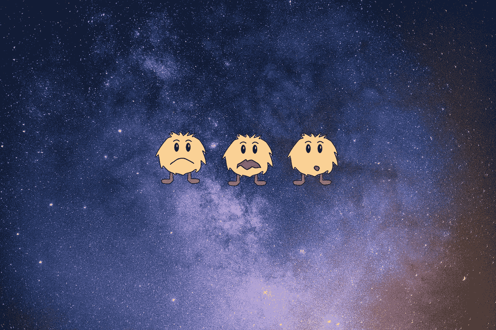
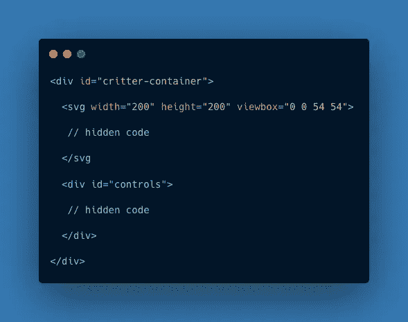
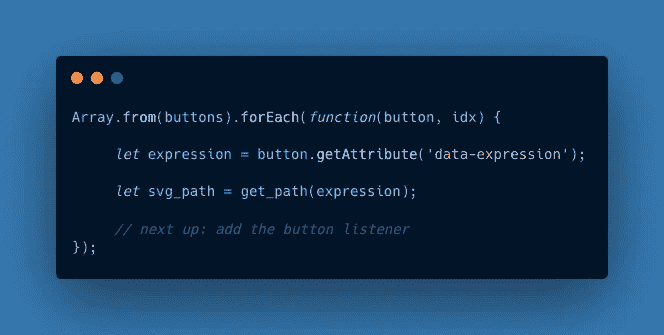
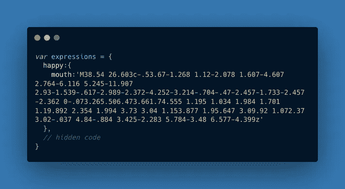
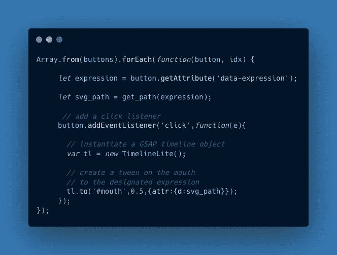

# 如何用 JavaScript 和 GSAP 制作一个喜怒无常的 SVG 生物动画

> 原文：<https://javascript.plainenglish.io/how-to-animate-a-moody-svg-creature-with-gsap-9c8e2c8e9407?source=collection_archive---------11----------------------->



Photo by [Andy Holmes](https://unsplash.com/@andyjh07?utm_source=unsplash&utm_medium=referral&utm_content=creditCopyText) on [Unsplash](https://unsplash.com/s/photos/space?utm_source=unsplash&utm_medium=referral&utm_content=creditCopyText). Funny-looking creatures by author.

标量矢量图形(SVG)是一种非常清晰的图像，其底层代码的结构很像 HTML。虽然 SVG 现在享有强大的浏览器支持，但复杂的动画仍然会导致问题——因此使用库可以帮助确保您的代码在不同的浏览器和设备上都能很好地工作。一个这样的库是[GSAP](https://greensock.com/gsap/)(green sock Animation API)，它允许你制作任何 JavaScript 交互的动画，包括 CSS 属性和 SVG 元素。

在本教程中，我将向你展示如何创建下面的 SVG 生物，并用 JavaScript 和 GSAP 库制作嘴部表情动画。一旦你运行代码笔，点击按钮，生物应该改变嘴的表情。

# 背景

在网页上包含 SVG 有多种方法，包括以下几种:

*   将`.svg`文件的路径作为`src`属性包含在``元素中
*   将路径作为`background-image`属性添加到 CSS 中。
*   内嵌 SVG，这需要将标记直接包含在 HTML 中

虽然前两种技术有其用途，但用 CSS 和 Javascript 制作 SVG 的各个部分的动画需要您将其内联到 HTML 页面上。事实上，我对上面这个看起来很有趣的生物使用了内联技术。让我们通过查看我用于 HTML、SVG、CSS 和 JavaScript 的代码来研究它是如何创建的。

# HTML、SVG 和 CSS

在到达树林之前，让我们先检查一下森林。下面是包含主 SVG 和控件的主`<div>`元素。



Overall HTML container.

## SVG 代码

下面的代码是我们的生物 SVG，你可以看到它主要由`path`元素组成。一个例外是眼睛，它是由椭圆组成的。

注意，每个`path`都有一个`d`属性，它存储路径的细节。就是这个`d`属性在生物变换表情时发生变化。

## 创建 SVG

因为 SVG 元素通常太复杂而无法手工编码，所以我推荐以下过程:

*   使用矢量程序如 Inkscape、Vectornator 或 Adobe Illustrator 绘制 SVG
*   使用 [SVGOMG](https://jakearchibald.github.io/svgomg/) (在线工具)或 [SVGO](https://github.com/svg/svgo) (命令行工具)优化 SVG 文件
*   从优化文件中复制标记，并将其粘贴到 HTML 页面中
*   为 JavaScript 添加`id`属性，并为清晰起见添加注释
*   根据需要对 SVG 元素重新排序并清理

优化是一个特别重要的步骤。它将去掉使文件不必要地复杂的专有代码，并且通常会使文件显著变小，从而减少加载时间。

## 控制器

好了，回到 HTML 上来。下面是控件的标记。注意每个按钮上的`data-expression`属性，它将在 JavaScript 中使用。

The button

## 添加 CSS

这里我们只是想设计控件的样式，并使 SVG 居中。

# JavaScript

JavaScript 有两个主要组件:一个存储每个嘴部表情的路径属性的`expressions`对象，和一个将每个按钮连接到其在`expressions`对象中对应的路径属性的`init`函数。

## 存储嘴部表情

下面是存储嘴部表情的对象。在每个表达式对象中，我有一个`mouth`作为显式属性，以防我们想要添加其他东西来制作动画，比如眼睛或腿。在每个表达式中，`mouth`指向一个表示嘴型的路径属性。

## init 函数

下面是启动一切的`init`函数。

让我们来分解一下`init`函数是如何工作的。

## 我们的助手功能

首先，我们创建一个名为`get_path`的助手函数，它钻入`expressions`对象并获取表达式的 path 属性。我们将很快使用它。

```
const get_path = (str) => expressions[str].mouth;
```

## 遍历按钮

在定义了我们的助手之后，我们获得了一个`button`元素的列表。

```
let buttons = document.querySelectorAll('button');
```

然后，我们使用`Array.from`将按钮列表转换成一个数组，从而允许我们使用`forEach`遍历按钮。



Starting our forEach loop through the buttons.

## 寻找表达方式

对于循环中的每个按钮，我们得到它的`data-expression`属性。

```
let expression = button.getAttribute('data-expression');
```

这里是我们使用助手函数地方！我们现在可以使用`get_path`从`expressions`对象获得相应的路径属性。

```
let svg_path = get_path(expression);
```

请注意，`svg_path`现在旨在存储给定面部表情的路径属性。例如，`happy`表达式的`svg_path`最终存储了下面的橙色代码，这是使用`get_path`获得的。



The corresponding d-attribute for the happy expression.

当 JavaScript 作用于 SVG 时，这个橙色代码成为代表生物嘴巴的`<path>`元素的`d`属性。换句话说，这个代码决定了快乐表情的嘴型。

## 添加监听器

好了，现在我们有一个方法来得到每个按钮的嘴形。现在我们可以设置一个按钮点击监听器来动画化嘴巴。这就是 GSAP 的用武之地。



Using GSAP.

## 制作嘴部动画

在每个侦听器中，我们创建一个 GSAP 时间轴对象。

```
var tl = new TimelineLite();
```

然后我们用这个物体来制作嘴巴的动画。

```
tl.to('#mouth',0.5,{attr:{d:svg_path}});
```

需要注意的几件事:

*   我们在`TimelineLite`对象上调用了`to`方法。
*   `0.5`以秒为单位指定动画的持续时间。
*   `attr`属性指定了我们正在制作动画的属性，在本例中是代表嘴的`<path>`元素的`d`属性。
*   注意，我们的`svg_path`变量中的代码将作为 mouth `<path>`元素的`d`属性。

GSAP 的妙处在于它可以采用两个`d`属性，并使用它们在嘴部表情之间插入形状帧。通过这种方式，它“补间”嘴形的变化，使动画保持平滑。

作为参考，此代码使用 GSAP 版本 2.1.3。CDN 的链接在下面。

```
[https://cdnjs.cloudflare.com/ajax/libs/gsap/2.1.3/TweenMax.min.js](https://cdnjs.cloudflare.com/ajax/libs/gsap/2.1.3/TweenMax.min.js)
```

# 后续步骤

*   分叉本教程的代码，并通过改变 SVG 标记创建一个你自己的生物。
*   创建或找到一些 SVG 图像进行实验。
*   尝试用 [SVGOMG](https://jakearchibald.github.io/svgomg/) 和 [SVGO](https://github.com/svg/svgo) 优化你的 SVG。
*   尝试制作其他部分的动画，如眼睛、身体和腿。
*   截止到本文，GSAP 的最新版本是 3。尝试学习新的 GSAP 3，并比较其动画功能与 GSAP 2。
*   考虑一下你什么时候想用 GSAP 或者更简单的 CSS 来制作 SVG 动画。

目前就这些。勇往直前去创造吧！

[](https://medium.com/codex/create-an-animated-banner-with-vanilla-javascript-and-html5-canvas-8b499c294b88) [## 用普通的 JavaScript 和画布 API 创建一个动画横幅

### 画布会忘记，但我们的物体不会。

medium.com](https://medium.com/codex/create-an-animated-banner-with-vanilla-javascript-and-html5-canvas-8b499c294b88) 

*更多内容看* [***说白了. io***](http://plainenglish.io) ***。*** *为无限制访问我的文章，考虑* [***加盟中***](https://medium.com/@nevkatz/membership) ***。***