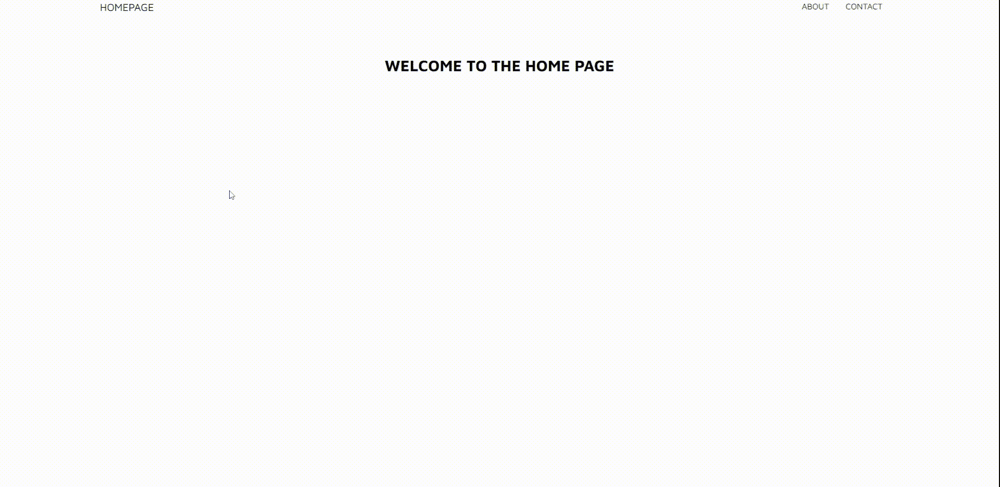
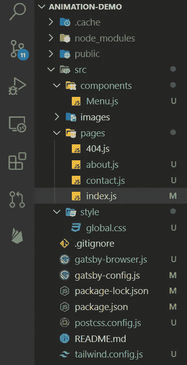
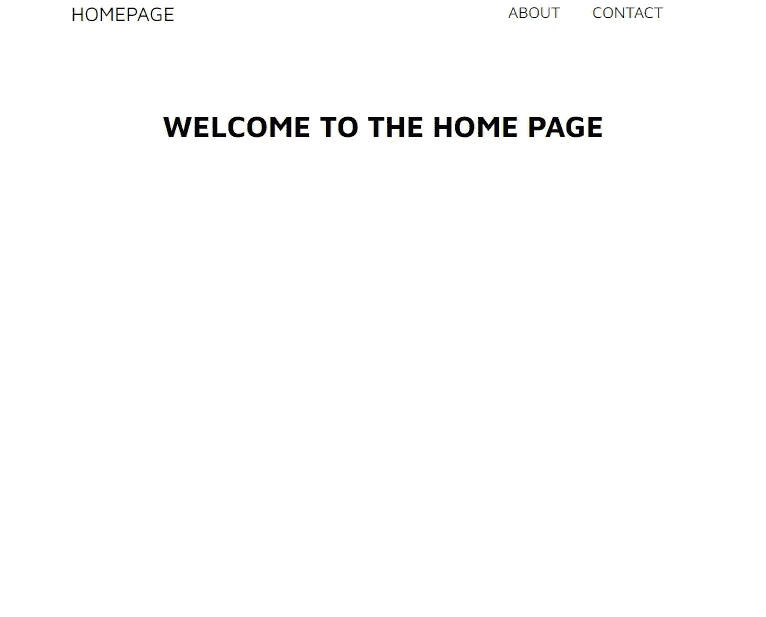
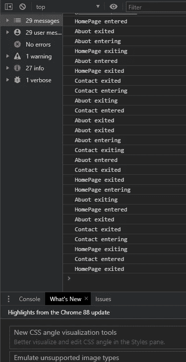

# 如何用 GSAP 制作 React/Gatsby.js 页面过渡动画

> 原文：<https://javascript.plainenglish.io/how-to-animate-page-transition-using-gatsby-js-and-gsap-in-react-b9ecf247fec2?source=collection_archive---------1----------------------->



在重建一个作品集网站的时候，我们想出了一个(目前普遍使用的)想法来制作网站页面之间的过渡动画。我们已经基本准备好了我们的项目(除了一些最小的细节)，它是在 React 中使用[盖茨比](https://www.gatsbyjs.com/)作为框架，我们也使用 [Gsap](https://greensock.com/gsap/) 用于页面内动画和滚动行为；因此，我们需要一些东西，可以很容易地插入到一个盖茨比驱动的网站，可以充分利用 GSAP 动画，以便所有的网站动画得到相同的“感觉”。

在尝试使用 Barba.js(我认为它是页面转换的实际标准)后，我们发现我们在重写代码以添加 Barba 所需的 ID 和类时遇到了一些问题，我们还发现我们的菜单在一个单独的组件中，这使得设置更加复杂，尤其是跟踪活动菜单和其他类似的事情。

进一步挖掘，我们发现了一个名为[gatsby-plugin-transition-link](https://www.gatsbyjs.com/plugins/gatsby-plugin-transition-link/)的 Gatsby 插件，它为 Gatsby 页面添加了过渡功能。

## 如何**盖茨比插件过渡链接**

除了关于站点中如何发生过渡的技术生命周期(您可以在这里找到详细的解释[https://transition Link . tylerbarnes . ca/docs/timeline-of-events/](https://transitionlink.tylerbarnes.ca/docs/timeline-of-events/))，这个插件可以在 Gatsby 项目中以(至少)3 种方式实现，只需更改您的 Gatsby*<Link>…</Link>*with*<transition Link>…</transition*

最简单的方法是<anilink>导入它，然后在链接到页面时使用，然后在链接到页面时使用:</anilink>

```
import AniLink from "gatsby-plugin-transition-link/AniLink";
...
<AniLink fade to="/about">
  About
</AniLink>
```

这样，当点击*关于*链接时，它将淡出(或滑动，或覆盖或涂抹)到关于页面。这是最基本的，不需要配置，也不需要太多定制

然后你可以使用<transitionlink>与触发器，你导入它，然后你在页面之间链接指定哪个动画触发退出和进入页面，它的持续时间和它的延迟:</transitionlink>

```
import TransitionLink from 'gatsby-plugin-transition-link';
...
<TransitionLink
  to="/about"
  exit={{
    trigger: ({ exit, node }) => leaving(exit, node),
    length: 1
  }}
  entry={{
    trigger: ({ enter, node }) => entering(enter, node),
    length: 1,
    delay: 0.6
  }}
>
  About
</TransitionLink>
```

当你点击*关于*链接时，transition 运行*离开*动画函数(可以是 GSAP，一个弹簧，js，一个 Anime.js one)一段指定的时间，并在指定的延时后执行目标页面上的*进入*动画。如果您将所有的过渡动画集中在一个可以传递的文件中，并且所有的页面都具有相同的结构(关于 refs、id、classes ),这种方法非常好，否则动画会失败(或者有不可预知的结果)。

第三个也是最强大的一个是基于状态的转换:

```
import TransitionLink from 'gatsby-plugin-transition-link';
...
<TransitionLink
  to="/about"
  exit={{
    length: 1,  
    state: {customstate: 'this is a exiting message'}
 }}
  entry={{
    delay: 0.6,
    state: {customstate: 'this is a entering message'}
  }}
>
  About
</TransitionLink>
```

这样，当您单击 About 时，您将一个转换状态作为道具传递给页面(您所在的页面，您正在链接的页面)，转换状态可以是以下之一:*退出*、*退出*、*进入*、*进入*，加上对象中指定的退出/进入状态。
此时非常容易创建基于过渡状态的强大动画:

```
const AboutPage = ({ transitionStatus, enter, exit }) => {
   useEffect(() => {
    console.log(transitionStatus, entry, exit)
    if (transitionStatus==='exiting') { 
      //play the exit animation  
    }
    if (transitionStatus==='entering') { 
      //play the enter animation  
    }
    if (transitionStatus==='entered') { 
      //the page is loaded, play another animation
    }},[transitionStatus]); //execute when transitionStatus change
```

这种动画最重要的一点是用户体验，它看起来像一个单页面应用程序，但你是在一个多页面应用程序中(即使页面的某些部分被更新，url 也会改变),拥有所有的优势(静态 HTML、seo 等等)。

# 构建带有页面转换的微型网站

理论讲得够多了，让我们根据我们的需要建立一个带有页面转换的迷你网站。要继续学习，你可以在这里下载资源库→[https://github.com/popeating/animation-demo](https://github.com/popeating/animation-demo)

## 先决条件

本教程假设你已经知道(至少知道一点)React JS，你熟悉 Gatsby 和它的插件，我们也将使用 [Tailwind CSS](https://tailwindcss.com/) 进行样式化(尽管这不是必须的)

## **我们要建什么**

在本演练结束时，您将构建一个迷你站点，其中包含主页、关于和联系人页面，所有这些页面都有一个公共菜单(在其自己的组件中)及其进入和退出(基本)动画

## 创建项目并安装插件和所需的库

使用:`npm init gatsby`创建一个新的 Gatsby 项目，遵循屏幕上的提示，一旦项目准备好，就进入它的文件夹。

安装盖茨比插件过渡链接

```
npm i gatsby-plugin-transition-link
```

然后将插件添加到 *gatsby-config.js*

```
// gatsby-config.js
module.exports = {
    plugins: [
      `gatsby-plugin-transition-link`
    ]
];
```

安装你最喜欢的动画包，在我们的例子中，我们使用 GSAP

```
npm install gsap
```

如果你要使用顺风 CSS 的话，安装并配置它(如果需要的话，遵循这个指南[https://www.gatsbyjs.com/docs/how-to/styling/tailwind-css/](https://www.gatsbyjs.com/docs/how-to/styling/tailwind-css/)

## **布置项目**

在 *src/pages* 文件夹中添加以下文件:about.js，contact.js，同时清理 index.js 使其为空。
在 *src* 中创建一个名为 *components* 的文件夹，并在其中添加一个名为 *Menu.js* 的文件；文件结构现在应该如下所示:



## 编辑页面

让我们开始编辑页面:

索引页面，它只是一个包含菜单组件(稍后创建)的普通页面(其他页面也是如此)，我们指定 *transitionStatus* 作为道具，即使我们还没有使用它:

与之前一样，about 页面是一个简单的页面，包含菜单组件和 *transitionStatus* 属性:

联系页面:

现在是使用菜单组件链接页面的时候了；该链接将使用 TransitionLink 创建(尽管目前没有动画)，给出 1 秒的退出长度(因此当您单击该链接时，退出页面将多显示 1 秒，允许退出动画)并且没有 entry 属性(进入页面将立即出现)。我们还用一个附加类设置了 activeClassname 来跟踪活动菜单。在退出(和进入对象)中，也可以添加一个*延迟*参数，该参数指示进入(或退出)动作开始的延迟。如果不指定延迟值，进入和退出将同时开始。

现在，如果您使用以下代码运行项目:

```
gatsby develop
```

在浏览器中打开它，http://localhost:8000 ，主页应该会出现:



Our basic Homepage

所有的链接应该是功能性的，你会注意到当从一个页面传递到另一个页面时，页面如何“重叠”1 秒钟，这与 TransationLink 中指定的参数有关。正如你所看到的，如果你点击*关于，*关于页面由于`entry={{}}`而立即出现，主页根据`exit={{length: 1}}`在 1 秒后消失。

我们现在可以看到页面在进入和退出时发生了什么；让我们将这段代码添加到 index.js 中(不要忘记导入 useEffect！)

```
useEffect(() => {
  console.log('HomePage', transitionStatus);
}, [transitionStatus]);
```

另外，在 about.js 和 contact.js 中添加一个类似的代码片段。

现在，如果你打开你的控制台，在页面之间导航，你应该看到 transitionStatus 不断更新。



We are loggin the enter/exit process

在这一点上，我们几乎设置好了动画的过渡，这只是一个偏好和风格的问题。让我们从一个基本的开始:在主页中，我们进入时淡入，退出时淡出；我不会深入讨论如何 aimate，因为这是 GSAP 相关的，但基本上我们正在获得一个 DOM 元素(在这种情况下通过类),并使用 gsap 模块将其动画化。

返回 Menu.js 并修改主页链接，使*条目*的长度也为 1:

```
<TransitionLink
 to="/"
 exit={{
  length: 1,
}}
 entry={{ length: 1 }}
 className="hover:text-gray-600"
>
 HOMEPAGE
</TransitionLink>
```

接下来是 index.js 导入 GSAP

```
import gsap from 'gsap'
```

修改主页文本的类名，使其在启动时是透明的(如果你使用的是 Tailwind CSS，那么这个类名就是透明的)和一个你可以引用的类名(我使用的是 T2 hometex T3):

```
<div className="text-3xl w-full mx-auto justify-center flex font-bold hometex opacity-0">
  WELCOME TO THE HOME PAGE
</div>
```

用 useEffect 钩子制作它的入口和出口透明度的动画，我们使用了一个没有依赖关系的 useEffect 钩子，这样当页面被直接调用时。hometex 类设置为 opaque (autoAlpha 为 1 表示我们设置 opacity 为 1，visibility 为 visible，以防万一)，1 秒(持续时间参数)；然后我们有一个 useEffect 钩子，它依赖于 *transitionStatus* ，当从一个链接到达页面或使用一个链接离开页面时触发动画:

现在，如果你从/到网站的主页，它的内容会正确地淡化，但我们来自或将要去的页面会突然出现/消失。让我们在“关于”页面中添加一个更有趣的动画:

首先，我们再次修改菜单，在“关于”链接上输入一秒钟:

```
<TransitionLink
 to="/about"
 exit={{
  length: 1,
}}
 entry={{ length: 1 }}
 className="hover:text-gray-600"
>
 Abouot
</TransitionLink>
```

然后我们跟 useRef 挂钩(导入 useRef！)我们创建一个数组来引用每一行文本，这样我们就可以将这个引用数组传递给动画函数(这主要是与 GSAP 相关的，可能不是处理它的最佳方式)

然后我们添加一个 GSAP 动画，我们将从 useEffect 钩子中调用它

现在，当我们从主页转到“关于”页面时，主页文本将淡出，同时“关于”页面的内容将动画显示，当您回到主页时，“关于”将动画显示，同时主页将淡入。您可以使用延迟和持续时间参数来同步动画，以满足您的需求。


## 接下来呢？

如果你下载了回购，我会把联系人动画空出来作为游乐场。

此外，所有的动画都可以优化，改变，你可以让它们变得非常复杂或非常微妙，你可以使用另一个动画包等等。但是我认为如果您在项目中使用 Gatsby，这是开始实现页面转换的好方法