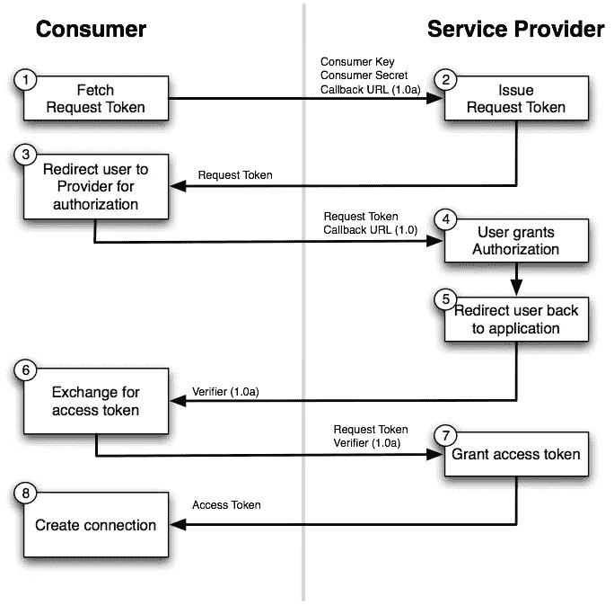
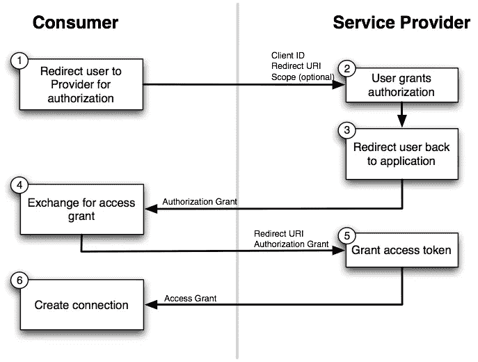
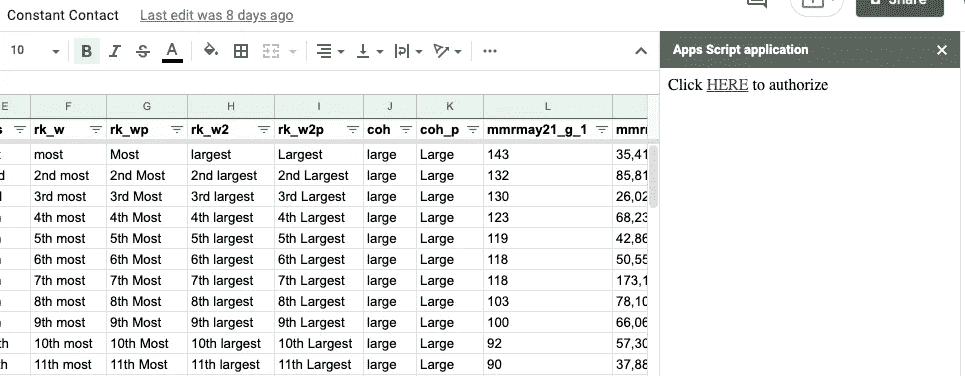
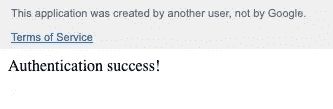

# 如何使用 Google Sheets 的 OAuth 2.0 认证和授权一个帐户

> 原文：<https://javascript.plainenglish.io/how-to-authenticate-and-authorize-an-account-with-oauth-2-0-from-google-sheets-8815b85f5fd9?source=collection_archive---------14----------------------->

Photo by [Matthew Henry](https://unsplash.com/@matthewhenry?utm_source=medium&utm_medium=referral) on [Unsplash](https://unsplash.com?utm_source=medium&utm_medium=referral)

[Google Sheets](https://www.google.com/sheets/about/) 本身是一个巨大的工具，但是结合 [Google Apps 脚本](https://developers.google.com/apps-script)，它可以通过最少的前期开发成为一个强大的托管数据库。但是数据库的好坏取决于它们与服务和应用程序集成的能力。手动导出和导入数据不可扩展，并且非常耗时。将 Google Sheets 与外部组件轻松集成的能力带来了无限的可能性，我将向您展示如何使用 Constant Contact APIs 实现这一点。

[Constant Contact](https://www.constantcontact.com/) 是一家在线营销公司，帮助您的企业轻松管理营销活动。它最有用和最受欢迎的服务之一是允许你管理你的联系人数据库的电子邮件活动。对于没有大量开发资源的小企业来说，使用 Google Sheets 是一个有吸引力的低成本解决方案，可以保存您的联系人、营销材料和所有其他相关信息。

在我们深入研究从 Google Sheets 中认证和授权您的固定联系人帐户的技术细节之前，我们需要讨论 OAuth。

# OAuth

OAuth，即开放授权，是授权安全访问的领先开放标准。许多大公司使用该标准允许用户让第三方应用程序访问他们的信息，而实际上不必给第三方他们的密码。对于任何平台或生态系统来说，拥有一种安全的授权访问方式都是至关重要的。

OAuth 很复杂。在高层次上，OAuth 描述了一种用户授权第三方应用程序 API 访问的标准化方法。让我们来看看 OAuth 1.0 的工作流程:

A flow diagram for OAuth 1.0 ([Source](https://docs.spring.io/spring-social/docs/1.1.0.RELEASE/reference/htmlsingle/#section_oauth2ServiceProviders))

正如你在上面看到的，首先用户需要通过提供一个`key`和`secret`来请求一个`Request Token`。然后用户被重定向以验证他们自己。之后，用户可以请求一个`Access Token`，它将在后续的授权数据请求中使用。

OAuth 的架构师希望通过引入 OAuth 2.0 来改进这个工作流。他们是否成功实现了他们的目标[是有争议的](https://web.archive.org/web/20120731155632/http://hueniverse.com/2012/07/oauth-2-0-and-the-road-to-hell/)，然而，它在整个技术领域扩散，开发者需要理解它。让我们看一下更新流程图:

A flow diagram for OAuth 2.0 ([Source](https://docs.spring.io/spring-social/docs/1.1.0.RELEASE/reference/htmlsingle/#section_oauth2ServiceProviders))

OAuth 2.0 的工作流程与 OAuth 1.0 非常相似，但是正如你在上面看到的，它稍微简化了一些。随着`Request Token`工作流的移除，OAuth 2.0 减少了所谓的“OAuth 舞蹈”中所需的一些网络调用。

现在，我们已经对 OAuth 及其特点有了很高层次的理解，让我们深入了解一下集成。

# 恒定接触积分

要在一个固定联系账户上执行任何 CRUD 操作，你需要验证和授权你的应用程序(即 Google Apps 脚本)。Constant Contact 的 V3 API 文档相当不错。他们有有用的[一步一步的指导](https://v3.developer.constantcontact.com/api_guide/auth_overview.html)和[令人印象深刻的 API 参考](https://v3.developer.constantcontact.com/api_reference/index.html)，允许你在浏览器中查看示例请求和测试实际的 API。

在“持续联系”中设置您的应用程序设置后，您会注意到您需要选择一个授权工作流。他们提供了一个三条腿的“服务器流”和一个两条腿的“客户端流”，我选择了服务器流，因为它支持刷新令牌。

然后，我开始沿着[服务器流程路径](https://v3.developer.constantcontact.com/api_guide/server_flow.html)运行，并开始创建通用的请求函数，这些函数包装了 Google App Script 的[urlfettchapp 类](https://developers.google.com/apps-script/reference/url-fetch/url-fetch-app?hl=en)，但后来我意识到，在 Google App Script 中进行身份验证很可能是一项常见的任务，有人可能已经开源了这项任务。果不其然，GitHub 上 [googleworkspace](https://github.com/googleworkspace) 的优秀人员创建了一个 [OAuth 2.0 实用程序类](https://github.com/googleworkspace/apps-script-oauth2)，可用于此目的。它包装在我之前提到的相同 UrlFetchApp 类之上，[方便地为您提取和处理授权代码](https://github.com/googleworkspace/apps-script-oauth2/blob/eebdf7884b019dac5160f6554059bf9537fda1cd/src/Service.js#L382-L414)，而[将授权令牌](https://github.com/googleworkspace/apps-script-oauth2/blob/eebdf7884b019dac5160f6554059bf9537fda1cd/src/Service.js#L615-L628)保存在您选择的属性存储中。

一旦我检查了 OAuth 2.0 实用程序类并通读了文档，构建身份验证和授权就变得轻而易举了。让我们来看看一些代码。

首先，让我们使用上面讨论的 OAuth 2.0 实用程序类来设置我们的 OAuth 2.0 服务:

Sample JavaScript code to instantiate the OAuth 2.0 service.

我们上面使用的 OAuth 2.0 实用程序类被设计成链式的(即每个方法返回`this`)。让我们看看这里调用的每个方法:

1.  `createService`
    这是整个操作的总切入点。这个方法创建了私有`Service_`类的一个新实例。
2.  `setAuthorizationBaseUrl`
    设置认证和授权过程第一阶段的 URL。
3.  `setTokenUrl`
    这个方法为获取认证令牌的请求设置 URL。
4.  `setClientId`
    这里，我们使用这个方法将我们的 API 键添加到我们的初始请求中(即第一段)。此密钥应由您尝试鉴定的第三方服务提供。
5.  `setClientSecret`
    类似于`setClientId`，我们使用这个方法为第一段设置我们的 API 秘密。此值也将由您尝试鉴定的第三方服务提供。
6.  `setCallbackFunction`
    设置 OAuth 过程完成后应调用的函数名称。这个方法的参数是一个`String`，而不是对函数的引用。
7.  `setPropertyStore`
    该方法设置授权令牌将被持久化的属性存储。我强烈推荐使用上面显示的原生 Google Apps 脚本`PropertiesService`，因为它已经符合了`setPropertyStore`所期望的界面。
8.  在 OAuth 的授权步骤中，你需要描述你需要被授权的范围。这个方法的参数是作用域名称`String` s 的`Array`。
9.  `setParam`
    该方法是一个通用方法，用于添加 OAuth 过程中可能需要的任何附加参数。在我上面的例子中，持续接触要求你描述`response_type`。你可以根据你的需要连接任意多个`setParam`电话。

现在，让我们看看授权的 UI 部分。OAuth 2.0 要求将用户导航到授权实体，以便正确地进行身份验证和授权。有几种方法可以提示用户导航，我选择使用[侧边栏](https://developers.google.com/apps-script/reference/base/ui?hl=en#showsidebaruserinterface)，类似于 OAuth 2.0 实用程序类创建者在他们的 [README.md 示例](https://github.com/googleworkspace/apps-script-oauth2/blob/master/README.md#2-direct-the-user-to-the-authorization-url)中描述的那样。让我们看看这是什么样子:

Sample JavaScript code to show a sidebar in Google Sheets with an authorization link.

这个函数只是呈现一个包含不同内容的侧边栏。如果用户尚未通过身份验证和授权，侧边栏将呈现一些带有可点击链接的说明性文本，该链接将用户重定向到持续联系身份验证。侧栏看起来像这样:

Sample sidebar output of an unauthorized user.

在用户被重定向到授权页面并正确登录进行身份验证后，用户将会看到类似如下的页面:

Sample post-OAuth flow HTML rendering.

这是因为我们传递给 OAuth 服务实例化的回调函数(即`setCallbackFunction(‘authCallback’)`)根据授权状态有条件地呈现 HTML 输出。你可以在这里看到:

Sample JavaScript code to conditionally render HTML output based on authorization status.

现在，我们可以简单地从 OAuth 服务实例中调用`getAccessToken`方法，并在请求头中传递它。下面的例子展示了一个我测试过的函数，它通过 Google Apps 脚本创建了一个新的“列表”。

Sample JavaScript code to create a Constant Contact list from within Google Apps Script.

# 结论

就是这样！现在，您已经了解了如何在 Google Apps 脚本中正确地进行身份验证和授权，一切尽在您的掌握之中。只需很少的开发和基本上为零的环境配置，您就可以利用来自 Google Sheets 的数据，并以编程方式与外部服务和数据进行交互。

这对我们来说是一个游戏改变者，但是请在评论中让我知道你能够利用这个教程的创造性方法！

*原载于***。**

**更多内容请看*[***plain English . io***](http://plainenglish.io)*