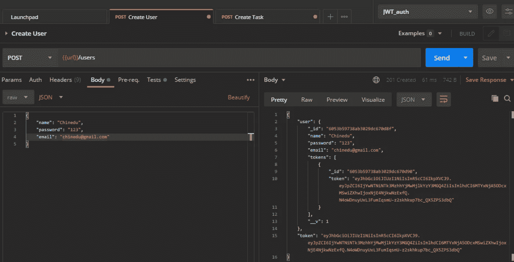
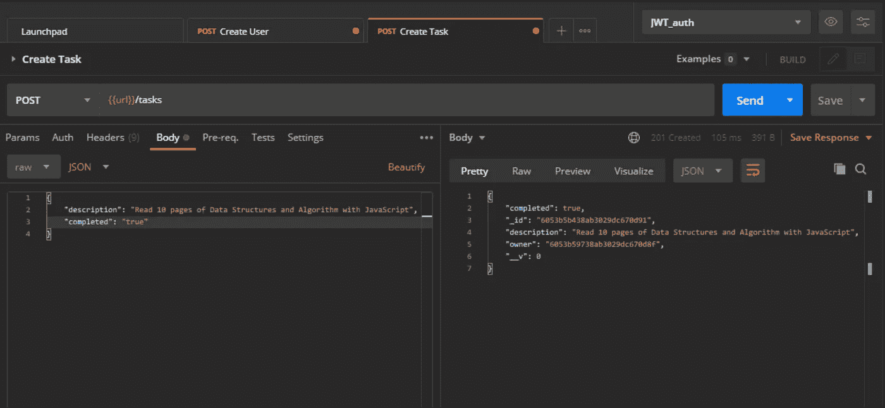

# 如何通过 Node.js 使用 JWT 进行身份验证和授权

> 原文：<https://javascript.plainenglish.io/how-to-authenticate-and-authorize-using-jwt-with-node-js-a324437dedb1?source=collection_archive---------16----------------------->

我敢打赌，如果你每次都被要求在你最喜欢的应用程序上登录，那会很令人沮丧。

Photo by [Markus Spiske](https://unsplash.com/@markusspiske?utm_source=medium&utm_medium=referral) on [Unsplash](https://unsplash.com?utm_source=medium&utm_medium=referral)

在本文中，我们将探索 jwt(JSON Web 令牌)。JWTs 为发布和验证认证令牌提供了一个很好的系统。身份验证令牌将确保客户端不需要每次在服务器上执行操作时都登录。

一旦用户登录，每个后续请求都将包含 JSON Web 令牌，这将允许用户访问可以用该令牌访问的路由和服务。

我们的路线图包括创建一个 express 服务器、一个用户、一个身份验证中间件和一个任务服务——如果我们未经身份验证，就无法访问它们。

接下来，我们将使用的工具和框架包括 NodeJS、Express、MongoDB 和 Postman。

首先，初始化 Node.js 项目:

`npm init -y`

接下来，安装 express framework:

`npm install express`

安装 express 后，创建一个文件(我叫我的`app.js`)并设置一个 express 服务器:

运行这个文件会将文本`listening to server at port:5000` 打印到终端。这表明我们的服务器已经启动并正在运行。

下一步是安装 mongoose 并设置 MongoDB 数据库:

这个 mongoose 文件驻留在一个`db`文件夹中，这个文件夹必须导入到`app.js`文件中。这将在服务器启动后启用 MongoDB 连接。

Add this line to the top of the app.js file.

一旦服务器启动，我们就可以连接到任何 MongoDB 客户端。

接下来，让我们创建一个用户模型:

我们的用户模型包含四个字段:名称、密码、电子邮件和令牌字段，每当用户注册或登录时，这些字段将用于存储生成的令牌。

## **用户路线**

下一步是为注册和登录用户创建端点。每当用户注册或登录时，都会生成一个新令牌。

在第一个端点中，`user.save()` 在数据库中存储一个新用户，而`user.GenerateAuthToken()` 为该用户生成一个新的 auth 令牌。我们将很快定义`GenerateAuthToken()` 函数。如果这些操作成功，我们会将用户详细信息和生成的令牌作为响应发送回去。

在第二个端点中，我们使用`FindByCredentials()` 函数(我们尚未定义)来登录已经拥有帐户的用户——也就是说，如果他们提供的电子邮件和密码与数据库中的电子邮件和密码相匹配。一旦他们登录，就会使用`GenerateAuthToken()` 功能为他们生成一个新令牌。如果这些操作成功，我们将用户详细信息和生成的令牌作为响应发送回去。

让我们看看我们的用户创建端点是否通过 Postman 工作:

我们在请求体中提供了一个`name`、`password`和`email` ，当我们发送请求时，为创建的用户生成了一个`token` 。

## **生成和存储认证令牌**

每当用户注册或登录时，JWT 都会生成一个新的身份验证令牌。该认证令牌可以存储在数据库中。所有生成的令牌都将存储为用户配置文件。这样，它们可以用于注销用户。每当用户注销时，当前令牌将从用户配置文件中删除。删除存储在用户配置文件中的所有生成的令牌将导致用户从所有会话中注销。

Define this function in user.js

上面的实例方法负责生成新的认证令牌。在函数中，我们调用了生成令牌的`jwt.sign()` 函数。`sign()`取三个参数:`payload`、`secretOrPrivatekey`、`options`。`payload` 可以是字符串也可以是对象；我们的是一个对象—用户 id `id`。`secretOrPrivateKey` 顾名思义——一个秘密的或私有的密钥，它不应该被暴露(尽管为了可见性，我们确实暴露了我们的密钥)。第三个参数是可选的。

生成令牌后，我们通过将它添加到用户模型中的令牌字段来将其存储在数据库中。存储后，令牌从函数返回。

创建了一个生成身份验证令牌的系统之后，让我们继续创建一个任务服务。该服务中的主要操作——创建任务——将放在身份验证之后。这将确保只有经过身份验证的用户才有权创建任务。

## **任务服务**

让我们首先创建一个任务模型:

我们的任务模型包含三个字段:`description` —基本上是一个任务的描述；`completed` —一个布尔值，表示任务是否完成；`owner` —与用户模型的关系，表明谁创建了任务。

下一步是创建一个用于创建任务的端点，但是我们需要创建一个认证中间件，它可以被添加到端点来锁定它。这意味着只有拥有帐户或已登录的用户才能创建任务。

## **认证中间件(接受和验证令牌)**

这个中间件的目标是验证身份验证令牌，然后获取该用户的配置文件。下面的代码展示了如何做到这一点。

方法`verify()` 使用我们的私钥`yourprivatekey`验证来自`req.header` 的认证令牌。返回一个解码后的令牌，其中包含我们用来创建令牌(id)的有效负载。然后，这个解码后的令牌可用于获取用户配置文件，该文件随后可被传递给`req.user`。这允许路由处理器函数访问用户配置文件，而不必再次获取它。

## **任务路线**

现在我们已经定义了身份验证中间件，让我们为创建任务创建一个端点。认证中间件将作为第二个参数添加到`router.post()`，这意味着它将在路由处理程序运行之前运行。这将确保用户得到验证。

一旦用户被认证，他们可以继续创建任务，但是在用户未被认证的情况下，认证中间件`auth`、**、**将抛出`**401**` (未授权错误)，这将阻止路由处理器执行任务创建操作。如果任务创建成功，它将存储在数据库中。

让我们看看我们的任务创建端点是否通过 Postman 工作:

我们收到了一个`201` 状态代码，这意味着我们能够成功地创建一个任务，这是因为我们通过了身份验证——也就是说，我们已经登录。未登录的用户将无法创建任务。

我们已经看到了 jwt 在我们的 API 和服务中的作用和重要性。一旦我们通过了身份验证，我们就可以在不提示我们进行身份验证的情况下执行许多操作。JWTs 还使我们能够通过将端点置于身份验证之后来保护我们的服务。这将防止未经身份验证的用户访问和使用我们的端点和服务。

# 结论

仅此而已。

到目前为止，我们已经了解了如何:

*   使用 JWT 生成身份验证令牌。
*   验证身份验证令牌。
*   通过将终端置于身份验证之后来保护终端。

写这篇文章的时候我学到了很多，我希望你在阅读的时候也能学到一些东西。

*更多内容看*[***plain English . io***](https://plainenglish.io/)