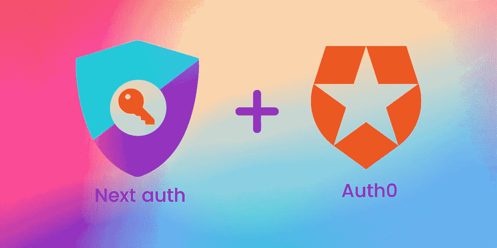
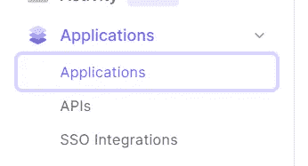
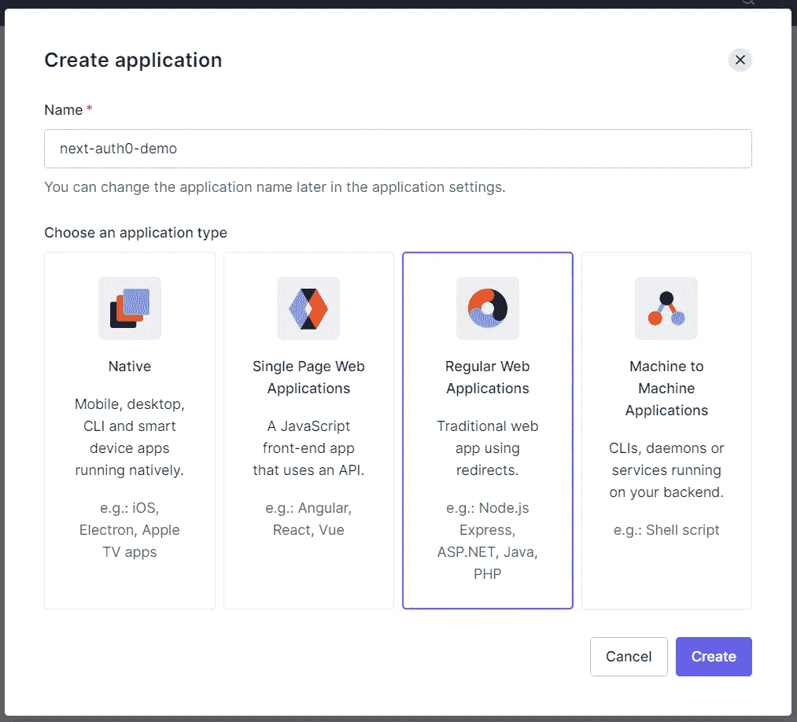
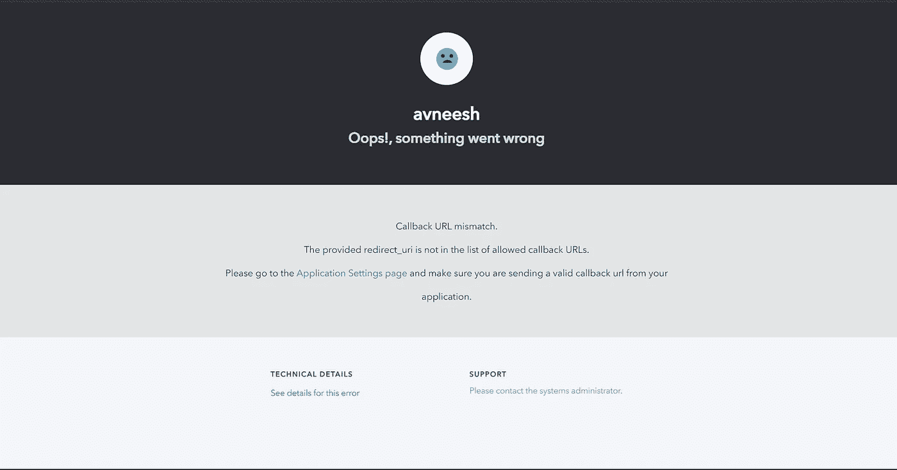
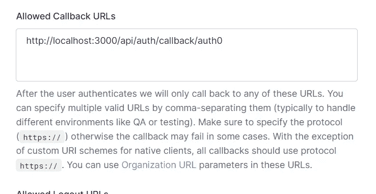
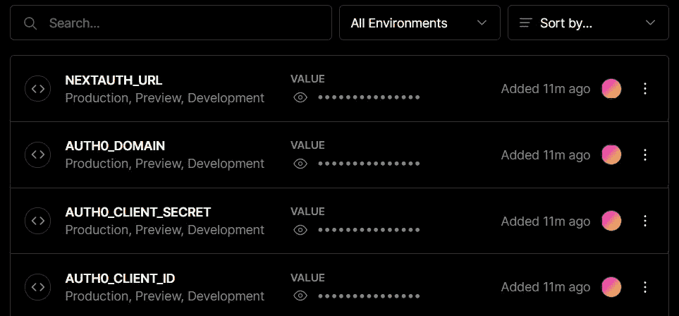
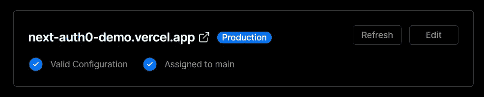
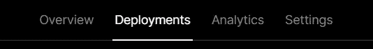
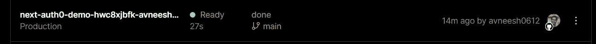
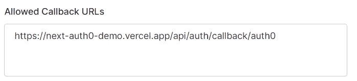

# 使用 Next.js 中的 Auth0 验证用户

> 原文：<https://javascript.plainenglish.io/how-to-authenticate-users-with-auth0-in-next-auth-9c1160ce48a8?source=collection_archive---------4----------------------->

## 下一步如何使用 Auth0 验证用户



Next auth + Auth0

## 什么是 Auth0？

Auth0 是一个易于实现、适应性强的认证和授权平台。如果你想跟随这个教程，你可以在这里创建一个免费的 Auth0 账户[。](https://auth0.com/signup?utm_source=external-post&utm_medium=link_placement&utm_campaign=devmar-media)

## 设置

我将使用 create-next-app 设置一个新的 next 应用程序。

```
npx create-next-app next-auth0-demo
```

## 清除

我会删除从主页面到页脚的所有内容。

安装[下一个授权](https://next-auth.js.org/)

```
npm i next-auth # npm
yarn add next-auth # yarn
```

## 开始使用下一次授权

我们将首先在 pages 中的`api`文件夹内创建一个名为`auth`的文件夹。

在那个文件夹中创建一个名为 ***[…nextauth]的文件。js***

我们将使用 auth0 作为提供者，因此我们需要三个参数。所以将这段代码添加到您的 ***[…nextauth]中。js*** 。

现在我们将最终在 ***_app.js*** 中配置下一个 Auth 如下-

## 在 Auth0 中设置应用程序

**创建应用**

*   注册到 [Auth0](https://auth0.com/signup?utm_source=external-post&utm_medium=link_placement&utm_campaign=devmar-media)
*   转到应用程序选项卡下的应用程序



*   创建新的应用程序
*   选择常规 Web 应用程序，并为您的应用程序命名，然后单击创建。



**获取凭证**

在 settings 选项卡中，复制域、`client id`和`client secret`，并将其添加到您的. env.local 文件中。

我们还将在 env 中添加 NEXTAUTH_URL，如下所示

```
NEXTAUTH_URL=http://localhost:3000
```

## 创建登录按钮

现在，如果我们尝试登录，我们会看到这个错误页面



我们需要添加[http://localhost:3000/API/auth/callback/auth 0](http://localhost:3000/api/auth/callback/auth0)作为允许的回调 URL 并保存它。



现在我们可以成功登录了！

## 获取用户信息

我们将使用`getServerSideProps`创建一个函数，通过会话获取我们的用户详细信息。

如果用户已经登录，我们希望有一个注销按钮。因此，如果没有用户，我们将有一个登录按钮，如果有用户，我们将有一个退出按钮。

所以像这样创建一个三元运算符

然后从 next-auth/client 导入我们需要的所有内容。

## 显示用户详细信息

我们将添加此代码来获取用户的电子邮件、姓名和图像。

最终的代码应该是这样的

由于我们正在使用下一个图像，我们将需要在***Next . config . js***中添加域

我们使用谷歌登录，所以我们将添加 lh3.googleusercontent.com 作为域名，如果你不知道图片的来源，你可以使用普通的 img 标签。

## 部署

我将创建一个新的 GitHub 库，并将代码推送到那里。如果你不了解 git 和 GitHub。查看我的 [Git 和 Github 速成班](https://avneeshagarwal.medium.com/git-and-github-crash-course-b44f4885ff66)。

之后去[威瑟尔](https://vercel.com/)

*   注册你的 GitHub
*   点击创建一个新项目
*   导入您创建的存储库
*   单击部署

您的站点现在将被部署，但身份验证将不起作用。

添加环境变量。

*   网站部署后，进入当前应用程序的仪表板，点击设置，然后环境变量。
*   添加我们的. env.local 文件中的 Auth0 客户端 id、Auth0 客户端机密和 Auth0 域。
*   在你添加了这两个之后，它看起来就像这样。



*   我们将添加另一个变量，我们的下一个 Auth URL，它将是部署的 URL 而不是本地主机。
*   要获取 URL，单击 domains，获取最短的链接，并将其添加到 NEXTAUTH_URL 变量中。这将类似于 https://next-auth0-demo.vercel.app/的



*   最后，转到标题中选项卡上的“部署”选项卡。



*   点击最新版本，并按下重新部署。



## 更改 Auth0 中的 URI

最后，用实际的 URL 替换 localhost:3000，并使用 HTTPS 代替 HTTP。



我们的认证现在运行良好。恭喜你。您已经使用下一个身份验证创建了您的第一个身份验证 0 登录！🥳

如果你觉得这很有用，请在评论中告诉我。如果您想查看任何其他类型的认证，也可以告诉我。

## 更多资源

*   [Github 库](https://github.com/avneesh0612/next-auth0-demo)
*   [NextJS 文档](https://nextjs.org/docs)
*   [下一次授权](https://next-auth.js.org/)
*   [认证 0](https://auth0.com/)
*   [所有社交](https://avneesh-links.vercel.app/)

*更多内容请看*[***plain English . io***](http://plainenglish.io)