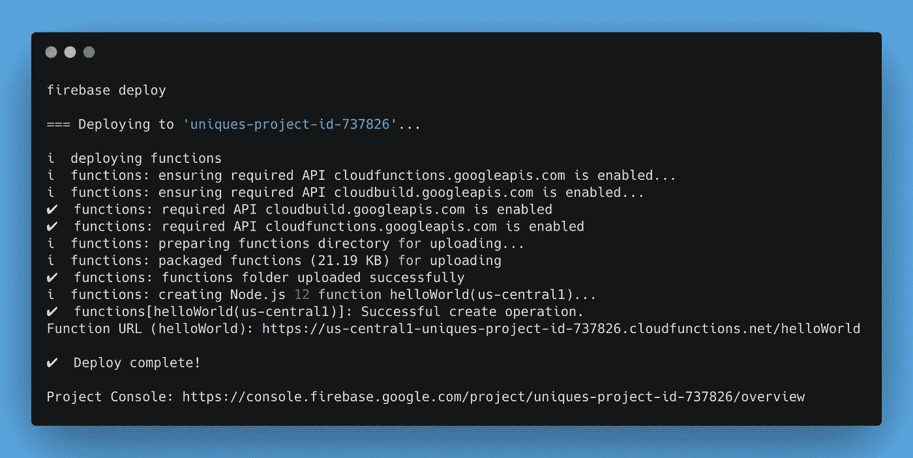

# 如何使用 GitHub 动作自动部署 Firebase 应用程序

> 原文：<https://javascript.plainenglish.io/how-to-automate-firebase-app-deployment-with-github-actions-beb26e458e17?source=collection_archive---------4----------------------->

开发人员应接不暇，要做的事情太多了:讨论解决方案、编写代码、获得评审、一次又一次地重写简单的功能。任何额外的手动步骤都会导致问题。

Photo by [Marvin Meyer](https://unsplash.com/@marvelous?utm_source=unsplash&utm_medium=referral&utm_content=creditCopyText) on [Unsplash](https://unsplash.com/?utm_source=unsplash&utm_medium=referral&utm_content=creditCopyText)

> 一切可以自动化的东西，都必须自动化。

本教程帮助您自动化 Firebase 应用程序的部署过程。这个简短的例子为下面探索 GitHub 动作的强大功能提供了基础。

# 这个计划

1.  创建一个空的 Firebase 项目。
2.  手动将 Firebase 项目部署到 Google 云平台。
3.  生成部署机密令牌。
4.  创建 GitHub 存储库。
5.  在 GitHub 操作上创建部署工作流。
6.  将代码推送到 Github 并测试解决方案。

# 开始之前

有一个清单来确保您已经在本地机器上安装了所有的东西。

1.  终端中的节点| try `node -v`。
2.  Firebase 账户([https://console.firebase.google.com/](https://console.firebase.google.com/))和谷歌云计费账户([https://console.cloud.google.com/billing](https://console.cloud.google.com/billing))。
3.  尝试终端中的`firebase -V`和`firebase login`。
4.  您在 GitHub 上有一个帐户，帐户上有相关的 SSH 密钥。我的 YouTube 频道上有一个[视频可以帮你。](https://youtu.be/yjupZm_ysY0)

# 1.创建一个空的 Firebase 项目

*   运行终端应用程序
*   执行命令:`firebase project:create`
*   选择唯一的项目 id

`firebase project:create`

*   用`mkdir unique-project`命令创建一个新目录(*唯一-项目*是一个目录名)
*   导航到目录`cd unique-project`
*   用`firebase init`命令初始化一个空的 Firebase 项目

`firebase init`

*   打开`functions/index.js`文件，取消后面`helloWorld`函数的注释，保存文件

`functions/index.js`

空项目已准备好发布。

# 2.手动将项目部署到 GCloud 平台

在同一终端窗口运行命令`firebase deploy`

哎呀…

我们需要升级该项目的计划，按照命令输出的链接，并选择“现收现付”。

请尝试再次部署该项目。运行`firebase deploy`。

`firebase deploy`

# 3.生成部署机密令牌

在同一终端窗口中运行命令`firebase login:ci`。它生成部署令牌。令牌允许你从任何地方部署代码，而无需登录到你的谷歌账户。对我们来说非常有用。

`firebase login:ci`

将令牌保存在文本文件中，我们稍后会用到它。

# 4.创建 GitHub 存储库

如果你不熟悉 GitHub，我会帮你建立一个新的资源库。

*   打开 Github.com 的[并登录](http://github.com/)
*   点击右上角的“+”并选择“新建存储库”

*   设置存储库名称，然后单击“创建存储库”

# 5.在 GitHub 操作上创建部署工作流

我们仍然在同一个终端窗口。让我们创建文件来设置工作流。

*   运行命令`mkdir .github/workflows/ && touch ./github/workflows/deploy.yml`
*   打开`deploy.yml`文件并粘贴以下代码

保存文件。

现在我们需要将秘密令牌添加到存储库中:

*   转到存储库“设置”
*   点击“秘密”
*   点击“新建存储库密码”
*   使用“GCLOUD_TOKEN”作为“名称”
*   将令牌粘贴为您之前生成的“值”
*   点击“添加密码”按钮

# 6.将代码推送到 Github 并测试解决方案。

运行命令序列，不要忘记替换我的用户名和库名。

结果:

在您的 GitHub 存储库中检查结果。代码已上传:

动作被触发:

并且执行时没有任何错误:

让我们测试我们的 Firebase 应用程序。

*   遵循第二步中的“项目 URL ”,或者打开 Firebase 控制台

Firebase console

Call the URL

如果您得到相同的结果，那么恭喜您，您已经自动部署了代码！从现在开始，主分支机构中的任何更新都将触发部署流程。

我希望本教程能够帮助您运行您的第一个工作流，并激发您对自动化的兴趣。

**如果你面临问题，请不要犹豫在评论中提问，并订阅我的** [**YouTube 频道**](https://www.youtube.com/channel/UCbTe2uHWiMWIN2eW9_ViqPQ) **了解更多与技术发展相关的视频。**