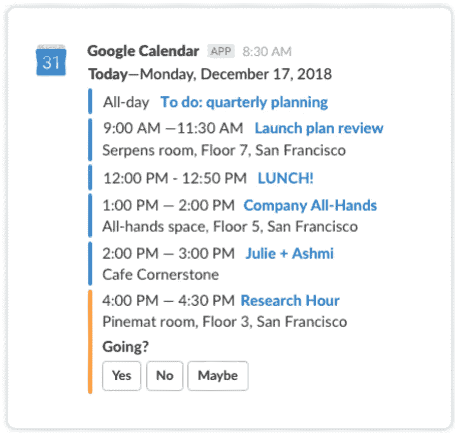
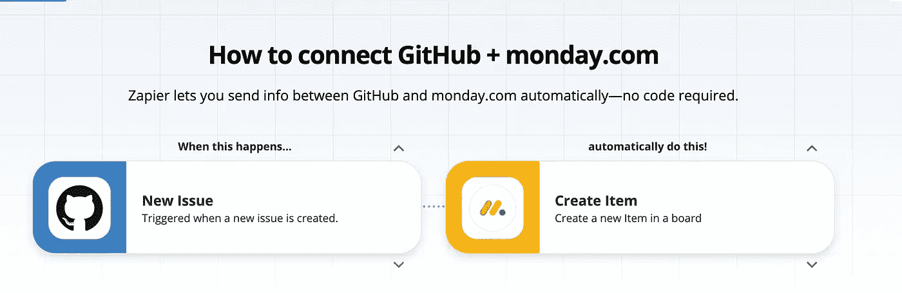
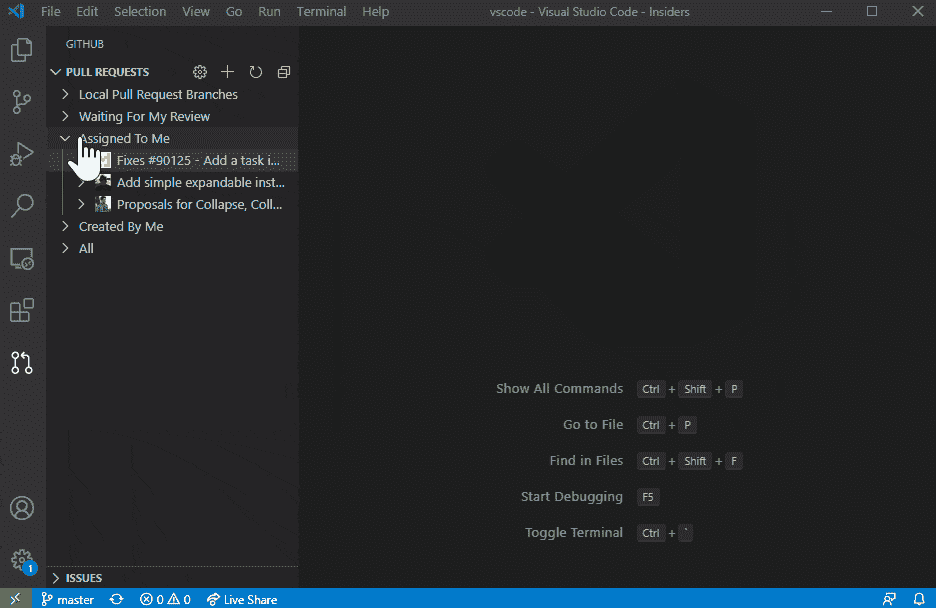

# 如何自动化您的编码工作流程并加倍您的生产力

> 原文：<https://javascript.plainenglish.io/how-to-automate-your-coding-workflow-and-double-your-productivity-dbd77266a07d?source=collection_archive---------3----------------------->

现在就开始专注于写好代码吧。

Photo by [cottonbro](https://www.pexels.com/@cottonbro?utm_content=attributionCopyText&utm_medium=referral&utm_source=pexels) from [Pexels](https://www.pexels.com/photo/man-reclining-and-looking-at-his-laptop-5483064/?utm_content=attributionCopyText&utm_medium=referral&utm_source=pexels)

你一天中有多少次不得不停止编码来处理一些随机任务？

组织会议，检查邮件，管理看板票。这是一个毫无生气的负担，会扼杀你的生产力，让你无法专注于写好代码。

最近，我终于战胜了这种苦恼，在网上找到的一些神奇的免费工具的帮助下，我的生产率提高了一倍。

让我们检查他们。

## Slack 机器人

Slack 是团队沟通的行业标准。我在我合作过的每个团队中都使用过这个工具。不幸的是，你可能会将 Slack 的使用限制在一个简单的聊天应用上。

事实上，您的 Slack profile 应该是您避免在不同应用程序之间转换的第一个工具。方法是使用 Slack 机器人。

Slack bot 是一个简单的工具，它会在你的 Slack 页面上弹出，帮助你自动完成重要的任务，并且有一个 Slack bot 可以处理几乎所有的事情。我建议你使用以下几种:

*   谷歌日历机器人(Google Calendar bot):如果你不喜欢在日历中来回切换，以查看即将到来的会议、安排会议日程以及查看你的日常约会。通过这种集成，您每天早上都会收到关于您的日常会议的 pinged。此外，你可以使用聊天工具来组织它们，你还可以得到一个有用的开始会议的提醒和它的访问链接。

*   **奇迹**:你可以把奇迹想象成一个准备好为你记住一切的大大脑。你只需要告诉 Wonder 要记住什么，这个工具就会发挥它的魔力。这是一个你和这个机器人聊天的例子:

我使用 Wonder 来记住关于我公司的有用的东西，例如，我们进入办公室必须遵循的程序，以及关于我们的项目经常出现的问题。例如，我与 Wonder 的一次典型聊天是:

**“不知道，访问我的本地数据库的命令是什么？”**

一个真正的救世主来阻止我浏览文件。

## 扎皮尔

Zapier 是一个帮助你将不同的应用程序连接在一起并在它们之间移动信息的工具。在我的例子中，我使用 Zapier 将我的 GitHub 帐户连接到星期一，这也是我最喜欢的免费生产力，我设置了一些触发器来自动执行这些操作:

*   每当一个新的 Github 问题被创建并分配给我时，我会看到它立即在周一以列表项目的形式出现，所以我总是有一堆新任务在积累，等待我检查并控制。
*   每当我被要求做一个拉式请求审查时，我会在周一看到一个新的列表项出现，这样，我就不会失去对我要检查的内容和需要我注意的内容的了解。

总的来说，这个免费工具帮助我自动化了我的 GitHub 工作流程的一部分，让我不用检查数百封难以阅读和管理的 GitHub 电子邮件。

## Gmail 自动化功能

我觉得对包括我在内的许多人来说，电子邮件泛滥可能是现代社会的新问题之一。我们的收件箱不断收到大量信息。从清晨的第一缕阳光开始，我们就臣服于数十封电子邮件。

为了防止我对电子邮件着迷，我设置了自己的 Gmail 账户，使用一种叫做过滤器的工具。基本上，我向 Gmail 报告，一旦我收到来自特定发件人(例如 GitHub 或 Trello bot)的电子邮件，该电子邮件必须保存在特定的标签中。

这个工具让我每天早上都能看到非常相关的邮件。另外，由于我已经为我的 GitHub 通知设置了自动化，我的收件箱现在比以前更薄了。

## VS 代码 GitHub 集成

同样，设置集成和自动化的目标应该是在不同的应用程序之间尽可能少地耍花招。作为一名开发人员，我相信您必须不断地打开和审查 pull 请求，因此，您可以在编辑器中通过这种惊人的集成来完成所有工作，而不是在 VS 代码和 GitHub 之间切换。

## 结论

编码很神奇，但是围绕它的所有无聊的任务会扼杀你的生产力，让你沮丧。有了这个工具列表，你现在应该能够自动化你的工作流程的大部分，使你的生产力暴涨，你的编码体验更加流畅。

感谢阅读，

—皮耶罗

**你还想要更多的**？⬇️

## [想学习如何通过开发挣更多的钱并达到财务自由吗？这是我给你的免费指南。](https://tinyurl.com/MoneyDev)

## *更多内容尽在*[***plain English . io***](http://plainenglish.io/)