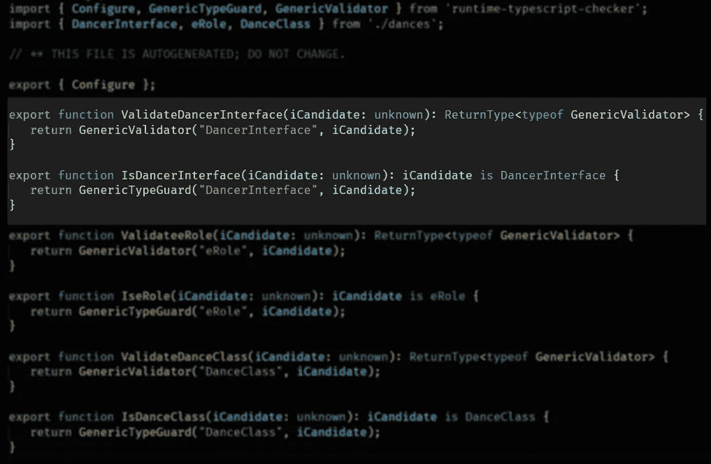

# 如何自动将 TypeScript 类型转换为运行时验证器

> 原文：<https://javascript.plainenglish.io/how-to-automatically-convert-typescript-types-to-runtime-validators-5b06ee269b13?source=collection_archive---------7----------------------->

## 本文将展示如何从 TypeScript 文件中生成运行时验证器。


Photo by [Tudor Baciu](https://unsplash.com/@baciutudor?utm_source=medium&utm_medium=referral) on [Unsplash](https://unsplash.com?utm_source=medium&utm_medium=referral)

作为一个开发者，偷懒可能是件好事。如果某些代码已经编写过一次(比如 TypeScript 定义)，为什么还要编写类似的代码来做同样的事情呢？这很容易出错，而且耗费大量时间。如果有一种方法可以将这些类型、枚举和接口转换成某种运行时代码呢？嗯，有。

本文展示了包`runtime-typescript-checker`，可以在 https://www.npmjs.com/package/runtime-typescript-checker找到。

# TL；速度三角形定位法(dead reckoning)

这篇文章解释了如何从下面的代码中自动生成函数`IsUserTypeGuard()`和`ValidateUser()`:

```
export interface User {
  Name: string;
  HasPaid: "Yes" | "No",
  Notes?: string
}
```

# 建设

首先，`runtime-typescript-checker`将解析源代码(包含导出类型、枚举和接口的类型脚本文件)。

解析结束时，将创建(或更新)可以使用的新文件。

## 例子


将为每个导出的类型生成一个包含两个函数的文件。一个 TypeGuard 和一个验证器函数。



# 在运行时使用测试(TypeGuard)

初始化运行时检查器需要几行代码，但是完成之后，只需使用:


# 在运行时使用测试(验证)

类型保护很好，但是经常需要关于错误的细节。如前所述，还有一个验证器函数，它可以清楚地显示在有效负载中发现的错误:


给定上面的接口，这个有效负载:

```
{
   Name: "Tomas",
   HasPaid: "Maybe",
   Role: dances.eRole.Leader,
   DanceClass: {
       ID: "7",
       Name: "Lindy Hop Autumn",
       Level: "?",
   },
   Notes: undefined,
   MemberShip: true
}
```

会呈现以下错误:

```
[
    {
        "instancePath": "/HasPaid",
        "schemaPath": "#/properties/HasPaid/enum",
        "keyword": "enum",
        "params": {
            "allowedValues": [
                "No",
                "Yes"
            ]
        },
        "message": "must be equal to one of the allowed values"
    },
    {
        "instancePath": "/DanceClass/Level",
        "schemaPath": "#/properties/DanceClass/properties/Level/enum",
        "keyword": "enum",
        "params": {
            "allowedValues": [
                "A",
                "B",
                "C",
                "D",
                "E"
            ]
        },
        "message": "must be equal to one of the allowed values"
    }
]
```

# 演示？

```
git clone [https://github.com/tomnil/runtime-typescript-checker-demo](https://github.com/tomnil/runtime-typescript-checker-demo)
cd runtime-typescript-checker-demo
npm install# And then one of the following:npm run build-example1
npm run build-example1-forcenpm run test-example1
```

在[演示项目页面](https://github.com/tomnil/runtime-typescript-checker-demo)上有更多信息。

## 享受

:)

*更多内容请看*[***plain English . io***](http://plainenglish.io/)