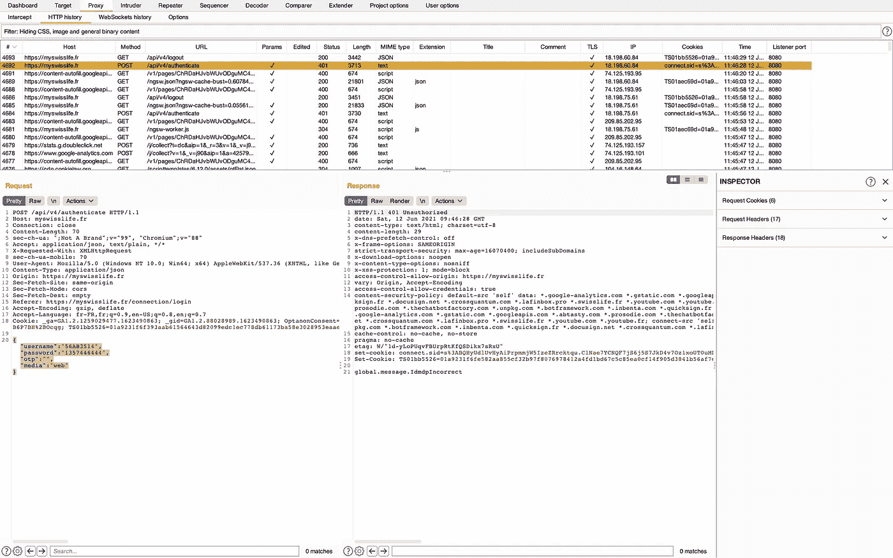

# 如何轻松避免刮网地狱

> 原文：<https://javascript.plainenglish.io/how-to-avoid-easily-the-web-scrapping-hell-3c259979ff5b?source=collection_archive---------13----------------------->

以下是我用另一种方式节省时间的秘诀

> 如何从网站中提取一些数据？

我的第一个直觉是使用一些网页删除技术，因为我每天都这样做，而且它一直在工作。但是刮网是一场噩梦:你可能会被网站封锁，如果你想要一个可靠和快速的服务，你依赖于前端。

但是今天，很大一部分网站使用 REST API。好好利用它！

# 您需要的

*   分析和复制 API 请求的工具(*即*[*Burp*](https://portswigger.net/burp)*)*
*   文本编辑器(*即 Visual Studio 代码*)

# 使用 Burp 浏览器浏览网站

打开 Burp，选择代理选项卡，然后截取子菜单。如果设置了拦截，您可以将其关闭，然后单击打开浏览器。

然后，您可以在您最喜欢的网站上导航。
就我而言，我使用了 [myswisslife.fr](http://myswisslife.fr) 一个法国人寿保险网站，在那里你可以找到你的股票期权。

# 检查网站是否有应用编程接口

第一步完成后，您可以进入 HTTP 历史子菜单。

您将看到一批请求(HTML、图像、JSON……)
现在尝试寻找一些可行的请求:

*   JSON 的回应
*   URL 中带有单词 API 的请求

例如，在我的例子中，当我提交登录时，在/API/v4/authentication 上发出了一个 POST 请求，该请求带有一个包含用户名、密码和其他一些东西的对象。

开机自检响应为*global . message . idmdpincorrect*(错误密码)

在本教程中，我使用假数据是很正常的，但是你理解这个想法；)

如果您继续查看历史记录，您可以找到其他可行的请求，比如这个:/API/v3/contrt/home

回复:一份 JSON 合同清单。

# 在文本编辑器中翻译请求

您现在有 2 个请求:

*   开机自检登录以获取承载令牌
*   获取合同以检索合同列表

你只需要用一个 HTTPS 模块来翻译它，比如 nodeJS 上的 Axios。
复制标题并设置参数，你的工作就完成了！

只需 2 次请求，您就可以提取所有合同，无需任何抓取技术。

# 奖金

在某些网站上，API 可能更复杂，您需要测试一些变化来了解强制参数。

为此，您可以右键单击请求，然后选择“将其发送到中继器”。

使用这个工具，您可以重复请求并尝试删除一些参数，并直接看到响应，就像使用邮差一样。

谢谢你的阅读。

## 如果这篇文章有帮助，请点击拍手👏按几下下面的按钮来表示你的支持！⬇⬇

*更内容于* [*浅显易懂的英语中*](http://plainenglish.io/)