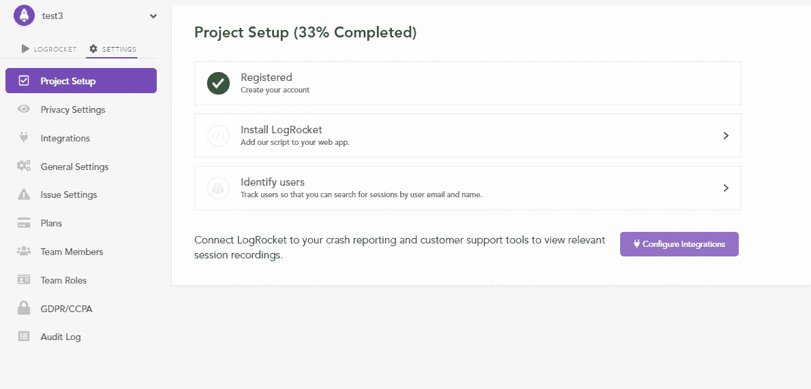
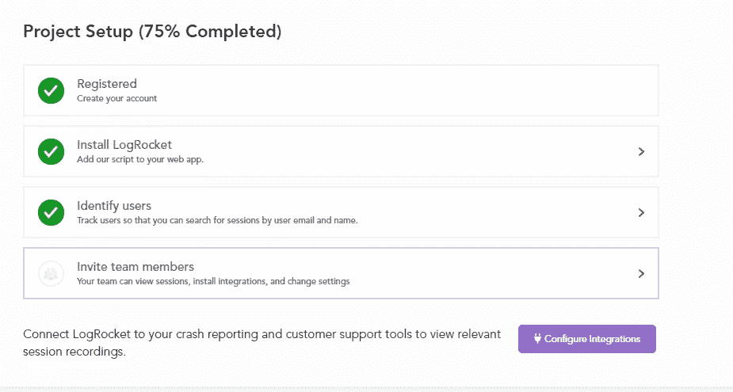
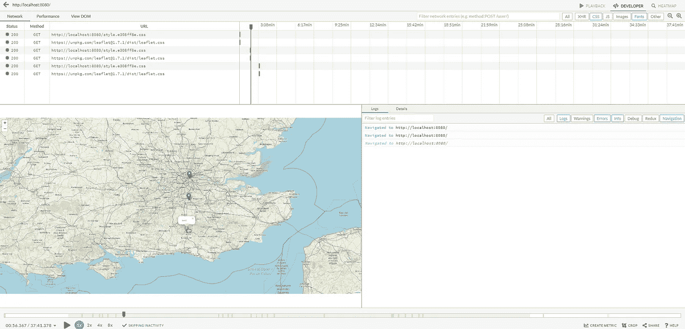
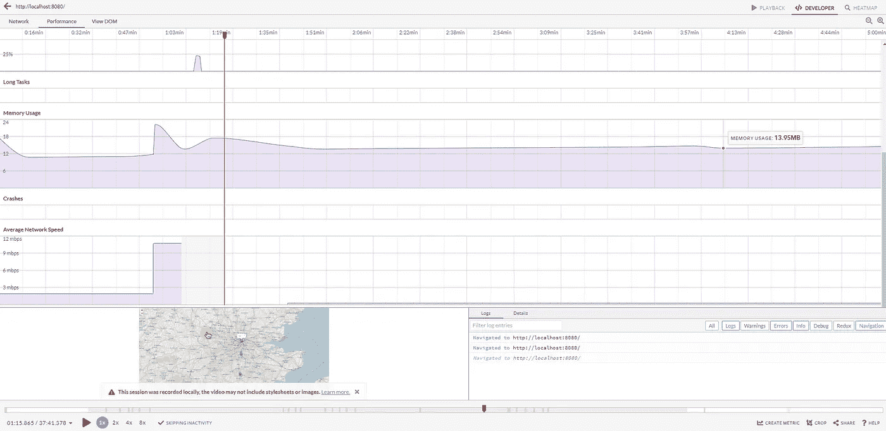

# 如何避免前端开发的运行时错误

> 原文：<https://javascript.plainenglish.io/how-to-avoid-runtime-errors-for-frontend-development-d24741df4a52?source=collection_archive---------17----------------------->

## 作为开发人员和测试人员，我们经常会遇到我们没有注意到的运行时错误。我们可以通过前端监控来摆脱它们。


Photo by [Hello I'm Nik](https://unsplash.com/@helloimnik?utm_source=medium&utm_medium=referral) on [Unsplash](https://unsplash.com?utm_source=medium&utm_medium=referral)

在应用程序上线之前，我们会花很长时间对其进行测试。在手动测试中，一些运行时错误可能很难用肉眼看到。这给最终用户造成了不愉快的情况。

这个阶段有工具使用。通过进行前端监控，您可以在仪表板上监控哪个用户花费了多少时间、他得到了什么错误、会话期间使用的 CPU、页面加载速度、经历的崩溃、遇到的 JavaScript 错误等等。

我将解释我用于前端监控的工具。我将用一个小应用程序展示设置步骤。完成设置阶段后，我将分享屏幕上出现的会话。

**会话**

这些是用户与你的应用程序的交互。点击按钮、DOM 状态、网络日志、Javascript 错误和性能数据、使用输入和每一次鼠标移动都包含在这些交互中。如果 30 分钟或更长时间没有交互，则会话结束。在会话丢失的情况下，即使应用程序是打开的，新的会话也会在下一次交互时开始。

**LogRocket**

LogRocket 捕获鼠标动作、事件、DOM 状态、应用程序中执行的网络请求，并将它们记录为会话。每次到达时，应用程序都被保存为一个会话。您可以轻松地将 LogRocket 集成到您的应用程序中。

## 【LogRocket 为我们提供的功能

**会话重放**

*   网络状态
*   工作特性
*   师
*   JavaScript 日志和详细信息
*   会话详细信息
*   用户详细信息

**前端性能监控**

*   页面加载指标
*   CPU 使用率
*   内存使用
*   猛撞
*   网络速度
*   长期任务

**产品分析**

**错误跟踪和管理**

**用户体验分析**

## **页面加载指标**

这些是每次加载页面时在会话中出现的页面加载度量。

**第一个字节的时间**

时间是从发出 HTTP 请求的用户或客户端开始计算的

**DOM 完成**

衡量页面上的所有操作何时完成，以及何时完成资源下载

**最大含量油漆(LCP)**

提供一种以用户为中心的方法来测量页面加载的实际时间

**第一输入延迟(FID)**

它测量从用户第一次与页面交互到浏览器响应交互的时间

我可以解释一些特征

**CPU 使用率:**用户在会话期间使用的 CPU

**内存使用量:**用户在会话期间使用的内存量

**浏览器崩溃:**表示会话期间浏览器崩溃。它仅受 Chrome 支持。

**平均网速:**根据用户整个会话的平均连接速度和页面加载时下载资产的速度计算出的平均值。


[https://logrocket-assets.io/static/home-hero-c97849b227a3d3015730e3371a76a7f0.svg](https://logrocket-assets.io/static/home-hero-c97849b227a3d3015730e3371a76a7f0.svg)

**定价**

> 对于开发者版本，它是免费的，你将有 1000 次会议，为期 1 个月。
> 
> 对于团队版本，费用是 1 个月 99 美元，您将有 10000 个会话。
> 
> 对于专业版，将是定制定价。

## 安装阶段

我在 JavaScript 项目中使用 LogRocket。我会告诉你如何设置它。

首先，从页面 [LogRocket](https://logrocket.com/) 用“免费入门”登录。

然后创建一个组织。

重定向后将出现此屏幕。



对于安装，让我们转到项目代码。

`npm i --save logrocket`

```
<script src=”https://cdn.lr-in.com/LogRocket.min.js" crossorigin=”anonymous”></script><script>window.LogRocket && window.LogRocket.init(‘your_project_id’);</script><script> LogRocket.identify(‘your_project_id’, { name: ‘user_name’, email: ‘user_email’,});</script>
```

让我们将这些`script`代码粘贴到 HTML 文件中。安装完成后，现在安装程序就完成了。如果您有群成员，您可以添加。



**LogRocket 仪表盘**

这是一个会话网络选项卡；



这是一个会话性能选项卡；



由于这种前端监控，您可以很容易地注意到系统中发生的错误，并在它们生效之前采取行动。

它有一个简单的界面。我很容易使用它，它是一个你绝对应该尝试的工具。

谢了。

贝斯特

*更多内容请看*[***plain English . io***](http://plainenglish.io/)