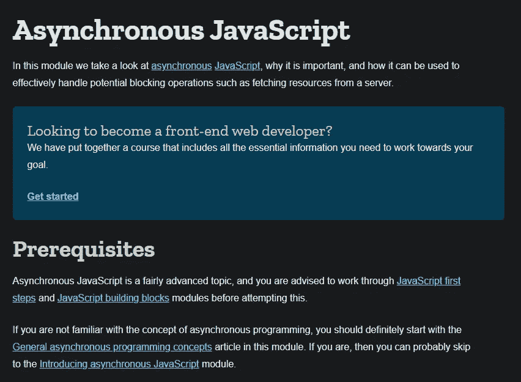

# 如何成为一名更好的软件工程师

> 原文：<https://javascript.plainenglish.io/how-to-be-a-better-software-engineer-41bb663f63d7?source=collection_archive---------16----------------------->

Photo by [Marvin Meyer](https://unsplash.com/@marvelous?utm_source=medium&utm_medium=referral) on [Unsplash](https://unsplash.com?utm_source=medium&utm_medium=referral)

**用 JavaScript 举例**

## ***简介***

远一点来说，提高自己编程技能的解决方案就是每天坚持编程，坚持学习，确实如此。当你积极追求某样东西的时候，不可避免的会因为追求而变得更好。然而，特别是在软件开发中，优化很重要，因为以`***O(n)***`的速度学习比`***O(n*2)***`的速度学习更好。这个博客是关于建立你自己的哲学的。所以事不宜迟，这是我的。

# 编码你所知道的

代码是一种艺术形式，作为艺术的开发者，我们必须完善我们的工艺。举个例子，比如关于 Leet 代码或黑客等级的代码挑战。用户收到一个类似“*的问题，给出两个数组，检查任一数组是否包含一个公共项，返回一个布尔值我们可以像这样写一些非常简单易读的代码。*

ContainsCommonItem example one

如果你知道这两种`some & includes` 方法是如何操作的，这是一个很好的解决方案。但是，为了便于讨论，我们假设我们不理解上面的代码。让我们对我们*做*知道的事情进行编码，我们知道。`if` `&` `for .`

ConstainsCommonItem Example of coding what we know.

这两个例子相对来说是一样的，它们都是很好的答案。如果你按照第一个例子做，但不明白它是如何工作的，你只会减慢你的进度。

当我们编写我们所知道的代码时，我们对内置方法有了更深的理解。此外，如果你在技术面试中用简单明了的方式编写代码，你就能回答它是如何工作的。当我们对自己所做的事情有了更深的了解，我们自然会更有动力地学习，这将在下一节讲述。

# 动态学习

*动态学习*意味着我们坚持概念，而不是解决方案。想象一下我们有解决方案&的一致性。例如，在软件中，我们可以用一个解决方案来解决两个不同的问题。

我们不仅可以使用 double bang 运算符，还可以记录每种类型。这是一个简单的例子，但它可以更深入。根据 [*CodersCat*](https://coderscat.com/learn-programming-languages/)

*“几乎每一种编程语言都包含这些类别的元素；数据类型和数据抽象、控制流和控制抽象、低级抽象、补充和特定领域的抽象。*”

上面列出的所有元素在 90%的大多数编程语言中都得到了简化。动态学习类似于隐喻，隐喻不需要照字面理解，比如

*“授人以鱼，可以吃一天；授人以渔，可以不饿。”——老子*。

任何人都可以用这个谚语来描述任何与展示而不是说某事有关的事情。就像数组可以用在任何语言中，可以被认为是一种数据结构或抽象。学习动态概念更加困难，但这些概念将在你的工作和日常生活中为你服务，不像工具或关键词。你会学得更快，也更容易找到答案，交流，避免误传，这些我们将在下一节详细介绍。

# 事实核查

我们都需要接受和接受批评，包括你和我。总是反复检查人们告诉你的话。听听人们对你说的话，然后在把它当作真理之前核实一下。准确性对客户、雇主和整个社会都至关重要。在 JavaScript 中，大多数人可能都知道这一点，你会在互联网和 stack overflow 上发现人们使用`var` 关键字，但是如果你熟悉 JavaScript，你就会知道，由于 es6 和 babel 以及许多其他原因，`var`是一个大禁忌，在现代 JavaScript 中很少使用。

我常常感到羞愧，因为我听了一个不知道自己在教什么的人的话。当你对人们进行事实核查时，你会变得更可靠，但你也会更深入地了解话题。事实核查是困难的，因为我们会觉得有太多的信息需要吸收和理解。这就是我利用兔子洞技术的地方，这将在下一节中介绍。

你应该核实整个博客，并把它留在评论里。这样，我们可以更好地理解 JavaScript 和编程社区。记住，这不是一场战争*。*

[*“我们都想互相帮助，而不是互相憎恨，人类都是这样的。*](https://www.youtube.com/watch?v=J7GY1Xg6X20)*——卓别林。*

# 兔子洞

兔子洞是袖手旁观的一项技术，尽管大多数人并不喜欢。注意与目标保持一致。 [MDN](https://developer.mozilla.org/en-US/) 在这方面做得非常出色。看看下面的片段:

主题从 ***异步 JavaScript*** 开始，但是建议您如果还没有去过***Java script build blocks***的话，可以去看看，因为下面的主题是高级的。

如果你实施了*兔子洞*技术，你将进入下一部分，一旦你遇到一个主题，比如承诺，你将对该主题进行顶级潜水，收集信息，然后一旦你有了想法就重新浮出水面。为了保持条理，我建议使用 [Typora](https://typora.io/) 或你最喜欢的笔记应用程序来记录你在保持条理的过程中学到了什么。

如果执行得当，你会学得更快更有效。*兔子洞*并不适合每一个人，因为它确实需要大量的组织才能与你的目标保持一致。但是对于那些对自我管理没有问题的人来说，这是一个很好的方法来形象化你所知道的，并在你的实践中感到自信。下一节将更深入地探讨可视化。

# 笔到纸

笔到纸是我最喜欢的可视化代码的方式。离开键盘，画出问题的可视化表示，确实有助于与你正在做的事情建立更深层次的联系。

我建议买一个白板，因为从长远来看它会更便宜。笔到纸是有趣的，有效的，并且能真正地透视事物。我真的认为这对每个人都有好处，尤其是作为两三个人的团队来做的时候。它还可以帮助你处理失败，因为你会兴奋地回到绘图板，双关语。

# 失败是最重要的

失败是好的，也不知道为什么人一搞砸就把自己放下。失败只是培养你技能的另一种方式。我曾经写过，*“失败是第一位的，成功是第二位的，”*这句话的意思是失败比成功更重要。失败可以导致伟大的成就，无论是偶然发明微波炉的 [*珀西·斯宾塞*](https://en.wikipedia.org/wiki/Percy_Spencer) ，还是偶然发现青霉素的 [*亚历山大·弗莱明*](https://kidsdiscover.com/quick-reads/penicillin-found-functional-fungus/#:~:text=The%20first%20name%20for%20penicillin,the%20bacteria%20he'd%20been) 。当拥抱失败时，你获得了能力。有了它，你对消极变得更有弹性，这将极大地影响你的心理健康，让你成为一个更好的程序员。

# 健康第一

开始吧，健康永远是你能为自己做的最重要的事情。不要把工作当成不健康的借口。在我所有的经验中，健康的 web 开发人员在工作中表现得比不健康的 web 开发人员更好*。我没有偏见。这是事实。根据 BYU[*和健康研究中心*](https://news.byu.edu/news/poor-employee-health-means-slacking-job-business-losses) *-2012* 所做的这项研究*

*   *白天很难锻炼的员工生产率下降的可能性增加了 96%。*
*   *吸烟者报告工作效率下降的可能性要高 28%。*
*   *在工作中很少吃水果、蔬菜和其他低脂肪食物的员工，其生产力损失的可能性要高 93%。*
*   *那些不相信他们的工作场所会支持他们变得更健康的人更有可能降低生产力。*

*如果你从这篇博客中只有一个收获，那就是健康第一。*

# *C 结论*

*要成为一名优秀的 web 开发人员，无论你使用的是 JavaScript、TypeScript、Python、Ruby、C、C++等等。你必须建立自己的哲学。当你建立了自己的实践学校，你就独立了。任何大公司都必须创造一些东西才能达到现在的位置。*

*所以，我的建议是检查事实，健康饮食，编码你所知道的，失败，尽你所能保持开放和接受反馈。一旦你完成了自己的自省学习过程，事情会变得更加令人兴奋，你可以把它传递给其他人。下次见。我是卡梅隆，保持快乐，保持健康。*

**更多内容请看*[*plain English . io*](http://plainenglish.io/)*