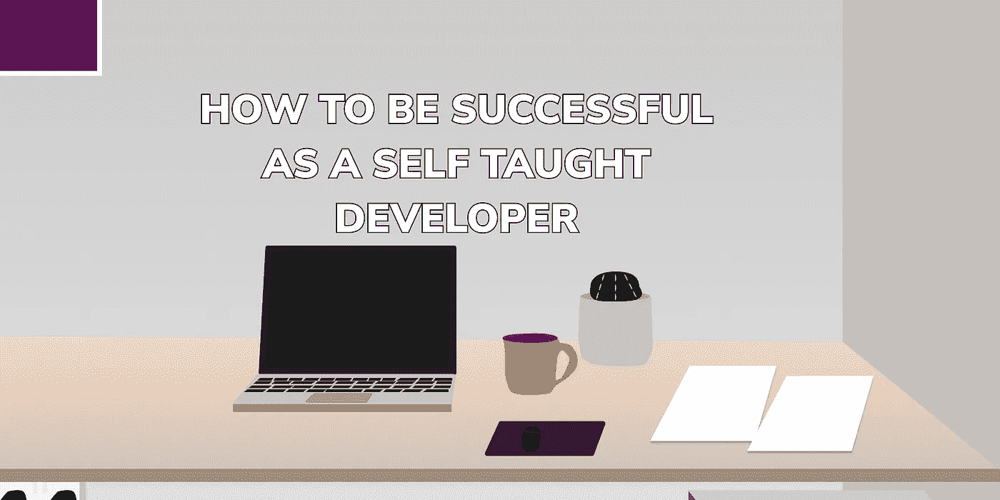

# 如何成为一名成功的自学成才的开发人员

> 原文：<https://javascript.plainenglish.io/how-to-be-successful-as-a-self-taught-developer-d42482bd7fd8?source=collection_archive---------7----------------------->

游戏已经改变了。你不再需要大学文凭就能成为一名开发人员。我不是说你应该辍学，但是如果你正在学习，那么继续这样做！但是不管你的成绩如何，在你学习并获得资格证书之后，这条路并没有结束。如果你没有取得好成绩，不要认为这就结束了，你可以在家里或训练营中自学编程，并且仍然让自己进入科技世界。

# 渴望成为一名开发者

对于那些没有技术背景的人来说，这将是一个勇敢的新世界！人们很容易被外面的所有内容和信息完全淹没。我可能在大学里学过，但我最近的和最好的技能都是自学的。如果我能做到，那么任何人都可以。

通往成功的道路将是漫长而崎岖的，但是如果你能挺过来(大多数人都是这样)，那么你将踏上一条新的职业道路。

# 成功之路

你应该做的第一件事是加入拥有最大开发者追随者的顶级平台。

# 编程；编排

你将需要 GitHub 帐户上传你的项目，你应该在 freeCodeCamp 上创建一个帐户，并加入 [100 天代码挑战](https://www.100daysofcode.com/)，这样你就可以为你的学习创建一个时间表，也让自己负责。

[GitHub](https://github.com/)T6[freeCodeCamp](https://www.freecodecamp.org/)

# 博客

写博客非常重要，它不仅是一种学习工具，也是你在发展过程中记录自己进步的一种方式。此外，如果你真的很幸运，它可能会变成一个侧面或被动的收入流。

[hash node](https://hashnode.com/)
[DEV](https://dev.to/)
[Medium](https://medium.com/)

# 社会化媒体

如果你真的想成为一名开发者，那么你需要使用社交媒体。这就是你如何与和你一样有相同想法和抱负的开发人员联系的方式。这会给你很大的动力，保证你永不放弃。Twitter 上有成千上万的开发者，所以你永远不会失去可以使用的内容，也不会费力去寻找可以指导你的开发者。

显然，你需要 LinkedIn 来找工作，联系招聘人员和其他开发人员。

[推特](https://twitter.com/)
[领英](https://www.linkedin.com/)

# 制品

一旦你对自己的技能有了一些信心，现在就是创造一些产品的时候了。这样做将打开一些被动收入流，作为一个额外的奖励，你的声誉将增加，导致更多的工作机会和与其他开发者的合作，这是你永远无法想象的。

[product hunt](https://www.producthunt.com/)
gum road

# 最后的想法

我真的希望你喜欢阅读这篇文章，并从中学到一些东西。作为一名内容创作者和技术作家，我热衷于分享我的知识并帮助其他人实现他们的目标。让我们通过社交媒体联系起来你可以在 [linktree](https://linktr.ee/andrewbaisden) 上找到我所有的社交媒体资料和博客。

和平✌️