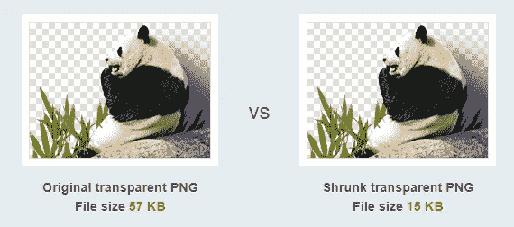

# 如何在网站上线前提高速度

> 原文：<https://javascript.plainenglish.io/how-to-boost-your-website-speed-before-making-it-online-dcca98b53440?source=collection_archive---------13----------------------->

## 在 web 应用上线之前，用 5 个步骤提升您的 web 应用！

By FAM

你有自己的网站吗？你打算建立自己的网站，并想得到一些提高网站性能的建议吗？你对什么最影响网站速度感到好奇吗？

欢迎，这篇文章是给你的！我们都知道一个网站的表现对于被 Google 和 SEO 很好的排名是至关重要的。因此，该网站将在互联网上有更好的知名度，这意味着更多的访问者。

因此，无论我们做了多少努力，这一步都是抓住更多用户并为他们提供美好网站体验的必经之路。这将使他们在访问你的网站后感到高兴，并不断返回。

准备好了吗？我们走吧！

# # 1-图像优化

网站是文字和视觉事物(视频、图片、gif……)的结合。我们都希望展示最漂亮和高质量的图像，以增强用户体验，使网站充满活力。问题是:

> 一个高质量的图像是沉重的，它对网站加载时间的权重

所以想象一下，如果你有很多高质量的图像。这会如何影响你的网站速度？

💡然而，有一个解决方案，在不牺牲质量标准的情况下，我们希望为我们亲爱的访问者保持。这就叫做: ***压缩*** 。

[TinyPNG](https://tinypng.com/)

你看出什么不同了吗？我个人不！不过尺寸已经变了！

通过这种方式，你可以为你的网站生成更亮的图片来快速加载并提升你的网站性能。

有很多工具可以使用。我个人使用 [TinyPNG](https://tinypng.com/) 是因为它的简单和快速的处理时间。您所需要做的就是拖放您的重要图像并下载生成的图像:

TinyPNG

# # 2-代码最小化

它是关于最小化你的 JavaScript 和 CSS 文件。确保你所有的 CSS 和 JavaScript 文件在应用程序中没有被分割。把你所有的样式放在一个 CSS 文件中，对 JavaScript 来说也是一样的，这将加速这些资源的加载，从而加快你的网站的加载时间。

# # 3-启用文本压缩

**压缩**一般指使用数据压缩算法修改过的代码。对于 Node.js 开发人员来说，有一个压缩包可以减少可下载的数据量。当我试用这个包时，我的网站性能已经从*的 54%*的 84% (我使用了 Lighthouse 扩展来衡量性能，更多细节请看最后一节)。**

**这里有一篇很好的文章解释了这个过程:**

** [## 用 Node.js 压缩 Gzip

### Node.js 和 Express.js 中的压缩减少了网站或应用程序的可下载数据量。通过使用这个…

medium.com](https://medium.com/@victor.valencia.rico/gzip-compression-with-node-js-cc3ed74196f9)** 

# **# 4-避免过多的 HTTP 请求**

**从逻辑上来说，当你有很多 HTTP 请求时，应用程序将花费更多的时间来加载所有内容，因为对于每个请求，我们需要加载响应。**

**因此，在这种情况下，减少请求的数量是最好的办法。你可能想知道，如果这些请求对我的网站都很重要，该怎么办？好吧，不用担心，已经有很多技术可以解决这个问题。**

*   **惰性装载**
*   **束分裂**

# **# 5-托管网站**

**托管网站的选择很重要。你可能只寻找一个免费的主机服务，但这对你的网站性能来说可能还不够。**

**远程计算机越快，访问者访问所请求页面的速度就越快。**

**所以，一定要选择适合你的主机！**

# **最后**

**嗯，你想知道如何确保你的网站足够好，让谷歌排名吗？好问题！**

**我的诀窍是使用 [Lighthouse Chrome 扩展](https://chrome.google.com/webstore/detail/lighthouse/blipmdconlkpinefehnmjammfjpmpbjk?hl=en)。这个分机就像一个医生。它诊断您的网站，并根据 4 个主轴向您报告好的和坏的方面:**

*   ****表演****
*   ****最佳实践****
*   ****SEO****
*   ****无障碍****

**顺便说一下，我已经在下面的文章中谈到了这个非常棒的扩展。如果你有兴趣发现更多有趣的 Chrome 扩展，请点击这里:**

** [## Web 开发者的 5 个最佳 Chrome 扩展

### 我最喜欢的 Chrome 扩展

medium.com](https://medium.com/geekculture/5-best-chrome-extensions-for-web-developers-2b2b54b056d0) 

*   网站[性能](https://www.dropbox.com/s/34noajrbm324iai/performance-checklist-1.4.pdf?dl=0)的另一个好来源。** 

# **尽情享受吧！**

****

**By @the_frontend_world**

**亲爱的读者，我希望这是明确和有用的。我希望你和你的家人无论在哪里都平安！坚持住。明天会更好！**

****让我们在** [**上取得联系**](https://medium.com/@famzil/)**[**Linkedin**](https://www.linkedin.com/in/fatima-amzil-9031ba95/)**[**脸书**](https://www.facebook.com/The-Front-End-World)**[**insta gram**](https://www.instagram.com/the_frontend_world/)**[**Youtube**](https://www.youtube.com/channel/UCaxr-f9r6P1u7Y7SKFHi12g)**或************

********[www.fam-front.com](http://www.fam-front.com/)********

*********更多内容请看*[***plain English . io***](http://plainenglish.io/)********