# 如何将浏览器开发工具和控制台引入 VS 代码

> 原文：<https://javascript.plainenglish.io/how-to-bring-the-browser-devtools-and-console-to-vs-code-848edc257094?source=collection_archive---------0----------------------->

## 将您的整个设置组合到您的 ide 中

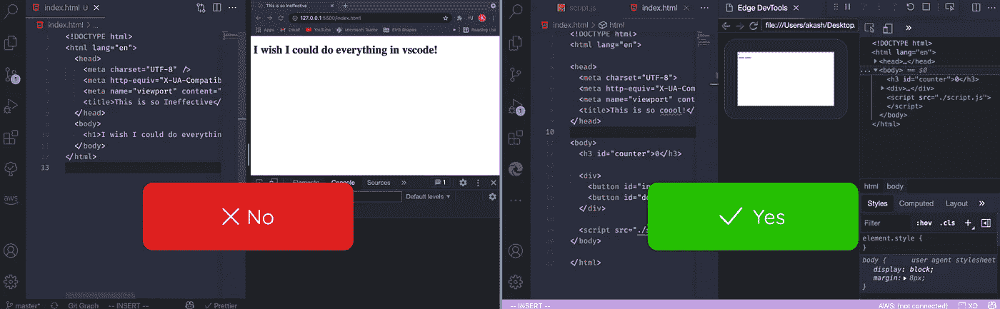

将我们前端开发所需的所有工具都放在 VS 代码中该有多酷？控制台、开发工具、终端——所有这些东西，都在 VS 代码中，就在我们深爱的代码旁边。

大多数开发人员都这样做:


但是现在，我们可以在代码中利用开发工具的力量


首先点击`Run and Debug`按钮或侧边栏中的`CMD + Shift + D`，图标可能会因您的图标主题而异。

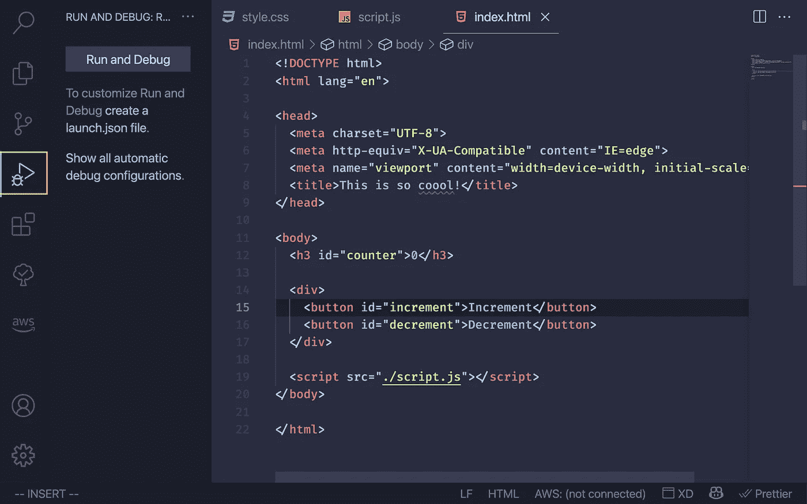

然后，点击`Run and Debug`按钮，打开一个显示可用浏览器的面板:

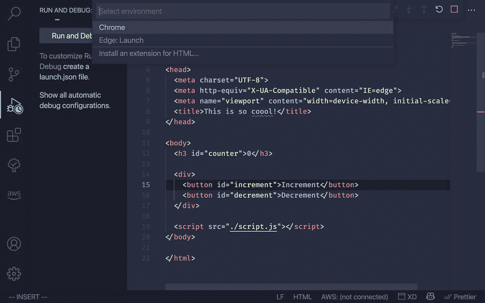

然后，选择`Edge: Launch`，是的，你没看错，我没疯。让我们看看为什么我们需要选择 Microsoft Edge:

# 为什么选择微软 Edge？

大多数开发人员使用 Firefox 或 Chrome 作为他们的开发工具和控制台。显然，微软对此不太高兴。由于微软拥有 VS code，显然，VS Code 将被这家科技巨头用来将开发者转化为 Edge。

在你开始坐立不安之前，我要告诉你，Edge 只是重新包装的 chrome。微软 Edge 内部使用 Chromium 浏览器引擎。因此，它拥有与 chrome 相同的开发工具和控制台。所以，给它一个机会吧！

# 设置

首先，我们需要在电脑上安装微软 Edge 浏览器。我们还需要为 VS 代码中的[开发工具](https://marketplace.visualstudio.com/items?itemName=ms-edgedevtools.vscode-edge-devtools#:~:text=The%20DevTools%20will%20connect%20to,without%20leaving%20Visual%20Studio%20Code.&text=You%20can%20use%20the%20extension,or%20embedded%20in%20your%20editor.)安装一个扩展:

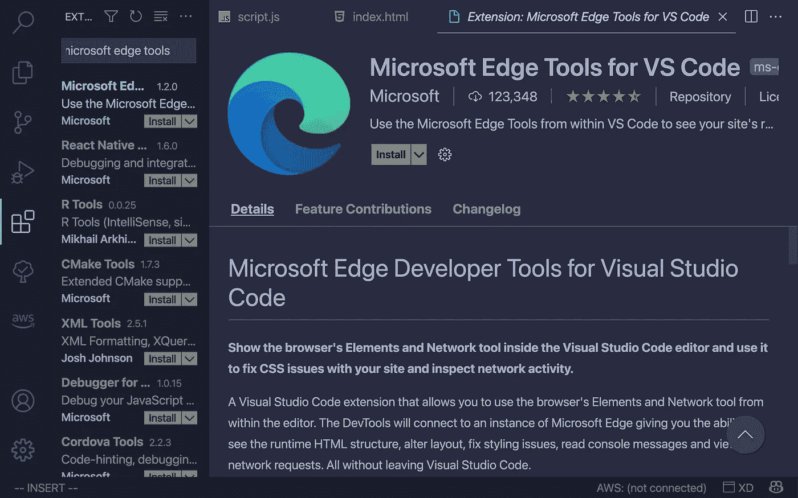

选择`Microsoft Edge`选项后，将会打开一个调试面板。然后单击开发工具面板中的最后一个图标，打开开发工具:

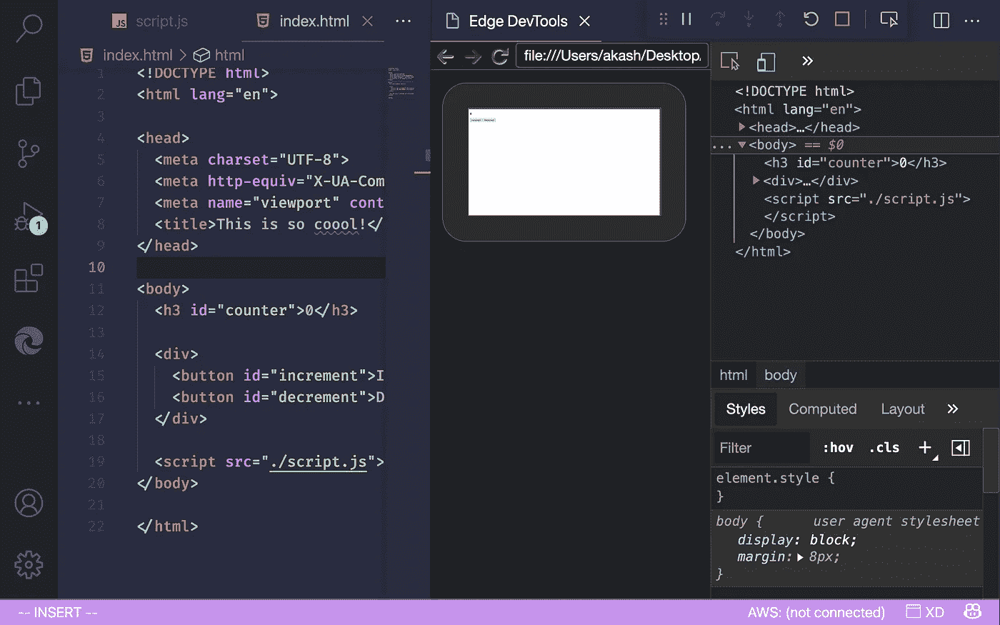

如您所见，`elements`选项卡已打开。除此之外，我们还可以访问`network`选项卡。您还可以通过点击 VS 代码中显示的窗口来与站点进行交互。

> 如果您只能看到开发工具而看不到网站，请单击图标此图标打开网站:

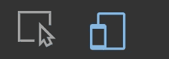

对于一些使用笔记本电脑编码的人，或者觉得他们的屏幕太杂乱，你可以将网站预览拖到我们看到文件的栏中。请查看以下截屏视频，了解如何充分利用这一特性的潜力:

[](https://vimeo.com/583459634) [## 屏幕记录 2021 年 8 月 5 日 21 时 44 分 43.mov

### 这是“屏幕录制 2021-08-05 在 21.44.43.mov”由 Akash Shyam 在 Vimeo，高品质视频和…

vimeo.com](https://vimeo.com/583459634) 

> 你可能已经注意到一个浏览器窗口被打开了，你可以最小化它，但是保持它打开是很重要的，否则开发工具将无法工作。这是因为我们在 vs 代码中看到的作为浏览器的窗口就像是外部窗口的截屏。所以如果你放大外部窗口，vs 代码窗口也会放大。

# 实时刷新

这是一个全新的功能，所以我们必须有耐心，因为它不会有所有的花哨功能。然而，VS 代码团队在路线图上有自动重新加载特性，我很确定我们能在几个月内看到它。

在那之前，别担心，我有解决办法。如果你注意到了，这个网址会打开我们电脑上的文件。但是，我们可以通过实时服务器使用热重装。为此，我们将使用一个名为 [reload](https://www.npmjs.com/package/reload) 的 NPM 包。通过在终端中键入以下命令来安装它:

```
npm i reload -g
```

安装后，在命令行中运行以下命令:

```
reload
```

就是这样，你在`localhost:8080`上有了自己的直播服务器。接下来，我们需要告诉 vs 代码使用这个服务器。选择`Generate launch.json`，它基本上就像是调试器的配置文件。

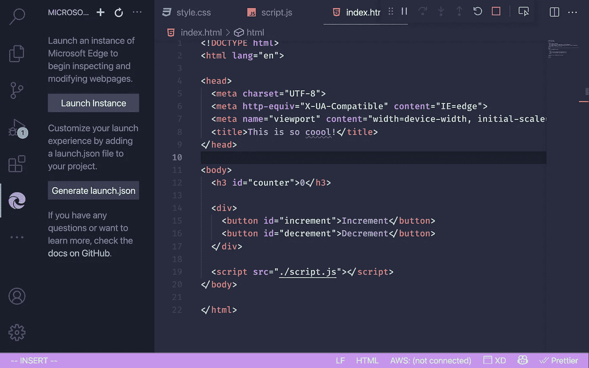

默认的`launch.json`会是这样的:

```
{
 "configurations": [
  {
   "name": "Launch Microsoft Edge and open the Edge DevTools",
   "request": "launch",
   "type": "vscode-edge-devtools.debug",
   "url": ""
  }
 ]
}
```

用`[http://localhost:8080](http://localhost:8080)`替换`url`字段。

> 创建反应应用程序，Vite，Vue 等也给我们现场服务器，我们可以更新显示的网址

现在，我们需要重新启动调试器。单击红色方块将其停止。然后转到工具条中的调试器图标，选择`Launch Project`。

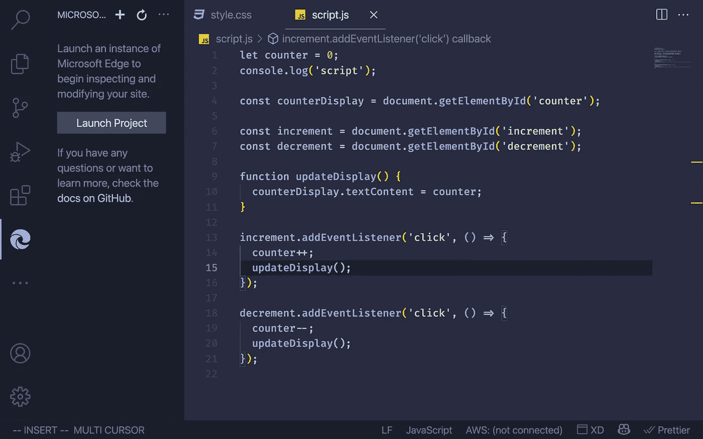

看下图的地址栏，上面写着`localhost:8080`。如果我们编辑项目中的任何文件，它将自动刷新。耶！

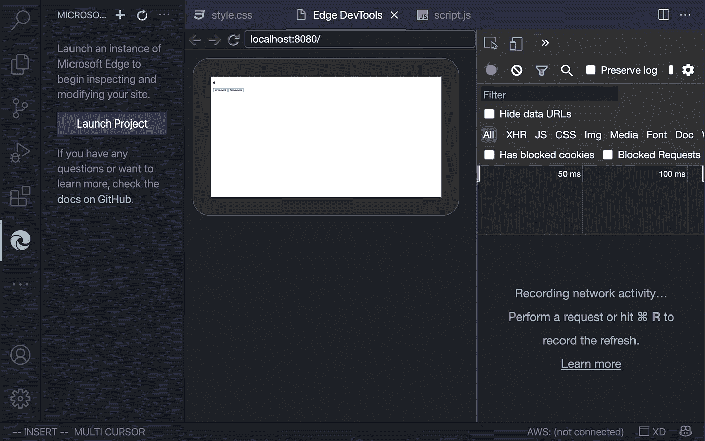

# 控制台在哪里？

传统上，我们在调试期间在代码中使用`console.log()`。现在，我们可以使用断点。断点本质上是我们代码内部的中断，在这里我们可以检查调用堆栈、变量的当前值等等。

为此，我们需要给`launch.json`添加一些配置。转到工具条上的调试器图标，点击设置图标，这将打开`launch.json`。用这个更新`lauch.json`:

```
{
 "configurations": [
  {
   "name": "Launch Edge",
   "request": "launch",
   "type": "pwa-msedge",
   "url": "[http://localhost:8080](http://localhost:8080)",
   "webRoot": "${workspaceFolder}"
  },
  {
   "name": "Launch Microsoft Edge and open the Edge DevTools",
   "request": "launch",
   "type": "vscode-edge-devtools.debug",
   "url": "[http://localhost:8080](http://localhost:8080)" // Provide your project's url to finish configuring
  }
 ]
}
```

> 记得根据您的应用更新 URL

现在，当我们转到调试图标时，我们有两种配置可以从下拉列表中选择:

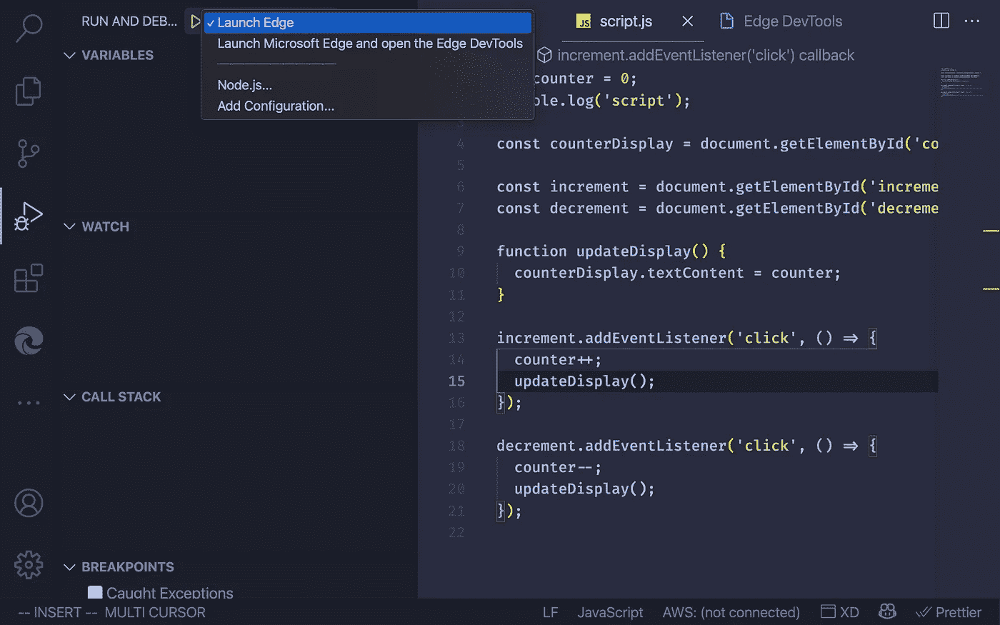

我们可以通过在看到行数的右边单击来添加断点。现在，当代码执行并到达断点时，代码执行暂停，我们可以在右边的调试器面板中看到变量、调用堆栈等的值。

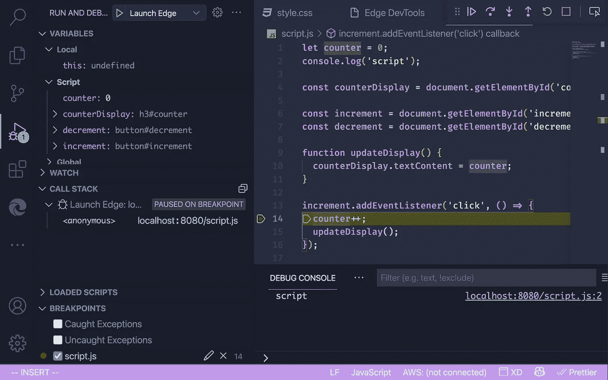

我们可以看到调试器在右边，代码和控制台在左边。如果你觉得网站之前的 inside VS 代码太小，把网站移到另一个显示器上，在 VS 代码中使用 dev tools/console。说说调试的圣杯吧！

# 我们应该用这个吗？

我认为在 vs 代码中拥有开发工具和控制台会让我们更有效率。vs 代码和浏览器之间的来回切换会少很多。在你的下一个项目中尝试一下，让我知道效果如何！

这就是现在，我希望你们喜欢这篇文章。感谢您的阅读，并在 Twitter 上关注我，我会在这里发布一些技巧、窍门和迷因。再见了。🤘

*更多内容尽在*[plain English . io](http://plainenglish.io/)