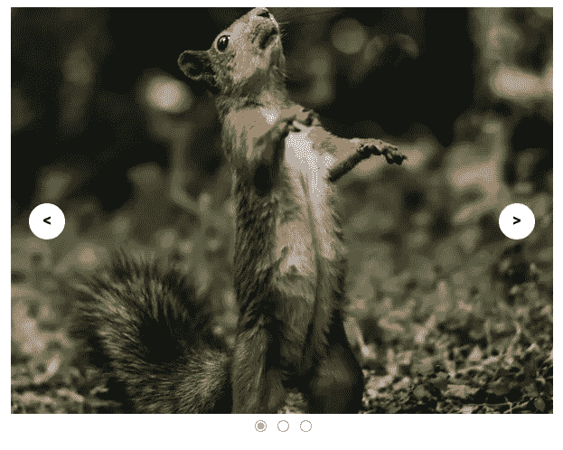

# 如何从头开始构建一个旋转木马

> 原文：<https://javascript.plainenglish.io/how-to-build-a-carousel-from-scratch-2e32753a5e80?source=collection_archive---------3----------------------->

## 如何从零开始建立一个旋转木马？以 JavaScript、HTML 和 CSS 为特色。

Carousel

# 什么是旋转木马？

在 Web 开发中，轮播是一种以类似幻灯片的方式显示不同项目(通常是图像)集合的特性。它们通常包括几个箭头按钮，用于控制在该集合中的来回导航。当到达集合的末尾或最后一个项目时，它会循环回到起点，因此有术语 carousel。

一些常见的用例是图片库、新闻标题或网站主页上的专题文章。

# 思考如何建造一个旋转木马

要开始构建一个旋转木马，我们应该首先考虑我们希望我们的旋转木马看起来像什么，它需要什么样的主要功能。以下是一些需要考虑的要点。

*   构建所需的基本 HTML 结构
*   包括用于导航的上一个和下一个按钮(箭头按钮)
*   我们将在幻灯片中包含哪些类型的项目？(在这种情况下是僵尸图像)
*   显示用户当前所在的幻灯片(用点填充)
*   切换到下一张或上一张幻灯片的功能(Javascript)
*   我们的旋转木马的样式(CSS)
*   我们旋转木马的可访问性(使用 aria 标签)

考虑到这一点，我们可以开始建造我们的旋转木马。

# 建造旋转木马

为了开始构建我们的 carousel 的结构，我们将使用几个 HTML divs，这样我们就可以按照我们需要的显示方式来定位它。第一个`div`将是保存所有项目和特性的容器。每个项目和特性也应该包装在自己的`div`中。这包括图像、按钮和圆点。

我们还将给第一个项目一个显示默认图像的类`carousel-item-visible`。稍后我们将利用它来显示用户当前正在查看的图像。我们也可以对这些点做同样的事情，给第一个点一个类`selected-dot`，并将其设置为`checked`。

接下来，我们想要添加样式，使布局看起来像我们想要的样子。我们还想让我们的图像以一种平滑和用户友好的方式显示和导航，因此我们利用 [CSS 关键帧](https://developer.mozilla.org/en-US/docs/Web/CSS/@keyframes)来实现这一点。

现在我们已经完成了旋转木马的结构和样式，我们可以给它注入一些活力了。我们需要使用 Javascript 来构建允许在我们的图像集合中来回导航的功能。

首先，我们将从 DOM 中获取 carousel 的所有活动部分。这包括所有幻灯片、下一页按钮、上一页按钮和圆点。接下来，我们需要一种跟踪和设置当前幻灯片位置的方法，以及一个对幻灯片总数的引用。

从这里我们可以开始考虑控制图像幻灯片来回移动的逻辑。需要注意的一点是，我们应该一次只查看一张幻灯片，所以我们需要一种方法来隐藏除了当前位置的幻灯片之外的所有其他幻灯片。为此我们可以使用一个助手函数，我们称之为`hideAllSlides()`。

现在，我们可以在幻灯片导航功能中使用我们的助手功能，我们将很快构建它！

让我们实现我们的导航功能来控制幻灯片的移动，我们称它们为`handleMoveToNextSlide()`和`handleMoveToPrevSlide()`。对于每个处理移动到上一张或下一张幻灯片的函数，我们将首先在函数内部调用我们的助手`hideAllSlides()`,这样当它们被调用时，我们就不会同时呈现多张幻灯片。

之后，我们需要设置检查当前幻灯片位置的条件，这样我们就知道向哪个方向移动。

在下一张幻灯片中，将检查我们是否已经到达末尾，如果是这样，我们将重置回第一张幻灯片。前一张幻灯片正好相反，当我们看到第一张幻灯片时，就会转到最后一张幻灯片。最后的任务是通过将类名`carousel-item-visible`添加到幻灯片的更新位置来设置当前幻灯片，然后将`selected-dot`类添加到相同位置的点，并将其设置为待检查。

就差最后一步了！

让我们添加事件监听器来监听上一个和下一个滑动按钮上的每个点击事件，并传入我们的`handleMoveToNextSlide()`和`handleMoveToPrevSlide()`作为回调。

这就是所有的人！

我们最终的 Javascript 代码可以在下面看到。

我还包含了代码笔的链接，这样你就可以与我们的旋转木马的代码进行交互了！点击查看[。](https://codepen.io/coderjay06/pen/NWvaYOW)

## **资源**

*   [建造旋转木马(Scrimba)](https://scrimba.com/learn/frontend/build-a-carousel-overview-c9rqB2sZ)

*更多内容看* [***说白了. io***](http://plainenglish.io)