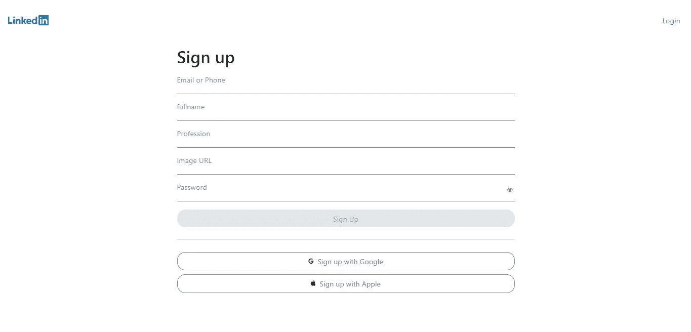

# 如何使用 ReactNative 和 Firebase 构建聊天应用程序(LinkedIn 克隆版)

> 原文：<https://javascript.plainenglish.io/how-to-build-a-chat-app-using-reactnative-and-firebase-linkedin-clone-2901a2ecb53d?source=collection_archive---------5----------------------->


你将要建造的东西。看现场[演示](https://rn-linkedin-clone-a1b25.firebaseapp.com/)和 Git 回购[这里](https://github.com/Daltonic/linkedIn-clone)。


# 介绍

你想在你的应用程序开发职业生涯中前进吗？然后是时候完成这个 LinkedIn 克隆项目了。我们将使用 ReactNative 创建一个 LinkedIn 克隆，这将极大地提高您对这个跨平台框架的理解。本教程是在[反应](https://reactnative.dev/)、[火焰基](https://console.firebase.google.com/)和[彗星](https://app.cometchat.com/)的帮助下完成的。我们将使用您的 JavaScript 技能创建一个项目，如上图所示。

如果你想把这个项目添加到你的投资组合中，那就和我一起敲键盘吧，我们会想出办法的。

# 先决条件

要理解这篇教程，你应该已经有了反应式的基础知识，其余的部分很容易理解。下面列出了用于开发该应用程序的包。

*   [反应式](https://reactnative.dev/)
*   [燃烧基地](http://)
*   [CometChat](https://app.cometchat.com/)
*   [福米克](http://)
*   [是啊](http://)
*   [反应媒体询问](https://www.npmjs.com/package/react-native-media-query)
*   [世博会](http://)
*   [Node.js](http://)

# 安装项目依赖项

首先，在你的机器上下载并安装 Node.js，访问他们的[网站](https://nodejs.org/)并完成安装(如果你还没有的话)。接下来，您需要使用下面的命令在您的计算机上安装 Expo-CLI。您可以使用此[链接](https://docs.expo.dev/get-started/installation/)访问他们的文档页面。

**安装 Expo-CLI**

```
npm install --global expo-cli
```

然后，打开终端，创建一个名为 LinkedIn-clone 的新 expo 项目，并在出现提示时选择空白模板。使用下面的例子来做这件事。

**创建一个新的 expo 项目并导航到目录**

```
expo init linkedin-clonecd linkedin-clone
```

**启动新创建的世博项目**

```
expo start
```

在终端上运行上述命令将创建一个新的 react-native 项目，并在浏览器上启动它。现在，您可以选择启动 IOS、Android 或 Web 界面，只需选择您想要的界面。要在 IOS 或 Android 上启动开发服务器，您需要一个模拟器，使用这里的说明使用一个 [IOS](https://docs.expo.dev/workflow/ios-simulator/) 或 [Android](https://docs.expo.dev/workflow/android-studio-emulator/) 模拟器，否则，使用 web 界面并遵循教程。

太棒了，现在让我们按照下面的说明为我们的项目安装这些必要的依赖项。expo 的默认包管理器是 yarn，参见下面的代码。

**安装本地 react 导航库**

```
yarn add @react-navigation/nativeyarn add @react-navigation/native-stack
```

**将依赖项安装到 Expo 管理的项目中**

```
expo install react-native-screens react-native-safe-area-context
```

**安装 Yup 和 Formik 来验证我们的表单**

```
yarn add formik yup
```

太棒了，现在让我们为这个项目设置 Firebase。

# 设置 Firebase

首先，在您的 expo 项目终端上运行下面的命令。使用下面的代码正确安装它。

```
#Install firebase with the commandexpo install firebase
```

好，让我们为这个项目设置 firebase 控制台，包括我们将使用的服务。

如果您还没有 firebase 帐户，我们将注册一个。之后，前往 Firebase 并创建一个名为 LinkedIn-clone 的新项目，激活电子邮件和密码认证服务，详细信息如下。


Firebase 支持使用不同的提供者进行身份验证。例如，社交认证、电话号码以及标准的电子邮件和密码方法。由于我们将在本教程中使用电子邮件和密码认证方法，我们需要为我们在 Firebase 中创建的项目启用该方法，因为它在默认情况下是禁用的。在项目的 authentication 选项卡下，单击 sign-in 方法，您应该会看到 Firebase 当前支持的提供者列表。


Epic，让我们激活 Firestore 服务，我们将使用它来存储来自 LinkedIn-clone 应用程序的所有帖子。

要激活 Firestore 服务，请导航到侧栏上的 Firestore 选项卡，如下图所示，然后单击“创建数据库”。


接下来，转到 Firestore 规则，进行如下图所示的更改。


接下来，我们想使用时间戳作为排序文章的索引，为此，我们必须为它创建一个索引。按照下图所示的流程进行操作。


单击单个字段选项卡，并添加一个例外，如下图所示。


输入 posts 作为集合 ID，输入 timestamp 作为字段。点击下一步，并启用如下图所示的范围。


如果你正确地完成了上面的步骤，你应该会得到和下图一样的结果。


一旦一切都完成了，异常块上的加载指示器应该消失，看起来应该是这样的。


很好，您已经设置了 Firestore 服务所需的所有内容，现在让我们生成 Firebase SDK 配置密钥。

您需要在 Firebase 项目下注册您的应用程序。


在项目的概述页面上，选择添加应用程序选项，并选择 web 作为平台。


完成 SDK 配置注册后，导航回项目概述页面，如下图所示。


现在，您可以单击项目设置来复制您的 SDK 配置设置。


上图中看到的配置键必须复制到一个单独的文件中，我们将在本项目的过程中使用该文件。

在这个项目的根目录下创建一个名为 firebase.js 的文件，粘贴以下代码并保存。

如果你正确地遵循了所有这些，你就太棒了。接下来我们将为 CometChat 做类似的事情。

# 设置 CometChat

如果您没有他们的帐户，请访问[come chat](https://app.cometchat.com/app/)并注册。接下来，登录，您将看到下面的屏幕。


点击**添加新应用**按钮创建一个新的应用，您将看到一个对话框，您可以在其中输入要创建的应用的详细信息。下图是一个例子。


创建应用程序后，您将导航到您的应用程序控制面板，如下所示。


您还需要按照下面的方式将这些密钥复制到一个单独的文件中。只需在项目根目录下创建一个名为 **CONSTANTS.js** 的文件，并粘贴下面的代码。现在将这个文件列在 gitIgnore 文件中，它也是这个项目的根目录，这将确保它不会被发布到网上。

```
*export* const CONSTANTS = {APP_ID: 'xxx-xxx-xxx',REGION: 'us',Auth_Key: 'xxx-xxx-xxx-xxx-xxx-xxx-xxx-xxx',}
```

太棒了，这对于设置来说已经足够了，让我们开始将它们集成到我们的应用程序中。

# 组件目录

这个项目中有几个目录，让我们从 components 文件夹开始。在这个项目的根目录下创建一个名为 components 的文件夹。让我们从标题组件开始。

**割台组件**


使用 react-native-media-query 的强大功能，您将能够制作出如上图所示的 header 组件。

很好，让我们将下一个组件添加到组件目录中。

**底部标签组件**


这个粘性组件出现在主屏幕的底部。当您点击发布按钮时，您将被导航到**添加发布屏幕**。创建一个名为 **BottomTabs.js** 的组件，并将下面的代码粘贴到其中。请参见下面的代码片段。

最后，让我们包括这个项目的卡组件。

**卡组件**


这是一张精心制作的卡片，有许多部分，最好自己去看代码。在 components 目录下创建一个名为 **Card.js** 的组件，并将下面的代码粘贴到其中。

太棒了，我们刚刚完成了组件目录，是时候创建屏幕了。

# 屏幕目录

这些屏幕可以比作网站上的页面，每个屏幕代表一个页面，你可以使用**反应**导航包在屏幕间导航。让我们继续进行**签约画面**。

**注册屏幕**



该屏幕负责创建新用户。它是 Firebase 身份验证和 CometChat 之间的接口。有了这个屏幕，你就可以在 Firebase 上注册新用户，也可以同时在 CometChat 上注册。请参见下面的代码。

**登录屏幕**


这个屏幕验证我们平台中已经存在的用户。当您使用正确的详细信息登录时，您将通过 Firebase 和 CometChat 的身份验证。如果你提供了正确的数据，你将被允许进入系统，否则，你将被踢出局。查看下面的代码。

**主屏幕**


主屏幕包括三个组件。标题、卡片和底部标签组件。该屏幕与 Firestore 中的帖子同步地动态呈现卡片组件。请参见下面的代码片段。

**添加后屏幕**


该屏幕负责创建新帖子。使用 Formik 和 Yup，我们从表单中收集数据，并将其保存到 Firestore 数据库中。下面是展示这种行为的代码。

**聊天列表屏幕**


聊天列表屏幕负责列出在我们平台上注册的所有用户。使用 CometChat SDK，我们将检索向我们注册的用户列表。代码看起来是这样的。

**聊天屏幕**


最后，我们有聊天屏幕，用户可以在这里进行一对一的聊天。下面是它的代码。

# 设置路由器

现在我们已经完成了项目的所有编码，让我们设置导航路由器和守卫，按照下面的指示创建并粘贴以下代码。

**导航文件**

这将屏幕分为两组，一组需要验证，另一组不需要验证。

在项目名**“navigation . js”**的根目录下创建一个新文件，并将下面的代码粘贴在里面。

**授权导航文件**

该文件根据 firebase 身份验证服务的 authState 逻辑地向您显示屏幕。要继续，在项目名**“auth navigation . js”**的根目录下创建另一个文件，并将下面的代码粘贴到其中。

**App 文件**

最后，用以下代码替换 **App.js** 文件中的代码。

恭喜你，你刚刚粉碎了这个应用程序，你只需要引入一些静态图像。

下载下面的图片，并把它们放在你的资产目录中。

[https://raw . githubusercontent . com/Daltonic/linkedIn-clone/main/assets/logo . png](https://raw.githubusercontent.com/Daltonic/linkedIn-clone/main/assets/logo.png)

[https://raw . githubusercontent . com/Daltonic/linkedIn-clone/main/assets/avatar . jpg](https://raw.githubusercontent.com/Daltonic/linkedIn-clone/main/assets/avatar.jpg)

[https://raw . githubusercontent . com/Daltonic/linkedIn-clone/main/assets/default-avatar . jpg](https://raw.githubusercontent.com/Daltonic/linkedIn-clone/main/assets/default-avatar.jpg)

太棒了，如果你还没有这样做，你可以在你的终端上使用下面的代码启动你的服务器。

`# Start your ReactNative local server on the web view`

`yarn web`

# 结论

这里没有什么是不可能的；你可以用[反应](https://reactnative.dev/)、[火情](http://)和 [CometChat](http://) 碾压一个聊天 app。您已经看到了如何逐步实现它；现在是时候自己碾压其他聊天应用了。我也有其他教程，将告诉你如何创建一个私人或公共的群聊。我期待看到你令人惊叹的作品。

## 进一步阅读

[](/i-built-a-serverless-live-chat-app-with-next-js-fauna-and-wundergraph-for-graphql-live-queries-b671d9646f6) [## 我用 Next.js、Fauna 和 WunderGraph 为 GraphQL 实时查询构建了一个无服务器的实时聊天应用程序

### 使用无服务器技术创建可扩展的实时聊天应用程序的分步指南，来自…

javascript.plainenglish.io](/i-built-a-serverless-live-chat-app-with-next-js-fauna-and-wundergraph-for-graphql-live-queries-b671d9646f6) 

# 关于作者

福音书达林顿在 2016 年开始了他的软件工程师之旅。这些年来，他在 React、ReactNative、VueJs 等 JavaScript 堆栈方面的技能日臻成熟。

他目前是自由职业者，为客户开发应用程序，并编写技术教程，教别人如何做他所做的事情。

福音达林顿是开放的，可以听到你的声音。你可以通过 [LinkedIn](https://www.linkedin.com/in/darlington-gospel-aa626b125/) 、[脸书](https://www.facebook.com/darlington.gospel01)、 [Github](https://github.com/Daltonic) 或者他的[网站](https://daltonic.github.io/)联系到他。

*更多内容看* [***说白了. io***](http://plainenglish.io/) ***。*** *报名参加我们的* [***免费每周简讯点击这里***](http://newsletter.plainenglish.io/) ***。***