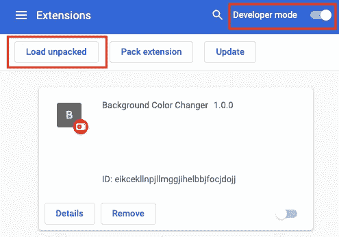

# 如何构建一个 Chrome 扩展

> 原文：<https://javascript.plainenglish.io/how-to-build-a-chrome-extension-d165f5cde793?source=collection_archive---------12----------------------->

## 按照这个循序渐进的指南创建你的第一个 Chrome 扩展

Photo by [Caio](https://www.pexels.com/de-de/@caio?utm_content=attributionCopyText&utm_medium=referral&utm_source=pexels) on [Pexels](https://www.pexels.com/de-de/foto/macbook-air-auf-grauem-holztisch-67112/?utm_content=attributionCopyText&utm_medium=referral&utm_source=pexels)

***免责声明*** *:本文原载于* [*网络集锦博客*](https://web-highlights.com/blog/) *。你可以在这里找到***。**

*我记得当我创建第一个 Chrome 扩展时。我在寻找一个扩展，作为文本荧光笔在这里的媒介。Chrome 网上商店中的几个扩展功能可以作为文本标记，但是没有一个功能符合我的设想。那时，我跟随一篇类似的文章，创建了我的第一个自己的 Chrome 扩展。*

*我意识到创建扩展非常简单，所以我决定开发自己的 [Web Highlights Chrome 扩展](https://chrome.google.com/webstore/detail/web-highlights-%20-bookmark/hldjnlbobkdkghfidgoecgmklcemanhm?hl=de)，现在已经有 1000 多名用户。😊*

* [## 如何用 Web 组件构建一个中型文本荧光笔作为 Chrome 扩展

### 我一直喜欢中型荧光笔，它出现在选择文章中的文本时。我认为这将是很好的…

javascript.plainenglish.io](/how-to-build-the-medium-text-highlighter-as-a-chrome-extension-with-web-components-b3feccddcd01) 

能够创建自己的扩展使您有可能根据自己的需要定制网页。

> "浏览器扩展是一个用于定制网络浏览器的小软件模块."——[https://en.wikipedia.org](https://en.wikipedia.org/wiki/Browser_extension)

在本文中，我们将构建一个非常简单的 chrome 扩展，允许您通过双击当前页面上的任何元素来更改其背景颜色。* 

# *我们开始吧*

*首先，我们需要创建一个`manifest.json`文件。清单是我们的扩展的入口点，它定义了元数据，比如名称和版本，以及其他功能。*

*让我们创建一个`manifest.json`并添加一些元数据:*

*manifest.json*

*前三个值`name`、`version`和`manifest_version`足以创建我们的第一个 chrome 扩展。*

## *安装延伸部分*

*打开你的 Chrome 浏览器，导航到 **chrome://extensions** 。*

*点击**开发者模式**旁边的拨动开关启用开发者模式。点击**加载解包**按钮，用我们的`manifest.json`选择目录。*

**

*恭喜你！你刚刚创建了你的第一个 Chrome 扩展！*

## *添加一些功能*

*我们刚刚安装了自己的扩展。尽管如此，目前它什么也不做，因为我们还没有给我们的`manifest.json`添加功能。*

*为了让我们的文本荧光笔工作，我们需要读取 DOM 并对其进行修改的功能。为此，我们将创建内容脚本。chrome 开发者文档对内容脚本的定义如下:*

> *内容脚本生活在一个孤立的世界中，允许内容脚本对其 JavaScript 环境进行更改，而不会与页面或其他扩展的内容脚本发生冲突。*

*让我们创建一个带有警告的`content.js`文件，以确保我们的扩展成功加载脚本。这个文件将作为我们的内容脚本。*

*`content.js`脚本是我们扩展的入口点。让我们调整我们的`manifest.json`来注入我们的脚本:*

*为了使用我们静态声明的脚本，我们需要在`content_scripts`字段下注册它们。该字段需要定义*必需的*属性`matches`，以指定内容脚本将被注入到哪些页面。为此，您可以设置几个[匹配模式](https://developer.chrome.com/docs/extensions/mv3/content_scripts/match_patterns)。我们将使用特殊模式`<all_urls>`来匹配任何以允许的模式开头的 URL 例如`http`或`https`。*

*我们还定义了可选字段`js`。在这里，我们定义要注入到匹配页面中的脚本。*

*让我们通过按下`chrome://extensions`上扩展的刷新按钮来更新我们的扩展。我们现在可以导航到任何页面，如果操作正确，当页面加载时应该会出现一个警告。*

*老实说，这是一个非常烦人的扩展。因此，让我们为非常简单的背景颜色转换器添加代码:*

*这个脚本将监听当前页面上的双击，以在给定位置显示颜色选择器。*

*同样，让我们通过点击刷新按钮来更新我们的扩展。我们现在可以通过双击改变页面上任何元素的背景。*

# *结论*

*创建一个简单的 Chrome 扩展非常简单。如果您想更深入地了解如何创建扩展，可以看看这篇文章:*

* [## 如何用 Web 组件构建一个中型文本荧光笔作为 Chrome 扩展

### 我一直喜欢中型荧光笔，它出现在选择文章中的文本时。我认为这将是很好的…

javascript.plainenglish.io](/how-to-build-the-medium-text-highlighter-as-a-chrome-extension-with-web-components-b3feccddcd01) 

我希望你能理解这篇文章。看看 [GitHub 库](https://github.com/MariusBongarts/medium-chrome-extension)来看看我们的投资组合应用程序的最终版本。

我总是很乐意回答问题，也乐于接受批评。请随时联系我😊

[**这里是无限制访问媒体**](https://medium.com/@mariusbongarts/membership) 上每一个内容的链接。如果你用这个链接注册，我会赚一小笔钱，不需要你额外付费。

 [## 通过我的推荐链接加入 Medium-Marius bong arts

### 作为一个媒体会员，你的会员费的一部分会给你阅读的作家，你可以完全接触到每一个故事…

medium.com](https://medium.com/@mariusbongarts/membership) 

## 关于作者

Marius Bongarts 是埃森哲互动公司的软件工程分析师。他还创建了 [Web Highlights 扩展](https://chrome.google.com/webstore/detail/web-highlights-+-bookmark/hldjnlbobkdkghfidgoecgmklcemanhm)，允许用户在标签和目录的帮助下组织文本亮点和书签。

通过**[**LinkedIn**](https://www.linkedin.com/in/marius-bongarts-6b3638171/)**与我联系。****

** [## 用 Web 组件构建自己的博客组合:基础

### 第 1 部分—定制元素、阴影 DOM 和 HTML 模板

javascript.plainenglish.io](/showcase-your-medium-articles-with-web-components-part-1-basics-d2c6618e9482)  [## 作为全栈开发人员，你应该马上学会的 5 项技能

### 现在就学习吧，你会后悔错过的

javascript.plainenglish.io](/5-skills-you-dont-get-around-to-learn-as-a-fullstack-developer-409f13c394c7)  [## 作为一名全栈开发人员，你应该马上学会的另外 5 项技能

### 现在就学习它们；你会后悔耽搁了它

javascript.plainenglish.io](/5-more-skills-you-should-learn-right-away-as-a-full-stack-developer-4cb6f935671)  [## 何时应该复制代码

### 复制比错误的抽象要便宜得多

javascript.plainenglish.io](/when-you-should-duplicate-code-b0d747bc1c67) 

*更多内容请看*[***plain English . io***](http://plainenglish.io)***