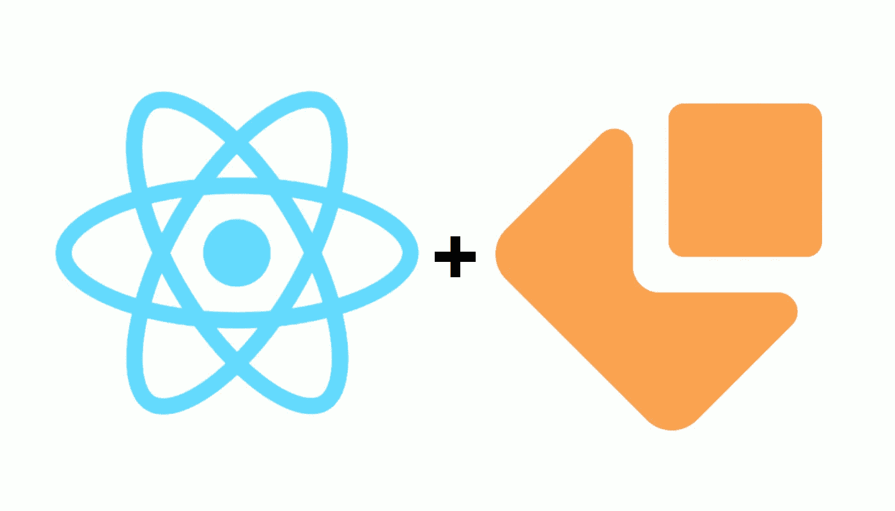
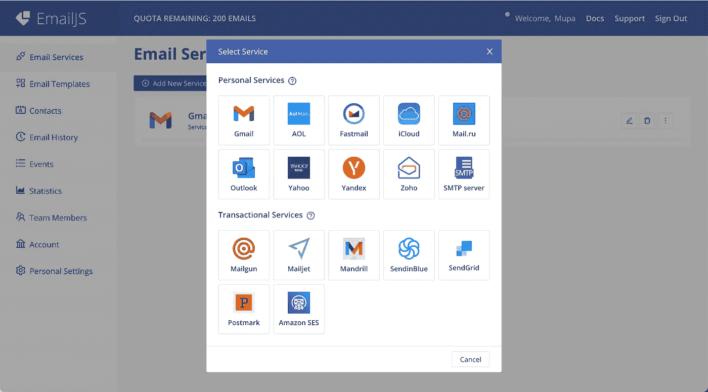
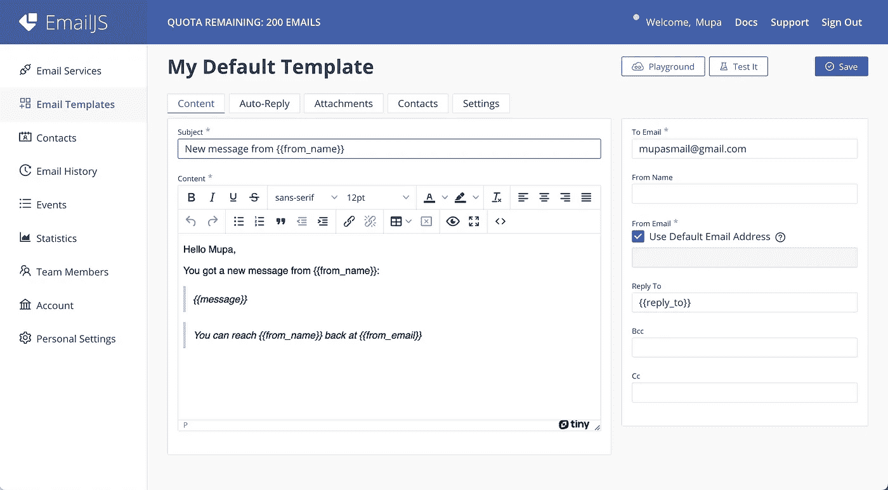
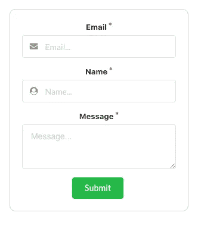
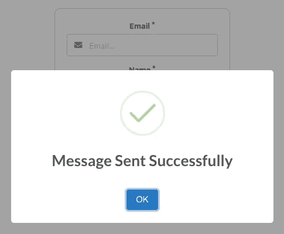
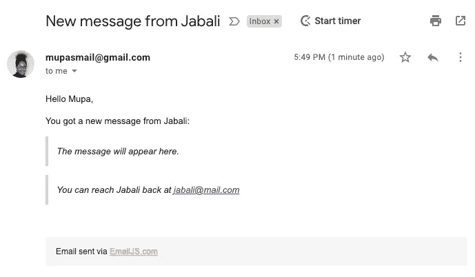

# 如何在 React 中构建一个使用 EmailJS 发送电子邮件的联系人表单

> 原文：<https://javascript.plainenglish.io/how-to-build-a-contact-form-in-react-that-sends-emails-using-emailjs-70011d2563a3?source=collection_archive---------0----------------------->



联系方式对任何业务都是必不可少的，因为它们为客户提供了一种方便的联系方式。在本教程中，我将向您展示如何使用名为 [EmailJS](https://www.emailjs.com/) 的第三方服务添加从 React 中的表单发送电子邮件的功能。只要你每月不超过 200 封邮件，EmailJS 服务就是免费的。

# **第一步。设置电子邮件**

我们将从注册[开始，创建一个免费账户](https://dashboard.emailjs.com/sign-up)。

创建帐户后，添加您选择的电子邮件服务。正如你在下图中看到的，我正在使用 Gmail。



接下来，转到侧面菜单上的“电子邮件模板”选项卡，并单击“创建新模板”按钮。双花括号中的变量是基于表单输入的动态变量。因此，请确保在 React 应用程序中使用与 **emailjs.sendForm** 方法完全相同的名称。



请确保您正确设置了右侧的“To Email”字段，因为当有人发送消息时，该电子邮件将接收表单中的内容。点击保存。我们完成了设置。

# 第二步。反应

您可以在现有的 React 应用程序中包含此步骤，或者通过运行`npx create-react-app app-name.`创建一个新的 React 应用程序。如果您是 React 新手，并且希望了解更多关于创建、运行和更新到新版本的信息，请前往[此存储库](https://github.com/facebook/create-react-app)了解更多信息。

在应用程序的目录中，我们将安装一些集成 emailjs、创建联系人表单以及在发送电子邮件后显示警告所必需的依赖项。

`npm i emailjs-com semantic-ui-react semantic-ui-css sweetalert2`

接下来，我们需要在应用程序的入口文件中导入语义 UI 的缩小 CSS 文件，如下所示:

```
***#* *index.js***import React from ‘react’;
import ReactDOM from ‘react-dom’;
**import ‘semantic-ui-css/semantic.min.css’;**import ‘./index.css’;
import App from ‘./App’;ReactDOM.render(
  <React.StrictMode>
    <App />
  </React.StrictMode>,
  document.getElementById(‘root’)
);
```

我们将在 app.js 文件中包含联系人表单的逻辑。但是，您可以将该逻辑包含在不同的组件中。

## **第一步。建立联系表**

让我们从添加如下所示的表单开始:-

```
**# app.js**import React from ‘react’;
import { Form, Input, TextArea, Button } from ‘semantic-ui-react’;import ‘./App.css’;const App = () => {

  {/* --- handleOnSubmit method --- */} return (
    <div className=”App”>
      <Form onSubmit={handleOnSubmit}>
        <Form.Field
          id=’form-input-control-email’
          control={Input}
          label=’Email’
          name=’user_email’
          placeholder=’Email…’
          required
          icon=’mail’
          iconPosition=’left’
        />
        <Form.Field
          id=’form-input-control-last-name’
          control={Input}
          label=’Name’
          name=’user_name’
          placeholder=’Name…’
          required
          icon=’user circle’
          iconPosition=’left’
        />
        <Form.Field
          id=’form-textarea-control-opinion’
          control={TextArea}
          label=’Message’
          name=’user_message’
          placeholder=’Message…’
          required
        />
        <Button type=’submit’ color=’green’>Submit</Button>
      </Form>
    </div>
  );
}export default App;
```

接下来，我们将向 app.css 文件添加一些样式，使表单看起来更漂亮。

```
***#* *app.css***.App {
  text-align: center;
  max-width: 300px;
  margin: 20px auto;
}Form {
  border: 1px solid lightgray;
  border-radius: 10px;
  padding: 20px;
}
```

当你在命令行上运行`npm start`来运行你的应用程序时，你应该会在浏览器上看到一个类似下面的表单。



## **第二步。包括处理表单提交逻辑。**

我们快完成了！

对于这最后一步，我们需要返回 emailjs.com 以获取 SERVICE_ID、TEMPLATE_ID 和 PUBLIC_KEY。

*   您可以从“帐户”选项卡中获取您的公钥。
*   电子邮件服务选项卡中的服务 ID。
*   电子邮件模板选项卡中的模板 ID

请记住用您自己帐户的 id/key 替换星号。您也可以添加一个. env 文件来存储您的 id/key，只是为了保持它们的私有性。

在添加了其余的导入和 handleOnSubmit 函数后，我们的 app.js 应该类似于下面的代码。

```
**# app.js**import React from ‘react’;
import emailjs from ‘emailjs-com’;
import { Form, Input, TextArea, Button } from ‘semantic-ui-react’;
import Swal from ‘sweetalert2’;import ‘./App.css’;const SERVICE_ID = "**************";
const TEMPLATE_ID = "*******";
const PUBLIC_KEY = "****************";const App = () => {
  const handleOnSubmit = (e) => {
    e.preventDefault();
    emailjs.sendForm(SERVICE_ID, TEMPLATE_ID, e.target, PUBLIC_KEY)
      .then((result) => {
        console.log(result.text);
        Swal.fire({
          icon: ‘success’,
          title: ‘Message Sent Successfully’
        })
      }, (error) => {
        console.log(error.text);
        Swal.fire({
          icon: ‘error’,
          title: ‘Ooops, something went wrong’,
          text: error.text,
        })
      });
    e.target.reset()
  };return (
    <div className=”App”>
      <Form onSubmit={handleOnSubmit}>
        <Form.Field
          id=’form-input-control-email’
          control={Input}
          label=’Email’
          name=’user_email’
          placeholder=’Email…’
          required
          icon=’mail’
          iconPosition=’left’
        />
        <Form.Field
          id=’form-input-control-last-name’
          control={Input}
          label=’Name’
          name=’user_name’
          placeholder=’Name…’
          required
          icon=’user circle’
          iconPosition=’left’
        />
        <Form.Field
          id=’form-textarea-control-opinion’
          control={TextArea}
          label=’Message’
          name=’user_message’
          placeholder=’Message…’
          required
        />
        <Button type=’submit’ color=’green’>Submit</Button>
      </Form>
    </div>
  );
}export default App;
```

还记得我之前讲过的将在`emailjs.sendForm`上使用的花括号中的变量吗？

`emailjs.sendForm(SERVICE_ID, TEMPLATE_ID, e.target, PUBLIC_KEY)` 将用于访问我们的电子邮件服务。参数由 3 个 id 加上 e.target 组成，e . target 对应于表单上的输入字段。请注意，表单中的 name 属性与花括号中的值相同。

只要您完全按照这个设置，emailjs 将使用表单中的正确输入设置您的定制模板，然后将完成的模板发送到为它设置的地址。

所以现在当您通过表单发送消息时，您应该在单击 submit 后得到一个警告。如果成功，我们将收到类似下图的警告:-



然后在发送信息后几秒钟，你会在收件箱里收到一封电子邮件。



## 结论

就是这样！现在，您的网站上有了一个功能齐全的联系表单，您的客户可以在访问您的网站时与您联系。

我希望这篇文章对你有所帮助。如果您有任何问题，请随时通过 [Linkedin](https://www.linkedin.com/in/mupa-mmbetsa/) 或我的[作品集](https://mupa-dev.netlify.app/)联系我。感谢阅读！

*更多内容请看*[***plain English . io***](https://plainenglish.io/)