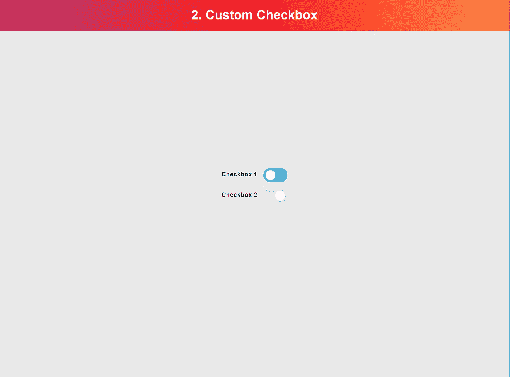

# 如何用 JavaScript 构建自定义复选框

> 原文：<https://javascript.plainenglish.io/how-to-build-a-custom-checkbox-with-javascript-82083a66ae04?source=collection_archive---------4----------------------->

## 以最简单的方式学习 JavaScript



Inspired by [Liquid UI Elements](https://dribbble.com/shots/14656980-Liquid-UI-Elements)

# HTML 和 CSS

所以让我们从 HTML & CSS 开始，让我们的组件成为静态的。我已经为你创建了 HTML 和 CSS。但是如果你想改变它，请继续做你喜欢的。

在 HTML 中，我们有 2 个复选框，因为使用 JavaScript，我们将创建一个自定义复选框。但是让每一个输入都带有一个类型复选框，一个自定义的复选框会更酷。

**HTML**

```
<section class="form-wrapper">
    <label class="label" for="checkbox1">
        <strong>Checkbox 1</strong>
        <input type="checkbox" name="checkbox1" id="checkbox1">
    </label>
    <label class="label" for="checkbox2">
        <strong>Checkbox 2</strong>
        <input type="checkbox" name="checkbox2" id="checkbox2">
    </label>
</section>
```

**CSS**

```
:root {
    --red: rgb(209, 3, 3);
    --white: #fff;
    --black: #000; --blue: rgb(0, 191, 255);
    --grey: rgb(211, 211, 211);
}body {
    font-family: "Helvetica";
    background: #e9e9e9
}
.container {
    width: 100vw;
    height: 100vh;
    display: flex;
    justify-content: center;
    align-items: center;
}.wrapper {
    max-width: 600px;
    height: 400px;
    display: flex;
    justify-content: center;
    align-items: center;
}
.project-header {
    position: absolute;
    top: 0;
    background: rgb(180,58,116);
    background: linear-gradient(90deg, rgba(180,58,116,1) 0%, rgba(253,29,29,1) 50%, rgba(252,139,69,1) 100%);    width: 100%;
    text-align: center;
    color: var(--white);
}
.form-wrapper {
    display:flex;
    flex-direction: column;
    background: var(--white);
    padding: 4rem 4rem 3rem;
    border-radius: 10px;
    box-shadow: 0px 3px 25px rgba(0, 0, 0, 0.2);
}
input[type="checkbox"].hide {
    display: none;
}
.label {
    line-height: 30px;
    display: flex;
    justify-content: space-between;
    margin-bottom: 1rem;
    cursor: pointer;
}
.label strong {
    margin-right: 3rem;
}/*===== Custom Checkbox ===== */
.chkBox {
    display: inline-block;
    width: 50px;
    height: 25px;
    background: var(--blue);
    border-radius: 20px;
    padding: 5px;
    transition: 0.5s ease-in-out;
}/*===== Custom Checkbox switch ===== */
.chkBox--switch {
    display: block;
    width: 25px;
    height: 25px;
    border-radius: 100%;
    background: var(--white);
    transition: 0.5s ease-in-out;
}.chkBox.checked {
    background: var(--blue);
}
.chkBox.checked .chkBox--switch {
    transform: translate(0);
}.chkBox.unchecked {
    background: var(--grey);
}
.chkBox.unchecked .chkBox--switch {
    transform: translate(24px);
}
```

如果你不喜欢我选的颜色，我已经用 CSS 变量很容易地改变了颜色。

现在我们已经静态地创建了按钮组件，我们从 JavaScript 开始。😇

# 辅导的

现在我们已经创建了一个带有复选框的页面，它看起来很丑，对吧。这些是默认浏览器样式的复选框。

在这个项目中，我想教你一些新的东西，并重复前一个项目中的一些内容，因为重复是掌握的关键😉。

# 你将学到什么

*   变量
*   功能
*   如果语句
*   返回
*   类别列表 API
*   事件侦听器“更改”
*   箭头功能
*   ForEach 循环
*   QuerySelectorAll
*   节点列表
*   排列

# 第一步。获取所有复选框

首先，我们需要访问页面上的所有复选框。如果我们在页面上需要 1 个元素，我们将使用`querySelector()`方法。但是，我们需要获得页面上的所有复选框，因此我们需要为此使用`querySelectorAll()`方法。

`querySelectorAll()`方法返回一个`NodeList`。一个[节点列表看起来像一个数组](https://developer.mozilla.org/en-US/docs/Web/API/NodeList)，但是有点不同。

> 当我包含文档链接时，检查它们是一个好主意。这将有助于你对某些术语有更多的了解。

Nodelist 在一个列表中有多个节点。节点是对 HTML 元素的引用。数组可以是多个值的列表。它可以是字符串、对象、布尔值和更多值的列表。

```
const checkboxElements = document.querySelectorAll('input[type="checkbox"]');
```

在`querySelectorAll(selector)`中，我们给出一个选择器作为参数。该方法将搜索整个页面来找到这些元素，并在一个`NodeList`中返回它们。

# 第二步。在复选框间循环

现在我们有了一个变量`checkboElements`和页面上所有复选框的`NodeList`，我们需要遍历列表并为每个复选框创建一个定制的复选框。

如果您查看 NodeList 文档页面，您可以看到[我们有一个方法列表](https://developer.mozilla.org/en-US/docs/Web/API/NodeList#Methods)可以使用。

*   `item()`
*   `entries()`
*   `forEach()`
*   `keys()`
*   `values()`

现在，我不会告诉他们每个人是做什么的。但是我们将把重点放在`forEach()`方法上。

使用这种方法，您可以为`NodeList`中的每个项目执行特定的任务。

```
const checkboxElements = document.querySelectorAll('input[type="checkbox"]');
checkboxElements.forEach((checkboxItem) => console.log('checkboxItem: ', checkboxItem))
```

在这种情况下，当我们用`querySelectorAll(selector)`执行上面的代码时，您将在您的控制台选项卡(浏览器中的开发人员工具)中看到两条消息。

现在我们可以创建一个函数，就像上面例子中的`console.log()`函数一样被调用。

# 第三步。用 JavaScript 创建自定义复选框 HTML

让我们定义一个函数，在这个函数中，我们编写创建自定义 checkbox 元素的逻辑。

```
function createCustomChkBox(checkboxEl) {
    // logic comes here
}
```

我们也可以把它写在方法中。`.forEach()`。但是当你创建一个不同的函数时，最好在以后检查代码的时候阅读。

在函数中，我们定义了一个参数，在该参数中我们引用了原始的 checkbox 元素。

我们希望在标签内创建我们的自定义复选框，紧挨着 input 元素。所以我们需要原始输入元素的父元素。我们通过使用`checkboxEl.parentElement`来做到这一点。页面上的每个 HTML 元素都有一个名为`parentElement`的属性，除了`<html>`标签，因为那是所有元素的父元素。

我们将对父元素的引用存储在一个变量中，以便稍后在函数中使用。

```
const checkboxLabel = checkboxEl.parentElement
```

为了防止代码因错误而中断，我们希望检查对元素的引用是否正确。我们创建一个 if 语句来检查这一点。如果引用不正确，我们给出一个 return 语句，以便函数停止并继续执行`forEach()`循环。

```
if (!checkboxEl) {
    // If the checkbox element is a falsy value
    // We will cancle this function with a return statement
    return
}
```

使用`!checkboxEl`我们检查`checkboxEl`是否有错误值。因此，如果是`null`、`undefined`或`false`，它将执行`return`语句。

## 什么是真与假？

Falsy 表示一个值可以是`null`、`false`、`0`、`NaN`、`""`或`undefined`。大多数时候这意味着，它没有价值或者是负的。

真实意味着给定一个值。该值可以是`"string"`、`{}`、`[]`、`"0"`、`number`、`function() {}`或设置为`true`的布尔值。

如果该值有一个对元素的有效引用(`Node`)，它将继续创建我们的 HTML 元素。为此，我们需要`createElement()`方法。在这种方法中，您定义想要制作的元素。例如，创建一个`<div></div>`元素。

```
const divElement = document.createElement('div')
divElement.classList.add('cool-class-name')
```

现在你可能会想，`<div></div>`是哪里造出来的？在我的 HTML 结构中看不到。没错，但它还没有放在 HTML 中。现在，元素只在浏览器的内存中创建。但是当它在内存中时，我们可以给它添加类名或其他属性。

要将它添加到页面中，我们需要用`appendChild()`方法将它添加到现有元素中。使用这种方法，我们在当前元素中放置一个`<div class="cool-class-name"></div>`。

```
existingElement.appendChild(divElement)
```

通过这种方法，我们添加了带有复选框切换器的自定义复选框元素。

```
// Create the custom checkbox element
// Add some classes to it
const chkBox = document.createElement('div')
chkBox.classList.add('chkBox')
chkBox.classList.add('unchecked')// Create the custom checkbox element switch
// Add a class to it
const chkBoxSwitch = document.createElement('span')
chkBoxSwitch.classList.add('chkBox--switch')// Add the custom checkbox switch to the custom checkbox element
chkBox.appendChild(chkBoxSwitch)// Add the custom checkbox element to the parent label element
checkboxLabel.appendChild(chkBox)
```

这里你可以看到，首先，我创建了`<div></div>`元素，用`classList` API 给它命名为`chkBox`和`unchecked`。接下来，我为切换器制作了`<span></span>`。

切换器`chkBoxSwitch`通过`chkBox.appendChild(chkBoxSwitch)`被添加到`chkBox`元素中，而`chkBox`被添加到`checkboxLabel`中，这已经在 HTML 中了。

现在，我们的自定义复选框元素在 HTML 中创建了👏。

最后一步是在原来的复选框“hide”中添加一个类。在我们描述的 CSS 中，当类“hide”在带有类型复选框的输入上时，我们在`display: none;`上设置样式。如果在创建元素的过程中出现问题，最初的复选框将保持可见。

最后，这是函数完成后的样子。

```
function createCustomChkBox(checkboxEl) {
    const checkboxLabel = checkboxEl.parentElement if (!checkboxEl) {
        // If the checkbox element is a falsy value
        // We will cancle this function with a return statement
        return
    } // Create the custom checkbox element
    // Add some classes to it
    const chkBox = document.createElement('div')
    chkBox.classList.add('chkBox')
    chkBox.classList.add('unchecked') // Create the custom checkbox element switch
    // Add a class to it
    const chkBoxSwitch = document.createElement('span')
    chkBoxSwitch.classList.add('chkBox--switch') // Add the custom checkbox switch to the custom checkbox element
    chkBox.appendChild(chkBoxSwitch) // Add the custom checkbox element to the parent label element
    checkboxLabel.appendChild(chkBox) checkboxEl.classList.add('hide') // Add a event listener to the checkbox to switch classes in the toggleCustomChkBox function
    checkboxEl.addEventListener('change', (event) => toggleCustomChkBox(event, chkBox))}
```

# 第四步。创建事件以更改复选框类

现在我们已经创建了 HTML 元素，我们需要为所有的复选框创建一个事件监听器。当一个复选框被更改时，我们希望绑定到事件中。我是说，我们想知道值什么时候变了。

用`addEventListener()`我们可以听“改变”事件。当复选框被选中或取消选中时，将调用 change 事件。

当事件被调用时，当真正的复选框被设置为`checked`时，我们希望将类名“unchecked”替换为“checked”。当 checked 属性不再位于元素上时，它会将“checked”类名替换为“unchecked”。

> *为调试复选框的状态，你可以随时做* `*console.log(event.target.checked)*` *来查看一个* `*true*` *或* `*false*` *的值。*

这就是函数的形式。

```
function toggleCustomChkBox(event, chkBox) {
    if (event.target.checked) {
        chkBox.classList.replace('unchecked', 'checked');
    } else {
        chkBox.classList.replace('checked', 'unchecked');
    }
}
```

您可以看到，我们在第一个参数中从事件侦听器中为函数提供了对它们的引用`event`。在第二个参数中，`chkBox`我们提供了对新的自定义 checkbox 元素的引用。

如果我们不在函数中添加这些引用，我们就不能替换类名。当我们创建一个函数时，我们创建了另一个作用域。对于 JavaScript 中的作用域，您可以向上查找，但不能向下查找变量引用。

函数中定义的变量在函数外部是不可见的。该函数保护它不受外部代码的影响。您可以通过返回这些变量来将它们的值传递到函数之外。

## **JavaScript 中什么是作用域？**

范围是由 JavaScript 函数创建。它可以保护变量不被该函数之外的代码覆盖。如果函数不能到达某个变量，可以通过参数传递，否则不能到达该变量。

这个简短的解释太简短了，不足以解释这一切。过去我已经创建了一个关于 JavaScript 作用域的完整指南，所以你可以在这里阅读。

在前面的代码示例中，您可以看到该函数被添加到事件侦听器中。

```
checkboxEl.addEventListener('change', (event) => toggleCustomChkBox(event, chkBox))
```

# 第五步。完成✅

现在，您已经拥有了使这个自定义复选框工作的一切。我会建议你尝试一下代码，看看它是如何工作的。我会鼓励你改变造型和动画，使之成为你自己的风格。

但是将它付诸实践的最好方法是在您自己的项目中实现它。因为通过自己动手做东西，你会更好地记住刚刚学过的所有东西。

## 结论

*如果你想得到下一个项目的通知？* [*在这里订阅，我会尽快更新给你！*](https://mailchi.mp/7ea77c9742bb/learn-javascript-the-easy-way) *🤗*

当你完成项目后，请在推特上分享你的成果😁。如果你愿意，你可以使用这个示例推文！👇

```
I have created project 2 of the "Learn JavaScript The Easy Way" program. 😁[ADD LINK HERE] 🔥Do You Want To Learn #javascript like me? Check the link below and start for free. 🚀[TODO: LINK]#html #css #codenewbie #coding #frontend #developer #creativity #learnJavaScript #easyJavascript
```

# 阅读更多

[](https://betterprogramming.pub/how-promises-actually-work-in-javascript-1c80b1af7193) [## JavaScript 中承诺的实际工作方式

### 了解何时以及如何使用它们

better 编程. pub](https://betterprogramming.pub/how-promises-actually-work-in-javascript-1c80b1af7193) [](https://medium.com/javascript-in-plain-english/build-a-custom-like-button-with-html-css-and-vanilla-javascript-b81fa4b00aad) [## 用 HTML、CSS 和普通 JavaScript 构建一个自定义的 Like 按钮

### 以最简单的方式学习 JavaScript

medium.com](https://medium.com/javascript-in-plain-english/build-a-custom-like-button-with-html-css-and-vanilla-javascript-b81fa4b00aad) [](https://medium.com/better-programming/setting-up-a-next-js-project-with-tailwind-css-85fcc882d0b8) [## 使用 TailWind CSS 设置 Next.js 项目

### 今天整合 Tailwind 和 Next.js

medium.com](https://medium.com/better-programming/setting-up-a-next-js-project-with-tailwind-css-85fcc882d0b8) [](https://medium.com/better-programming/how-to-build-and-deploy-a-jamstack-website-fast-with-next-js-a61df3c822f) [## 如何使用 Next.js 快速构建和部署 Jamstack 网站

### 为什么 Next.js 是明智的选择

medium.com](https://medium.com/better-programming/how-to-build-and-deploy-a-jamstack-website-fast-with-next-js-a61df3c822f) [](https://medium.com/better-programming/5-development-retrospective-questions-to-have-great-discussions-aa77f96cf793) [## 5 开发回顾问题进行大讨论

### 不是所有的讨论都很棒。让我们改进它们

medium.com](https://medium.com/better-programming/5-development-retrospective-questions-to-have-great-discussions-aa77f96cf793)