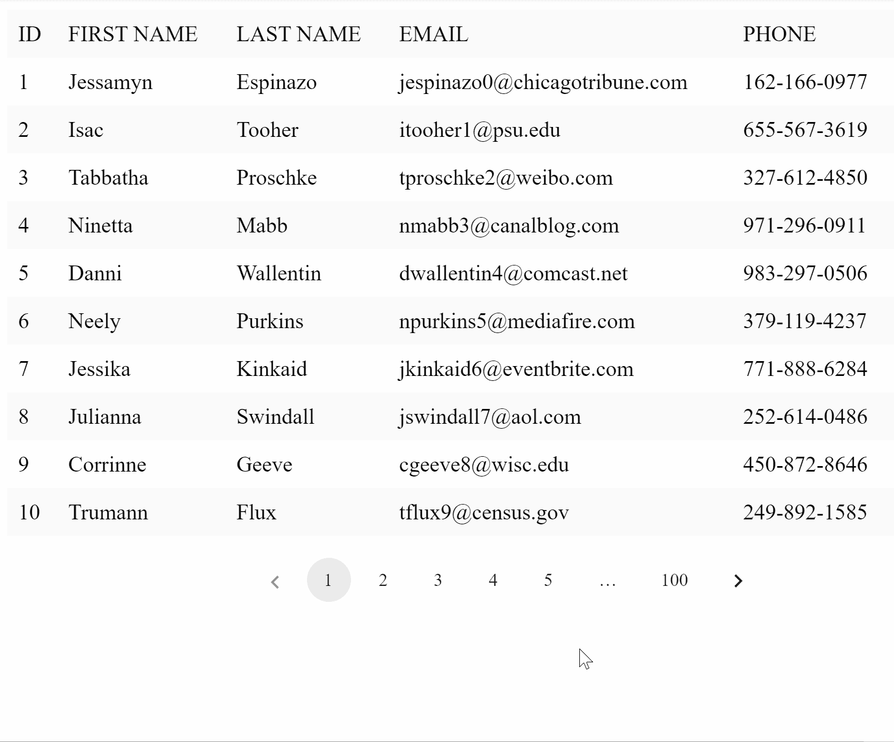
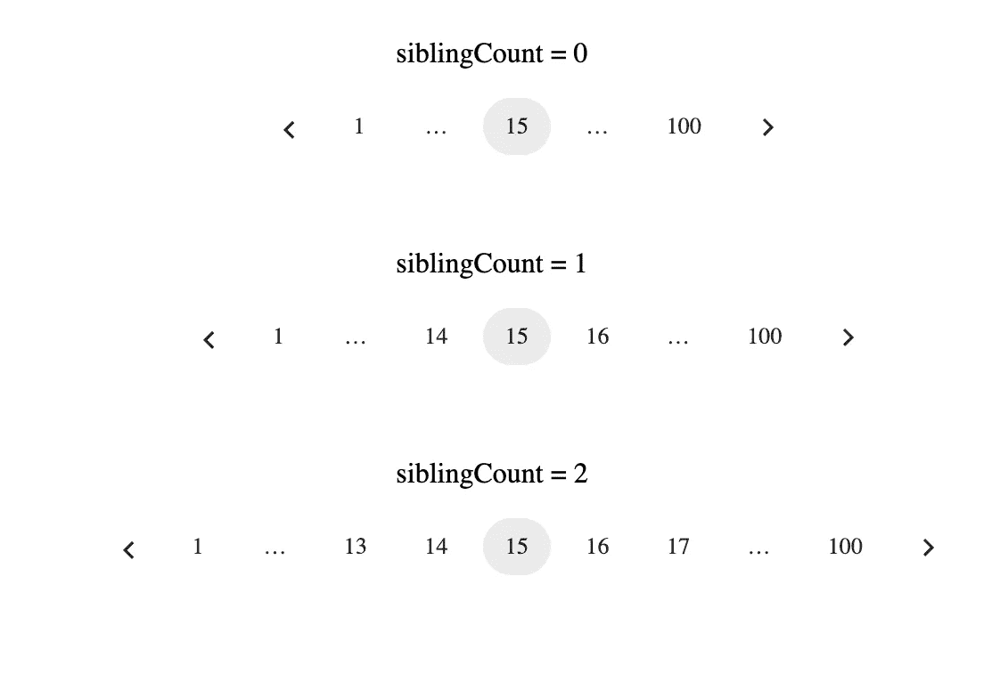
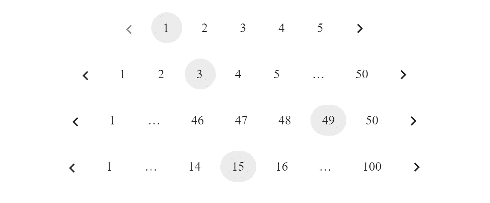
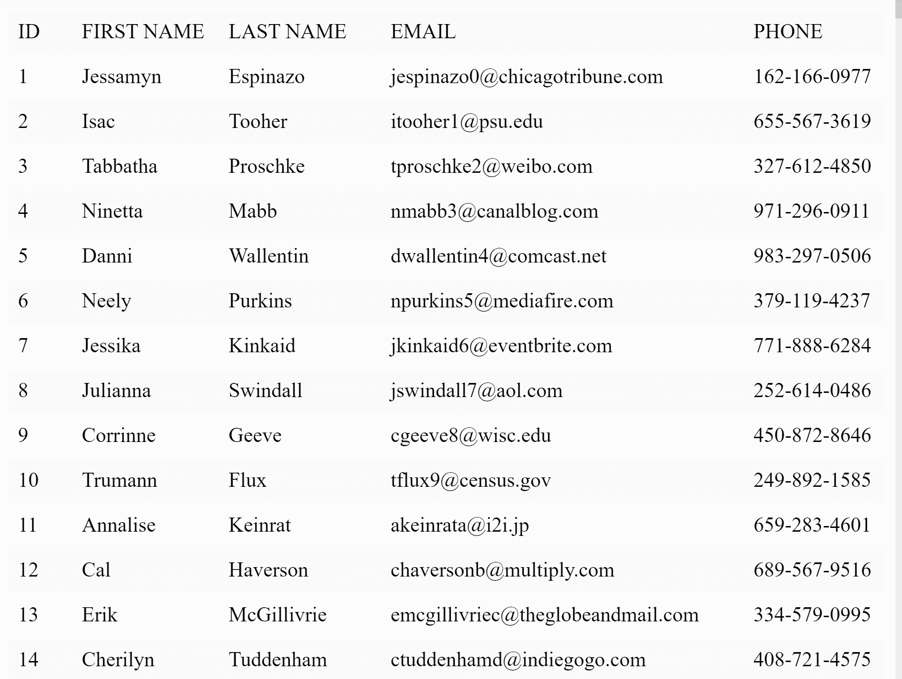

# 如何在 React 中构建自定义分页组件

> 原文：<https://javascript.plainenglish.io/how-to-build-a-custom-pagination-component-in-react-99f5b233ce2?source=collection_archive---------6----------------------->


我们经常使用需要通过 API 从服务器获取大量数据并将其呈现在屏幕上的 web 应用程序。

例如，在一个**社交媒体应用程序中，**我们获取并呈现用户的帖子和评论。在 **HR 仪表板中，**我们显示了申请工作的候选人的信息。在**电子邮件客户端中，**我们显示用户的电子邮件。

在屏幕上一次呈现所有数据会导致网页速度大大降低，因为网页中存在大量的 DOM 元素。

如果我们想要优化性能，我们可以采用各种技术来更有效地呈现数据。其中的一些方法包括**虚拟化无限滚动**和**分页**。

如果您事先知道数据的大小，并且不频繁地添加或删除数据集，分页就能很好地工作。

例如，在每隔几毫秒就会发布新帖子的社交媒体网站中，分页并不是理想的解决方案。但是对于显示候选人申请并需要过滤或排序的 HR 仪表板来说，它会工作得很好。

在这篇文章中，我们将重点关注分页，我们将构建一个自定义控制的组件，根据当前页面和总数据量来处理页面按钮。

我们还将编写一个自定义的 React 挂钩，为我们提供一个由分页组件呈现的数字范围。当我们想用不同的样式或不同的设计呈现一个分页组件时，我们也可以独立地使用这个钩子。

下面是我们将在本教程中构建的内容的演示:



Demo interaction of the final application

# 如何设置项目

如果您熟悉 React 项目的设置，可以跳过这一节。

为了设置我们的 React 项目，我们将使用`[create-react-app](https://github.com/facebook/create-react-app)`命令行包。您可以使用`npm install -g create-react-app`或`yarn add global create-react-app`全局安装软件包。

从命令行运行`create-react-app`创建一个新项目，如下所示:

```
npx create-react-app react-pagination
```

接下来，我们需要安装我们的依赖项。我们将只使用一个简单的叫做`classnames` 的附加依赖，它在有条件地处理多个类名时提供了灵活性。

要安装它，运行`npm install classnames`或`yarn add classnames`。

现在，我们可以使用下面的命令运行我们的项目:

```
yarn start
```

# 如何定义接口

既然我们的项目已经运行，我们将直接进入我们的`Pagination`组件。

让我们首先来看看我们需要哪些值来支持我们的`Pagination`组件:

*   **totalCount** :表示从数据源获得的数据总数。
*   **当前页面**:表示当前活动页面。对于我们的`currentPage`值，我们将使用基于 **1 的指数**，而不是传统的基于 0 的指数。
*   **pageSize** :表示单页上可见的最大数据量。
*   **onPageChange** :当页面发生变化时，用更新后的页面值调用回调函数。
*   **siblingCount** (可选):表示当前页面按钮每侧显示的页面按钮的最小数量。默认为 1。



Illustration of different values siblingCount

从分页组件中，我们将调用`usePagination`钩子，它将接受以下参数来计算页面范围:`totalCount`、`currentPage`、`pageSize`、`siblingCount`。

# 如何实现 usePagination 挂钩

下面是我们在实现`usePagination`挂钩时需要记住的几件事:

*   我们的分页钩子必须返回要在分页组件中以数组形式显示的数字范围。
*   当`currentPage`、`pageSize`、`siblingCount`或`totalCount`发生变化时，计算逻辑需要重新运行。
*   钩子返回的项目总数应该保持不变。如果用户与组件交互时范围数组的长度发生变化，这将避免调整分页组件的大小。

记住上面的事情，让我们在我们的项目`src`文件夹中创建一个名为`usePagination.js`的文件，并开始实现。

我们的代码框架如下:

如果我们看看上面的代码，我们正在使用`useMemo`钩子来计算我们的核心逻辑。当依赖数组中的任何值改变时，`useMemo`回调将运行。

此外，我们将`siblingCount`道具的`defaultValue`设置为`1`，因为它是可选道具。

在我们继续实现代码逻辑之前，让我们理解一下`Pagination`组件的不同行为。下图包含分页组件的可能状态:



Possible states of Pagination component

请注意，分页组件有四种可能的状态。我们会一个一个检查。

*   总页数少于我们要显示的页数。在这种情况下，我们只返回从`1 to totalPageCount`开始的范围。
*   总页数大于页数，但只有正确的点可见。
*   总页数大于页码，但只有左边的点可见。
*   总页数大于页数，左右点都可见。

作为第一步，我们将着手计算来自`totalCount`和`pageSize`的总页数，如下所示:

```
const totalPageCount = Math.ceil(totalCount / pageSize);
```

注意，我们使用`Math.ceil`将数字舍入到下一个更高的整数值。这确保了我们为剩余的数据保留了额外的页面。

接下来，我们将继续实现一个定制的`range`函数，该函数接受一个`start`和`end`值，并返回一个从头到尾都包含元素的数组:

Range method implementation

最后，我们将通过记住上述案例来实现核心逻辑。

usePagination Custom hook implementation

实现的思想是，我们确定想要在分页组件中显示的数字范围，然后在返回最终范围时用分隔符或点将它们连接在一起。

对于第一个场景，我们的`totalPageCount`小于我们根据其他参数计算的药丸总数，我们只返回一个数字范围`1..totalPageCount`。

对于其他场景，我们在将兄弟药丸包含到`currentPage`之后，通过计算左侧和右侧的索引来确定我们是否需要在`currentPage`的左侧或右侧的点，然后做出我们的决定。

一旦我们知道要在哪里显示点，剩下的计算就很简单了。

# 如何实现分页组件

正如我前面提到的，我们将在分页组件中使用`usePagination`钩子，我们将映射返回的范围来呈现它们。

我们在`src`文件夹中创建一个`Pagination.js`文件，并实现如下代码逻辑:

Pagination Implementation

如果页面少于两页，我们不呈现`Pagination`组件(然后我们返回`null`)。

我们将`Pagination`组件呈现为一个带有左右箭头的列表，用于处理用户的上一个和下一个动作。在箭头之间，我们映射到`paginationRange`上，并将页码呈现为`pagination-items`。如果页面项是一个点，我们为它呈现一个 Unicode 字符。

作为特殊处理，如果`currentPage`是第一页或最后一页，我们分别为左/右箭头添加一个`disabled`类。如果需要禁用图标，我们禁用`pointer-events`并通过 CSS 更新箭头图标的样式。

我们还向页面 pill 添加了 click 事件处理程序，它将使用更新后的值`currentPage`调用`onPageChanged`回调函数。

我们的 CSS 文件将包含以下样式:

Pagination component styles

**就这样！**

我们的通用分页实现已经准备好了，我们可以在代码库中的任何地方使用它。

# 如何使用自定义分页组件

作为最后一步，让我们将这个组件合并到一个小例子中。

对于本文的范围，我们将以表格的形式呈现静态数据。所以，让我们先这样做:

此时，我们的用户界面如下所示:



Intermediate table component UI

现在要合并`Pagination`组件，我们需要两件东西。

*   首先，我们保持一个`currentPage`状态。
*   第二，我们计算要为给定页面呈现的数据，并对其进行映射和呈现。

出于演示的目的，我们将保持`PageSize`不变，并将其值设置为`10`。我们还可以提供一个选择器，供用户选择所需的`pageSize`。

一旦我们做了更改，我们就可以继续用适当的道具呈现我们的`Pagination`组件。

考虑到这些变化，我们的最终代码将如下所示:

Final Demo code

您可以在此处找到实施的现场演示:

Demo

# 结论

在本文中，我们创建了一个定制的 React 钩子`usePagination`并在我们的`Pagination`组件中使用它。我们还实现了一个使用该组件的简短演示。

**感谢您的阅读。**

你可以在 GitHub 库查看本教程的完整源代码。

如果你觉得这篇文章有帮助，一定要喜欢并与你的同事和朋友分享。如果有什么建议，欢迎在评论里补充。

我还分享与 JavaScript web 开发相关的技巧和诀窍，并在 Twitter 上作出反应。

*更多内容尽在*[***plain English . io***](http://plainenglish.io)