# 如何用 Vue.js (Tinder 克隆)搭建交友网站

> 原文：<https://javascript.plainenglish.io/how-to-build-a-dating-site-with-vuejs-tinder-clone-827f1f38d5c?source=collection_archive---------9----------------------->

你将要建造的东西。[演示](https://tiner-clone-213ab.web.app/)，Git 回购[这里](https://github.com/Daltonic/tinder-clone)。

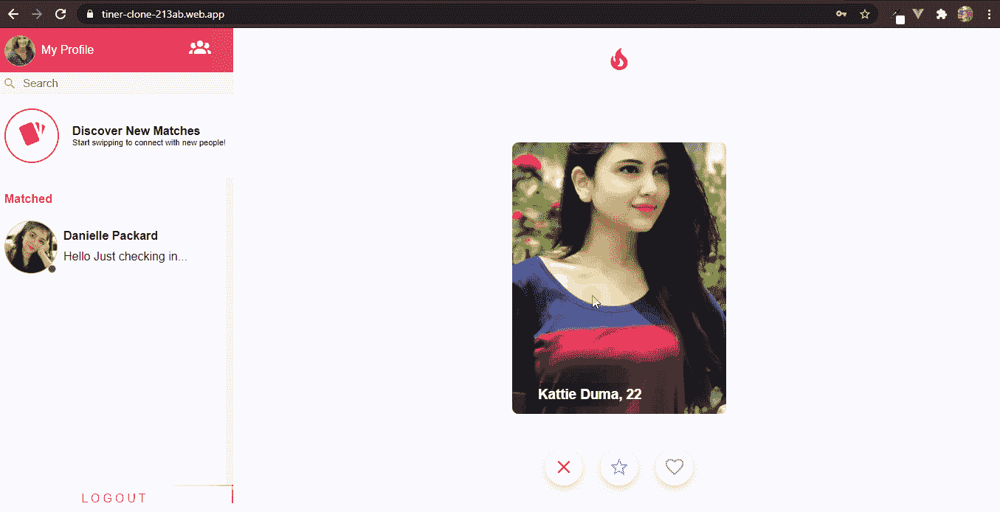

A VueJs Clone

# 介绍

作为这个时代的软件开发人员，你肯定会面临需要在应用程序中添加通信功能的情况。本教程将帮助您使用 [CometChat](https://www.cometchat.com/) 开发一个基于网络的聊天和通话通信解决方案。我将一步一步地指导你，不会错过任何一步，所以准备好平稳的旅程吧。

# 先决条件

要学习本教程，你必须理解 [Vue.js](https://vuejs.org/) 的基本原理。这将加速你对本教程的理解。

# 安装应用程序依赖项

首先，你需要在你的机器上安装 NodeJs，你可以去他们的[网站](https://nodejs.org/)去做。

其次，您还需要使用下面的命令在您的计算机上安装 Vue-CLI。

`npm install -g @vue/cli`

接下来，创建一个名为 **tinder-clone** 的新项目，并选择默认的[预置](https://cli.vuejs.org/guide/creating-a-project.html#vue-create)。

`vue create tinder-clone`

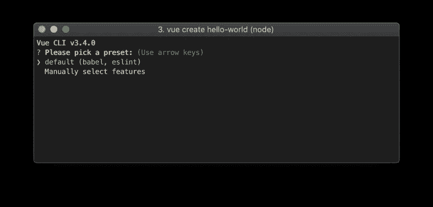

*VueJs Project Presets*

最后，使用下面的命令为我们的项目安装这些必要的依赖项。

`npm install vue-router vue-swing vue-material-design-icons firebase`

现在我们已经完成了安装，让我们继续构建我们的 tinder clone 解决方案。

# 正在安装 CometChat SDK

1.  前往 [CometChat](https://app.cometchat.com/signup) Pro 并创建一个帐户。
2.  从[仪表盘](https://app.cometchat.com/apps)中，创建一个名为**“聊天应用”**的新应用。
3.  创建一个，单击浏览。
4.  转到 API 密钥选项卡，然后单击创建 API 密钥。
5.  创建一个名为**“Tinder Clone”**的具有完全访问权限的 API 密匙。
6.  单击新创建的 API，导航到 Users 选项卡，删除所有默认用户，保留空白 ***(非常重要)*** 。
7.  在您的终端上输入这个命令，在您的机器上安装 VueJs CLI 。npm 安装-g @vue/cli
8.  创建一个**”。env"** 文件在项目的根目录下。
9.  以此方式从 CometChat 和 Firebase 输入您的**密钥**。
10.  复制**。env”**文件并将其重命名为**。env”**。
11.  排除**。env”**和**。env . production”**在**中。避免在 **Github** 上曝光**文件。
12.  运行以下命令安装 **CometChat SDK** 。

# 环境变量

下面的设置说明了配置**的格式。env** 为本项目文件。

`VUE_APP_ID="xxx-xxx-xxx"`

`VUE_APP_KEY="xxx-xxx-xxx-xxx-xxx-xxx-xxx-xxx"`

`VUE_APP_REGION="xx"`

`VUE_APP_BASE_APIKEY="xxx-xxx-xxx-xxx-xxx-xxx-xxx-xxx"`

`VUE_APP_BASE_AUTHDOMAIN="xxx-xxx-xxx-xxx-xxx-xxx"`

`VUE_APP_BASE_PROJECTID="xxx-xxx-xxx"`

`VUE_APP_BASE_STORAGEBUCKET="xxx-xxx-xxx-xxx-xx"`

`VUE_APP_BASE_MESSAGINGSENDERID="xxx-xxx-xxx"`

`VUE_APP_BASE_APPID="xxx-xxx-xxx-xxx-xxx-xxx"`

`VUE_APP_BASE_MEASUREMENTID="xxx-xxx-xxx"`

# 建立 Firebase 项目

前往 Firebase 创建一个新项目并激活电子邮件和密码身份验证服务。这就是你的做法。

要开始使用 Firebase，您需要一个 Gmail 帐户。前往 [Firebase](https://console.firebase.google.com/u/0/) 创建一个新项目。

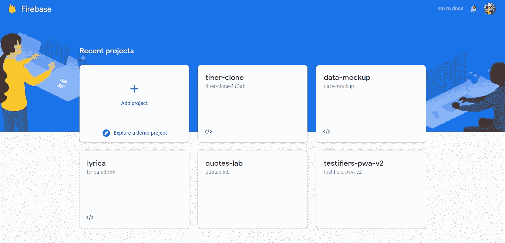

Firebase 支持使用不同的提供程序进行身份验证。例如 Social Auth、电话号码以及标准电子邮件和密码方法。由于我们将在本教程中使用电子邮件和密码身份验证方法，因此需要为我们在 Firebase 中创建的项目启用此方法，因为默认情况下该方法处于禁用状态。

在项目的“身份验证”选项卡下，单击登录方法，您将看到 Firebase 当前支持的提供程序列表。

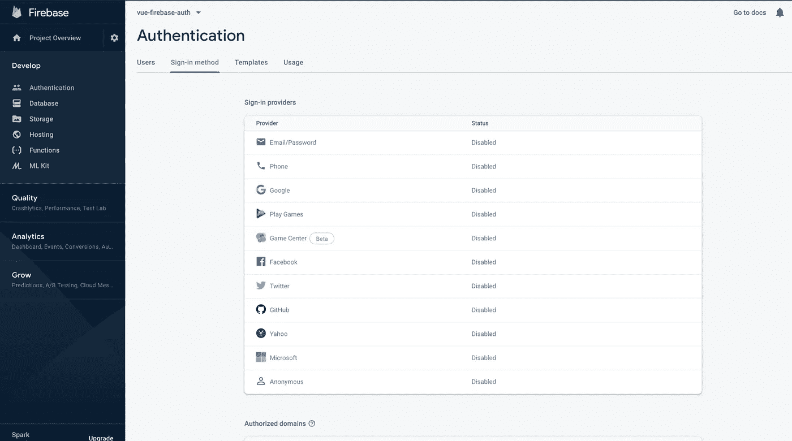

接下来，单击电子邮件/密码提供程序上的“编辑”图标并启用它。

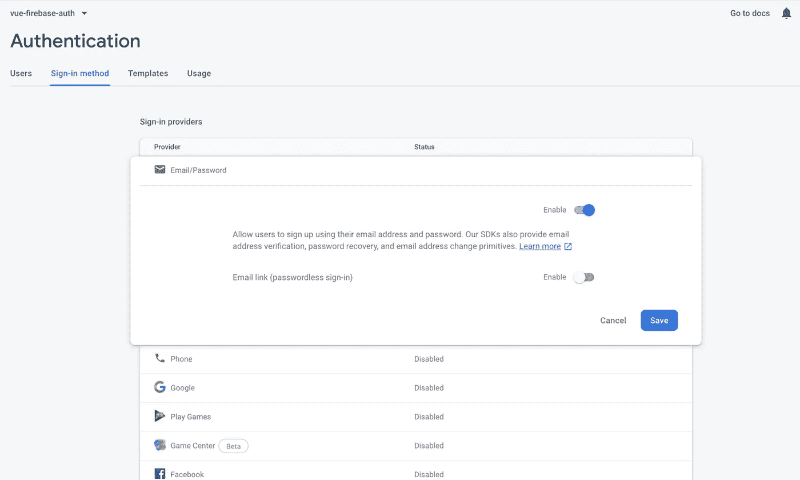

接下来，你需要去注册你的 Firebase 项目下的应用程序。在项目的“概述”页上，选择“添加应用程序”选项并选择“web”作为平台。

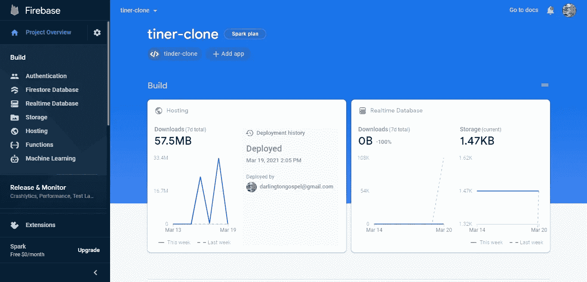

注册完应用程序后，您将看到一个包含应用程序凭据的屏幕。请注意第二个脚本标记，我们很快将在 Vue 应用程序中使用它。

恭喜，现在您已经完成了安装，让我们进行一些配置。

# 安装 CometChat VueJs 用户界面工具包

*   将该文件夹复制到源文件夹。
*   将 cometchat-pro-vue-ui-kit 的 package.json 中的所有依赖项复制到项目的 package.json 中并安装它们。

# 配置 CometChat SDK

在您的项目结构中，打开 **main.js** 并粘贴这些代码。

The Entry Component

上面的代码在你的应用程序中初始化 CometChat 并设置它。路由保护将过滤掉未经验证的用户。 **main.js** 入口文件使用您的 CometChat API 凭证。该文件还包含存储在**中的 Firebase 配置。env** 文件。这个**。env** 文件将不会在您的 git repo 上公开，如**中所指定的。gitignore** 文件。

# 设置路由器

router.js 文件包含我们的应用程序中所有可用的路线及其安全许可。

The Router With All The Routes

# 设置 Firebase SDK

**firebase.js** 文件包含了与 *auth* firebase 服务交互的所有代码。这也将使我们的代码没有冗余。

The Firebase SDK Setup

# 项目结构

下图显示了项目结构。在继续之前，请确保您看到了文件夹排列。

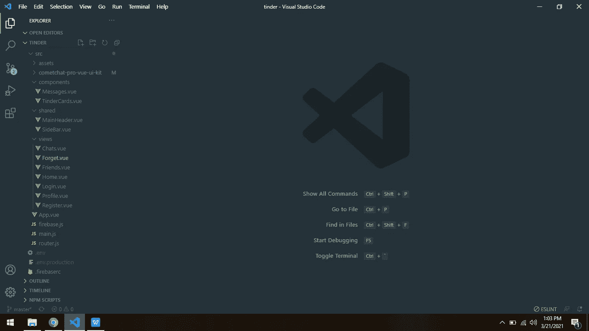

现在，让我们复制项目组件的其余部分，如上图所示。

# 应用程序组件

以下代码在 ***vue-router*** 中包装了我们的应用程序，实现了平滑导航。对于每条路线，该组件都会生成一个新的 id 来改进我们的应用程序的预期行为。

The App Component

# 侧栏组件

侧栏组件展示匹配的用户。除了其优雅的设计，它还让用户能够与其他匹配的用户聊天。除了上面提到的以外，它还提供搜索和注销功能。

The Sidebar Component

# 消息子组件

侧栏组件包含一个名为 ***【消息】*** 的子组件。该子组件列出了与当前登录用户相关联的匹配用户。这是它的代码。

The Message Component

# 身份验证组件

认证组件包括 ***注册、登录和忘记密码*** 组件。让我们在“视图”文件夹中创建这些文件，说明如下。

创建一个名为***“views”***的新文件夹，并在其中创建以下组件。应该都是以 ***”结尾。*vue**延伸课程。登录、注册和忘记组件还必须包含以下代码。

# 寄存器组件

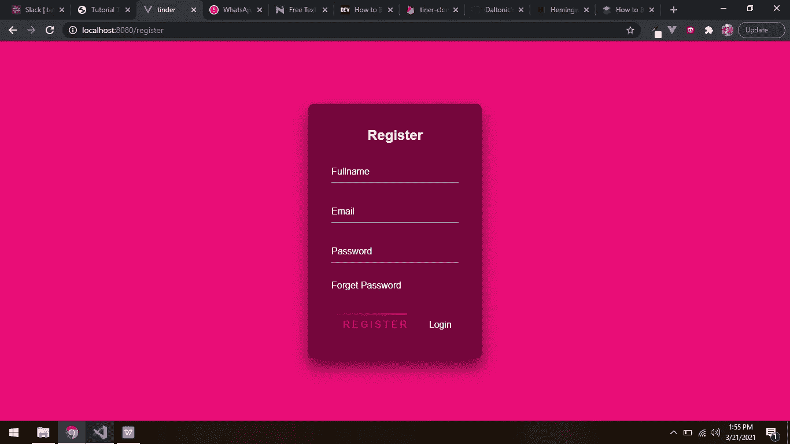

我们想要一个用户可以点击“注册按钮”并将其记录发送到 Firebase 的情况。在 firebase 注册之后，CometChat SDK 也会注册新用户。这个注册将在您之前创建的 API 键下进行。

例如，一个名叫 Lucy 的用户想要在我们的平台上注册。因此，她在提供的注册表单中输入自己的凭证，然后单击 register 按钮。现在，firebase 可以看到她的详细信息，如果她的电子邮件是唯一的，就注册她。向 Firebase 注册后，CometChat 接管并注册她。CometChat 使用您的 API 密钥，并将她放在您的帐户下，她的 ID 设置为她的 firebase ID。

下面的脚本详细描述了身份验证过程。这里是注册组件的完整代码。

The Registration Component

# 登录组件

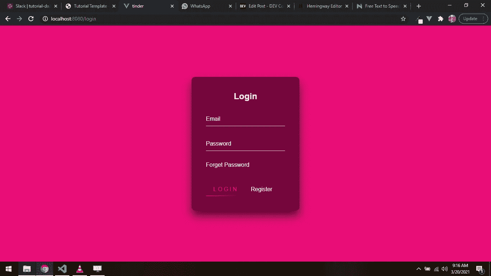

一旦用户点击登录按钮，在登录表单中输入他的详细信息，firebase 就开始验证。如果 firebase 验证成功，CometChat 将使用 firebase ID 登录用户。这与注册过程遵循相同的原则。

下面是登录组件的完整代码。

The Login Component

# 遗忘部分

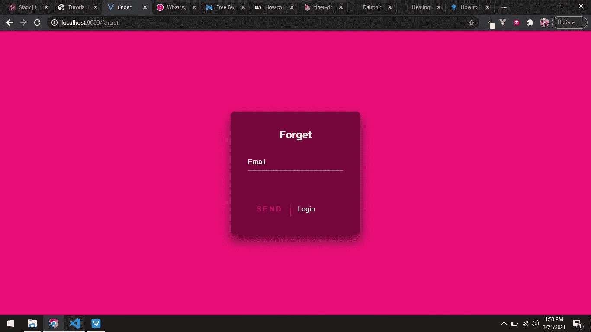

忘记密码组件对于恢复密码非常重要。Firebase SDK 提供了这种功能。此外，为了使我们的应用程序完整，我们必须包括它。

该组件中的代码允许您使用有效的电子邮件地址恢复丢失的密码。

The Forget Password Component

# 配置文件组件

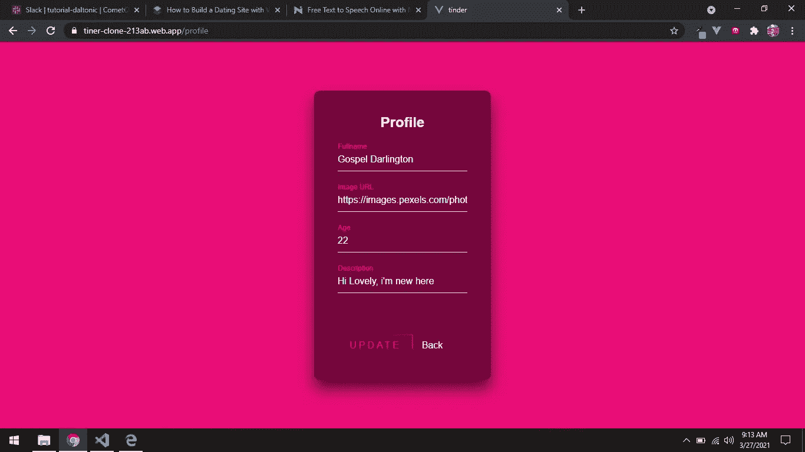

配置文件组件负责捕获和更新用户的其他详细信息。一旦用户在我们的应用程序中注册，他将被引导到个人资料页面来完成他的详细信息。这些细节对于我们应用程序的正常运行非常重要。用户不允许继续使用系统，直到他完成他的个人资料。概要文件组件需要的信息如下。

*   用户的全名
*   用户的头像
*   用户年龄
*   用户描述

下面是负责此操作的代码。

The Profile Component

现在我们已经完成了身份验证组件，让我们进入最后三个最重要的组件。

# 家用部件

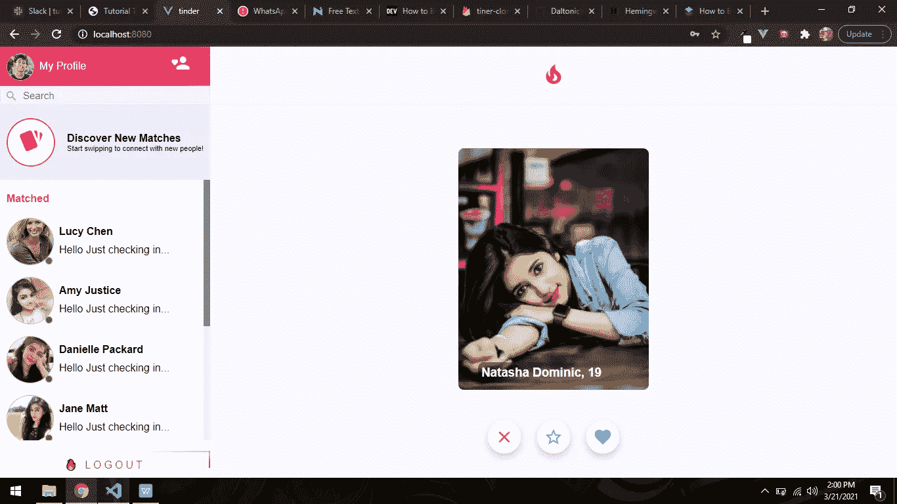

Home 组件包含两个子组件，即**主标题**和**子标题**组件。除了漂亮的设计，它还可以与 **CometChat SDK** 交互。下面是它的工作原理。

在创建时，Home 组件检索 CometChat 帐户中的用户列表。检索之后，它将它们提供给 **TinderCards** 子组件。下面的代码更好地说明了我的观点。

这是 Home 组件的完整代码。

The Home Component

# 子组件

而 **MainHeader** 子组件显示导航按钮。 **TinderCards** 子组件展示了卡片和样式良好的按钮。这是他们各自的代码。

The MainHeader Component

也复制这段代码:[https://gist . github . com/Daltonic/83c 87 AC 13d 4d 6 e 2971 FB 789 deed 6 b 7 db](https://gist.github.com/Daltonic/83c87ac13d4d6e2971fb789deed6b7db)

现在我们已经完成了 Home 组件及其子组件，让我们来谈谈 Chats 组件。

# 聊天组件

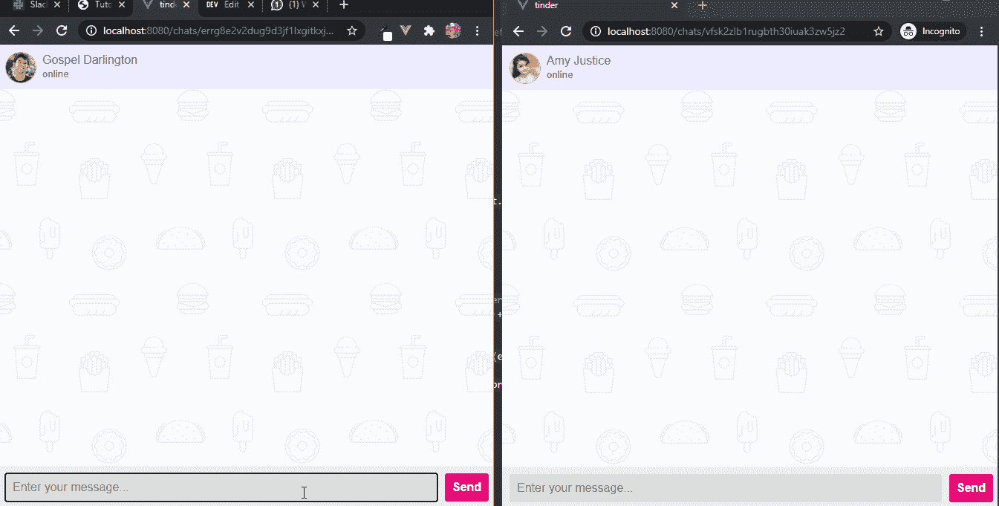

聊天组件提供了一个温馨华丽的聊天界面，让***【tinder . com】***大赚一笔*(微笑)*。它让用户能够进行文本对话。让我们看看负责这项功能的代码。

The Chat Component

我来进一步解释一下，有三种方法你要密切注意。它们包括 ***getUser()、getMessages()、sendMessage()和 listenformmessage()***。

getUser() 方法就像它的名字一样直观，从你的 CometChat 帐户中检索用户。检索后，它将详细信息保存在用户属性中以备他用。

`getUser() {`

`const uid = this.uid;`

`CometChat.getUser(uid)`

`.then((user) => (this.user = user))`

`.catch((error) => console.log(error));`

`}`

**getMessages()** 方法收集你和另一个用户之间的所有对话。之后，它将它存储在一个 messages 数组中以备将来使用。

`getMessages() {`

`const limit = 50;`

`const messagesRequest = new CometChat.MessagesRequestBuilder()`

`.setLimit(limit)`

`.setUID(this.uid)`

`.build();`

`messagesRequest`

`.fetchPrevious()`

`.then((messages) => {`

`messages.map((message, i) => {`

`if (!message.readAt) {`

`const messageId = message.id;`

`const receiverId = message.sender.uid;`

`const receiverType = "user";`

`console.log({ i: i + 1, l: messages.length, r: receiverId, u: this.uid });`

`if (i + 1 === messages.length && receiverId === this.uid)`

`CometChat.markAsRead(messageId, receiverId, receiverType);`

`}`

`});`

`this.messages = messages;`

`})`

`.catch((error) => console.log("Message fetching failed with error:", error));`

`}`

**listenForMessage()** 方法调用参与聊天的两个用户之间的监听器。它用任一用户发送的新消息更新视图。

`listenForMessage() {`

`const listenerID = this.uid;`

`CometChat.addMessageListener(`

`listenerID,`

`new CometChat.MessageListener({`

`onTextMessageReceived: (messageReceipt) => {`

`if (this.uid === messageReceipt.sender.uid) {`

`this.messages.push(messageReceipt);`

`const messageId = messageReceipt.id;`

`const receiverId = messageReceipt.sender.uid;`

`const receiverType = "user";`

`CometChat.markAsRead(messageId, receiverId, receiverType);`

`}`

`},`

`onMessagesDelivered: (messageReceipt) => {`

`this.messages.filter((msg) => (msg.deliveredAt = messageReceipt.deliveredAt));`

`},`

`onMessagesRead: (messageReceipt) => {`

`this.messages.filter((msg) => (msg.readAt = messageReceipt.readAt));`

`},`

`})`

`);`

`}`

最后， **sendMessage()** 方法将文本从输入消息的一方发送到接收消息的一方。

`sendMessage() {`

`const receiverID = this.uid;`

`const messageText = this.message;`

`const receiverType = CometChat.RECEIVER_TYPE.USER;`

`const textMessage = new CometChat.TextMessage(`

`receiverID,`

`messageText,`

`receiverType`

`);`

`CometChat.sendMessage(textMessage)`

`.then((message) => {`

`this.message = "";`

`this.messages.push(message);`

`})`

`.catch((error) => console.log("Message sending failed with error:", error));`

`}`

我打赌你现在对这个过程有了更好的理解，让我们继续到朋友部分。

# 朋友组件

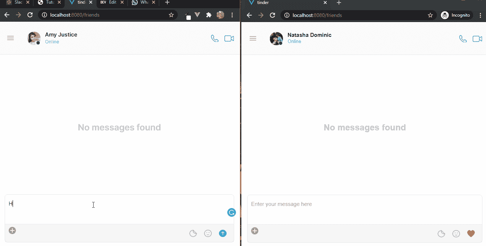

Friends 组件是另一个重要的组件，因为它拥有 CometChat 的全部功能。它包含了 CometChat 的所有功能。是的，你没听错。这些功能包括 CometChat **Vue UI 套件**、聊天、音频、视频通话等。下面我们来看看它的简单代码。

The Friends Component

# Vue UI 套件定制

访问 **Vue UI 套件**组件中的以下文件，并将其更改为以下代码。

*'…/src/comet chat-pro-vue-ui-kit/src/components/Users/CometChatUserListWithMessages/style . js '*

*CometChat User List*

*'…/src/comet chat-pro-vue-ui-kit/src/components/Users/comet chat userlist/style . js*'

*'…/src/comet chat-pro-vue-ui-kit/src/components/Users/comet chat userlist/comet chat userlist。vue '*

*'…/src/comet chat-pro-vue-ui-kit/src/components/Messages/CometChatSenderTextMessageBubble/style . js '*

*'…/src/comet chat-pro-vue-ui-kit/src/components/Messages/CometChatMessageList/style . js '*

*…/src/comet chat-pro-vue-ui-kit/src/components/Messages/CometChatMessageHeader/CometChatMessageHeader . vue*

# 结论

最后，我们以 tinder 为例，一步一步地介绍了如何建立一个约会网站。我们已经学习了如何集成 CometChat SDK 来解决网络上的交流问题。我们已经探索了 CometChat SDK 中发送和接收文本、音频和视频呼叫的各种功能。既然您已经看到了使用 CometChat SDK 和 UI Kit 是多么容易，那么是时候让您着手使用它来创建其他东西了。

*更多内容请看*[***plain English . io***](http://plainenglish.io/)