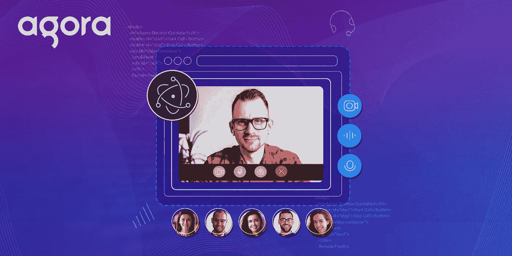
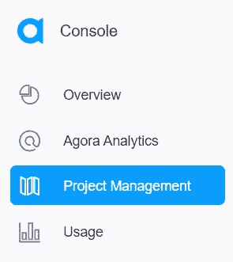
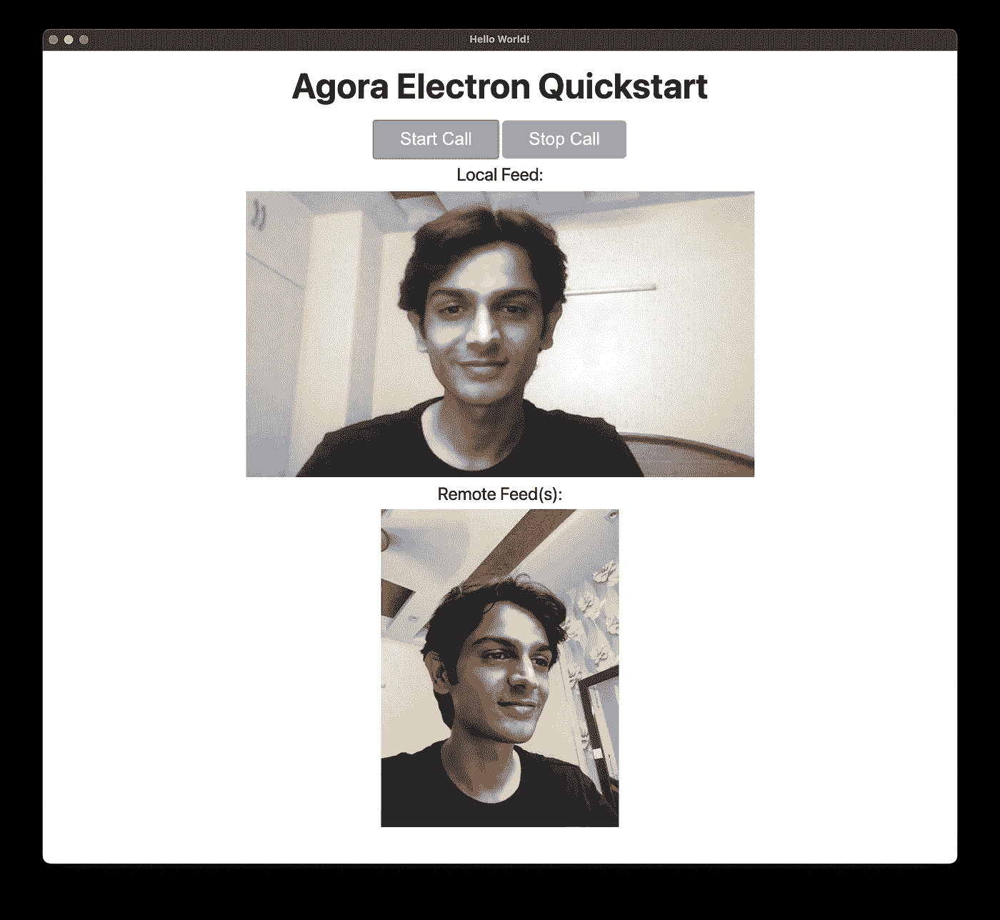

# 如何使用 Agora Electron SDK 构建桌面视频通话应用程序

> 原文：<https://javascript.plainenglish.io/how-to-build-a-desktop-video-calling-app-using-the-agora-electron-sdk-c4149efa1de4?source=collection_archive---------11----------------------->



作为一名 JavaScript 开发人员，您可以真正使用一种语言为几乎任何平台构建应用程序，并且 [Electron](https://www.electronjs.org/) 框架使您能够构建跨平台的桌面应用程序。在本教程中，我们将使用用于 macOS 和 Windows 的 [Agora Electron SDK](https://github.com/AgoraIO/Electron-SDK) 构建一个视频通话桌面应用。

有了电子版，我们可以把一个网站捆绑成一个独立的桌面应用。这种方法有时会引起争议。但它允许网络开发者在几个小时内开始构建桌面应用。所以作为先决条件，你只需要知道 HTML，CSS 和 JavaScript。

# 使用 Agora 创建帐户

在 [Agora.io](https://sso.agora.io/en/signup?utm_source=medium&utm_medium=blog&utm_campaign=how-to-build-a-desktop-video-calling-app-using-the-agora-electron-sdk) 注册，登录仪表盘。



导航到“项目管理”选项卡下的“项目列表”选项卡，并通过单击蓝色的“创建”按钮来创建项目。(当系统提示使用应用 ID +证书时，请仅选择应用 ID。)检索 App ID。它将用于在您开发应用程序时授权您的请求。

> *注意:*本指南不实施令牌认证，建议在生产环境中运行的所有 RTE 应用程序都实施令牌认证。有关 Agora 平台中基于令牌的认证的更多信息，请参见本指南:[https://docs.agora.io/en/Video/token?platform =所有% 20 平台。](https://docs.agora.io/en/Video/token?platform=All%20Platforms)

# 我们示例的结构

这是我们正在构建的应用程序的结构:

```
.
├── **src**
│ └── index.css
│ └── index.html
│ └── index.js
│ └── render.js
├── package.json
.
```

# 让我们运行应用程序

您需要安装 LTS 版本的 Node.js 和 NPM:

*   确保您拥有 Agora 开发人员帐户，设置项目并生成应用 ID。
*   从[主分支](https://github.com/EkaanshArora/Agora-Electron-Quickstart)下载并解压 ZIP 文件。
*   在 macOS 上运行`npm install`或在 Windows 上运行`npm install — arch=ia32`以在解压缩的目录中安装应用依赖项。
*   导航到`./src/render.js`，输入我们生成的应用 ID`appId = “<YourAppId>”;`
*   你现在可以在项目根目录下运行`npm start`来启动你的应用程序。

就是这样。你有一个视频通话桌面应用。该应用程序使用`"test”`作为频道名称。该项目使用[电子锻造](https://www.electronforge.io/)引擎盖下，轻松上手电子。



# 应用程序如何工作

我们的电子应用程序有四个文件:`index.html`是应用程序元素的标记，`index.css`处理应用程序的样式，`render.js`包含视频呼叫的应用程序逻辑，`index.js`处理设置电子应用程序的引导过程。

# index.html

```
<!DOCTYPE html>
<html><head>
  <meta charset="UTF-8">
  <title>Agora Electron Quickstart</title>
  <link rel="stylesheet" href="index.css">
  <script defer src="render.js"></script>
</head><body>
  <h1>Agora Electron Quickstart</h1>
  <button id="start">Start Call</button>
  <button id="stop">Stop Call</button>
  <div id="video-container">
    Local Feed:
    <div id="local">
    </div>
    Remote Feed(s):
    <div id="remote">
    </div>
  </div>
</body></html>
```

我们向`<head>`标签添加一个脚本标签，将 source 设置为`render.js`，这样我们就可以加载我们的应用程序逻辑。defer 标记在执行 JS 之前等待页面加载。

我们有一个简单的布局:两个按钮用于开始和结束通话，两个 div 包含本地和远程用户的视频。

# index.css

我们的应用程序的样式如下所示:

```
body {
  font-family: -apple-system, BlinkMacSystemFont, "Segoe UI", Roboto, Helvetica, Arial, sans-serif;
  margin: auto;
  max-width: 90vw;
  text-align: center;
  align-items: center;
}
h1 {
  margin-block-start: 0.4em;
  margin-block-end: 0.4em;
}
button {
  background-color: rgb(50, 153, 250); /* Green */
  border: none;
  color: white;
  padding: 8px 24px;
  text-align: center;
  text-decoration: none;
  border-radius: 4px;
  font-size: 16px;
  margin-bottom: 5px;
}
#local canvas {
  margin: 5px 0;
  height: 30vh;
}
#remote {
  flex-direction: row;
  display: flex;
  width: 100%;
  flex-wrap: wrap;
}
#remote div {
  flex: 1;
  margin: 5px;
}
#remote canvas {
  height: 27vh;
  zoom: 1.2 !important;
}
```

# render.js

让我们言归正传，看看我们的应用程序逻辑:

```
const AgoraRtcEngine = require('agora-electron-sdk').default;
const APPID = ""; //Enter App  ID hereif (APPID === "") {
  alert('Please enter APPID in src/render.jsx (line:2)');
}let rtcEngine = new AgoraRtcEngine();
rtcEngine.initialize(APPID);rtcEngine.on('joinedChannel', (channel, uid, elapsed) => {
  let localVideoContainer = document.querySelector('#local');
  rtcEngine.setupLocalVideo(localVideoContainer);
})rtcEngine.on('userJoined', (uid) => {
  let remoteVideoContainer = document.querySelector('#remote')
  rtcEngine.setupViewContentMode(uid, 1);
  rtcEngine.subscribe(uid, remoteVideoContainer)
})rtcEngine.setChannelProfile(0)
rtcEngine.enableVideo()document.getElementById('start').onclick = () => {
  rtcEngine.joinChannel(null, "test", null, Math.floor(new Date().getTime() / 1000))
};document.getElementById('stop').onclick = () => {
  rtcEngine.leaveChannel();
  document.getElementById('local').innerHTML = '';
  document.getElementById('remote').innerHTML = '';
};
```

我们正在从 SDK 中导入`AgoraRtcEngine` 类。如果用户没有输入 Agora 应用程序 ID，我们会禁用提醒。我们创建了该类的一个新实例— `rtcEngine`。我们使用 App ID 来初始化我们的引擎实例。

Agora 使用基于事件的 SDK。例如，当我们成功加入一个视频频道时，我们得到了`joinedChannel`事件，然后我们可以用它来执行我们的功能。我们正在设置一个事件处理程序，它调用引擎上的`setupLocalVideo`方法，并且我们传递我们的 div `localVideoContainer`来呈现本地用户的视频提要。

接下来，我们将为`userJoined`设置一个事件，每当用户加入频道时都会触发该事件。我们使用`setupViewContentMode`方法来设置远程视频提要，从事件传入 UID，使用`1`来使用 fit 模式。您可以使用`0`将视频裁剪到 div 的大小。然后我们使用`subscribe`方法，该方法订阅一个远程用户，并通过传入 UID 和 HTML 容器来初始化相应的呈现器。我们正在使用`remoteVideoContainer` div。

我们现在使用`setChannelProfile`方法来使用通信配置文件。也可以使用直播。我们正在使用`enableVideo`方法启用视频模块。

接下来，对于我们的按钮，我们正在设置`onClick` 功能。start 按钮使用`joinChannel`方法加入通道:它接受令牌、通道名、可选信息和 UID。我们为令牌传入 null。如果您在安全模式下使用应用程序，您可以使用临时令牌。我们用`“test”`作为我们的频道名称，但是你可以使用任何字符串。同一信道上的用户可以相互通信。我们为 info 参数传入 null，并使用 Date 函数生成一个随机 UID。一个频道中的所有用户都应该有唯一的 uid。

停止按钮调用`leaveChannel`方法并清除远程视频。

# 索引. js

现在让我们启动我们的电子应用程序:

```
const { app, BrowserWindow } = require('electron');
const path = require('path');app.allowRendererProcessReuse = falseif (require('electron-squirrel-startup')) { 
  app.quit();
}const createWindow = () => {
  const mainWindow = new BrowserWindow({
    width: 1200,
    height: 800,
    webPreferences: {
      nodeIntegration: true,
      contextIsolation: false
  },
  });
  mainWindow.loadFile(path.join(__dirname, 'index.html'));
};app.on('ready', createWindow);app.on('window-all-closed', () => {
  if (process.platform !== 'darwin') {
    app.quit();
  }
});app.on('activate', () => {
  if (BrowserWindow.getAllWindows().length === 0) {
    createWindow();
  }
});
```

我们从 Electron 导入`app`和`BrowserWindow`，从 Node 使用`path`。我们通过将`allowRendererProcessReuse`属性设置为 false 来使用 Agora SDK，从而允许使用非上下文感知模块。`electron-squirrel-startup`模块管理 Windows 应用程序启动逻辑。

我们编写了一个新函数`createWindow`来使用来自 Electron 的`BrowserWindow`生成一个新的浏览器窗口。我们在`webPreferences`中传递`nodeIntegration: true`和`contextIsolation: false`来支持 Agora SDK 集成。我们在主浏览器窗口中使用`loadFile`方法加载`index.html`文件。

回到我们的电子应用程序上的事件，我们有 ready 事件，它调用了`createWindow`函数。对于 macOS，我们使用`window-all-closed`事件在窗口关闭时退出应用程序。如果没有打开的窗口，我们使用`activate`事件通过`createWindow`函数创建一个新窗口。

# 其他资源

这就是使用 [Agora](https://www.agora.io/en/) SDK 和电子框架构建桌面视频通话应用的简单之处。看看[Agora electronic Docs](https://docs.agora.io/en/Video/start_call_electron?platform=Electron&utm_source=medium&utm_medium=blog&utm_campaign=building-a-desktop-video-calling-app-using-the-agora-electron-sdk)和[Agora electronic API Reference](https://docs.agora.io/en/Video/API%20Reference/electron/index.html?&utm_source=medium&utm_medium=blog&utm_campaign=building-a-desktop-video-calling-app-using-the-agora-electron-sdk)快速添加更多功能，如静音摄像头和麦克风、设置视频配置文件和音频混合。

我也邀请你加入 Agora 开发者社区。有问题可以在`#electron-help-me`频道发布。

*更多内容请看*[***plain English . io***](http://plainenglish.io/)