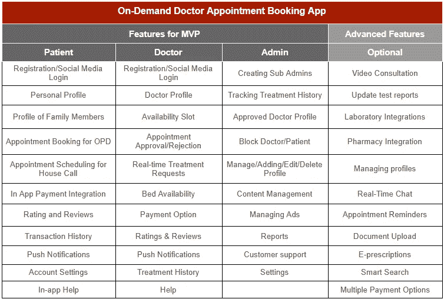

# 建一个患者和医生预约 App 要多少钱

> 原文：<https://javascript.plainenglish.io/how-to-build-a-doctor-booking-app-for-healthcare-appointments-with-react-native-c3ddf4bb40af?source=collection_archive---------4----------------------->

## 如何建立一个病人和医生预约 App:成本，功能，商业模式，流程。

我们许多人都有与医院相关的记忆。接待处的长队，等待预约的长时间，坐在候诊室面对惊慌失措的病人的尴尬，以及那种明显的“医院”气味。

*当然记得很可怕！*

但幸运的是，多亏了这个按需预约医生的应用程序，这样的麻烦可以结束了。

如果你是那些厌倦了管理在诊所候诊室排队的患者的人之一，那么这是一个迹象，你可能应该投资一个在线医生预约应用程序，它可以根据你的可用性帮助你简化你的工作。

## **为什么投资医生预约应用变得如此重要？**

随着新兴技术为医疗保健领域铺平道路，越来越多的患者开始转向移动医疗。*让我们带你浏览市场统计数据，向你解释患者的心理是如何变化的，以及他们为什么转向在线医疗服务。*

*   [根据研究](https://www.lsainsights.com/)，60%的消费者在预约物理治疗师、疗养院或其他医生之前会进行谷歌搜索。
*   94%寻求医疗服务的患者在与医生预约之前使用在线评论。
*   [81%的消费者](https://www.dialogtech.com/blog/health-care-marketing-statistics/)对他们的医疗保健体验不满意，因此，他们可能会查看在线评论。
*   [2.4%的医疗保健预约](https://www.accenture.com/us-en)在网上预约，以避免等待。
*   [19%的智能手机用户](https://thesparkreport.com/infographic-social-mobile-healthcare/)在手机上至少有一个医疗保健应用，无论是运动、饮食、体重应用还是医生咨询应用。
*   [54%的患者](https://getreferralmd.com/2013/09/healthcare-social-media-statistics/)对他们的提供者从在线社区寻求建议以更好地治疗他们的疾病非常满意。
*   预计到 2025 年，移动医疗保健行业将成为一个价值 3000 亿美元的行业。
*   到 2025 年底，远程医疗行业预计将增长 [19%。](https://www.gminsights.com/industry-analysis/telemedicine-market)

***简而言之:*** *移动医疗的统计数据和事实描绘了接入虚拟诊所的上升趋势。对于正在寻找简化临床操作的潜在方法的诊所或总是忙碌的患者来说，这些按需预约医生的应用程序被证明是关键。*

现在这里的中心问题是如何 [**为你的诊所或医院开发一个成功的按需预约医生 app**](https://www.xicom.biz/services/mobile-app-development/) ？

下面我们来看一个搭建医生预约预约 app 的分步指南。

# **2022 年如何搭建医生预约预约 App**

虽然世界上充斥着大量的技术、工具和框架，但设计、开发和发布满足最终用户需求的防失败应用程序似乎是一项艰巨的任务。因此，在这里，我们将一步一步地指导您开发医生预约 app，帮助您在竞争激烈的市场中保持领先地位。

如何创建一个功能强大的医疗日程安排应用程序，并提供患者需要的所有功能？如果你没有技术团队，那么你可以选择聘请一家手机 app 开发公司，它会帮你构建一个医生预约 app，为你兼顾前端和后端。

*但是，我们还是设计出了创建医生预约应用的简单步骤:*

## **第一步——研究市场**

在开始设计和开发在线医生预约系统之前，做深入的市场调查。您的应用程序的功能将取决于您的位置、目标受众、商业模式等。

如果你正试图进入患者预约移动应用程序开发，那么通过 [**雇佣一名应用程序开发人员**](https://www.xicom.biz/solutions/hire-developers/) 帮助你从竞争对手那里学习一些重要的事实是很重要的。遵循他们的商业模式，从他们的错误中学习，将会减少你最初的努力，并帮助你把它们变成你的资产。

***所以基本上，在研究一个市场的时候，你需要:***

*   仔细看看你的竞争对手的应用程序，它的界面，功能，技术等等。
*   分析它们的利弊。
*   框出他们为达到最终需求而遗漏的要点。
*   检查他们选择了什么平台来发布他们的应用程序——iOS，Android，或者两者都有。
*   验证他们是否有两个 app，一个给病人，一个给医生。
*   将所有这些与患者的需求结合起来。

## **步骤 2——规划特性集**

下一步是选择你希望你的应用程序拥有的特性。根据您的需求和预算，您可以选择 MVP 模式或为您的应用程序选择高级功能。但是为了在竞争激烈的市场中保持领先，专家建议你选择第二种选择。

***但是当你开始为你的应用程序分类时，记住有三个面板——病人、医生和管理员。***

## **步骤 3——验证原型**

一旦决定了应用程序的结构，就该考虑按需应用程序开发原型了。你需要开发应用程序中所有屏幕的视觉效果，并通过点击原型验证其功能。

***对于原型制作，我们更喜欢使用 Invision，但是开发者可以自由使用其他的原型制作工具，例如:***

*   [Adobe XD](https://www.adobe.com/products/xd/solutions/prototyping-tool.html)
*   [图玛](https://www.figma.com/prototyping/)
*   [草图](https://www.sketch.com/docs/prototyping/)

***借助这些工具你可以更好地决定:***

*   用户界面
*   应用程序中的颜色、图案和其他视觉效果
*   易于导航的预订系统
*   针对 iOS 和 Android 进行微调

## **第 4 步—查看现成的调度工具**

当你决定创建一个预约医生的应用程序时，最耗费时间的部分将是开发一个调度引擎。尤其是如果你从头开始构建一个应用。更好的选择是选择现成的调度 API，如 Acuity、Timekit 或 OnSched 提供的 API。

由于我们正在使用 React Native 开发按需医生预约预约应用程序，因此使用 React Native 支持的 API 是一个值得的决定，它可以显著加快定制移动应用程序的开发过程，但请记住，这一选择将影响您的 UI。

## **为什么选择 React Native 作为医疗保健预约应用？**

假设你很熟悉的事实是，它是框架之一，广泛用于 [**跨平台 app 开发解决方案**](https://www.xicom.biz/services/cross-platform-app-development/) ，对前端开发有很高的需求。尽管它是一个基于 JavaScript 的年轻框架，但它赢得了包括 Myntra、Tesla、脸书、亚马逊等领先企业的信任。

***原因在这里:***

*   React Native 对 web、Android 和 iOS 平台使用相同的代码，因此，在不影响质量和生产率的情况下，将开发工作量减少了近 50%。
*   从头开始开发应用程序是一项昂贵的交易，尽管 React Native 提供了一个巨大的 JavaScript 库，它彻底改变了工作流程并增强了应用程序的性能。
*   确保更好的用户界面/UX 就像本地体验。
*   React Native 是构建 MVP 的完美平台，提供了极大的灵活性和生产力。此外，它支持快速开发、代码可重用性、第三方插件支持、简化的 UI、大量的库集合，这些都使这个框架成为开发的首选。
*   它是移动应用程序开发的顶级跨平台框架之一，利用脸书丰富的 UI 库，可以轻松实现和执行类似 React 的代码。

## **第 5 步——应用程序开发流程**

毫无疑问，对开发人员来说，编写一个应用程序是一项复杂而枯燥的任务，但在 [**创建一个按需医生预约应用程序**](https://www.xicom.biz/services/mobile-app-development/) 时，它可能是令人兴奋的。RN 不仅为你提供了对插件广泛选择的良好支持，而且还帮助你通过使用一个单一的代码库来开发多个应用程序。你所需要的就是雇佣一个跨平台的应用开发者，他拥有开发一个应用的经验和知识，使其符合所有 AppStore 和 PlayStore 的规则。

## **第 6 步——质量保证**

在急于将你的应用程序发布到应用商店之前，有必要进行一系列严格的测试和质量保证过程。这些测试通过在发布前修复缺陷，确保按需应用程序能够提供最佳性能。确保应用程序通过严格的速度测试、单元测试、安全测试、负载测试和回归测试。

## **第 7 步—启动应用**

无论你开发了一个多么出色的应用程序，在你没有在应用程序商店中有效地营销预订应用程序之前，它都不会给你带来任何好处。*告诉你的病人是第一步，然后是营销策略，可能包括:*

*   在你的医生官网推送 app。
*   向患者列表发送批量电子邮件。
*   在社交媒体上分享细节。
*   应用程序商店和医疗保健业务上的广告。

如果你认为你的工作已经完成，那么你可能错了。开发和启动一个应用程序并不像听起来那么无缝。所以让我们来了解一下 2022 年推出医生预约 app 的挑战！

# **创建健康预约应用的主要障碍**

虽然开发任何类型的应用程序对开发者来说都不是一件遥不可及的工作，但是，通过雇佣移动应用程序开发公司，你可以为你的企业构建一个令人惊叹的应用程序。但是实际上，在开发应用程序时，有许多悬而未决的问题需要克服。以下是限速器列表:

***挑战#1*** *开发人员在将视频通话功能引入应用时，首先要应对的也是最常见的挑战。*

*   **Pro 解决方案:**要成功实现医生预约 app 的视频通话功能，您需要使用 Twilio 的可编程视频服务。

***挑战#2*** *另一个挑战是跟踪医生诊所的确切位置，以检查与患者的接近程度。*

*   **专业解决方案:**你可以 [**雇佣移动应用开发者**](https://www.xicom.biz/offerings/hire-mobile-developers/) 来克服这个挑战，或者使用谷歌的地理定位功能来获取准确的数据。

在为您的诊所开发按需医生预约应用程序时，这并不是您需要关注的全部。随着这些医疗保健预约应用程序的需求不断增长，ZocDoc 和 Practo 等应用程序已经成为这一类别中占主导地位的医生的两个主要预约应用程序。那么你将如何赢得用户的信任呢？

# **如何在预约医生时建立对你的应用程序的信任？**

无论你是跟随任何领先应用程序的克隆，还是雇佣移动应用程序开发公司从头开始开发，你的主要关注点必须是终端用户。因此，考虑到这一事实，如果你真的希望赢得用户对你的应用程序的信任，下面是一些简单而基本的事情

*   你的应用应该易于使用和简单导航。
*   用户界面很重要，所以要保持简单、吸引人。
*   *应用程序必须易于安装，并通过快速注册开始使用。*
*   *它应该可以轻松地在各种设备之间同步数据。*
*   *应该可以安全访问，因为它保存了用户数据。*

医疗保健移动应用程序开发应该包含优秀的 UX/UI 设计、分析、质量保证、后端和应用程序开发。为了让你的应用在竞争中保持领先，我们在这里列出了一些重要的功能，这些功能将集成到应用中，帮助你赢得用户的信任:

*   **医生档案扫描**

在你的应用程序中列出任何医生之前，请确保你在应用程序中有一个彻底的验证过程。例如，Practo 只在医生提供了他的注册号和证书或身份证的扫描件后才发布个人资料。

*   **医生经验的准确显示**

在批准医生的个人资料之前，你需要尽可能多地结合检查医生经验的方法。你可以 [**雇佣一名在人工智能、数据科学或人工智能方面经验丰富的应用程序开发人员**](https://www.xicom.biz/solutions/hire-developers/) ，让你能够选择最合适的方法来收集数据。

*   **正版评分和评论**

另一个目的是让用户相信你的应用评论的真实性。虽然每个应用程序都有这一部分，但这里有一些关于如何更好地执行这一部分的提示:

*   *仅允许经过验证的患者在确认预约后发布评论。*
*   *确保一生中必须提供一次反馈，并且可以通过手机号码验证进行检查。*
*   *预约后，可以在患者的手机号码上发送短信。*

现在，您已经开发了集成了最佳功能的应用程序。但主要问题仍然没有答案:如何从你的预约应用程序中获利。

# **医生预约 App 最佳商业模式**

与其浪费时间做介绍，不如让我们快速了解一下通过按需医疗应用赚钱的主要方式:

*   **纳入优质服务:**这种优质服务可以扩展访问无限医生、访问人工智能医生、在线处方、药物递送等设施。
*   **提供套餐:**所有用户都可以切换到付费账户，利用更好的设施来利用扩展功能。
*   对每次预约收费:这是大多数医疗保健应用赚钱的方式。他们以佣金的形式从每次预约的医生那里收取部分费用。

# **开发一个医生预约 App 要多少钱？**

计算为您的诊所创建一个医生预约应用程序的成本是一个真正的挑战，因为成本主要取决于您集成到应用程序中的功能、特性、复杂性和 UX/UI 设计。该应用程序可以很简单，包括通过短信预约医生，也可以是一个集成了过多功能和高级功能的高级应用程序。应用程序的结构完全取决于你的预算和你的最终用户。

> 让我们来看看使用 React Native 进行开发的成本:

## **您的应用程序中的预期功能**

*   约会提醒
*   在线预约医生
*   药物输送
*   药品提醒
*   电子处方上传
*   病历
*   根据位置绘制医生地图
*   访问健康专家的博客

## **需要整合的技术**

*   后端开发:Java，。Net、Python
*   开发时间:1200+小时
*   前端开发:反应自然，有角度
*   开发时间:800+小时
*   平台可用性:Android、iOS
*   博客功能:WordPress
*   开发时间:100+小时

## **开发团队所需**

*   质量保证
*   网络运营
*   商业分析员
*   UX/用户界面设计

> **在这个特定的案例中，使用 React Native 开发一个医生预约应用程序的估计价格可以从 20，000 美元以上开始。但开发这款应用的基本或现代版本的成本不可能从 1 万美元开始。**

# **包装**

在这篇博客的结尾，我们同意医疗保健行业很拥挤的事实，但总有改进和创新的空间。

市场上有很多医疗保健预约应用程序，但仍需要提供更好的用户体验。因此，雇佣一家 [**移动应用开发公司**](https://www.xicom.biz/services/mobile-app-development/) 是有意义的，它在应用开发过程中利用最好的技术，让你在竞争激烈的市场中保持领先。

*希望这篇博客已经回答了你所有关于开发一个成功的按需预约医生应用程序的问题。但是，如果你有任何疑问，你可以在下面的评论中提出疑问。*

*更多内容请看*[*plain English . io*](http://plainenglish.io/)