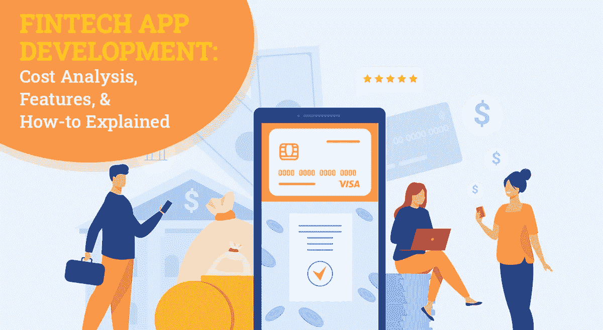
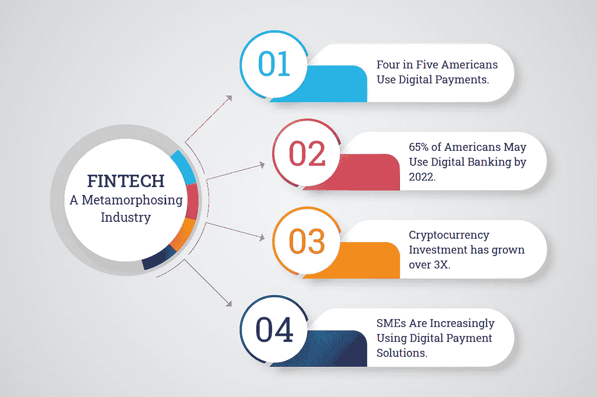
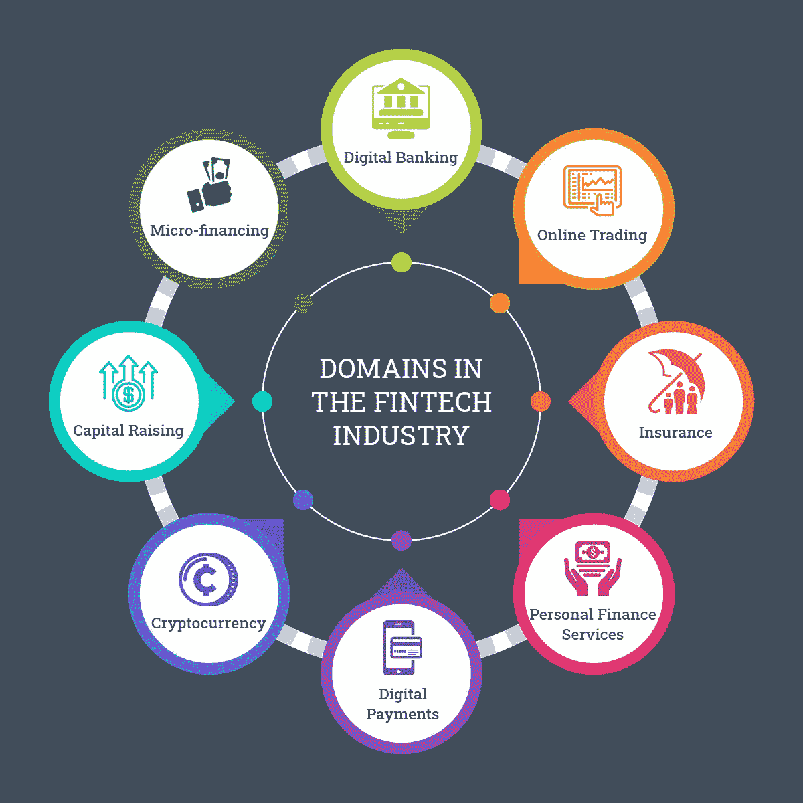
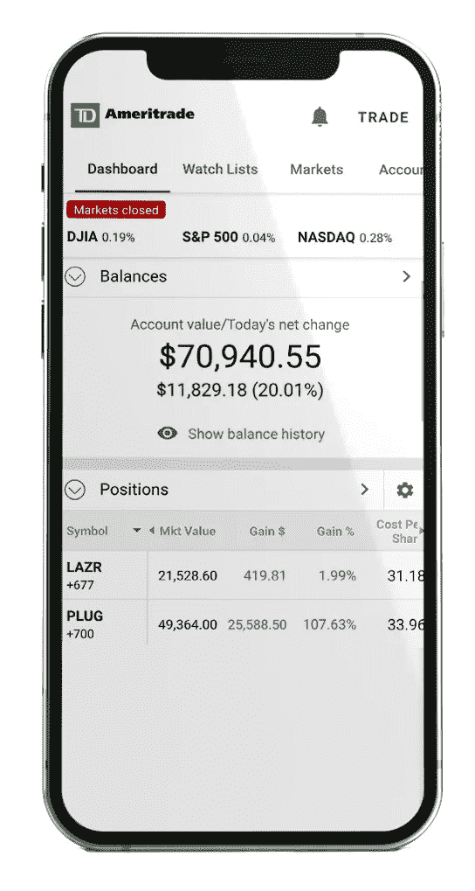
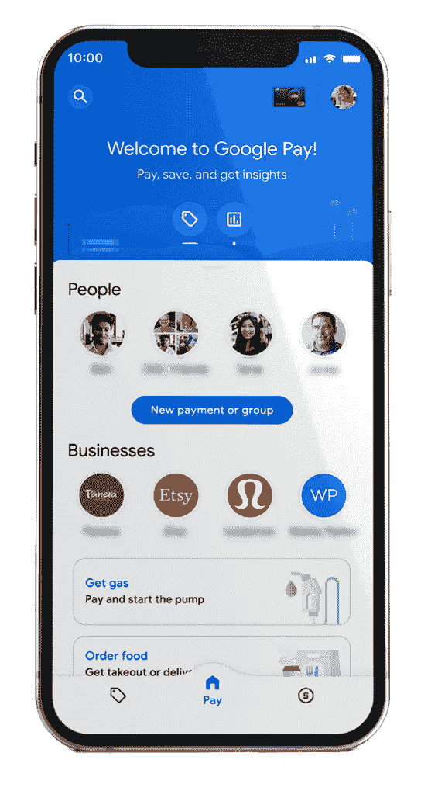
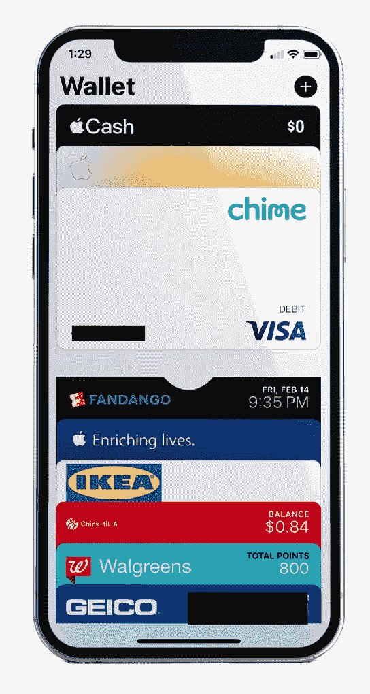
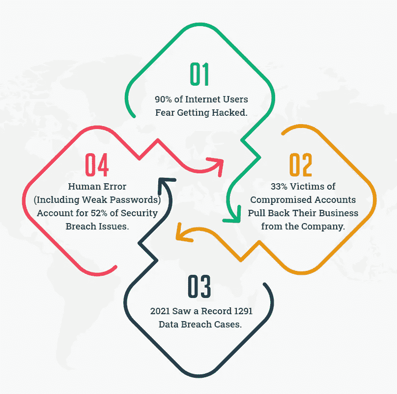
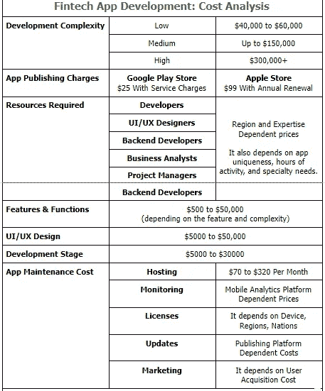

# 如何建立一个能够吸引投资回报的金融科技应用

> 原文：<https://javascript.plainenglish.io/how-to-build-a-fintech-app-that-can-attract-roi-a3d416a9a289?source=collection_archive---------8----------------------->

## 金融科技应用程序开发:成本分析、特点和操作说明

*深入探讨金融科技应用开发的挑战，DIY 与外包的成本分析，必备功能，相当大的风险，以及如何构建金融科技应用的分步指南。*

金融科技产业价值近[**340 亿美元**](https://www.statista.com/topics/2404/fintech/#dossierKeyfigures) 。从改善客户的数字体验到为金融机构创造非传统收入流，金融科技无处不在。

不用说，目前金融科技应用程序开发存在大量机会。

然而，这并不一定意味着你应该马上开始开发。

金融科技行业是广阔的；它有不断发展的维度。同样，该领域的颠覆性技术每天都在涌现。此外，美国在 2021 年拥有全球最多的金融科技初创公司**，这一事实可以衡量那里的竞争。**

> **那么，**如何打造一款成功几率更高的 fintech app** ？让我们开始吧！**

# **正在研究金融科技应用开发？以下是不要做的事情！**

1.  **不要坐下来造下一个独角兽。**
2.  **不要指望你的解决方案会在几分钟内获得巨大成功。**

**希望任何一个都没有错。**

**请记住，好的解决方案可以高效地解决问题。所以，你可以稍微装饰一下。但是，不要因为流行的解决方案而分心，投入宝贵的时间去模仿它们的外观或技巧。**

**对于第一个版本，以功能有效性为目标。**

**记住，罗马不是一天建成的；Google Pay 也不是！**

# **首先，有一个想法——你的金融科技应用是关于什么的？**

**你可能对这个应用有想法。也许，你没有。如果你让热情蒙蔽了你的决定，那也没多大关系。**

**除非你了解你即将进入的利基，否则结果不会很有收获。**

****

**例如，让我们假设你希望从事数字支付领域。自然，你会想知道这个领域金融科技应用开发的所有特点。**

**但是，数字支付是一个范畴。它可以分为消费者支付解决方案、移动钱包、支付处理解决方案、电子支付接受解决方案等等。**

> ****看看排名靠前的金融科技应用。然后，看你的想法或者概念。现在回答:****

1.  **你到底在开发什么？**
2.  **这里的目标受众是谁？**
3.  **最终用户期望什么？**
4.  **已经存在哪些解决方案？**
5.  **你能做得更好吗？**

**深入研究使用金融科技应用的顶级公司，金融科技收入、增长、地区和特定趋势的年终评论等。然后，让自己对想要构建的解决方案和它将解决的问题有一个清晰的认识。**

# **金融科技应用开发的必备功能**

> **那么，**如何搭建一个 fintech app** ？**

> **第一步就是。决定你想建立什么，并研究这种解决方案的市场。**

**第二件事是决定什么样的特性是让你的应用程序工作的关键。**

**将你的特性分成两部分-基本的和附加的。在前一个类别中，包括用户为实现应用程序的目的而需要的每一个功能。在后一个类别中，添加一些很好的特性。**

**围绕这些特性规划您的开发过程。这里有一些基本的帮助你前进。**

## **1.令人愉快的金融科技应用程序设计**

**复杂、严肃的仪表板的时代已经一去不复返了。**

**用户便利性是一个市场差异化因素。他们希望这款应用可以随时使用。但是，他们也想从美学的角度来看待他们的活动。**

**因此，一个简单而令人愉悦的 UI 是 fintech 应用开发最重要的**特征之一。****

****

**TDAmeritrade**

****

**Google Pay**

****

**Apple wallet**

## **2.安全性-您所能提供的最佳保障**

**如果你向使用金融科技应用的顶级公司询问一个他们永远不会妥协的功能，“安全”可能是答案。**

**为什么？**

**因为金钱问题很敏感。银行数据、卡信息、电子邮件、交易密码、认证媒介——所有这些都是数字金融领域的黄金。失去这些数据，你也将失去客户的信任和业务。**

****

**生物识别是确保金融科技应用开发安全的最佳方式。如今，几乎所有的移动设备都包含指纹传感器。大多数还带有面部识别传感器。依靠这种先进的认证技术。**

**还有，用 2FA。谷歌和微软表示，双因素认证可以消除高达 100%的自动网络攻击[。](https://www.zdnet.com/article/better-than-the-best-password-how-to-use-2fa-to-improve-your-security/)**

**挑出每一个必须采取严厉措施的敏感例子。例如，当打开应用程序时，验证汇款请求、最终付款阶段等。**

## **3.推送通知**

**有效的沟通是繁荣的金融科技应用的基础支柱之一。**

**用户会想知道银行提供的每一次更新，或者是否有任何金额被扣除或记入，或者是否有支付提议，或者是否有任何变化——不管他们的账户、钱包或余额有多小。**

**你会在顶级金融科技应用中发现咄咄逼人的推送通知。用户可以选择停用一些。但作为提供者，确保不遗漏任何沟通是明智的。**

## **4.分析和简单报告**

**理解金融数据不是每个人都具备的技能。但是，这也是必要的。因此，在金融科技应用开发期间创建一个专门的报告功能是一个好主意。**

**请记住，简单是用户友好的财务报告的关键。**

**构建分析功能，使最终用户能够-**

> **跟踪他们的交易**
> 
> **查看个人付款的详细信息**
> 
> **跟踪特定帐户或企业的数据**
> 
> **定制报告以获得精确的数据**
> 
> **导出报告**

**如果您想领先一步，可以将图形数据表示融入其中。使用图形、图表、线条、条形图和标题来简化客户的理解。**

# **5.扫描仪集成**

**QR 码/条形码是通过数字媒介进行支付的一个组成部分。它们是身份。你会发现跨企业的 QR，有个人用户，甚至小供应商。**

**因此，如果你正在开发一个支付应用，二维码扫描集成功能是必不可少的。**

**同时，其他银行和金融科技解决方案也可以使用二维码扫描仪。它可以用来验证文件，商家付款，甚至简单的银行交易。**

**添加一个将为您的金融科技应用解决方案带来新的功能机会。**

# **金融科技应用开发中的风险和挑战**

**对于一个生活在服务器上的金融生态系统，赌注比以往任何时候都高。不幸的是，当你努力保护你的用户免受全球人类情报已知和未知威胁时，没有欺诈免疫这回事。**

**但是，这里也有一个机会。**

**如果你能创造一个安全的——一个相对更安全的——解决方案，你成功的机会将会成倍增加。**

> **因此，在创建金融科技应用开发的**功能的线框时，要考虑这些风险。****

## **1.网络安全**

**听说过勒索软件吗？**

**当你的工作应用程序被勒索时，停机所造成的损失可能会比通常要求的赎金 多 10 倍 [**。此外，如果尽管支付了赎金，威胁仍然选择破坏您的数据，您将无法控制任何事情。**](https://www.itgovernance.co.uk/blog/wp-content/uploads/2019/10/datto-pic.png)**

**避免此类事件是一个保护您的平台的问题。**

*   **为用户帐户提供强大的保护(想想 2FA)**
*   **彻底测试以识别编码漏洞**
*   **使用最好的反网络钓鱼措施**
*   **尽可能多地加密您的数据**
*   **使用防火墙、防病毒软件、访问控制等。**

**我们已经看到安全是所有使用金融科技应用服务的顶级公司的选择。最好的手机 app 开发公司或者 [**MVP 开发服务**](https://www.suntecindia.com/mvp-development-company.html) 会给你建议类似的路线。**

## **2.金融犯罪**

**洗钱、欺诈、非法交易——当金钱在网上流动时，很多事情都会出错。这种金融犯罪不仅会失去客户的信任，还会给你的业务蒙上阴影。**

**但是，处理金融犯罪是一门高级技能。你将需要人工智能、持续监控、用户行为研究等的结合。，来搞定这件事。**

**同时，你也应该利用人工智能和人工智能来监控可疑的行为，并在问题爆发之前处理它们。**

## **3.数据加密和合规性**

**这里有两件事:**

1.  **用户会涌向你的金融科技应用，因为他们相信自己的数据是安全的**
2.  **小偷会蜂拥至你的数据，因为这是价值所在**

**因此，为了让您的用户满意并防止小偷，您需要尽可能地保护数据。**

> **这就是加密和法规遵从性的用武之地。**

**遵循最佳行业安全标准。在存储之前或传输过程中加密数据。有效管理加密密钥。尽最大努力降低数据的价值，这样万一数据被盗，也不会有太大损失。**

# **金融科技应用开发:成本分析**

> **移动应用程序的平均开发成本在[3 万到 70 万美元](https://www.businessofapps.com/app-developers/research/app-development-cost/)之间。**

**当然，一个平均值对你没有多大帮助。随便问问 [**手机 app 开发公司**](https://www.suntecindia.com/mobile-app-development-services.html) ！移动应用程序开发的成本取决于几个因素，每个因素在提高或降低最终费用数字方面都起着关键作用。**

****

**然后，还有建立内部团队或外包 MVP 开发服务的问题。或者你可以只 [**雇佣专门的软件开发人员**](https://www.suntecindia.com/hire-dedicated-developers.html) 来完成这项工作。这三种情况下的成本都不同。**

**然而，当你 [**雇佣 iOS 应用开发者**](https://www.suntecindia.com/hire-iphone-app-developers.html) 或者 [**从一家值得信赖的移动应用开发公司雇佣 Android 应用开发者**](https://www.suntecindia.com/hire-android-app-developers.html) 时，利益就堆积起来了。**

*   **你可以接触到有经验的资源。**
*   **需要最少的监控。**
*   **你可以完全控制整个过程。**
*   **总体成本几乎总是低于招聘一个内部团队。**
*   **此外，零基础设施成本**

> ***总之，fintech app 开发成本取决于你的商业模式。从那里，它分支到几个其他的考虑。***

**因此，彻底的研究和明智的策略是必由之路。**

# **关于如何构建金融科技应用的最终想法？**

**虽然我们已经讨论了很多关于顶级金融科技应用程序如何工作的问题，或者使用金融科技应用程序的顶级公司在选择解决方案时会考虑什么，但我袖手旁观说的是我的第一句话。**

**功能有效性是成功的关键**

> **你如何实现这一点？**

**非常清楚你在创造什么。小心组建你的金融科技应用开发团队。 [**雇佣经过彻底筛选的手机 app 开发者**](https://www.suntecindia.com/hire-mobile-app-developers.html) 。明智地选择你的基础版本特性。创建一个计划来升级和更新适当的时间滞留。遵循国际法规。消除风险。**

**祝项目好运！**

# **常见问题(常见问题)**

****1。做一个 Fintech App 要多少钱？****

**Fintech app 开发成本因多种因素而异，包括开发复杂度、设计、开发、功能、紧急程度等。参考这张详细的图表，可以了解构建一个金融科技应用的成本是如何确定的。**

****2。搭建一个 Fintech App 需要多长时间？****

**你可以在一到十个月的时间里在任何地方创建一个金融科技应用，这取决于你将愿景转化为有效解决方案所需的复杂性、独特性和专业水平。**

**如果你打算雇佣专门的软件开发人员或者外包给移动应用开发公司，你可以直接问他们关于时间因素的问题。他们将研究你的要求，并相应地提供一个估计。**

****3。金融科技应用程序必须遵守哪些法律要求？****

**大多数“如何构建金融科技应用”指南并没有告诉你保持应用程序与国际数据和安全合规性保持同步的重要性。其中包括:**

1.  **通用数据保护条例(GDPR)**
2.  **金融科技行动计划(FAP)**
3.  **反洗钱**
4.  **电子资金转账法案(EFTA)**
5.  **电子身份和信任服务**
6.  **美国联邦贸易委员会(联邦贸易委员会)**
7.  **证券交易委员会**
8.  **支付服务指令**

****4。一款 Fintech App 如何赚钱？****

**在 fintech 应用程序开发之后，您可以使用以下货币化策略来增加收入。**

*   **优质服务**
*   **应用内购买**
*   **捐款**
*   **交易费用**
*   **完全付费的模块**
*   **支付处理费**
*   **放款**
*   **加密货币**

**因此，如果您有任何想法，您想要实现技术、特性和功能的正确组合，那么您可以 [**联系我们**](https://www.suntecindia.com/contactus.htm) 或在下面提出疑问。**

**现在你知道了。感谢您的阅读。**

# **另请参阅:**

> **[***如何创建一个交友 App？(特性、成本、时间等等)***](https://www.suntecindia.com/blog/how-to-create-a-dating-app/)**
> 
> **[***2021 年打造自己的优步 App:综合指南***](https://www.suntecindia.com/blog/how-to-make-an-app-like-uber/)**
> 
> **[***如何将 iOS 应用转换为 Android 应用？(步骤、成本和挑战)***](https://medium.com/dev-genius/how-to-convert-ios-app-to-android-app-steps-cost-and-challenges-a064ebc0e636)**
> 
> **[***外包手机 App 开发服务的技巧和策略***](https://medium.com/mobile-app-development-publication/tips-and-strategies-to-outsource-mobile-app-development-services-a5a7f9c6ac85)**
> 
> **[***开发一个送餐应用程序(它的特性、成本和功能)***](https://medium.com/flutter-community/develop-a-food-delivery-application-its-features-cost-and-functionality-454b228b8111)**
> 
> **[***Shopify vs woo commerce vs Magento—您应该为您的企业选择哪种电子商务解决方案？*T34**](/shopify-vs-woocommerce-vs-magento-which-ecommerce-solution-should-you-choose-for-your-business-d744a828a71b)**

***更多内容请看*[*plain English . io*](http://plainenglish.io/)*。在这里注册我们的* [*免费周报*](http://newsletter.plainenglish.io/) *。***