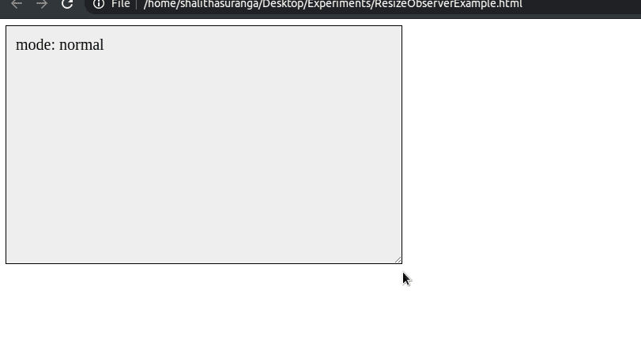

# 如何用 ResizeObserver API 构建高响应性的 UI

> 原文：<https://javascript.plainenglish.io/how-to-build-a-highly-responsive-ui-with-resizeobserver-api-e645d3c578d5?source=collection_archive---------8----------------------->

## 让我们用先进的响应式设计理念打动用户。


Photo by [HalGatewood.com](https://unsplash.com/@halacious?utm_source=unsplash&utm_medium=referral&utm_content=creditCopyText) on [Unsplash](/s/photos/web?utm_source=unsplash&utm_medium=referral&utm_content=creditCopyText)

此前，几乎所有的网络应用和网站都有固定的宽度。请记住，我们曾经有一段时间，网站促使我们以预定义的分辨率查看特定网站，以获得最佳浏览效果。例如，一些网站表示，他们的内容在 1024x768 的屏幕上清晰可见。对于较小的屏幕，有一个水平滚动条来查看隐藏的内容。响应式设计一词在 2010 年开始流行。在 CSS 媒体查询的帮助下，每个人都试图让他们的网站对任何屏幕尺寸都友好。换句话说，他们做出了反应灵敏的用户界面。

现在，所有的 web UI 工具包都有现成的响应设计支持。我们不需要付出更多的努力来使我们的用户界面对不同的分辨率友好。此外，响应式设计不再是一个时髦的词，因为它现在就像一个标准。我们确实可以通过一些高级的响应实现概念来增强应用程序的可用性。也许，您的应用程序有一些可调整大小的窗口、可扩展区域和分隔视口的分割线。您可以通过根据 resize 事件动态更改 UI 元素来构建更生动的 UI。例子见以下情况。

*   根据特定父级`div`的大小显示和隐藏不同的 UI 元素。
*   根据屏幕大小或特定父`div`的大小应用不同的字体大小。
*   为您的应用程序实现不同的模式。例如，一些应用程序根据屏幕上的可用空间激活不同的 UI 模式。

# 什么是 ResizeObserver API？

ResizeObserver 接口检测给定 DOM 元素的大小变化。如果高度或宽度发生变化，将触发一个回调函数，为每个 DOM 元素指定新的大小。

这个 API 作为标准 API 被添加到 W3C 规范中，因为现有的 DOM 大小变化检测方法是不成熟的变通方法。换句话说，即使有一个标准的 API 来检测窗口调整事件，也没有一种直接的方法来观察特定 DOM 元素的调整事件。现在，我们可以用 ResizeObserver API 创建下一级响应 ui，而不会给 web 应用程序带来性能问题。

而且浏览器对这个 API 的支持还是不错的。除了 Internet Explorer 之外的所有浏览器都支持 ResizeObserver API。

# 如何使用 ResizeObserver API

让我们看看如何使用这个 API。首先，我们需要创建一个 resize observer 实例，如下所示。

```
let resizeObserver = new ResizeObserver(onResize);
```

构造函数接受一个回调函数，该函数将被 resize 事件触发。

```
function onResize(entries) {
    // "entries" is an array of ResizeObserverEntry objects.
}
```

`ResizeObserverEntry`对象包含被观察元素的新维度的信息。

一旦创建了 observer 实例，就可以用`observe`方法观察任何 DOM 元素，如下所示。

```
resizeObserver.observe(HTMLElement_1);
resizeObserver.observe(HTMLElement_2);
...
resizeObserver.observe(HTMLElement_n);
```

如果需要从观察者中移除一个元素，可以使用`unobserve`方法。

下面的例子有一个可调整大小的`div`元素。当宽度发生变化时，将相应地激活不同的模式。



Example usage of the ResizeObserver API. A screen recording by the author.

查看上面例子的源代码。

# 结论

这个 API 可以和任何前端框架一起使用。当您通过`disconnect`方法改变视图时，确保清除观察者。`disconnect`方法从 observer 实例中删除所有附加的元素。