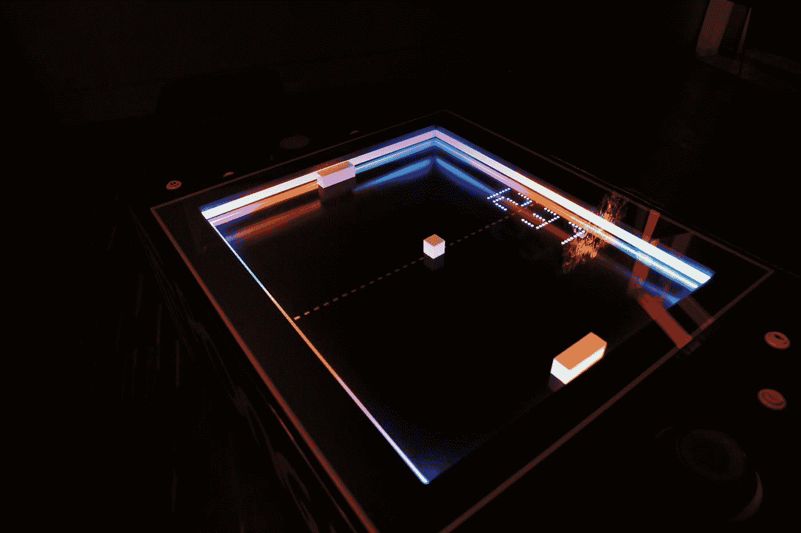
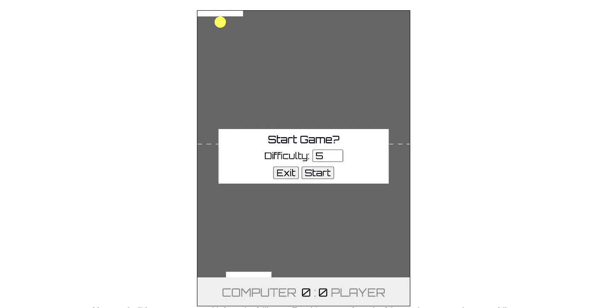

# 如何建立一个 HTML 乒乓游戏

> 原文：<https://javascript.plainenglish.io/how-to-build-a-html-pong-game-8c29ef0ff462?source=collection_archive---------4----------------------->

## 使用 SVG/HTML/CSS(不是 Canvas)和 JavaScript

**Pong** 是 1972 年发布的一款以乒乓球为主题的街机游戏，以简单的 2D 图形为特色。在本教程中，这个游戏将使用 HTML 开发，包括 SVG，为了最大限度的简化(通过避免关注画布图形)，不使用 canvas



Photo by [Feelfarbig Magazine](https://unsplash.com/@feelfarbig?utm_source=medium&utm_medium=referral) on [Unsplash](https://unsplash.com?utm_source=medium&utm_medium=referral)

总共有五个步骤。

1.  画桌子/球
2.  让球动起来
3.  设置播放器
4.  设定对手(电脑)
5.  用分数来定案

当我们完成所有五个步骤时，除了一个用于移动球拍的小库，您将拥有不到 100 行的 JavaScript。

# 第一步。画桌子/球

作为第一步，您将只绘制一张桌子和一个球，而不使用任何 JavaScript。

**HTML**

```
<div class="table" id="table">
  <svg>
    <**circle** id="ball" lass="ball" cx="40" cy="20" r="10" fill="yellow"/>
    <**line** x1="0" y1="50%" x2="100%" y2="50%" stroke="#CCC" stroke-dasharray="8" />
  </svg>
</table>
```

**CSS**

```
.table {
  height: calc(100% - 50px);
  position: relative;
}.table svg {
  position:absolute;
  background: #666;
  inset: 0 0 0 0;
  z-index:1;
  width: 100%;
  height: 100%;
}
```

[https://stackblitz.com/edit/medium-pong-step1?file=index.html](https://stackblitz.com/edit/medium-pong-step1?file=index.html)

# 第二步。让球动起来

在这一步中，您将只编写 JavaScript 来使用`[requestAnimmationFrame](https://developer.mozilla.org/en-US/docs/Web/API/window/requestAnimationFrame)`移动球。这一步的要点是将球向 x 方向和 y 方向移动给定的量，也就是 4 个像素，当球碰到墙壁时，通过将 x 方向或 y 方向改为负值的方式反弹回来。

```
const **table** = document.querySelector('#table');
const **ball** = document.querySelector('#table #ball');
const ballRadius = parseInt(ball.getAttribute('r'));
const ballSpeed = 4; 
let [directionX, directionY] = [ballSpeed, ballSpeed];**function moveBall(timestamp)** {
  const cx = parseInt(ball.getAttribute('cx'));
  const cy = parseInt(ball.getAttribute('cy')); const leftLimit = ballRadius;
  const rightLimit = table.offsetWidth - ballRadius;
  const topLimit = ballRadius;
  const bottomLimit = table.offsetHeight - ballRadius; const [nextCX, nextCY] = [cx + directionX, cy + directionY];
  if (nextCX < leftLimit || nextCX > rightLimit) {
    directionX = -directionX;
  }
  if (nextCY < topLimit || nextCY > bottomLimit ) {
    directionY = -directionY;
  } const [xPos, yPos] = [cx + directionX, cy + directionY]; **ball.setAttribute**('cx', xPos);
  **ball.setAttribute**('cy', yPos); **requestAnimationFrame(moveBall);**
}
**requestAnimationFrame(moveBall);**
```

[https://stackblitz.com/edit/medium-pong-step2?file=index.js](https://stackblitz.com/edit/medium-pong-step2?file=index.js)

# 第三步。设置播放器

正如你在上面看到的，随着第二步的完成，球正在自动移动。现在是时候添加一个球员桨，当你移动你的鼠标。

**HTML**

```
<div class="touch-area" id="touch-area"></div>
```

**CSS**

```
.touch-area {
  position: absolute;
  inset: 50% 0 0 0;
  z-index: 1;
}
```

**JavaScript**

```
import { TouchX } from '@elementsx/touch-x';const **player** = document.querySelector('#player');
player.setAttribute('x', 50);
player.setAttribute('y', table.offsetHeight - ballRadius);const touchArea = document.querySelector('#touch-area');
**new TouchX(touchArea);** // this fires x-swipe event...let touchStart = 0; // used to calculate player moving distance
document.body.addEventListener('**x-swipe**', event => {
  const { **x0, x2, type** } = event.detail;
  if (type === 'start') {
    touchStart = parseInt(player.getAttribute('x'));
  }
  else if (type === 'move') {
    let x = touchStart + (x2 - x0);
    x = x < 0 ? 0 : x;
    x = x > table.offsetWidth - 80 ? table.offsetWidth - 80 : x;
    player.setAttribute('x', x);
  }
});
```

[https://stackblitz.com/edit/medium-pong-step3?file=index.html](https://stackblitz.com/edit/medium-pong-step3?file=index.html)

## 设置球员击球而不是底部边界

有了前一步，球碰到底壁就被弹了回来。取而代之的是，现在是时候更新代码来移动球，只有当它击中球员的球拍时才反弹回来。

为此，每帧都会检查碰撞检测，以确定球是否碰到了球拍。

```
function moveBall(timeframe) {
  ...
  if (nextCY < topLimit) {
    directionY = -directionY;
  }
 **if (detectCollision(ball, player)) {
    directionY = -directionY;
  }** if (yPos > table.offsetHeight) { // player lost
    alert('Ooops');
  } else {
    ball.setAttribute('cx', xPos);
    ball.setAttribute('cy', yPos);
    requestAnimationFrame(moveBall);
  }
}
...**function detectCollision(ball, paddle) {**
  const cx = parseInt(ball.getAttribute('cx'));
  const cy = parseInt(ball.getAttribute('cy'));
  const r = parseInt(ball.getAttribute('r'));
  const [x1, y1, w1, h1] = [cx - r, cy - r, r * 2, r * 2]; const x2 = parseInt(paddle.getAttribute('x'));
  const y2 = parseInt(paddle.getAttribute('y'));
  const w2 = parseInt(paddle.getAttribute('width'));
  const h2 = parseInt(paddle.getAttribute('height')); const colliding = x1 < (x2 + w2) && (x1 + w1) > x2 &&
    y1 < (y2 + h2) && (y1 + h1) > y2;
  return colliding;
} 
```

[https://stackblitz.com/edit/medium-pong-step3-2?file=index.js](https://stackblitz.com/edit/medium-pong-step3-2?file=index.js)

## **第四步。设定对手(电脑)**

完成第三步后，你就可以玩一个简单的 pong 游戏，你永远也赢不了。就像网球练习撞墙一样。

是时候设定一个对手了，它是一台电脑，这样你也能赢。我们将更新上面的代码，增加一个电脑板，只在玩家回击时移动。

**HTML**

```
<rect id="computer" width="80" height="10" y="0" fill="#FFF" />
```

**JavaScript**

`serveBall`用于让电脑启动游戏。

```
**const computer = document.querySelector('#computer');**
**let [computerHit, playerHit] = [false, false];**
let computerSpeed = 5;if (playerHit && **detectCollision(ball, computer)**) {
  directionY = -directionY;
  [computerHit, playerHit] = [true, false];
} else if (computerHit && **detectCollision(ball, player**)) {
  directionY = -directionY;
  [computerHit, playerHit] = [false, true];
}function serveBall() {
  const rand = ballRadius +
  Math.floor((table.offsetWidth - ballRadius) * Math.random());
  computer.setAttribute('x', rand - 40);
  ball.setAttribute('cy', ballRadius + 10);
  ball.setAttribute('cx', rand);
  computerHit = true;
  [directionX, directionY] = [ballSpeed, ballSpeed];
  setTimeout(moveBall, 3000);
}
```

[https://stackblitz.com/edit/medium-pong-step4?file=index.js](https://stackblitz.com/edit/medium-pong-step4?file=index.js)

## 第五步:通过评分来完成

加评分总比没有好。在这一步中，您将添加一个记分牌，并在球离开球台时更新分数。

**HTML**

```
<div class="touch-area" id="touch-area">
 **<div class="score">
    Computer <span class="computer">0</span>
    :<span class="player">0</span> Player
  </div>**
</div>
```

**JavaScript**

```
if (yPos < 0) { // computer lost
 **playerScore++;
  touchArea.querySelector('.player').innerText = playerScore;**
  serveBall();
} else if (yPos > table.offsetHeight) { // plaer lost
 **computerScore++;
  touchArea.querySelector('.computer').innerText = computerScore;**
  serveBall();
}function serveBall() {
 **if (playerScore >= 7 || computerScore >= 7) {
    const msg = playerScore >= 7 ? 
      'You Win !!!' : 'Computer Win :(';
    alert(msg);
  }**
  ....
}
```

[https://stackblitz.com/edit/medium-pong-step5](https://stackblitz.com/edit/medium-pong-step5)

搞定了。！！

你可以在[https://elements-x.github.io/touch-x/pong-game](https://elements-x.github.io/touch-x/pong-game)看到完整的游戏源代码。它还具有每 10 秒增加一次球的速度，并通过增加电脑球拍速度来控制游戏难度的特点。



[https://elements-x.github.io/touch-x/pong-game](https://elements-x.github.io/touch-x/pong-game)

要查看本教程使用的库的源代码，`@elementsx/touch-x`，请访问 [GitHub](https://github.com/elements-x/touch-x/blob/main/src/index.js) 。到今天为止，它总共有 141 行普通的 JavaScript 代码。

对于那些不需要编写 JavaScript 就想简单实现单页面应用程序的人，我创建了一个名为 [elements-x](https://elements-x.com/) 的定制元素，这是一个定制元素的集合。它的风格是可定制的，并且独立于框架。要了解更多 elements-x，请访问 [Github 资源库](https://github.com/elements-x/elements-x/)。

**你觉得这样有用吗？如果是的话，请；
*在评论中留言**
* [**在推特上关注艾伦** (@allenhwkim)](https://twitter.com/allenhwkim)

快乐编码:)