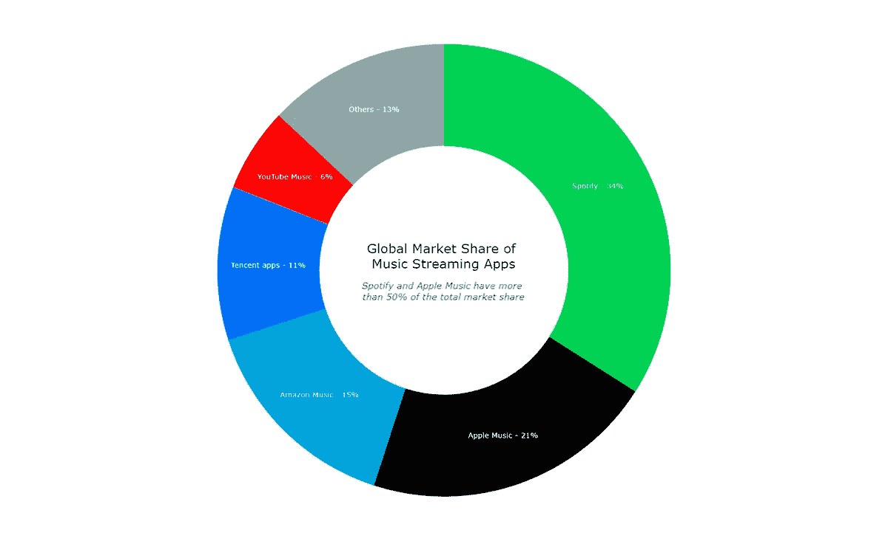
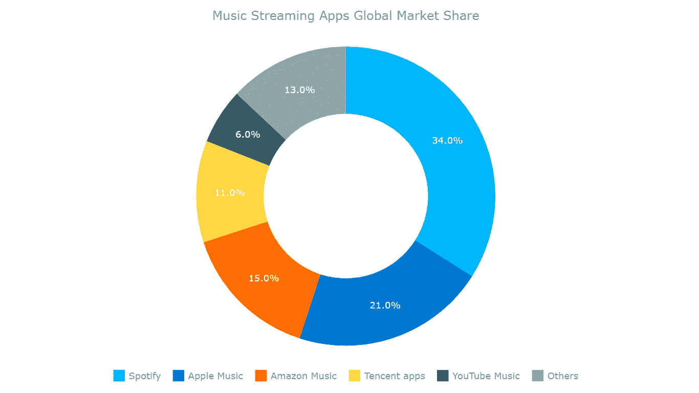
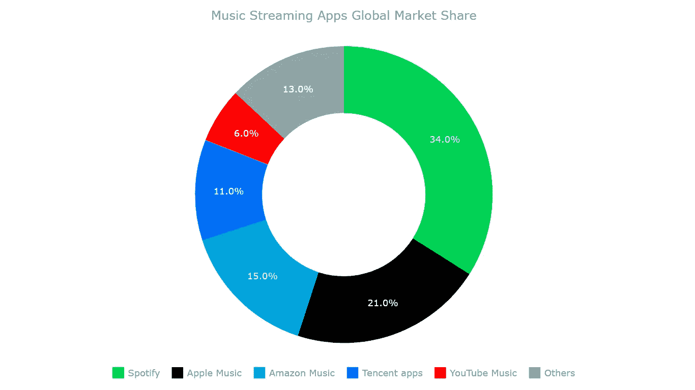
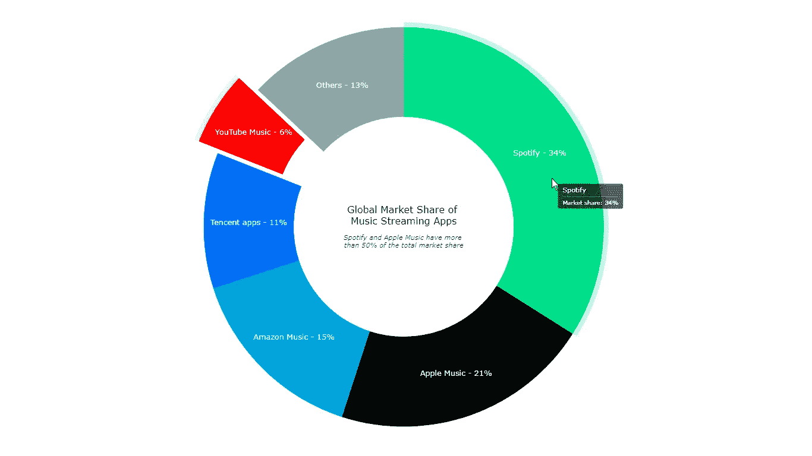

# 如何构建 JavaScript 环形图

> 原文：<https://javascript.plainenglish.io/how-to-build-a-javascript-donut-chart-1b98a62ee2ef?source=collection_archive---------20----------------------->

## 这是一个构建交互式 JavaScript 甜甜圈图的初级教程，通过音乐应用市场数据的可视化来演示


想知道数据设计人员和开发人员如何使用 JavaScript 创建引人注目的圆环图吗？那么你在正确的时间来到了正确的地方。继续学习，你将学会如何轻松地构建一个交互式 JavaScript 甜甜圈图，即使你是一个初学者！

在本教程中，我们将可视化关于顶级在线音乐流媒体平台的全球市场份额的数据。这是一个很好的信息示例，可以很好地用圆环图来表示。

为了确保我们在同一页上，让我们先看看什么是环形图，然后马上开始制作图表！

# 什么是圆环图？

基本上，[甜甜圈图](https://www.anychart.com/chartopedia/chart-type/donut-chart/)(或甜甜圈图)是[饼图](https://www.anychart.com/chartopedia/chart-type/pie-chart/)，中间有一个镂空区域，可以填充附加信息。它们经常被用作可视化分类数据比例的一种方式。

在圆环图中，每个扇区(或块)的大小描述了每个类别所代表的总量。因此，这种类型的数据可视化可以帮助您快速了解变量的比例组成。

根据经验，圆环图图形中显示的类别数量应该限制在少数几个，以保持表示整洁，避免易读性问题。

# JavaScript 圆环图预览

看看 JavaScript 环形图在本教程结束时会是什么样子。而且会互动！



# 构建一个基本的 JavaScript 圆环图

只需四个简单的步骤就可以构建一个漂亮的 JavaScript 环形图。那不是我们最喜欢的音乐吗？

1.  创建一个 HTML 页面。
2.  包括 JavaScript 文件。
3.  添加数据。
4.  写一些 JavaScript 图表代码。

## 1.创建 HTML 页面

我们要做的第一件事是创建一个基本的 HTML 页面，其中包含一个 block 元素，用于保存环形图。

为了稍后在代码中识别这个`<div>`，我们给它一个 id 属性。这次就让它只是“容器”吧。

我们还将`<style>`块中的`width`和`height`参数指定为“100%”，这样环形图就会填满整个页面。

```
<html>
  <head>
    <title>JavaScript Donut Chart</title>
    <style type="text/css">      
      html, body, #container { 
        width: 100%; height: 100%; margin: 0; padding: 0; 
      } 
    </style>
  </head>
  <body>
    <div id="container"></div>
  </body>
</html>
```

## 2.包括 JavaScript 文件

有许多 JavaScript 图表库提供了现成的特性，即使没有太多的技术技能和经验，这些特性也非常有助于快速可视化图表中的数据。其中一些支持开箱即用的圆环图。

在本教程中，我们使用的是 [AnyChart JS 库](https://www.anychart.com)。它是一个轻量级的、强大的、灵活的交互式数据可视化解决方案。AnyChart 对初学者来说也很棒，因为它有广泛而详细的[文档](https://docs.anychart.com)和大量的[图表示例](https://www.anychart.com/products/anychart/gallery/)，并附有源代码，可以在专用的[操场](https://playground.anychart.com)上玩。

因此，作为第二步，让我们从库的 [CDN](https://cdn.anychart.com) 中包含必要的 JavaScript 文件(如果您愿意，也可以下载)。

AnyChart 的 JavaScript 图表库采用模块化系统来确保最佳性能。为了使用它创建一个交互式 HTML5 圆环图，我们需要向 HTML 页面的`<head>`部分添加两个脚本——[核心模块](https://docs.anychart.com/Quick_Start/Modules#core)和[馅饼和圆环模块](https://docs.anychart.com/Quick_Start/Modules#pie_and_doughnut)。

```
<html>
  <head>
    <title>JavaScript Donut Chart</title>
    <script src="https://cdn.anychart.com/releases/8.10.0/js/anychart-core.min.js"></script>
    <script src="https://cdn.anychart.com/releases/8.10.0/js/anychart-pie.min.js"></script>
    <style type="text/css">      
      html, body, #container { 
        width: 100%; height: 100%; margin: 0; padding: 0; 
      } 
    </style>
  </head>
  <body>  
    <div id="container"></div>
    <script>
 ***// All the code for the JS donut chart will come here***    </script>
  </body>
</html>
```

## 3.添加数据

圆环图是一种简单的图表类型，它需要简单而有限的数据集。因此，尽管 AnyChart 支持多种加载数据的方式，我们还是会以一种简单的方式直接传递数据。

对于本教程，我决定收集领先的音乐流媒体应用程序的市场份额数据，这些数据是我从应用程序的商业网站收集的。所以，我只是添加它，如下所示:

```
var data = anychart.data.set([
  ['Spotify', 34],
  ['Apple Music', 21],
  ['Amazon Music', 15],
  ['Tencent apps', 11],
  ['YouTube Music', 6],
  ['Others', 13]
]);
```

现在我们已经设置好了一切，让我们通过添加一些 JavaScript 代码来准备查看环形图的形状！基本上，这是相当直观的。

## 4.为我们的圆环图编写 JavaScript 图表代码

我们要做的第一件事是添加一个包含所有代码的函数，确保其中的代码只在页面准备就绪时执行。

使用适当的 JavaScript 库创建圆环图非常简单，在这种情况下，实际上只需要几行代码！

正如我们刚刚了解到的，环形图基本上是一个有洞的饼图，就像一个圆环。因此，我们简单地创建一个饼图实例，并给它一个内径值，使它成为一个圆环图。

```
***// create a pie chart with the data*** var chart = anychart.pie(data)***// set the chart radius making a donut chart*** chart.innerRadius('55%');
```

然后，我们给我们的圆环图一个标题，并在最终绘制结果可视化之前设置容器 id。

```
chart.title('Music Streaming Apps Global Market Share')
chart.container('container');
chart.draw();
```

就这样——一个全功能的基于 JavaScript 的交互式圆环图已经准备好了！这不是绝对容易吗？

请注意，图例是自动创建的。此外，继续点击它的项目或任何一块，看看很酷的交互式甜甜圈切片行为。



JS donut chart — basic

> ***这个基本 JavaScript 甜甜圈图的初始版本及其完整代码可从*** [***AnyChart 游乐场***](https://playground.anychart.com/oGg0sx87/) ***和***[***CodePen***](https://codepen.io/shacheeswadia/pen/eYvJxJQ)***获得。***

这张甜甜圈图清楚地表明，Spotify 是全球领导者，Spotify 和 Apple Music 共同占据了音乐流媒体应用市场的一半以上。

现在，让我们定制我们的圆环图，使它看起来更酷，并以更清晰的方式传达见解。

# 自定义 JavaScript 圆环图

AnyChart 的 JavaScript 库的一个很好的特性是，初始的圆环图构建得非常快，然后有大量的选项来按照我们想要的方式微调图表。

让我们来看看一些有趣的方法，让我们的交互式圆环图更加美观，信息量更大:

1.  更改调色板。
2.  添加标签。
3.  改进工具提示。
4.  向甜甜圈的中心添加细节。

## 1.更改调色板

颜色是使图表看起来更个性化的最简单也是最有效的方法。因为我们在这里代表品牌，所以我们可以将它们的颜色应用于相应数据点的可视化。

这并不复杂，我们只需定义要使用的调色板，并在创建圆环图时将其作为参数传递。

```
***// create a color palette*** var palette = anychart.palettes.distinctColors();

***// set the colors according to the brands*** palette.items([
  { color: '#1dd05d' },
  { color: '#000000' },
  { color: '#00a3da' },
  { color: '#156ef2' },
  { color: '#f60000' },
  { color: '#96a6a6' }
]);***// apply the donut chart color palette*** chart.palette(palette);
```

看看我们的甜甜圈图用品牌颜色看起来怎么样！



JS donut chart — intermediate

> ***此甜甜圈图版本可用***[***any chart 游乐场***](https://playground.anychart.com/G0CdHbBP/) ***和***[***code pen***](https://codepen.io/shacheeswadia/pen/BaWjbdv)***上的代码。***

## 2.添加标签

因为我们的细分市场数量较少，而且每个细分市场都足够大，所以我们可以在环形图的每个部分中添加品牌名称和百分比数字。这将消除对图例的需求。

同样，这非常简单，只需两行额外的 JavaScript 代码就可以完成。

```
***// set the position of labels*** chart.labels().format('{%x} — {%y}%').fontSize(16);

***// disable the legend*** chart.legend(false);
```

## 3.改进工具提示

让工具提示变得清晰和有价值总是一个好主意。在我们的环形图中，只有两点信息:品牌名称和百分比份额。因此，我们可以有一个基本的工具提示，没有任何混乱的信息。

```
chart.tooltip().format('Market share: {%PercentValue}%');
```

## 4.将细节添加到圆环的中心

数据可视化的一个重要方面在于空间利用率。由于圆环图中间是空白的，我们可以用它来显示标题和其他一些信息。

让我们定义一个独立的元素，并将其放置在中心。除了标题，我们还添加了代表我们观察结果的副标题:

```
***// create a standalone label*** var label = anychart.standalones.label();***// configure the label settings*** label
  .useHtml(true)
  .text(
    ‘<span style = “color: #313136; font-size:20px;”>Global Market Share of <br/> Music Streaming Apps</span>’ +
    ‘<br/><br/></br><span style=”color:#444857; font-size: 14px;”><i>Spotify and Apple Music have more <br/>than 50% of the total market share</i></span>’
  )
 .position(‘center’)
 .anchor(‘center’)
 .hAlign(‘center’)
 .vAlign(‘middle’);***// set the label as the center content*** chart.center().content(label);
```

结果如下！



JS donut chart — final

这就是——一个用 JavaScript 构建的又酷又时髦的圆环图！

> ***你可以在下面这里找到这个甜甜圈图的最终代码，或者在*** [***AnyChart 游乐场***](https://playground.anychart.com/vDHOcQQZ/) ***，或者在***[***code pen***](https://codepen.io/shacheeswadia/pen/VwpeRBx)***上找到。***

```
<html>
  <head>
    <title>JavaScript Donut Chart</title>
    <script src="https://cdn.anychart.com/releases/8.10.0/js/anychart-core.min.js"></script>
    <script src="https://cdn.anychart.com/releases/8.10.0/js/anychart-pie.min.js"></script>
    <style type="text/css">      
      html, body, #container { 
        width: 100%; height: 100%; margin: 0; padding: 0; 
      } 
    </style>
  </head>
  <body>  
    <div id="container"></div>
    <script>anychart.onDocumentReady(function () {

 ***// add data***  var data = anychart.data.set([
    ['Spotify', 34],
    ['Apple Music', 21],
    ['Amazon Music', 15],
    ['Tencent apps', 11],
    ['YouTube Music', 6],
    ['Others', 13]
  ]);

 ***// create a pie chart with the data***  var chart = anychart.pie(data);

 ***// set the chart radius making a donut chart***  chart.innerRadius('55%') ***// create a color palette***  var palette = anychart.palettes.distinctColors();

 ***// set the colors according to the brands***  palette.items([
    { color: '#1dd05d' },
    { color: '#000000' },
    { color: '#00a3da' },
    { color: '#156ef2' },
    { color: '#f60000' },
    { color: '#96a6a6' }
  ]); ***// apply the donut chart color palette***  chart.palette(palette);

 ***// set the position of labels***  chart.labels().format('{%x} — {%y}%').fontSize(16);

 ***// disable the legend***  chart.legend(false);

 ***// format the donut chart tooltip***  chart.tooltip().format('Market share: {%PercentValue}%'); ***// create a standalone label***  var label = anychart.standalones.label(); ***// configure the label settings***  label
    .useHtml(true)
    .text(
      '<span style = "color: #313136; font-size:20px;">Global Market Share of <br/> Music Streaming Apps</span>' +
      '<br/><br/></br><span style="color:#444857; font-size: 14px;"><i>Spotify and Apple Music have more <br/>than 50% of the total market share</i></span>'
    )
    .position('center')
    .anchor('center')
    .hAlign('center')
    .vAlign('middle');

 ***// set the label as the center content***  chart.center().content(label);

 ***// set container id for the chart***  chart.container('container');

 ***// initiate chart drawing***  chart.draw();}); </script>
  </body>
</html>
```

# 结论

在本教程中，我们看到了创建和定制一个交互式 JavaScript 圆环图是多么的快速和简单。这是构建最简单的图表之一，因此在开始学习 web 数据可视化时，这是一个很好的选择。

如果您想进一步改进我们刚刚制作的圆环图，或者根据您自己的需要创建一个完全不同的圆环图，请查看[圆环图文档](https://docs.anychart.com/Basic_Charts/Doughnut_Chart)，不要错过[圆环图示例](https://www.anychart.com/products/anychart/gallery/Pie_and_Donut_Charts/)来获取灵感。也欢迎您查看 AnyChart JavaScript 数据可视化库中支持的其他[图表类型](https://docs.anychart.com/Quick_Start/Supported_Charts_Types)。

如果您对构建或使用圆环图或任何与数据可视化相关的问题有任何疑问，请告诉我，我会尽最大努力做出回应并提供帮助。

那就继续吧，开始制作不同的图表，坚持听音乐——两者都对创造力有好处！

AnyChart 感谢 Shachee Swadia 制作了这个令人惊叹的 JavaScript 甜甜圈图教程。

***如果您想为我们的博客创建一个酷炫的客座博文，请*** [***与我们联系***](https://www.anychart.com/support/) ***与我们一起讨论吧。* *参见其他***[***JavaScript 制图教程***](https://www.anychart.com/blog/category/javascript-chart-tutorials/) ***。***

*原载于 2021 年 7 月 6 日 https://www.anychart.com**[*。*](https://www.anychart.com/blog/2021/07/06/donut-charts-javascript/)*

*更多内容请看*[***plain English . io***](http://plainenglish.io/)