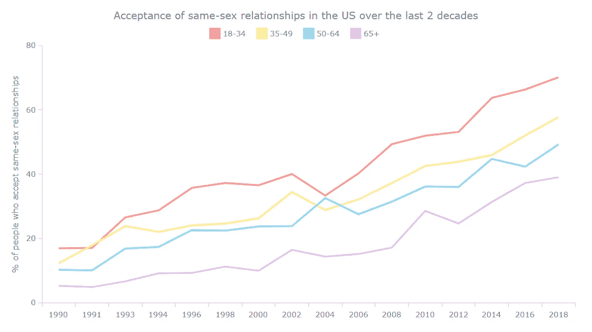
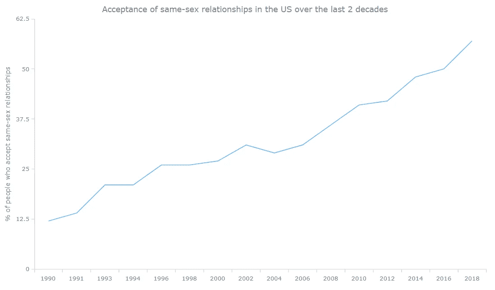
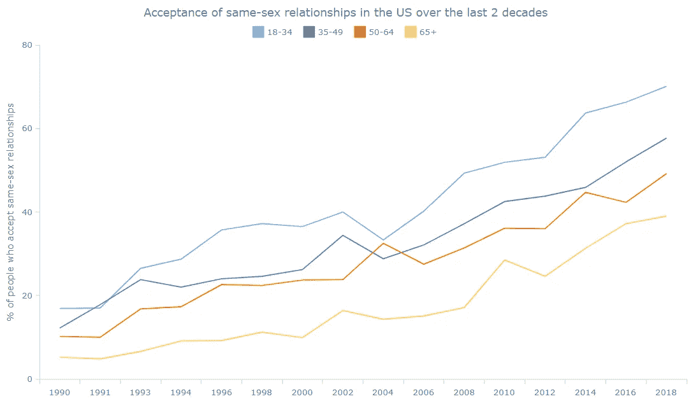
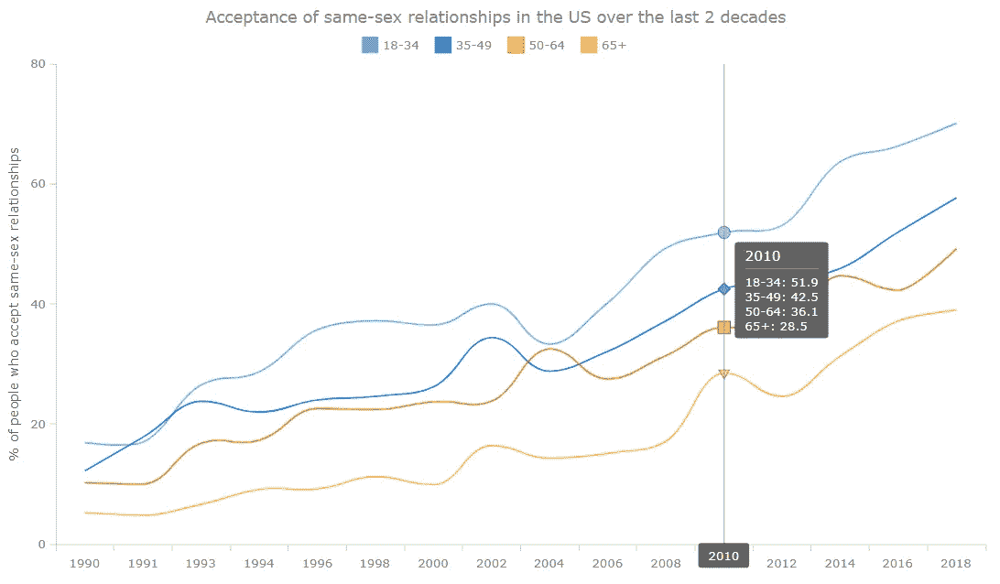
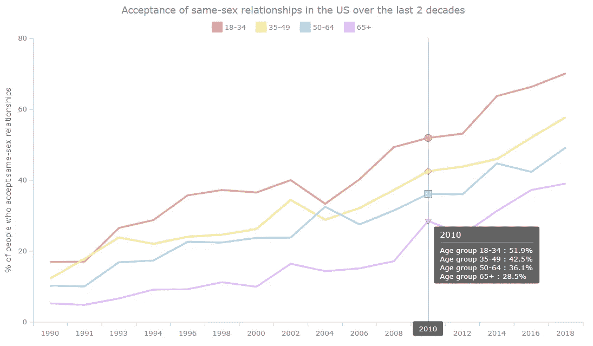

# 如何构建 JavaScript 折线图

> 原文：<https://javascript.plainenglish.io/how-to-build-a-javascript-line-chart-1258b98c632e?source=collection_archive---------16----------------------->

## 创建交互式 JS 折线图的分步教程


**一张** [**折线图**](https://www.anychart.com/chartopedia/chart-type/line-chart/) **是** [**数据可视化**](https://www.anychart.com/blog/2018/11/20/data-visualization-definition-history-examples/) **的基本和最常用的技术之一。众所周知，这种图形提供了一个或几个变量随时间变化的信息。现在，我将解释如何使用 JavaScript 轻松创建一个很酷的交互式折线图！**

这一过程将借助令人信服的示例来演示，您可以在以后使用这些示例来磨练您新的数据可视化开发技能。

为了让您阅读和学习这篇文章时特别激动人心，我决定展示折线图在现实世界数据中的实际应用。六月被庆祝为“骄傲月”,我认为看到人们对同性恋者的态度在最近几年发生了怎样的变化会很棒。然后我从综合社会调查(GSS)中发现了有趣的民意数据，这是芝加哥大学全国民意研究中心(NORC)的一个项目，看起来很适合，并在本指南中将其部分可视化。

所以，跟着教程走，你也将能够探索在过去的二十年里，美国在接受同性关系方面的转变！我们将首先创建一个单系列 JS 折线图，代表总趋势，然后创建一个多系列 JS 折线图，以可视化按年龄组的细分。

上船啦

# JS 折线图预览

在我们开始之前，先来看看预览吧！这是我们在本数据可视化教程结束时用 JavaScript 构建的漂亮的折线图。此外，它将是互动的，很容易嵌入任何网页或应用程序！



看着这张彩色的图表，对未来的前景感到乐观，这种感觉不是很棒吗？

从头到尾一步一步地阅读这个教程，你将学会如何用很少的代码轻松地生成这样一个线图。

# 用 4 个简单的步骤构建一个基本的 JavaScript 折线图

JavaScript 图表中可视化数据的正常顺序可以分为四个基本步骤，构建 JS 折线图遵循相同的模式:

1.  创建一个基本的 HTML 页面来显示图表。
2.  包括我们需要的所有 JS 脚本。
3.  为图表添加数据。
4.  编写 JS 图表代码。

现在，让我们深入研究每一个步骤，马上画出我们的折线图。

## 1.创建基本的 HTML 页面

首先，我们为折线图创建一个带有`<div>`块元素的基本 HTML 页面。为了在后面的代码中引用这个 block 元素，我们给它一个 id 属性，比如“container”。

```
<html>
  <head>
    <title>JavaScript Line Chart</title>
    <style type="text/css">      
      html, body, #container { 
        width: 100%; height: 100%; margin: 0; padding: 0; 
      } 
    </style>
  </head>
  <body>
    <div id="container"></div>
  </body>
</html>
```

这里，我们为`<div>`提供 100%的宽度和高度，以便在全屏上呈现折线图。但这不是必须的，当然可以根据你的要求定制。

## 2.包括所有的 JS 脚本

第二步是引用所有必要的脚本来构建 JS 折线图。这些脚本将放在`<head>`部分的`<script>`标签中。

在本教程中，折线图是用 [AnyChart](https://www.anychart.com/) 构建的。这是一个轻量级和灵活的 JavaScript (HTML5)图表库，具有详细的[文档](https://docs.anychart.com/)和 [API 参考](https://api.anychart.com)。此外，还有大量的[图表示例](https://www.anychart.com/products/anychart/gallery/)可供查看并用作起点，还有一个名为 [Playground](https://playground.anychart.com/) 的实用程序可用于试验代码。

由于折线图是基本图表类型之一，所以只需要 AnyChart 的[基础](https://docs.anychart.com/Quick_Start/Modules#base)模块。我们可以很容易地从 [CDN](https://cdn.anychart.com) 中获得。JS 折线图代码本身将被写在`<body>`部分内的`<script>`标签中。

```
<html>
  <head>
    <title>JavaScript Line Chart</title>
    <script src="https://cdn.anychart.com/releases/8.10.0/js/anychart-base.min.js"></script>
    <style type="text/css">      
      html, body, #container { 
        width: 100%; height: 100%; margin: 0; padding: 0; 
      } 
    </style>
  </head>
  <body>  
    <div id="container"></div>
    <script>
 ***// All the code for the JS line chart will come here***    </script>
  </body>
</html>
```

## 3.添加数据

在本教程中，我们将可视化来自 [GSS 数据浏览器](https://gssdataexplorer.norc.org/trends/Gender%20&%20Marriage?measure=homosex)的数据，即显示“同性成年人发生性关系是错误的吗？”这个问题的答案的分解的数据在 1990 年至 2018 年间随着时间的推移发生了变化。也就是说，我们将表示“一点也没错”的回答的百分比，这看起来是一个很好的接受指标。

AnyChart 支持多种选项将数据加载到图表中。我们的折线图的数据集非常简单，一点也不大。所以我们可以简单地将它包含在代码本身中。

为此，我们创建了一个返回数据的函数，将数据保存为一个单独的代码块。

```
function getData() {
  return [
    ['1990',12],
    ['1991',14],
    ['1993',21],
    ['1994',21],
    ['1996',26],
    ['1998',26],
    ['2000',27],
    ['2002',31],
    ['2004',29],
    ['2006',31],
    ['2008',36],
    ['2010',41],
    ['2012',42],
    ['2014',48],
    ['2016',50],
    ['2018',57]
  ];
}
```

所有准备工作都已完成，现在是时候用几行 JavaScript 代码创建折线图了！

## 4.编写 JS 线条图表代码

首先，我们添加一个函数，其中包含了创建预期的交互式折线图所需的所有 JavaScript 代码。这确保了其中的代码只有在页面全部加载后才会执行。

我们通过调用在上一步中创建的函数来设置数据，然后映射数据以指示每个数据点的第一个参数是 X 值，第二个参数是 Y 值。接下来，我们调用`line()`函数来创建 JS 折线图。

```
***// create a data set on our data*** var dataSet = anychart.data.set(getData());***// map data for the line chart,
// take x from the zero column and value from the first column*** var seriesData = dataSet.mapAs({ x: 0, value: 1 });***// create a line chart*** var chart = anychart.line();
```

现在，我们为折线图和 Y 轴设置标题。

```
***// configure the chart title text settings*** chart.title('Acceptance of same-sex relationships in the US over the last 2 decades');***// set the y axis title*** chart.yAxis().title('% of people who accept same-sex relationships');
```

最后，我们将映射的数据加载到折线图中，设置容器 id，并绘制图形。

```
***// create a line series with the mapped data*** var lineChart = chart.line(seriesData);***// set the container id for the line chart*** chart.container('container');***// draw the line chart*** chart.draw();
```

瞧啊。一个实用的、交互式的、基于 JavaScript 的折线图创建出来了！这很快也很简单，不是吗？

**看看下面的结果，非常欢迎你在** [**AnyChart 游乐场**](https://playground.anychart.com/AMYKy0zt/) **上看到这个图表并玩它的代码。**



[https://playground.anychart.com/AMYKy0zt/](https://playground.anychart.com/AMYKy0zt/)

这个折线图告诉我们什么？我们可以清楚地看到随着时间的推移发生的积极变化，以及在 1990 年至 2018 年期间，美国对同性关系的接受度是如何逐渐增加的，只有几次轻微的停顿。

但是不要离开！虽然这个图表看起来已经很好了，但它只是我们能够负担得起的 JS 折线图的一个非常基础的版本。只需要再多几个步骤就可以增加功能和交互性。

现在，准备好做一个惊人的多线图表，将可视化按年龄细分！

# 创建交互式多系列 JS 折线图

当存在分离的数据时，我们使用多系列折线图将每个部分表示为单独的线条。来看看是怎么做的吧！

基本代码保持不变。但我们将创建多个系列，而不是一个系列。当然，这些数据将包含每年的多个数据点，因为我们将“一点都没错”的总百分比按年龄组进行了细分:18-34 岁、35-49 岁、50-64 岁和 65 岁以上。

```
function getData() {
  return [
    ['1990',16.9,12.2,10.2,5.2],
    ['1991',17,17.8,10,4.8],
    ['1993',26.5,23.8,16.8,6.6],
    ['1994',28.7,22,17.3,9.1],
    ['1996',35.7,24,22.6,9.2],
    ['1998',37.2,24.6,22.4,11.2],
    ['2000',36.5,26.2,23.7,9.9],
    ['2002',40,34.4,23.8,16.4],
    ['2004',33.3,28.8,32.5,14.3],
    ['2006',40.2,32.1,27.5,15.1],
    ['2008',49.3,37.2,31.4,17.1],
    ['2010',51.9,42.5,36.1,28.5],
    ['2012',53.1,43.8,36,24.6],
    ['2014',63.7,45.9,44.7,31.3],
    ['2016',66.3,52,42.3,37.2],
    ['2018',70.1,57.7,49.2,39]
  ];
}
```

我们需要为每个系列创建不同的数据映射。

```
***// map data for the first series,
// take x from the zero column and value from the first column*** var firstSeriesData = dataSet.mapAs({ x: 0, value: 1 });***// map data for the second series,
// take x from the zero column and value from the second column*** var secondSeriesData = dataSet.mapAs({ x: 0, value: 2 });***// map data for the third series,
// take x from the zero column and value from the third column*** var thirdSeriesData = dataSet.mapAs({ x: 0, value: 3 });

***// map data for the fourth series,
// take x from the zero column and value from the fourth column*** var fourthSeriesData = dataSet.mapAs({ x: 0, value: 4 });
```

然后，我们将这些系列中的每一个链接到不同的行，并根据分段为每个系列命名。

```
***// create the first series with the mapped data*** var firstSeries = chart.line(firstSeriesData);
firstSeries.name('18-34');***// create the second series with the mapped data*** var secondSeries = chart.line(secondSeriesData);
secondSeries.name('35-49');***// create the third series with the mapped data*** var thirdSeries = chart.line(thirdSeriesData);
thirdSeries.name('50-64');

***// create the fourth series with the mapped data*** var fourthSeries = chart.line(fourthSeriesData);
fourthSeries.name('65+');
```

这里，因为我们在 JS 线图中描绘了多条线，所以我们需要一个图例来帮助识别哪条线代表哪一段。别担心，没什么复杂的。图表图例是由 JS 库自动创建的，我们只需要打开它。

```
***// turn the legend on*** chart.legend().enabled(true);
```

**就是这样！通过这些简单的修改，我们得到了一个用 JavaScript 构建的漂亮的多系列折线图！也可以在** [**AnyChart 游乐场**](https://playground.anychart.com/1tvaNdD6/) **上观看并进一步玩。**



[https://playground.anychart.com/1tvaNdD6/](https://playground.anychart.com/1tvaNdD6/)

同样，我们可以清楚地了解所有年龄组，尤其是年轻一代的总体趋势是积极的。

# 定制多系列 JS 折线图设计

多系列折线图看起来很棒，但我们可以通过一些定制让它更棒！AnyChart 在这方面很棒，因为它提供了大量现成的选项，允许您像这样轻松地修改 JS (HTML5)图表。

因此，让我们做一些快速的调整，以便更深入地了解数据。

## 1.平滑线条

正如我们所见，目前形成的线条在连接处很清晰，给人一种更具几何感的感觉。在 AnyChart JS 库中，我们在将数据与系列链接时，只需用“spline”替换“line”就可以得到更平滑的线条。

```
***// create the first series with the mapped data*** var firstSeries = chart.spline(firstSeriesData);
firstSeries.name('18-34');***// create the second series with the mapped data*** var secondSeries = chart.spline(secondSeriesData);
secondSeries.name('35-49');***// create the third series with the mapped data*** var thirdSeries = chart.spline(thirdSeriesData);
thirdSeries.name('50-64');

***// create the fourth series with the mapped data*** var fourthSeries = chart.spline(fourthSeriesData);
fourthSeries.name('65+');
```

经过这些简单的修改，我们的折线图变成了[样条图](https://www.anychart.com/chartopedia/chart-type/spline-chart/)！

## 2.在悬停时为每个数据点添加十字准线

因为我们的可视化中的线条现在是平滑的，所以当查看者悬停在线条上时显示十字准线可以提高可读性。自定义十字准线行为也很容易。在这种情况下，例如，让我们只保留 X 轴连接器和标签。

```
***// turn on the crosshair*** chart.crosshair().enabled(true).yLabel(false).yStroke(null);
```

**用十字准线查看交互式 JavaScript 样条图！在** [**AnyChart 游乐场**](https://playground.anychart.com/7l7UhiWw) **有售。**



[https://playground.anychart.com/7l7UhiWw](https://playground.anychart.com/7l7UhiWw)

> 最后，对于这个 JS 折线图教程的最后一个图表，让我们用直线代替平滑的曲线。但我们还是会保留十字准线。

## 3.改进 JS 折线图工具提示

为了让折线图工具提示提供更多信息，我们将数字显示为百分比值，分段显示为年龄组。

这可以简单地通过为每个行系列中的工具提示设置`format()`功能来完成。下面是第一个例子:

```
firstSeries
  .tooltip()
  .format("Age group 18-34 : {%value}%");
```

## 4.改变颜色和其他美学

因为这个基于 JavaScript 的折线图讨论了同性关系，所以我们可以用骄傲的颜色来表示线条。这使得图表看起来更个性化，更好地代表了主题。

让我们把线条变粗一点，这样看起来更明显。使用每个系列设置中的`stroke`属性，可以同时修改颜色和线宽。像这样:

```
firstSeries
  .stroke('3 #f49595')
```

最后，我们添加了一个简单的动画来活跃折线图，这也很容易，因为 JavaScript 库已经将它作为一个预构建的特性。

```
***// turn on the line chart animation*** chart.animation(true);
```

结束了。一个令人瞠目结舌的交互式 JavaScript 折线图已经完成！

**为了您的方便，最终的 HTML/CSS/JS 折线图代码在可视化下方。不要犹豫，在** [**或**](https://playground.anychart.com/4L1XeREM/) **上查看任意图表，并应用您的数据和其他更改。**



[https://playground.anychart.com/4L1XeREM/](https://playground.anychart.com/4L1XeREM/)

```
<html>
  <head>
    <title>JavaScript Line Chart</title>
      <script src="https://cdn.anychart.com/releases/8.10.0/js/anychart-base.min.js"></script>
      <style type="text/css">      
        html, body, #container { 
          width: 100%; height: 100%; margin: 0; padding: 0; 
        } 
      </style>
    </head>
    <body>  
      <div id="container"></div>
      <script>anychart.onDocumentReady(function () { ***// create a data set on our data***  var dataSet = anychart.data.set(getData());

 ***// map data for the first series,
  // take x from the zero column and value from the first column***  var firstSeriesData = dataSet.mapAs({ x: 0, value: 1 }); ***// map data for the second series,
  // take x from the zero column and value from the second column***  var secondSeriesData = dataSet.mapAs({ x: 0, value: 2 });

 ***// map data for the third series,
  // take x from the zero column and value from the third column***  var thirdSeriesData = dataSet.mapAs({ x: 0, value: 3 });

 ***// map data for the fourth series,
  // take x from the zero column and value from the fourth column***  var fourthSeriesData = dataSet.mapAs({ x: 0, value: 4 }); ***// create a line chart***  var chart = anychart.line(); ***// turn on the line chart animation***  chart.animation(true);

 ***// configure the chart title text settings***  chart.title('Acceptance of same-sex relationships in the US over the last 2 decades'); ***// set the y axis title***  chart.yAxis().title('% of people who accept same-sex relationships');

 ***// turn on the crosshair***  chart.crosshair().enabled(true).yLabel(false).yStroke(null); ***// create the first series with the mapped data***  var firstSeries = chart.line(firstSeriesData);
  firstSeries
    .name('18-34')
    .stroke('3 #f49595')
    .tooltip()
    .format("Age group 18-34 : {%value}%");

 ***// create the second series with the mapped data***  var secondSeries = chart.line(secondSeriesData);
  secondSeries
    .name('35-49')
    .stroke('3 #f9eb97')
    .tooltip()
    .format("Age group 35-49 : {%value}%"); ***// create the third series with the mapped data***  var thirdSeries = chart.line(thirdSeriesData);
  thirdSeries
    .name('50-64')
    .stroke('3 #a8d9f6')
    .tooltip()
    .format("Age group 50-64 : {%value}%");

 ***// create the fourth series with the mapped data***  var fourthSeries = chart.line(fourthSeriesData);
  fourthSeries
    .name('65+')
    .stroke('3 #e2bbfd')
    .tooltip()
    .format("Age group 65+ : {%value}%"); ***// turn the legend on***  chart.legend().enabled(true); ***// set the container id for the line chart***  chart.container('container');

 ***// draw the line chart***  chart.draw();});function getData() {
  return [
    ['1990',16.9,12.2,10.2,5.2],
    ['1991',17,17.8,10,4.8],
    ['1993',26.5,23.8,16.8,6.6],
    ['1994',28.7,22,17.3,9.1],
    ['1996',35.7,24,22.6,9.2],
    ['1998',37.2,24.6,22.4,11.2],
    ['2000',36.5,26.2,23.7,9.9],
    ['2002',40,34.4,23.8,16.4],
    ['2004',33.3,28.8,32.5,14.3],
    ['2006',40.2,32.1,27.5,15.1],
    ['2008',49.3,37.2,31.4,17.1],
    ['2010',51.9,42.5,36.1,28.5],
    ['2012',53.1,43.8,36,24.6],
    ['2014',63.7,45.9,44.7,31.3],
    ['2016',66.3,52,42.3,37.2],
    ['2018',70.1,57.7,49.2,39]
  ];
}
```

# 结论

折线图是一种非常实用的数据可视化形式。它使用得相当频繁。所以我想你会很想知道如何轻松地创建折线图。使用像 AnyChart 这样的 JavaScript 图表库是一种方便的方式，不仅可以快速创建美观和信息丰富的折线图，还可以添加一些自定义项，以非常简单的方式定制可视化效果以满足您的特定需求。

如需了解如何构建和个性化 JS 折线图，请参阅[折线图文档](https://docs.anychart.com/Basic_Charts/Line_Chart)。此外，不要错过查看这些[折线图示例](https://www.anychart.com/products/anychart/gallery/Line_Charts/)以获取灵感。

如果您对本教程中构建的 JavaScript 折线图，或者是一般的[折线图类型](https://www.anychart.com/chartopedia/chart-type/line-chart/)或者是您不知道如何实现的特定功能有任何疑问，请将它们留在评论中，我会尽我所能提供及时的回复。

让我们都为我们是谁而自豪，并将此图表添加到数据可视化开发技能集中来炫耀！

***any Chart 团队感谢自由数据设计师 Shachee Swadia 贡献了这篇出色的 JS 折线图教程。***

[***如果你想为我们的博客创建一个很酷的客座博文，请联系我们。***](https://www.anychart.com/support/)

***查看其他*** [***JavaScript 制图教程***](https://www.anychart.com/blog/category/javascript-chart-tutorials/) ***。***

*原载于 2021 年 7 月 28 日*[***anychart.com***](https://www.anychart.com/blog/2021/07/28/line-chart-js/)*。*

*更多内容请看*[***plain English . io***](http://plainenglish.io/)