# 如何打造 LinkedIn 的克隆版

> 原文：<https://javascript.plainenglish.io/how-to-build-a-linkedin-clone-683e392ee406?source=collection_archive---------4----------------------->

## 用 React、Redux 和 Firebase 创建一个 LinkedIn 克隆(第 1 部分)


Eyes on the prize: this will be the final result.

你是想让你的开发者技能更上一层楼，还是想给你未来的雇主留下深刻印象？然后打造这个 [**LinkedIn 克隆**](https://linkedin-clone-5ebs.web.app/) **！**

在这个由四部分组成的系列中，我将向您展示如何从头开始构建一个功能完整的 LinkedIn 克隆。如果你卡住了，不要担心！我将在每一节的结尾为您提供完整的代码。此外，在本教程的最后一期中，我将让您访问我的 GitHub 上的完整源代码。

# 在开始之前

在我们开始之前，让我们看一下我们将要使用的技术:

*   [React.js](https://reactjs.org/) —一个用于构建用户界面的 JavaScript 库。
*   [Redux.js](https://redux.js.org/) —管理应用状态的 JavaScript 库。
*   [Material UI](https://material-ui.com/)—React 的顶级用户界面库之一，由 Google 开发。
*   Firebase——一个帮助你创建移动和网络应用的谷歌平台。

对于本教程，我将使用 [Visual Studio 代码](https://code.visualstudio.com/)，但是您可以使用任何代码编辑器。我个人喜欢 VSCode，因为它使编码变得更加容易。

说够了…让我们编码吧！

# 1.设置 React 应用程序

首先，我们将创建并设置一个 React 应用程序。

*   新建一个名为`linkedin-clone` 的文件夹，用 Visual Studio 代码打开。
*   现在您已进入 VSCode，按 Command + ò(在 Mac 上)或 Ctrl + ò(在 Windows 上)打开终端。
*   在终端中键入以下内容并按回车键:`npx create-react-app . --template redux`

通过运行这个脚本，您将使用 [Redux Toolkit](https://redux-toolkit.js.org/introduction/quick-start) 创建并设置一个新的 React 应用程序启动器。该模板利用了 React Redux 与 React 组件的集成。圆点表示我们希望将 React 项目放在同一个文件夹中，而不是为它创建一个新文件夹。

现在让我们清理 React 应用程序启动器，这样我们就可以开始构建 LinkedIn 的克隆。

*   从`public`文件夹中删除这些不相关的文件:`favicon.ico`、`logo192.png`、`logo512.png`和`robots.txt`

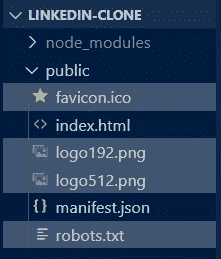

*   从`src` 文件夹:`App.test.js`、`logo.svg`、`setupTest.js`中删除这些无关文件。

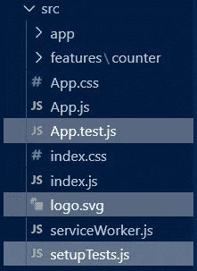

*   转到`App.css`并删除该文件的所有内容。
*   现在转到`index.css`并添加这段代码来删除默认边距:`* {margin: 0}`
*   在`App.js`文件内，移除`<header>`并添加一个简单的`<h1>`。
*   您的`App.js`文件现在应该看起来像这样:

现在我们终于可以在终端中键入`npm start`并启动我们的应用程序了。


React 模板终于设置好了，我们准备好构建克隆了！

# 2.设置 Firebase

我们将使用 Firebase 进行身份验证、托管和作为数据库。

*   在 React 应用中安装以下名为 **firebase** 和 **firebase-tools** 的依赖项。这将使我们能够使用 Firebase 工具。

```
npm install -g firebase-tools && npm install firebase && firebase login
```

*   现在，去 https://firebase.google.com/
*   一旦你进入 Firebase 控制台，点击**添加项目。**

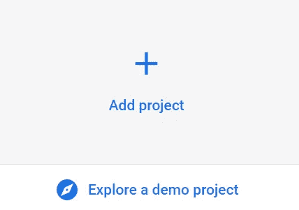

*   为您的项目命名并继续。

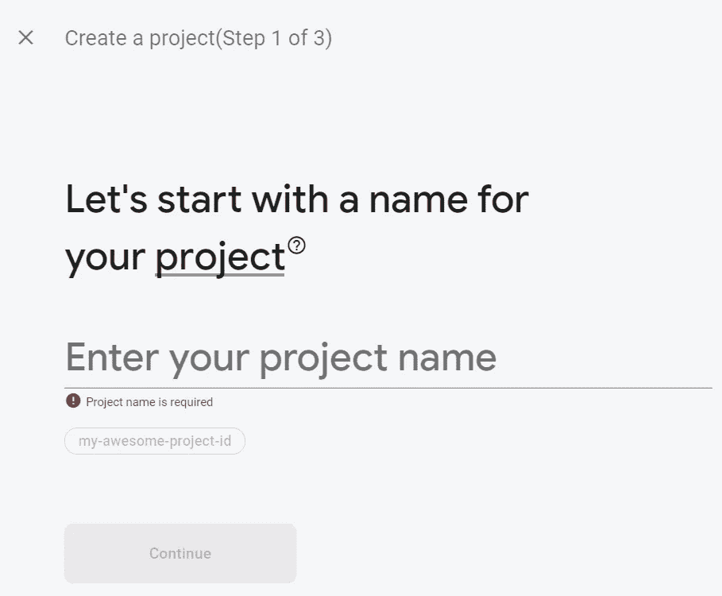

*   如果你愿意，打开谷歌分析，但对于这个项目来说，它不会有任何影响。

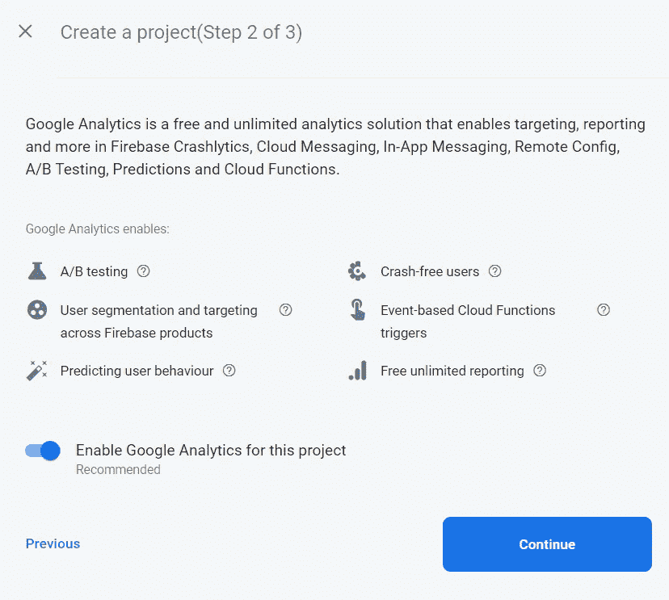

*   一旦你看到下图，Firebase 项目就准备好了。点击**继续。**

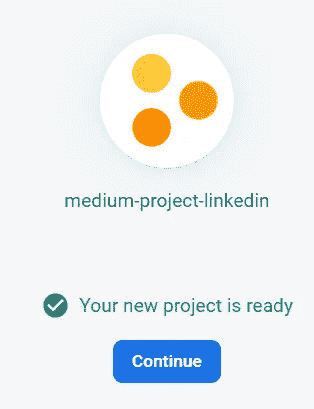

现在，让我们设置这个项目！

*   从面板中，选择**云火商店**。云 Firestore 是一个云托管的 NoSQL 数据库。


*   点击**创建数据库**。
*   在测试模式下选择**开始**，然后选择**。**

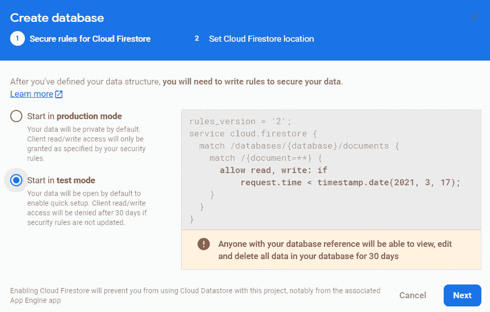

*   位置不重要，继续点击**启用**即可。
*   干得好，你的数据库准备好了！

现在，让我们设置**认证。**

*   从侧面板中，选择**认证。**

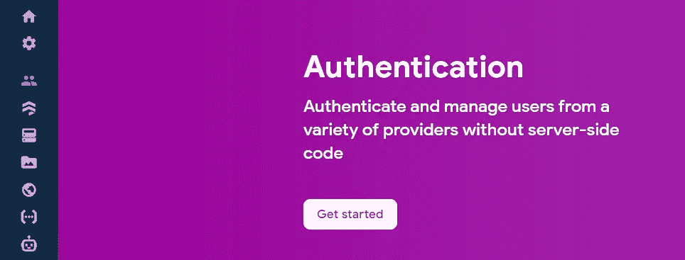

*   选择**设置签到方式。**
*   点击**开始。**
*   在**邮箱/密码的右上角，**点击铅笔图标。

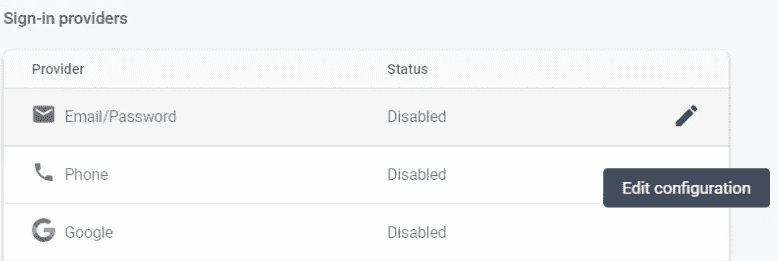

*   启用它并点击**保存**。

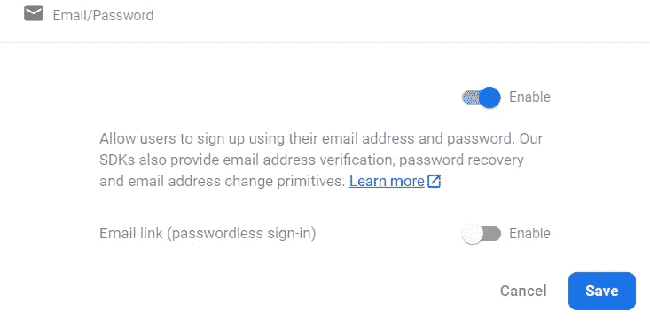

*   很好，您的身份验证设置已经准备好了！

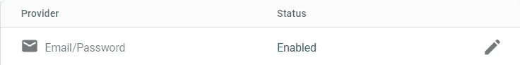

现在，让我们将这个 Firebase 项目连接到我们的 React 应用程序。

*   点击侧面板上的**设置**图标，选择**项目设置。**

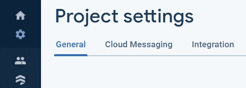

*   向下滚动并点击**/</>图标**


*   输入项目名称并选择“**同时设置 Firebase 托管**”

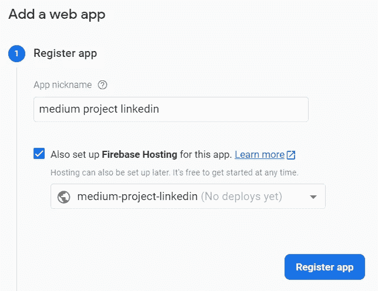

*   点击**下一步**直到你回到控制台。
*   向下滚动并选择**“配置”。**

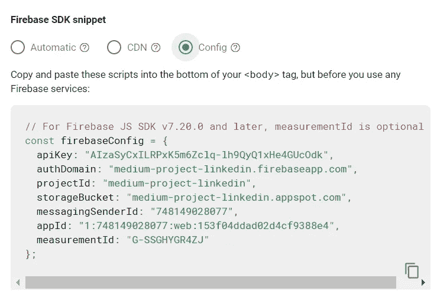

*   复制整个脚本。
*   回到 Visual Studio 代码，创建一个名为`firebase.js`的新文件。
*   将 **Firebase SDK 片段**粘贴到文件中。

让我们总结一下 Firebase 的设置。

*   在`firebase.js`中，导入 firebase。
*   添加以下代码来初始化配置，并从 Firebase 项目中获取数据库和身份验证。

```
const firebaseApp = firebase.initializeApp(firebaseConfig);
const db = firebaseApp.firestore();
const auth = firebase.auth();
export {db, auth}
```

*   您的`firebase.js`文件现在应该类似于下面的(记得使用您自己的配置。):

干得好，Firebase 设置完成了！

# 3.整理文件

我们的 LinkedIn 克隆将由一个标题、一个提要、一个侧栏和一些小部件组成。

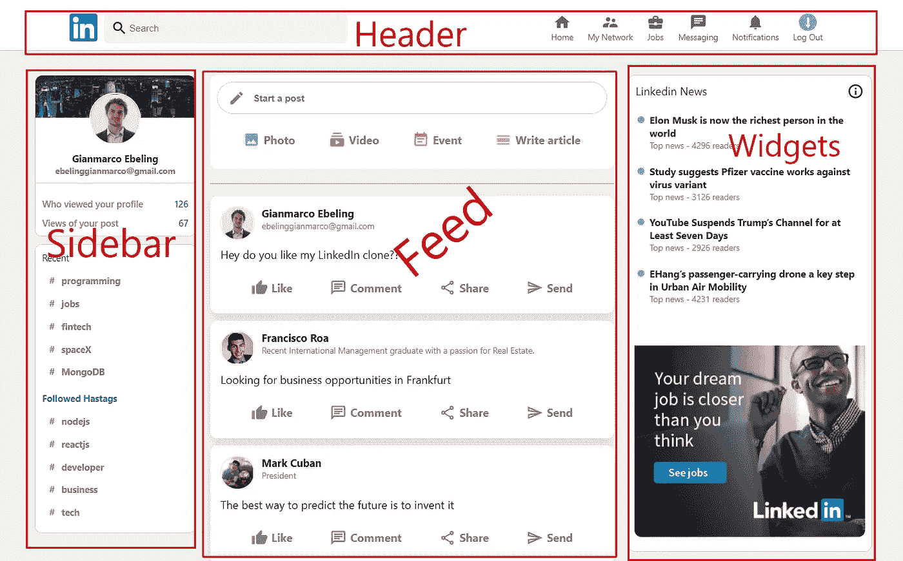

让我们通过在`src` 文件夹中创建一个名为`components`的文件夹来组织我们的环境。在其中，创建另外 5 个文件夹:`Feed` **、**、`Header`、`Login`、`Sidebar`和`Widgets`。

让我们开始建立标题！

# 4.设置标题组件

*   在`Header`文件夹中，创建一个名为`Header.js`的文件。
*   进入文件后，键入`rfce`使用来自 *ES7 片段的片段。*这将创建一个可以导出的 React 组件。
*   仍然在`pages` 文件夹中，制作一个`Header.css`文件，导入到你的`Header.js`组件中。
*   在`Header.js`文件中用`header` *的`classNames`创建一个`<div>` 容器。*这将包含两个`<div>` 子节点，分别带有`header__left`的`classNames`和`header__right`的*。*
*   在`header__left` `<div>` **，**内添加一个`` 标签，该标签将包含 LinkedIn 标志和另一个`<div>`**`header__search`*`className`。***
*   **在`header__search`*`<div>`**内添加一个`<input>` 和一个来自[物料 UI 的`<SearchIcon>`组件。](https://material-ui.com/)*****

*****要渲染图标，我们必须安装材质 UI。*****

*   *****打开终端，键入以下命令:*****

```
***npm install @material-ui/core @material-ui/icons***
```

*   *****现在在`Header.js`文件中导入`<SearchIcon>` 图标:*****

```
***import SearchIcon from "@material-ui/icons/Search";***
```

*   *****至此，您的`Search.js`文件应该如下所示:*****

*   *****为了给我们的`Header.js`组件添加一些样式，打开`Header.css`并添加以下代码:*****

*   *****回到`App.js`文件，导入并渲染**头组件。*******

*****干得好，我们的头部组件的左边部分完成了！*****

*****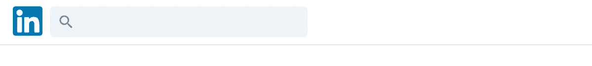*****

# *****结论*****

*****这部分到此为止。让我们总结一下到目前为止我们所做的工作:*****

1.  *****使用 **Redux 工具包设置 React 应用程序。*******
2.  *****为身份验证、数据库和托管设置 Firebase。*****
3.  *****整理了文件。*****
4.  *****构建了标题组件的左边部分。*****

*****在下一篇文章的[中，我们将完成标题，构建侧边栏，并设置提要组件。敬请期待！](/build-a-linkedin-clone-9d22d863805b)*****

******考虑* [***成为一个中等成员***](https://ebelinggianmarco.medium.com/membership)**如果你喜欢看这样的故事，并且想帮助我这个作家。每月 5 美元，你可以无限制地访问媒体内容。如果你通过* [***我的链接注册，我会得到一点佣金。***](https://ebelinggianmarco.medium.com/membership)******