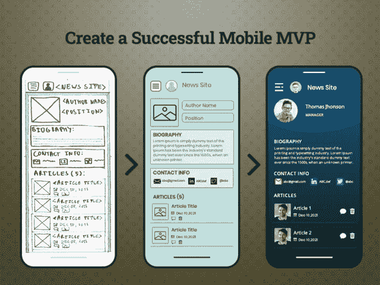
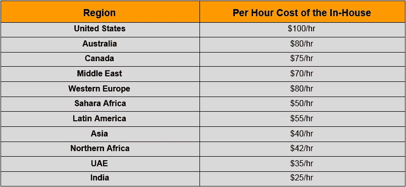
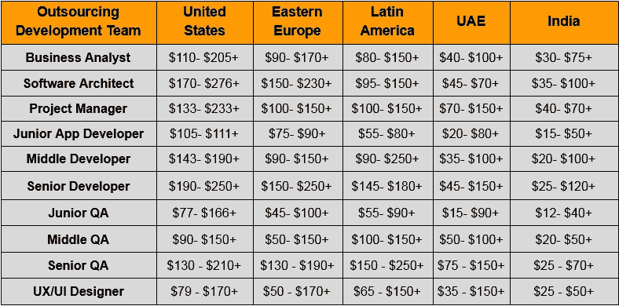

# 2022 年打造一款移动最小可行产品(MVP)需要多少钱

> 原文：<https://javascript.plainenglish.io/how-to-build-a-mobile-minimum-viable-product-mvp-in-2021-6665cec701?source=collection_archive---------5----------------------->

## 如何在 2022 年打造一款手机(MVP)(成本和功能)

对于初创公司、中小企业或领先品牌来说，拥有一个伟大的应用开发创意并以最小的投资用同样的方式处理它是一项具有挑战性的任务。

因此，与其推出成熟的移动应用程序，不如从最小可行产品(MVP)开始是一个完美的解决方案。

> 但现在的中心问题是:2022 年打造一个移动 MVP 需要多少钱？

*“根据* [*调查报告*](https://www.businessofapps.com/news/costs-to-build-a-mobile-mvp/) *，移动 MVP 开发的平均成本可能从 3000 美元到 50000 美元以上不等，这取决于各种因素，如应用程序的复杂性、您为项目指定的应用程序开发团队、开发时间和项目质量。”*

在我们深入计算每个密切影响 MVP 开发成本的参数之前，你们中的许多人可能会问，当初创公司可以用 10，000 美元以上开发他们的应用程序时，他们为什么要投资 MVP 开发？

## **为什么开始使用移动 MVP 很棒**

当开始一个新项目时，即使它已经在你的脑海中完美地计划好了，也不能保证它会像你想象的那样在现实中展开。大多数创业公司忽略了这一事实，只是为了节省成本，他们直接开发一个成熟的应用程序。

这一步的缺点是，应用程序开发过程的最终结果与应用程序的初始愿景不匹配的风险很大。这就是 MVP 帮助你毫无风险地找到通往最终目的地的正确方向的地方。

最小可行产品(MVP)由 [**应用开发公司**](https://www.xicom.ae/services/mobile-app-development/) 创建，具有在真实市场中测试应用想法和设计所需的主要和最认知的功能。MVP 除了次要的功能之外没有什么，因为开发 MVP 的最初目标是收集市场分析。但是，由于你的主要焦点是分析市场反应和真实用户的相关反馈，因此，你必须确定核心功能，并在最短的时间内构建和部署一个原型。

开始使用移动 MVP 是确定您计划在市场上推出的产品的潜力的一种有价值的方法。

> **创业公司使用 MVP 的好处:**

在你为 MVP 雇佣一个应用程序开发人员并投入资源和时间之前，有必要了解一下它能给你带来什么样的回报。

## **1。节省开发时间并确保您选择了正确的市场**

更快的开发流程和更少的资源意味着更低的应用开发成本。此外，你越快推出你的产品并让客户看到它，你就越快找到你的潜在市场，并能够实时扩大应用程序。

在新冠肺炎之后， [**移动应用开发解决方案**](https://www.xicom.ae/services/mobile-app-development/) 正在被大肆宣传，并成为企业的当务之急。世界各地的公司都在利用疫情期间的大规模增长，将他们的风险投资推向新的高度。例如，非接触式交付的概念推动食品交付应用在 2020 年产生了数百万美元的收入。此外，亚马逊的市值去年增长了约 5700 亿美元。

有了这些统计数据和事实，很明显，如果你有一个应用程序的想法，那么现在是测试它的正确时间，因为有些国家仍在继续封锁限制，人们有更多的时间。因此，开发一个移动 MVP 将是一个完美的选择，可以在最短的时间内介绍你的产品，并据此选择市场。

## **2。在早期阶段找到你的目标受众**

如果一个应用程序没有市场，那么开发这个应用程序是没有用的。要让你的应用成功，很简单，你需要找到正确的目标市场。就全球移动应用市场而言，预计从 2020 年到 2027 年，其 CAGR 将增长 11.5%。

因此，可以创建 MVP 方法来帮助您了解您的目标受众是否对这样的产品感兴趣。你可以在初始阶段展示应用创意的潜力，并相应地扩大规模。

## **3。长期盈利决策**

*这是支持创业公司建立 MVP 的最关键因素之一。但是怎么做呢？*

**没有预算消耗:**根据 CBInsights 的报告，28%的初创公司失败是因为他们耗尽了现金。这是 MVP 能够带来的一个核心好处。你可以通过简单地开发一个移动 MVP 来了解应用程序的范围并节省资金，而不是推出一个需要大量预算的成熟应用程序。

**以用户为中心的开发:**创建一个 MVP 应用来了解用户的期望和评论。它将通过简单地收集用户的反馈来帮助你构建一个以用户为中心的应用程序。

**最小化商业风险:**MVP 最大的好处是你可以了解市场，而 34%的创业公司失败是因为他们的产品并不完全适合市场。

## **4。为您的项目吸引额外的融资**

MVP 不仅仅是投资一个简单的想法。拥有一个 MVP 可能是在潜在观众中推广它或吸引公司和个人投资的关键因素。

MVP 这个概念本身有助于你理解它到底会让你付出什么代价。根据上面的陈述，你可以从 3000 美元开始构建移动 MVP，这不足以创建一个有效的产品来帮助你满足终端用户的需求。反过来，创建一个 MVP 的 50，000 美元以上的成本对于初创公司来说是不合理的，因为它只包括这种应用程序的最少功能集。

> 那么，如何计算 2022 年一个移动 MVP 的确切开发成本呢？

# **2022 年开发一个移动 MVP 需要多少钱？**

由于每个企业都有不同的需求，MVP 开发的成本取决于不同的因素。

无论你是一家初创公司还是一家企业，开发一个移动 MVP 的成本始终是每个人都严重关注的问题。然而，许多创始人认为应用开发的成本取决于你在项目中使用的技术类型。嗯，这只是 MVP 发展预算的一部分。更重要的是，开发需要多少时间，项目背后的想法应该是强大的，这都是问题。所以如果企业主真的想创造一个优秀的产品，明智地 [**雇佣应用开发者**](https://www.xicom.ae/solutions/hire-developers/) 是很重要的。

> 因此，以下是雇用开发人员的最佳选择以及成本:

## **选择 1:发展内部技术团队:拥有昂贵预算的专业团队**

许多企业主选择发展内部技术团队，以保持项目透明度和与团队的清晰沟通。毫无疑问，内部开发致力于项目，但是从团队获得质量是你的责任。您的开发人员更加依赖您的命令和指导来实现项目的成功。

这种方法的缺点是成本非常高，并且需要您关注项目的进展。更进一步，当你任命全职员工时，你需要支付房租、电费、月薪等等。如果你希望获得中等水平的移动应用开发服务，你的 MVP 项目需要这样的支出水平:

*   *每月花费 9000 多美元的全栈开发人员。*
*   *一名设计师的月薪为 3500 美元以上。*
*   *一名测试人员每月花费 4500 多美元。*
*   *一个项目经理的月薪是 8500 美元以上。*

因此，任命一个内部应用程序开发团队进行 MVP 开发的总成本约为每月 25，500 美元以上。

> 以下是各地区软件开发人员每小时成本的信息图表:

## **选项 2:外包 MVP 开发团队:专业知识、技能和专业方法**

外包一家软件开发公司来为初创公司创建移动 MVP 可能是一个很好的选择。这就像以两倍或三倍的低价格为你的项目雇佣一个成熟的、高度敬业的、有经验的和熟练的团队。

但是对 IT 公司外包的主要关注是建立信任和让团队参与到项目中来。然而，这两个问题都很容易解决。通过查看 [**软件开发公司**](https://www.xicom.ae/) 的评论、公司网站以及当前的项目，确保您已经对其进行了深入的评估。

> **要开发一个移动 MVP，你需要一个如下所示的团队:**

## **选项 3。雇佣自由职业者:便宜且容易获得**

有很多平台可以让你雇佣来自世界各地的自由职业者。这是开始一个项目最快、最便宜、最容易的方法之一。但是雇佣自由开发人员的真正挑战是他们缺乏对项目的承诺，并且为了满足最后期限，项目的质量很容易受到影响。在 MVP 中，产品质量就是一切。

此外，与自由职业者的协调和沟通是令人严重关切的问题。如果你仍然有兴趣雇佣自由职业者，那么建议从本地人那里雇佣。

*万一你想升级你的应用或者需要修复小 bug，那么雇佣一个全职团队就太好了。让我们考虑一下雇佣一个自由软件开发者的每小时成本:*

*   全栈应用程序开发人员的成本将低于其他两种选择，并且整个项目都需要专家，但相对而言，产品质量比技术专家开发的产品低 2 倍。
*   你需要在项目开始时为线框和 UX/用户界面设计聘请一名专门的设计师。此外，UX/用户界面设计在开发团队的密切配合下得到更好的开发，以避免应用程序的进一步复杂化。
*   为了确保你的应用程序没有错误，你需要一个测试人员贯穿整个开发过程，这将增加成本。

> **简而言之:构建移动 MVP 的最终成本**

当涉及到创业公司移动 MVP 开发的最终计算时，它可能会基于以下因素而有很大差异:

*   开发团队的类型
*   地理定位
*   每小时成本
*   专业水平

所以，当你 [**雇佣一个软件开发人员**](https://www.xicom.ae/services/hire-software-developers/) 时，如果你密切关注这些参数，你就可以轻松控制 MVP 开发的成本。以下是每个选项的最终成本估算:

*   如果你选择为项目雇佣自由职业者，你将花费大约 19，000 美元+。
*   内部应用程序开发团队将花费 25，000 美元以上。
*   同时，MVP 外包应用程序开发团队将花费你 10，000 多美元。

# **影响 MVP App 开发成本的因素**

雇用 MVP 应用程序开发人员只是应用程序 MVP 开发预算的一个主要部分，需要仔细关注，但还有其他因素也是最终定价的一个主要因素。

> 在评估完成应用程序成本的比例时，您还需要考虑以下因素。

*   **MVP 设计**

产品的设计会极大地影响用户体验和项目成本。MVP 移动应用程序开发的成本取决于应用程序设计的复杂性。由于它的 MVP 和你正在向市场介绍产品的概念，因此，保持 UX/UI 设计简单和易于访问。在印度和阿联酋，UX/用户界面设计师的每小时费用从 15 美元到 20 美元不等，而在美国和欧洲分别为 75 美元到 50 美元以上。选择一个简单的用户界面/UX 设计将有助于你保持低成本，并确保良好的用户体验。

*   **特性和功能**

您在 MVP 中添加的特性和功能的数量将决定项目在最后阶段的成本。更多的功能意味着更多的开发时间，这将提高开发成本。所以一定要确定你需要把哪些功能集成到应用中。确保你的 MVP 必须包括 MVP 开发中所有的基本和必备特性。构建基本功能的成本，包括用户登录，个人资料创建，产品列表，购物车，支付集成将花费 5000 美元以上，可以去任何昂贵的价格。

*   **MVP 开发的技术栈**

开发移动应用 MVP 的成本取决于你在项目中使用的技术。从零开始构建 MVP 可能是一种昂贵且耗时的方法，因此雇佣能够与预先定制的解决方案协调并以最低预算开发 MVP 的移动应用程序开发人员是有意义的。专家建议避免在混合环境中使用本机代码来开发特性，因为这会增加开发成本。

# **结论**

在这篇博客的最后，公平地说，确定 MVP 应用程序开发成本不是火箭科学。在确定 MVP 的成本时，您需要知道正确的评估因素，并得到您想要的结果。

聘请一家 [**手机 app 开发公司**](https://www.xicom.ae/services/mobile-app-development/) 更容易得到 MVP 开发的大致估算，得到专家团队打造的产品。然而，这个博客仍然提到了所有的参数，使你能够估计工作范围、团队、应用类型和项目成本。

考虑到所有的市场统计数据，专家对创业公司的意见是，从阿联酋或印度雇佣外包应用开发公司将是一个坚定的决定。

*更多内容尽在*[*plain English . io*](http://plainenglish.io/)