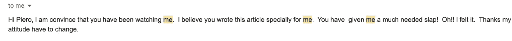
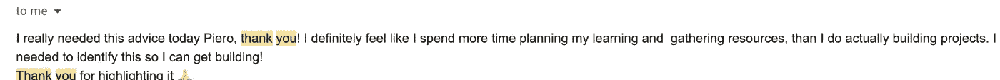

# 作为一名软件开发人员，如何建立一个赚钱的副业

> 原文：<https://javascript.plainenglish.io/how-to-build-a-money-making-side-hustle-writing-as-a-software-developer-22c966bb1ac0?source=collection_archive---------7----------------------->

用技能，买单。

Photo by [Sharon McCutcheon](https://unsplash.com/@sharonmccutcheon?utm_source=medium&utm_medium=referral) on [Unsplash](https://unsplash.com?utm_source=medium&utm_medium=referral)

你坐在金矿上，但你仍然不知道。

事实上，如今做一名程序员已经是一份报酬丰厚的工作了。不过，如果你能把这项技能和另一项技能结合起来，它甚至能让你赚更多的钱。例如，如果你非常擅长编码面试和娱乐大众，为什么不写一本关于这个主题的电子书呢？或者为什么不开始你的播客呢？

就我而言，我的选择是利用我的编码技能来写关于这个行业的文章，我每天都很感激这个选择。写科技文章让我能够支付账单和医疗费用，并保证更好的生活。

因为我写技术文章赚了钱，所以我想讨论一下我如何将这种技能与我的编码知识结合起来，并向您展示如何做同样的事情会很棒。

我们开始吧。

## 偷走观众

作为一个新作者，你会遇到的第一个问题是找到观众。如果没人买，你怎么能卖东西或赚钱呢？

在我的写作经历中，我是从博客开始的。我花了一个月的时间来设置它，还花了无数个小时来制作新的文章。

不幸的是，走这条路是最糟糕的选择。我不能把所有的精力集中在提高我的写作上，因为我不得不一直处理 SEO 和 WordPress 维护。

几个月后，在我关闭博客后，我登陆了 Medium。

我认为我在这个平台上的历史是独一无二的，因为我的第一篇文章非常成功，很快就让我赚了 800 美元。这不是每个作家都会遇到的事情，但我在那一点上完全迷上了 Medium。我看到了这个平台的潜力，一年过去了，我依然热爱它。

媒介已经发生了很大的变化，但对于作家来说，它仍然是一个制作内容并立即赚钱的绝佳场所。你还能在网上的什么地方做到这一点？

另外，科技文章在平台上的阅读率很高。有像 Better Programming，JS in plain English，Toward Data Science 这样的优秀出版物等着你去为它们写作。

一旦你在这里开始写作，你就可以进行第二步了。

## 扩大收入

读者是偶尔会接触你的文章的人，但真正的粉丝是愿意为你的内容付费的人，是你所有材料的忠实追随者。

如果你想比 Medium 更好地利用你的写作技巧，你应该建立一个电子邮件列表，并通过这种方式获得你的第一批真正的粉丝。

您可以使用 ConvertKit 这样的工具，它对多达 1000 个订户是免费的。此时，你要做的很简单:用电子邮件发送清单。
就是这样。每周给你的名单发一两封邮件。制作高质量的内容，免费提供给你的读者。

不要期待任何回报。这里最大的价值是你的读者会告诉你什么。

为什么？因为他们会回复你的邮件，会回答你的调查，你会发现他们的痛点是什么。例如，我创建了一个如何从零开始成为一名开发人员的电子邮件列表。有一次，我发了一封邮件，谈及教程《地狱》，收到了很多这样的回复:

在这一点上，我清楚地意识到许多年轻的开发人员在理解如何学习编码方面存在问题，在这里我产生了一个关于这个主题的小型付费电子书的想法。

在这一点上，有数百种方法可以将你的内容货币化:

*   你可以创建一个包月的专属邮件列表。
*   你可以看看你阅读量最大的文章，然后把它们变成电子书。
*   你可以把你最大的编码技能转化成一本电子书。
*   做一对一辅导是可以拿工资的。
*   你可以在 Teachable 或 Udemy 这样的平台上建立自己的课程。

许多这样的想法也可以产生被动收入，比如创建一门课程或一本电子书。如果你仍然不相信这是可能的，那么看看下面这些关于开发者将他们的技能转化为产品的故事:

 [## 开设了我的第一门课程，赚了 50 多万美元！美国医学协会(American Medical Association)

### 嘿 IH！上周，我提前推出了我的第一门课程，面向 JavaScript 开发者的 CSS。我刚刚结束了预订…

www.indiehackers.com](https://www.indiehackers.com/post/launched-my-first-course-earned-over-us-500-000-ama-4382405cd5)  [## 我是如何从一本书里赚到 4 万美元的…在我出版它之前。

### 在我开始之前，我想声明我将在这篇文章中讨论金钱，但请不要对此进行解读…

medium.com](https://medium.com/@emmabostian/how-i-made-40-000-off-a-book-before-i-even-published-it-4125ac812a94) 

## 如果您不想创建电子邮件列表，可以这样做

建立一个邮件列表需要很多努力，也许你想成为一个临时的创建者。在这种情况下，你仍然可以为专门的在线博客撰写技术文章，赚一大笔钱。

以我的经验来看，我已经为十多个平台写过文章，我的文章的稿费从 250 美元到 550 美元不等，每 1500 字。所以，是的，这是一大笔钱。

如果你想走这条路，我建议你做两件事:

*   订阅媒体。达到 20 篇写得很好的文章的水平，这样你就可以开始从这个平台赚钱，并建立你的写作组合。
*   进入这个网站，查看科技作家的职位空缺。这些演出的需求量非常大，如果你有一个好的作品集，你很快就会找到一个。另外，一旦你获得了一些经验，其他博客就会开始搜索你。
*   享受金钱

## 我的外卖

作为一名开发人员已经是一份非常高薪的工作，但总会有更多的机会。使用一种技能是赚钱的好主意，但是结合两种技能才是制胜之道。所以如果你喜欢写作，就按照我给你的指示去做。你会惊讶地发现，你在网上写作赚的第一美元很容易就会变成成百上千美元。

感谢阅读，
—皮耶罗

**你还想要更多的**？⬇️

## [想学习如何作为一名开发者赚更多的钱并达到财务自由吗？这是我给你的免费指南。](https://tinyurl.com/MoneyDev)

*更多内容请看*[***plain English . io***](http://plainenglish.io)