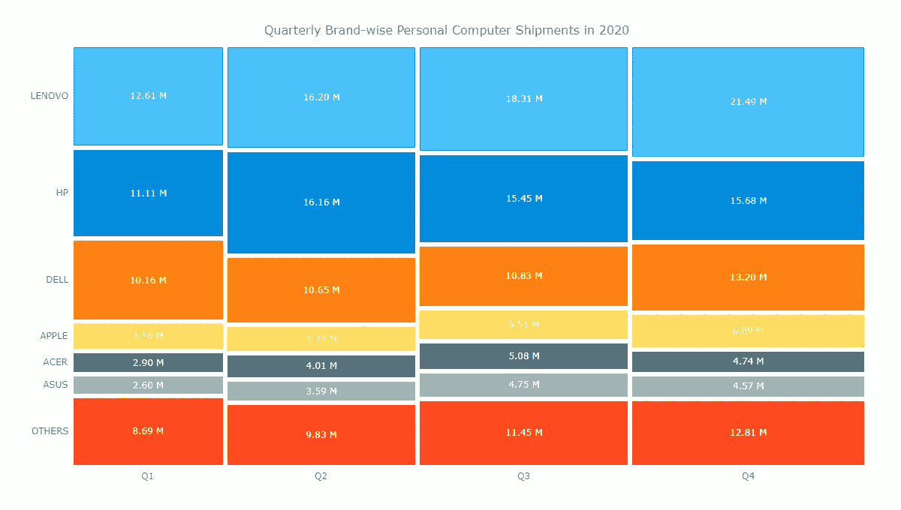

# 如何使用 JavaScript 构建镶嵌图:可视化来自 Gartner 的 2020 年 PC 出货量数据

> 原文：<https://javascript.plainenglish.io/how-to-build-a-mosaic-chart-with-javascript-visualizing-2020-pc-shipments-data-from-gartner-b3218fbfb889?source=collection_archive---------23----------------------->


> **构建交互式 JavaScript 镶嵌图的分步指南。通过可视化 2020 年按品牌划分的季度 PC 出货量数据来说明。**

在当今的场景中，数据可视化是一个很有价值的工具，因为数据无处不在，并且有各种机会来挖掘这些数据以获得洞察力。视觉图表对于交流思想、识别模式和充分利用现有数据是必不可少的。

那么，你想快速简单地学习如何创建一个非常酷的图表来有趣地展示数据吗？

**镶嵌图**是一种多序列图表，它有效地表示了超过 2 个参数的数据，之所以如此，是因为每个数据点都有独特的缩进，使其在视觉上类似于一幅镶嵌艺术品。该图表不仅看起来很漂亮，而且在表示多个变量和识别这些不同变量之间的关系方面也非常有帮助。

2020 年并不全是坏事，至少对个人电脑市场来说是这样。随着越来越多的人在家工作和学习，2020 年**的个人电脑**销量在每个季度都在增长。我根据全球出货量调查了每个品牌在每个季度的表现。

下面是最终的图表，让你兴奋起来！


跟随这个面向前端 web 开发人员和数据 viz 爱好者的快速教程，掌握使用 JavaScript 创建**镶嵌图的窍门。**

# 通过 4 个简单的步骤构建 JavaScript 镶嵌图

镶嵌图可能看起来令人兴奋，但很难创建。然而，用一个 [JavaScript 图表库](https://en.wikipedia.org/wiki/Comparison_of_JavaScript_charting_libraries)创建这个图表是非常简单的，因为它可以消除大量的编码负担，并允许您快速地用最少的技术细节创建一个图表。

对于本教程，我使用的是 [AnyChart JS 库](https://www.anychart.com/)。我选择了 AnyChart，因为它灵活且易于开始。它特别适合初学者，因为有大量的[文档](https://docs.anychart.com/)，以及许多有用的[示例](https://www.anychart.com/products/anychart/gallery/)。

在可视化数据时，具有 HTML 和 JavaScript 等技术的背景是一个优势。尽管如此，使用 JavaScript 库创建交互式图表并不复杂，使用几乎所有支持这种图表类型的 JavaScript 库创建镶嵌图表的步骤也大致相同。

创建 JavaScript 镶嵌图的 4 个基本步骤是:

*   为图表创建 HTML 页面。
*   添加必要的 JavaScript 文件。
*   连接数据。
*   编写绘制图表所需的 JavaScript 代码。

# 1.创建基本的 HTML 页面

首先要做的是创建一个包含图表的基本 HTML 页面。接下来，创建一个 HTML block 元素，为了稍后在代码中识别这个`<div>`，我给它一个 id 属性，比如‘container’

```
<!DOCTYPE html>
<html>
  <head>
    <title>JavaScript Mosaic Chart</title>
    <style type="text/css">
      html,
      body,
      #container {
        width: 100%;
        height: 100%;
        margin: 0;
        padding: 0;
      }
    </style>
  </head>
  <body>  
    <div id="container"></div>
  </body>
</html>
```

我将块的宽度和高度设为 100%,以便图表填充整个页面，但它可以根据您的偏好来指定。

# 2.参考必要的 JavaScript 文件

下一步是添加图表库脚本来创建镶嵌图表。我包含了来自 AnyChart 的 [CDN](https://www.anychart.com/download/cdn/) 的相应文件，因为那是我正在使用的库。当然，这些脚本也可以下载和引用。

对于这个图表，我需要[核心脚本](https://docs.anychart.com/Quick_Start/Modules#core)以及马赛克图表的特定[模块。这里，镶嵌图的模块包含 3 种不同类型的 Marimekko 图，镶嵌图是其中之一。如果你想了解更多关于这些图表和它们的具体特征，请查阅关于 Marimekko 图表](https://docs.anychart.com/Quick_Start/Modules#mekko)的 AnyChart [文档。](https://docs.anychart.com/Basic_Charts/Marimekko_Chart/)

我将这两个脚本都添加到我的 HTML 页面的`<head>`部分。

```
<!DOCTYPE html>
<html>
  <head>
    <title>JavaScript Mosaic Chart</title>
    <script src="https://cdn.anychart.com/releases/8.9.0/js/anychart-core.min.js">
    </script>
    <script src="https://cdn.anychart.com/releases/8.9.0/js/anychart-mekko.min.js">
    </script>
    <style type="text/css">
      html,
      body,
      #container {
        width: 100%;
        height: 100%;
        margin: 0;
        padding: 0;
      }
    </style>
  </head>
  <body>  
    <div id="container"></div>
    <script>
 ***// All the JS code for the mosaic chart will come here.***    </script>
  </body>
</html>
```

# 3.设置数据

我整理了 Gartner[提供的 2020 年每个季度不同个人电脑品牌的销售数据。为了便于创建镶嵌图，我以适合的格式处理了数据，由于数据有限，我直接在代码中添加了数据。](https://www.gartner.com/en/newsroom/press-releases/2021-01-11-gartner-says-worldwide-pc-shipments-grew-10-point-7-percent-in-the-fourth-quarter-of-2020-and-4-point-8-percent-for-the-year)

在这里，我在 X 轴上绘制了季度，并将品牌绘制为单独的图块，因此我在标题数据中添加了品牌，在行中添加了季度数据。

```
<!DOCTYPE html>
<html>
  <head>
    <title>JavaScript Mosaic Chart</title>
    <script src="https://cdn.anychart.com/releases/8.9.0/js/anychart-core.min.js">
    </script>
    <script src="https://cdn.anychart.com/releases/8.9.0/js/anychart-mekko.min.js">
    </script>
    <style type="text/css">
      html,
      body,
      #container {
        width: 100%;
        height: 100%;
        margin: 0;
        padding: 0;
      }
    </style>
  </head>
  <body>  
    <div id="container"></div>
    <script>
      var data = {
        header: [
          '#',
          'LENOVO',
          'HP',
          'DELL',
          'APPLE',
          'ACER',
          'ASUS',
          'OTHERS'
        ],
        rows: [
          ['Q1', 12613,11114,10158,3555,2900,2603,8693],
          ['Q2', 16197,16165,10648,4368,4007,3593,9829],
          ['Q3', 18310,15447,10827,5513,5085,4747,11448],
          ['Q4', 21491,15683,13199,6893,4741,4570,12813]
        ]
      };
    </script>
  </body>
</html>
```

现在我们已经完成了所有的准备工作，让我们进入绘制别致的交互式 JavaScript 镶嵌图的最后一步！

# 4.为您的图表编写 JavaScript 代码

对于没有太多编码经验的人来说，编写代码可能听起来令人生畏，但是请相信我，只需要编写 5 行代码就可以变出一个漂亮的马赛克图表。

在此之前，我添加了一个包含所有代码的函数，确保其中的整个代码只在页面准备就绪时执行。然后，我将数据放入这个函数中。

接下来，我用内置函数创建镶嵌图并设置数据。

最后，我将引用添加到要绘制图表的容器中，设置图表的标题，并开始绘制。

```
<!DOCTYPE html>
<html>
  <head>
    <title>JavaScript Mosaic Chart</title>
    <script src="https://cdn.anychart.com/releases/8.9.0/js/anychart-core.min.js">
    </script>
    <script src="https://cdn.anychart.com/releases/8.9.0/js/anychart-mekko.min.js">
    </script>
    <style type="text/css">
      html,
      body,
      #container {
        width: 100%;
        height: 100%;
        margin: 0;
        padding: 0;
      }
    </style>
  </head>
  <body>  
    <div id="container"></div>
    <script>
      anychart.onDocumentReady(function () {
        var data = {
          header: [
            '#',
            'LENOVO',
            'HP',
            'DELL',
            'APPLE',
            'ACER',
            'ASUS',
            'OTHERS'
          ],
          rows: [
            ['Q1', 12613,11114,10158,3555,2900,2603,8693],
            ['Q2', 16197,16165,10648,4368,4007,3593,9829],
            ['Q3', 18310,15447,10827,5513,5085,4747,11448],
            ['Q4', 21491,15683,13199,6893,4741,4570,12813]
          ]
        }; ***// create a mosaic chart***        var chart = anychart.mosaic(); ***// set chart data***        chart.data(data); ***// set container id for the chart***        chart.container('container'); ***// set the chart title***        chart.title("Quarterly Brand-wise Personal Computer Shipments in 2020 (Thousands of Units)"); ***// initiate chart drawing***        chart.draw();
      });
    </script>
  </body>
</html>
```

你瞧！一个迷人的和功能性的马赛克图表创建！


通过每个季度宽度的增加，您可以立即看到每个季度的出货量是如何增加的。在品牌方面，联想是明显的市场领导者，其销售额逐季增长。此外，我们清楚地看到，联想、惠普和戴尔占据了超过 50%的市场份额。

> **在** [**CodePen**](https://codepen.io/shacheeswadia/pen/LYbvzRJ) **【或者在**[**any chart Playground**](https://playground.anychart.com/xR2Wh65Y/)**】上看一下这个带有完整 JavaScript/CSS/HTML 代码的马赛克图表的初始版本。**

# 自定义镶嵌图表

大多数不错的 JavaScript 图表库都允许您使用它们的 API 定制图表。这些定制可以使您的数据可视化脱颖而出，具有个性化的美感，并改进了您想要传达的信息的表示。

既然已经创建了基本的镶嵌图，下面我将向您展示如何通过一些简单的定制来增强图表在表示数据和调整其外观方面的功能。

# 1.减少单个瓷砖之间的间距

为了改善马赛克的外观，我只用了一行代码就减少了每个点之间的空间。

```
chart.pointsPadding(3);
```

# 2.改进数据标签的显示方式

数据中的数值以千为单位。为了使它更具可读性和更容易理解，我改变了数字的格式，以百万为单位显示数字。我还更新了图表的标题以反映这一修改。

```
***// set the chart labels settings*** chart.labels()
  .format(function(e){
    var value = ((this.value)/1000).toFixed(2);
    return value + " M";
  });...***// set the chart title*** chart.title("Quarterly Brand-wise Personal Computer Shipments in 2020");
```

***你可以在***[***CodePen***](https://codepen.io/shacheeswadia/pen/bGBJYdR)***【或者在***[***any chart Playground***](https://playground.anychart.com/3FLAT707/)***上查看这个中间版本的马赛克图表的全部代码。***



# 3.更改颜色主题并进行其他相关修改

为了使镶嵌图更加个性化，我决定使用不同的调色板。AnyChart 提供了一些很棒的内置[主题](https://docs.anychart.com/Appearance_Settings/Themes)，包括预定义的设置，如图表数据点的颜色以及背景和独特的字体。您也可以创建一个自定义主题，但是对于这个图表，我选择了一个开箱即用的主题，感觉就像是老一代的 PC 屏幕。

我在`<head>`部分添加了主题脚本，然后添加了一行代码来设置镶嵌图的主题。

根据我的偏好，固有的字体大小略小，所以我在样式中指定字体的大小。此外，我希望图表的标题更大，所以我添加了一些代码来修改它。

```
<head>
  <script src="https://cdn.anychart.com/releases/8.9.0/themes/dark_blue.min.js">
  </script>

...

  <style type="text/css">
  #container text {
    font-size: 13px;
  }
  </style>
</head>...<body>
  <script>

 ***// set the chart theme***  anychart.theme('darkBlue');

  </script>
</body>
```

此外，我希望图表的标题更大，所以我添加了一些代码来修改它。

```
***// set the chart title*** chart
  .title()
  .enabled(true)
  .useHtml(true)
  .text("<span style='font-size:16px';>Quarterly Brand-wise Personal Computer Shipments in 2020</span>");
```

啊哈！马赛克图表看起来是不是非常个性化和引人入胜？

# 4.增强工具提示

最后要做的是让工具提示信息更丰富，格式更好。因为这是一个镶嵌图，每个数据点都非常清晰可辨，所以我希望工具提示显示该特定季度的所有数据值。这可以通过指定工具提示的显示模式来实现。

最后，我只是调整了工具提示的外观。

```
***// set union tooltip*** chart.tooltip().displayMode('union');***// enable HTML in tooltips and format*** chart
  .tooltip()
  .useHtml(true)
  .format("<h5 style='font-size:14px; margin: 0.5rem 0;'>{%name}</h5>{%SeriesName}: {%value}{scale:(1000)(1000)|( M)}");
```

就是这样！一个非常吸引人和信息丰富的 JavaScript 镶嵌图已经准备好了。


> **在这里或者在** [**CodePen**](https://codepen.io/shacheeswadia/pen/xxRePQw) **上【或者在**[**any chart Playground**](https://playground.anychart.com/9aRCmwxU/)**】上看看马赛克图的最终代码。**

```
<!DOCTYPE html>
<html>
  <head>
    <title>JavaScript Mosaic Chart</title>
    <script src="https://cdn.anychart.com/releases/8.9.0/js/anychart-core.min.js">
    </script>
    <script src="https://cdn.anychart.com/releases/8.9.0/js/anychart-mekko.min.js">
    </script>
    <script src="https://cdn.anychart.com/releases/8.9.0/themes/dark_blue.min.js">
    </script>
    <style type="text/css">
      html,
      body,
      #container {
        width: 100%;
        height: 100%;
        margin: 0;
        padding: 0;
      }
      #container text {
        font-size: 13px;
      }
    </style>
  </head>
  <body>  
  <div id="container"></div>
    <script>
      anychart.onDocumentReady(function () {
        var data = {
          header: [
            '#',
            'LENOVO',
            'HP',
            'DELL',
            'APPLE',
            'ACER',
            'ASUS',
            'OTHERS'
          ],
          rows: [
            ['Q1', 12613,11114,10158,3555,2900,2603,8693],
            ['Q2', 16197,16165,10648,4368,4007,3593,9829],
            ['Q3', 18310,15447,10827,5513,5085,4747,11448],
            ['Q4', 21491,15683,13199,6893,4741,4570,12813]
          ]
        }; ***// set the chart theme***        anychart.theme('darkBlue'); ***// create a mosaic chart***        var chart = anychart.mosaic(); ***// set points padding***        chart.pointsPadding(3); ***// set chart data***        chart.data(data); ***// set the chart labels settings***        chart.labels()
          .format(function(e){
            var value = ((this.value)/1000).toFixed(2);
          return value + " M";
        }); ***// set union tooltip***        chart.tooltip().displayMode('union'); ***// enable HTML in tooltips and format***        chart
          .tooltip()
          .useHtml(true)
          .format("<h5 style='font-size:14px; margin: 0.5rem 0;'>{%name}</h5>{%SeriesName}: {%value}{scale:(1000)(1000)|( M)}"); ***// set container id for the chart***        chart.container('container'); ***// set the chart title***        chart
          .title()
          .enabled(true)
          .useHtml(true)
          .text("<span style='font-size:16px';>Quarterly Brand-wise Personal Computer Shipments in 2020</span>"); ***// initiate chart drawing***        chart.draw();
      });
    </script>
  </body>
</html>
```

# 结论

如您所见，在图表库的帮助下，构建一个有创意的交互式 JavaScript 镶嵌图并不困难。当然，这只是皮毛，所以继续尝试不同的图表和数据集。还有许多其他的 JavaScript 图表库可以探索，或者如果你愿意，可以在 AnyChart 中查看一些很棒的其他图表类型。

用那个联想或者戴尔(或者你是 Mac 的人？)来创建可视化效果，请在此分享您的创作。当然，如果你有任何问题，让我知道。

经 Shachee Swadia 许可出版。原载于 2021 年 5 月 5 日 [*DZone*](https://dzone.com/articles/how-to-create-a-mosaic-chart-using-javascript) *标题为《如何使用 JavaScript 创建镶嵌图》。*

*在*[*Chartopedia*](https://www.anychart.com/chartopedia/chart-type/mosaic-chart/)*上了解更多镶嵌图表。查看其他* [*JavaScript 制图教程*](https://www.anychart.com/blog/category/javascript-chart-tutorials/) *。*

*如果你想为我们的博客写一篇有趣的客座博文，请* [*联系我们*](https://www.anychart.com/support/) *。*

*原载于 2021 年 5 月 11 日 https://www.anychart.com*[](https://www.anychart.com/blog/2021/05/11/mosaic-chart-js/)**。**

**更多内容请看*[*plain English . io*](http://plainenglish.io/)*