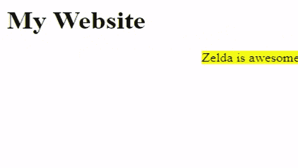
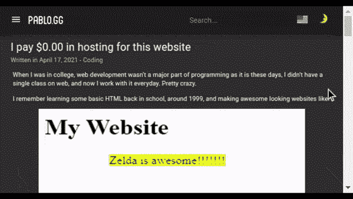

# 如何用 0.00 美元的托管预算建立一个多语言博客

> 原文：<https://javascript.plainenglish.io/how-to-build-a-multi-language-blog-with-a-0-00-hosting-budget-5f5051d5325b?source=collection_archive---------20----------------------->

## 如何使用盖茨比建立一个带有离线搜索、多语言、评论系统和谷歌照片的博客。


Photo by [NeONBRAND](https://unsplash.com/@neonbrand?utm_source=medium&utm_medium=referral) on [Unsplash](https://unsplash.com?utm_source=medium&utm_medium=referral)

> 您也可以在我的博客上阅读以下帖子:[我为这个网站支付了 0 美元的托管费| pablo.gg](https://pablo.gg/en/blog/coding/i-pay-0-in-hosting-for-this-website/)

当我在大学的时候，网络开发不是编程的主要部分，不像现在。我没有一门关于网络开发的课程，现在我每天都在学习。相当疯狂。

我记得大约在 1999 年在学校里学过一些基本的超文本标记语言，制作了一些看起来很棒的网站，比如:



# 旧的方式

回到过去(Dreamweaver)，如果我想制作一个网站，我会有这样的东西:

```
- website
  - index.html
  - about.html
  - contact.html
```

然后，对于这些文件中的每一个，我必须为该页面编写完整的 HTML，即使它们都有相同的标题或标志等。在这个例子中，没有数据库，没有动态数据，没有编译，网站是 100%静态的，我可以简单地在我的浏览器本地打开这些文件，一切都将在不需要服务器的情况下工作，因为 HTML 几乎只是一个带有类固醇的纯文本。

当然，这并不理想，所以像 PHP 这样的其他解决方案应运而生，让我们可以让事情变得更加动态。

# 不是那种古老的方式

有了 PHP，我可以将我的 HTML 模板分割成可重用的块，这样我就可以很容易地启动一个 WordPress 网站，并设置整个标题布局，然后只专注于为网站创建内容。

问题是我的浏览器不理解 PHP，所以我需要一个服务器将所有的 PHP 逻辑转换成静态 HTML。每当有人请求查看我网站上的某个页面，这个请求就会被发送到我的服务器，服务器会处理 PHP 代码并提供一个 HTML 页面，当然，这比简单地提供静态 HTML 文件要花费更多。

一个 PHP 网站文件结构应该是这样的:

```
- website
      - index.php
      - header.php
      - footer.php
  - content
      - home.php
      - about.php
      - contact.php
```

这就是大多数网站的现状，有一个很好的理由:Web 2.0 很复杂，需要动态性……至少在大多数情况下是这样。但是，像博客或文件夹这样几乎不会改变的网站呢？

# 新方法——JAMStack

JAMStack 代表“JavaScript、API 和标记——stack ”,它将把最好的旧方法带入我们的生活。有了 JAMStack，我可以像使用 PHP 一样创建我的网站，但是我可以为我的整个网站编写代码，预编译一次，然后作为静态 HTML + Javascript 文件。这对于像这样的网站来说非常有用，这种技术并不新鲜，我们所有的桌面应用都是预先编译好的，并“静态”提供——让我们暂时忘掉 SaaS，好吗？

例如，在这个网站上，我有一个博客帖子页面的模板，然后我用一个标记文件中的数据填充这个模板。该文件结构类似于:

```
- website
      - index.html
  - pages
      - home.html
      - contact.html
  - templates
      - blog-posts.html
  - content
      - my-first-post.md
      - my-second-post.md
```

我在用 Gatsby 把[做成我的个人网站](https://pablo.gg/)，这样我就可以用 React 组件写所有东西，Gatsby 框架把所有东西编译成一堆 HTML 文件，提供给浏览器。

# 从哪里开始？

在尝试盖茨比之前，我从[杰基尔](https://jekyllrb.com/)开始，这是一种创建 [JAMStack 博客并将其免费部署在 GitHub 页面](https://jekyllrb.com/docs/github-pages/)上的方法，这就是我所需要的，但首先我必须将我 12 年前的 WordPress 博客上的所有帖子转换成带有 [frontmatter](https://hexo.io/docs/front-matter.html) 变量的 Markdown 文件。

WordPress 的帖子(通常)存储在数据库中，所以我需要一种方法来提取这些数据并将其保存为 Markdown 文件，最简单的方法就是简单地使用 WordPress 插件，比如[WordPress-to-Jekyll-exporter](https://github.com/benbalter/wordpress-to-jekyll-exporter)。如果你不能再访问你的博客，但是仍然有你的“database.sql”文件(像我一样😅)只需[启动一个本地版本的 WordPress](https://wordpress.org/support/article/installing-wordpress-on-your-own-computer/) 来导出你的帖子。

我还创建了一个 [Python 脚本](https://gist.github.com/blopa/a6e49c798cf0fd5c875025c6ae282064)来修改生成的 Markdown 文件中的一些数据，以满足我的一些需求。

我在以前的博客中有超过 100 篇帖子，所以当我知道[无法使用 Jekyll 分页插件 v2](https://pages.github.com/versions/) 并自动将其部署到 GitHub 页面时，我感到非常惊讶，所以我决定寻找其他解决方案。

# 了不起的盖茨比

因为我已经知道了 React，所以使用 Gatsby 是一个显而易见的事情，他们有优秀的文档和大量的插件和教程，并且随着 [GitHub Actions](https://github.com/features/actions) 的发布，在 GitHub 环境中构建和部署 Gatsby 是可能的，而不必使用像[travis-ci.org](https://travis-ci.org/)这样的外部服务。不仅如此，我甚至可以将我的源代码放在私有回购中，并将其部署到公共回购中，这样我就可以起草帖子，而不用在代码库中公开它们。

首先我根据这个 MUI 回购的[指令做了](https://github.com/mui-org/material-ui/tree/master/examples/gatsby)[这个回购](https://github.com/blopa/gatsby-material-ui-starter)。它所做的只是将 UI 反应库的素材链接到盖茨比中。

下一步是获得[Gatsby-material-ui-starter](https://github.com/blopa/gatsby-material-ui-starter)作为模板来添加我所有的博客逻辑，但是首先我需要一个我想在我的博客中使用的所有特性的列表，它们是:

*   包含帖子列表的主页
*   带有文章列表的博客页面
*   包含相关文章的博客文章页面
*   带分页的存档页面
*   评论部分
*   联系页面
*   包含来自 Google 相册的照片的相册页面
*   搜索
*   没有服务器

一切听起来都很合理，直到你记得这一切都需要用 JAMStack 和无服务器来完成。这可能吗？是的，它是。盖茨比和 React 是非常强大的工具。

# 帖子列表和相关帖子

Gatsby 给了我一个简单的 GraphQL API 来从我的 Markdown 文件中获取数据，这可以使用 [gatsby-transformer-remark 插件](https://github.com/gatsbyjs/gatsby/tree/master/packages/gatsby-transformer-remark)轻松完成，因此我可以使用以下命令查询我的帖子:

如果你想了解更多关于如何从头开始创建你自己的盖茨比博客，请关注他们的官方教程。

对于相关帖子，我决定获取我的所有帖子，并检查每个帖子中哪些其他帖子具有最常见的标签，然后将前 3 个相关帖子添加到该帖子相关帖子中，这可能不是最有效的方法，但请记住，我只编译了一次网站，所以这是可以的😊

# 页码

Material-UI 已经有了一个[分页组件](https://material-ui.com/components/pagination/)，所以我创建了一个“Archive.jsx”模板，它接受一个帖子列表、总页数和当前页面的页码，然后在 [Gatsby 编译过程](https://www.gatsbyjs.com/docs/reference/config-files/gatsby-node/)中，我使用我的模板创建了一堆归档页面，就这样，很简单！

# 搜索

由于 Gatsby 使用超现代的 JavaScript 技术，创建本地搜索应该很容易，对吗？是啊！甚至已经有了一个插件。噪音。

# Google 相册集成

JAMStack 不好的一面是，我的 git repo 不仅包含我所有的代码库，还包含我所有的内容数据，包括照片等，这会变得非常大，非常快。

当然，我可以从外部 API 而不是 Markdown 文件中使用我的数据，这已经有点帮助了，但是能够不在 repo 中存储照片将节省很多空间。

多亏了 [@ValentinHervieu](https://medium.com/@ValentinHervieu) 的这篇好文章,我们可以知道如何从 Google 相册的 URL 中获取图片的 URL，我可以简单地跟踪这篇文章，并将代码添加到我的 Gatsby 构建过程中。

# 多语言

由于葡萄牙语是我的母语，而我住在巴西以外的地方，所以能够用多种语言写帖子，能够与我在这里和巴西的朋友分享这些帖子是很有用的。为此，我需要添加一个功能，以便能够创建不同语言的帖子，显然，[有一个用于那个](https://github.com/wiziple/gatsby-plugin-intl)的 Gatsby 插件。

这个插件基于著名的 [React Intl](https://formatjs.io/docs/react-intl/) ，使用起来非常简单。只需在 Gatsby 插件设置中添加一个新对象来传递一个数组，该数组包含您要添加的语言的代码以及这些语言的翻译所在的路径。请参见此博客中该对象的外观:

这样做的目的是，每当您创建像`/contact/'这样的页面时，它会为您配置的每种语言创建一个新页面，例如`/en/contact/`和`/pt-br/contact/`。太棒了。但是博客帖子呢？我不想要`/en/hello-world/`和`/pt-br/hello-world/`这样的路径，我想要`/en/hello-world/`和`/pt-br/ola-mundo/`。

为了用不同的语言发表同一篇博文，我创建了“hello-world.en.md”和“hello-world.pt-br.md”这样的降价文件，然后我按照文章标题和发表日期将它们链接起来。这样，我可以在博客文章页面中切换语言，然后以另一种语言查看同一篇文章。



# 联系页面和评论部分

有一些服务为你的网站提供评论系统，比如 disqus.com 的[和脸书的](https://disqus.com/)[评论](https://developers.facebook.com/docs/plugins/comments/)，但是 Disqus 的免费计划会在你的网站上添加广告，而脸书会要求用户拥有一个脸书账户才能使用。

经过一些研究之后，我发现可以使用 [Google Forms 作为我的 JAMStack 博客的评论系统](https://blog.webjeda.com/google-form-customize/)。

评论数据存储在 Google Drive 上的 Google 电子表格中，然后可以在 Gatsby 构建过程中访问该电子表格，将所有评论传递给适当的博客文章。

使用这个系统的一个注意事项是，如果我想让新的评论出现在我的博客上，我需要重新构建一切，但让我们把这看作是一个批准/不批准评论的过程😄而且[如果你配置得当，盖茨比的重建会相当智能和便宜](https://www.gatsbyjs.com/docs/reference/release-notes/v3.0/#incremental-builds-in-oss)。

# GitHub 操作

在所有的编码和破解之后，剩下的就是使用 GitHub 操作来构建和部署我的网站，为此，我简单地在我的 GitHub repo 中创建一个`. github/workflows/deploy.yml `文件，设置如下:

这将在我每次推送到“主”分支时建立网站，然后将其部署到 github.com/blopa/pablo.gg 的，这样就可以通过 https://pablo.gg/的访问它。

# 为什么

你可能会想，“为什么不简单地旋转一个 1.00 美元的服务器并运行 WordPress？”我来告诉你为什么。这不仅是省钱的问题，也是少了一件需要关心的事情，而且如果我死了或者陷入昏迷(我不知道)，我的网站还会在线——只要 GitHub Pages 可用且免费。通过使用 JAMStack，你将自动减少为你的网站提供服务的处理能力，这也将减少二氧化碳排放，拯救地球(或者至少有所帮助)。

# 结论

我不仅学习了一个新的 React 框架，还拥有了一个不错的轻量级个人博客，托管费用为 0.00 美元。即使有一天 GitHub Actions 和 GitHub 页面离线，我仍然可以在本地建立我的博客，并将其部署到任何静态主机上，每年花费很少，所以耶！

当然，最后还是我为[买单。gg 域名](https://godaddy.com/tlds/gg-domain)，但是如果你想变得*完全节俭*，你可以简单地使用免费域名托管你的网站，如 [github.io](https://pages.github.com/) 或[freenom.com](https://freenom.com)。

*更多内容请看*[***plain English . io***](http://plainenglish.io/)