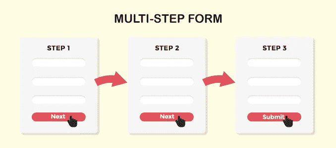

# 如何使用 Vue.js 构建多步表单

> 原文：<https://javascript.plainenglish.io/how-to-build-a-multi-step-form-using-vue-js-d00efc5f05f4?source=collection_archive---------0----------------------->



Image by [The Maverick spirit](https://themaverickspirit.com/create-multi-step-form-wordpress/)

在线注册表单通常包含一长串供用户输入的字段。将长表格分成更小的部分使它们更容易阅读。这导致了所谓的多步形式。这种形式改善了用户体验。对于许多前端开发人员来说，构建多步表单已经被证明是困难的。

在本文中，我将一步步向您展示如何使用 Vue.js 构建这样的表单。

**步骤 1:** 创建一个名为 MultiStepForm 的新 Vue 项目。阅读 Vue 项目设置[这里](https://cli.vuejs.org/guide/creating-a-project.html)。

```
vue create MultiStepForm
```

**第二步:**在 components 文件夹中，创建一个 Vue 组件，并将其命名为 *Multiform.vue* 。将其分为三个部分，模板、脚本和样式。

```
<template></template><script></script><style></style>
```

**第三步:**在模板标签里面，创建一个 *< article/ >* 标签在一个 *< div/ >* 标签里面。在*/>/*条标签内添加一个*/</>/*标签和*/</>/*标签。

```
<template> <div>
  <article>
    <header></header> <section></section>
   </article>
 </div></template>
```

**第四步:**在 header 部分添加一个 *< div >* 标签并使用 v-bind 添加一个动态类。这个 CSS 类将依赖于窗体的位置。

然后使用 v-for，遍历*表单组*数组。这个*表单组*将在后面的脚本部分定义。

```
<header>

     <div
       :*class*="{'active':index === formPosition}"
       *v-for*="(step, index) in formGroup"
       :*key*="'step'+index"
     >
       {{ index + 1 }}
     </div>

</header>
```

**第五步:**在 *<部分>* 标签中使用 v-bind 添加一个动态类。然后，使用 v-for 指令，遍历*表单组*字段。

```
<section :*class*="animation">
     <h2>{{ formGroup[formPosition].title }}</h2>
     <div>
     <div
       *v-for*="(field, index) in formGroup[formPosition].fields"
       :*key*="'field'+index"
     > <input *type*="text" *v-model*="field.value"  *required*>
      <label>{{ field.label }}</label>
     </div>
     </div>
   <div></div>
   </div></section>
```

**第六步:**在输入标签下方，添加两个按钮。这些按钮将根据*表单位置*有条件地显示。v-if 指令将用于实现这一点。

```
<section :*class*="animation">
     <h2>{{ formGroup[formPosition].title }}</h2>
     <div>
     <div
       *v-for*="(field, index) in formGroup[formPosition].fields"
       :*key*="'field'+index"
     ><input *type*="text" *v-model*="field.value"  *required*>
      <label>{{ field.label }}</label>
     </div>
     </div>
   <div><button 
     *v-if*="formPosition +1 < formGroup.length -1"      @*click*="nextStep">
     Next
   </button><button 
     *v-if*="formPosition +1 === formGroup.length -1">
    Enter
   </button></div>
   </div></section>
```

最终的模板部分将如下所示。

```
<template>
 <div>
  <article>
    <header>

     <div
       :*class*="{'active':index === formPosition}"
       *v-for*="(step, index) in formGroup"
       :*key*="'step'+index"
     >
       {{ index + 1 }}
     </div>

    </header><section :*class*="animation">
     <h2>{{ formGroup[formPosition].title }}</h2>
     <div>
     <div
       *v-for*="(field, index) in formGroup[formPosition].fields"
       :*key*="'field'+index"
     ><input *type*="text" *v-model*="field.value"  *required*>
      <label>{{ field.label }}</label>
     </div>
     </div>
   <div><button 
     *v-if*="formPosition +1 < formGroup.length -1"      @*click*="nextStep">
     Next
   </button><button 
     *v-if*="formPosition +1 === formGroup.length -1">
    Enter
   </button></div>
   </div></section>
   </article>
   </div></template>
```

**第七步:**在 *<脚本的>* 标签中给数据对象添加两个属性。第一个是*表单位置*，每次点击*下一个*按钮都会增加。

第二个是保存 CSS 类名的*动画*。

```
<script>
  export default {
  data: () => {
    return {
             formPosition: 0,
             animation: 'animate-in',
               }}}</script>
```

**步骤 7:** 接下来，添加另一个名为 *formGroup* 的属性，它将保存数据，以便在转换时显示在表单字段上。

```
<script>
  export default {
  data: () => {
    return {
             formPosition: 0,
             animation: 'animate-in',
             formGroup: [
               {title: "Personal Details",
                 fields: [
                   {label: "First Name", value: "" },
                   {label: "Second Name", value: ""},
                   {label: "Age", value: ""},]},
               {title: "Address",
                 fields: [
                   {label: "City", value: ""},
                   {label: "Zip Code", value: ""},
                   {label: "County", value: ""},
                   {label: "State", value: ""},]},
               {title: "Academic Details",
                 fields: [
                   {label: "Academic qualification", value: ""},
                   {label: "College Attended", value: ""},
                   {label: "Year of completion", value: ""},]},
                ]}},methods: {
     nextStep(){
      *this*.animation = 'animate-out';
      setTimeout(() => {
      *this*.animation = 'animate-in';
      *this*.formPosition += 1;
     }, 600);
     },}</script>
```

**第 8 步:**接下来，添加一个方法，该方法将更改 CSS 类名以显示下一个表单组。

```
methods: {
     nextStep(){
      *this*.animation = 'animate-out';
      setTimeout(() => {
      *this*.animation = 'animate-in';
      *this*.formPosition += 1;
     }, 600);
     },}}
```

接下来，添加 CSS 样式。

```
<style>*.animation-in* {
   transform-origin: left;
   animation: in .6s ease-in-out;
}
*.animation-out* {
   transform-origin: bottom left;
   animation: out .6s ease-in-out;
}</style>
```

最终的***multi form . vue***组件必须如下图所示。

```
<template>
 <div>
  <article>
    <header>

     <div
       :*class*="{'active':index === formPosition}"
       *v-for*="(step, index) in formGroup"
       :*key*="'step'+index"
     >
       {{ index + 1 }}
     </div>

    </header> <section :*class*="animation">
     <h2>{{ formGroup[formPosition].title }}</h2>
     <div>
     <div
       *v-for*="(field, index) in formGroup[formPosition].fields"
       :*key*="'field'+index"
     > <input *type*="text" *v-model*="field.value"  *required*>
      <label>{{ field.label }}</label>
     </div>
     </div>
   <div> <button 
     *v-if*="formPosition +1 < formGroup.length -1"      @*click*="nextStep">
     Next
   </button> <button 
     *v-if*="formPosition +1 === formGroup.length -1">
    Enter
   </button> </div>
   </div> </section>
   </article>
   </div></template><script>
  export default {
  data: () => {
    return {
             formPosition: 0,
             animation: 'animate-in',
             formGroup: [
               {title: "Personal Details",
                 fields: [
                   {label: "First Name", value: "" },
                   {label: "Second Name", value: ""},
                   {label: "Age", value: ""},]},
               {title: "Address",
                 fields: [
                   {label: "City", value: ""},
                   {label: "Zip Code", value: ""},
                   {label: "County", value: ""},
                   {label: "State", value: ""},]},
               {title: "Academic Details",
                 fields: [
                   {label: "Academic qualification", value: ""},
                   {label: "College Attended", value: ""},
                   {label: "Year of completion", value: ""},]},
                ]}}, methods: {
     nextStep(){
      *this*.animation = 'animate-out';
      setTimeout(() => {
      *this*.animation = 'animate-in';
      *this*.formPosition += 1;
     }, 600);
     },}}</script><style>*.animation-in* {
   transform-origin: left;
   animation: in .6s ease-in-out;
}
*.animation-out* {
   transform-origin: bottom left;
   animation: out .6s ease-in-out;
}</style>
```

**第 10 步:**最后将 ***的 MultiForm.vue*** 组件导入到 ***的 App.vue.***

```
<template>
  <div>
   <MultiForm/>
  </div>
</template><script>import MultiForm from './components/MultiForm.vue'export default {
   name: 'App',
   components: {
     MultiForm
 }
}<script/><style></style>
```

运行应用程序

现在我们有了。我希望你已经发现这是有用的。我会带着更多有趣的文章回来。感谢您的阅读。

*更多内容请看*[***plain English . io***](http://plainenglish.io/)