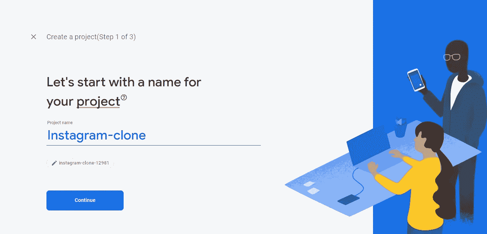
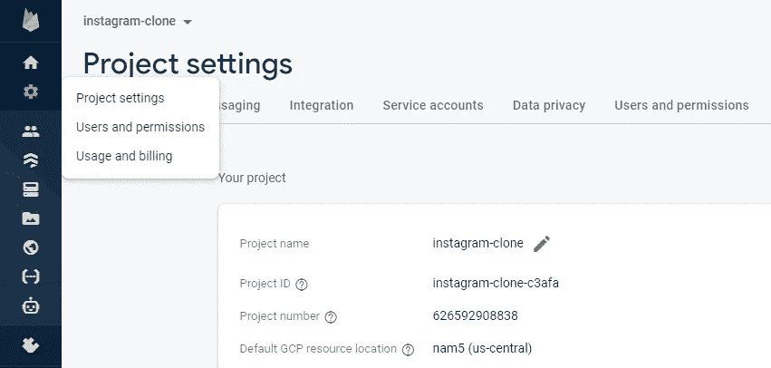

# 如何使用 React Native 构建照片分享应用程序(Instagram 克隆)

> 原文：<https://javascript.plainenglish.io/how-to-build-a-photo-share-app-with-react-native-instagram-clone-8cc81c5612af?source=collection_archive---------8----------------------->

你将要建造的东西。[演示](https://instagram-clone-c3afa.web.app/)，Git 回购[此处](https://github.com/Daltonic/instagram-clone)。

# 介绍

是时候让你的 web 开发更上一层楼了。你需要开始开发移动应用程序，如果你还没有，开始构建吧。React Native 让所有 JavaScript 开发人员的生活变得更加轻松，尤其是来自 React 社区的开发人员。最重要的是，谷歌决定通过提供名为 Firebase 的免费入门后端服务来为社区做贡献。Firebase 将让你立刻开发出令人兴奋的网络或移动应用程序。你不需要一台顶尖的机器就可以开始开发 React 原生 app(初步来说)。你必须做的就是开始。

# 先决条件

要继续学习本教程，您需要了解如何使用下面的堆栈。

*   [反应](https://reactjs.org/)
*   [CSS](https://css-tricks.com/)
*   [燃烧基地](https://firebase.google.com/)
*   [世博会](https://expo.dev/)

# 安装应用程序平台

首先，你需要在你的机器上安装[node . js](https://nodejs.org/)；你可以去他们的网站看看。其次，您需要使用下面的命令在您的计算机上安装 [Expo-CLI](https://docs.expo.dev/get-started/installation/) 。

`*# Install Expo-CLI*`

`*npm install --global expo-cli*`

# 正在初始化项目

接下来，在终端上创建一个名为**"*insta gram-clone "***的新 expo 项目，并在出现提示时创建空白模板。要知道 expo-CLI 默认使用[纱](https://classic.yarnpkg.com/lang/en/docs/install/)。

`*# Create a project named my-app*`

`*# Select the "blank" template when prompted.*`

`*expo init instagram-clone*`

`*# Navigate to the directory.*`

`*cd instagram-clone*`

`*# Start the newly created expo project.*`

`*yarn start // or yarn web to spin up the web interface.*`

执行上述命令将创建一个新的 react-native 项目，并在浏览器上运行它。现在，您可以选择启动 IOS、Android 或 Web 界面，只需点击您想要的界面。为了和我一起编码的新手，我们将使用 web 界面。要在移动设备上运行开发服务器，您需要一个模拟器。查看这里的说明，使用一个 [IOS](https://docs.expo.dev/workflow/ios-simulator/) 或 [Android](https://docs.expo.dev/workflow/android-studio-emulator/) 模拟器，否则，使用网络界面并遵循教程。最后，在 [VScode](https://code.visualstudio.com/download) 中打开项目，开始编码。

太好了，您已经成功地创建了项目，接下来让我们安装项目依赖项。

# 安装项目依赖项

仅仅是 React Native 的核心包不会让我们得到一个 *instagram 克隆*，我们将添加更多的包来完成这个项目。

`*# Required Packages*`

`*expo install firebase*`

`yarn add *@react-navigation/native*`

`yarn add *@react-navigation/stack*`

`yarn add *email-validator*`

`yarn add *formik*`

`yarn add *valid-url*`

`yarn add *yup*`

Epic，您已经完成了我们的应用程序依赖项的安装，现在让我们继续为这个项目设置 Firebase 配置。

# 设置 Firebase

这个应用程序使用 Firebase 的所有后端活动。要将 Firebase 配置到此应用程序中，请使用 Firebase 进行所有后端活动。要将 Firebase 配置到您的项目中，请遵循以下步骤。

第一步，我们将前往 [Firebase 控制台](https://console.firebase.google.com)并创建一个帐户，为此您将需要一个 [Gmail](https://mail.google.com) 帐户。你可以登录，如果你已经有一个帐户，你应该看到这个项目界面，一旦你在。

进入该页面后，点击 ***【添加项目】*** 按钮，您将进入项目创建流程。您将从输入项目名称开始。

输入项目名称后，单击继续，直到项目创建完成，您将看到下图所示的项目概述页面。

接下来，我们想要激活 Firebase 上的两个服务，它们将帮助我们构建这个应用程序。一个是认证服务，另一个是 Firestore 服务。

接下来，单击**电子邮件/密码**提供者上的编辑图标，并启用它，如下图所示。

接下来，转到 Firestore 数据库，通过单击 get started 按钮激活它，启用 Firestore 服务后，页面应该是这样的。

现在是时候为我们的应用程序创建一个配置设置了。进入项目概述页面，点击 ***【添加应用】*** 按钮，选择 web 选项。

您可以从项目设置页面获得所有这些信息，如下图所示。

向下滚动，您将看到配置设置。在项目的根目录下创建一个名为 ***firebase.js*** 的新文件，并将这些配置复制到其中。这个文件稍后将用于开发我们的应用程序，它应该是这样的。

太棒了，我们已经完成了基本的 Firebase 设置，让我们继续构建这个应用程序。

# 项目结构

您的项目结构应该是这样的。

您应该将此作为编码时的参考指南。和我一起开始创建我们的项目目录和文件。

# 组件目录

这个项目中有几个目录，让我们从 components 文件夹开始。在这个项目的根目录下创建一个名为 **components** 的文件夹，并创建下面讨论的文件。

**FormikPostUploader.js 组件**

该组件负责定义每个帖子将包含的内容。该组件使用 ***Formik*** 和 ***Yup*** 来构建帮助创建新帖子的界面。它还确保了你上传到数据库的每一篇文章都被很好地捕捉到，并且用正确的数据进行了验证。请参见下面的代码片段。

超级，现在我们就在 ***AddNewPost*** 组件中使用它。

**添加新的 Post 组件**

该组件结合了***FormikPostUploader***组件来改善用户界面。它还添加了一个 Header 组件，该组件将导航“***new postscreen***”返回到“ ***主屏幕*** ”。下面的代码片段更好地描述了这一点。

很好，我们稍后将把这个组件与***new post screen***连接起来。

**割台组件**

该组件带有三个图标和品牌名称，它也用作注销按钮。这三个图标包括加号、心形和聊天图标。加号图标将您导航到 ***新发布屏幕*** 。下面的代码片段详细展示了这一点。

Epic，我们稍后将在 ***主屏幕*** 上使用这个组件。让我们继续编写 ***故事*** 组件。

**故事组件**

stories 组件呈现一个故事列表及其各自的用户名，并显示在垂直滚动视图中。代码片段说明了一切。

该组件和标题组件将在稍后的 ***主屏幕*** 上使用。是时候继续处理 ***底部标签*** 组件了。

**BottomTabs 组件**

这个组件负责在我们应用程序的底部显示粘性底部图标。它也可以用于导航。参见下面的代码来理解它是如何工作的。

您已经做得很好了，接下来让我们构建 post 组件。

**岗位组件**

这个组件由许多较小的组件堆叠在一个文件中组成，我们最好用可视化和代码化的方式来描述它。

这是一个庞大的组件，不如把代码吐出来给你看看。

很好，你做得很好，继续努力，你将成功完成这个应用程序。现在让我们添加身份验证组件。

**LoginForm 和 SignupForm 组件**

这些身份验证组件旨在提供干净的身份验证用户界面。该组件还使用 Formik 和 Yup 来执行表单验证。由于它们在代码方面是相似的，我们不妨立刻讨论它们。创建下面的代码，并将其复制到 components 文件夹的下列组件中。

万岁，你刚刚完成了我们将在本教程中使用的所有组件的创建。现在让我们开始创建一些屏幕。

# 屏幕目录

整个项目包含四个屏幕，包括 ***登录、注册、主页、*** *和****NewPos***t 屏幕。让我们继续对 ***登录屏幕*** 进行编码。

**登录屏幕**

这个屏幕将验证一个用户，如果他以前在我们的应用程序注册。有了正确的详细信息，用户将被允许进入，否则，firebase 将警告用户无效的凭证。下面是负责此行为的代码。

现在让我们转到注册屏幕。

**注册屏幕**

登录屏幕验证已经存在的用户，而注册屏幕将新用户注册到我们的应用程序中。

很好，让我们从 NewPost 屏幕开始添加最后两个屏幕。

**新帖子屏幕**

这个组件允许我们在用***FormikPostUploader***组件验证后向 firebase 发送一个新帖子。代码附后。

聪明，让我们结束 ***主屏幕*** 。

**主屏幕**

这是这个项目的核心。主屏幕使用 ***文章*** 、 ***标题*** 和 ***底部标签*** 组件来填充视图。这是通过从 ***Firestore*** 中检索帖子并递归呈现所有带有帖子组件的帖子来实现的。代码片段详细展示了这一点。

好了，这个过程差不多完成了，让我们用一些静态数据来支持这个应用程序。

# 数据目录

此文件夹包含支持此项目所需的所有静态文件，这对于支持组件数据至关重要。在这个项目的根目录下创建一个名为“data”的文件夹，并在其中创建以下文件。

太棒了，让我们保护我们的应用程序路由，这样未经授权的用户就不能访问它们。

# 路线守卫和保护

使用 Firebase 身份验证服务和 ***authState*** 函数，我们将控制对我们应用程序的访问。在这个项目的根目录下创建两个名为“***auth navigation . js***”和“***navigation . js***”的文件。接下来，将以下代码粘贴到其中。

好，让我们通过用下面的代码块替换 ***App.js*** 代码来完成交易。

`*import* React *from* 'react'`

`*import* AuthNavigation *from* './AuthNavigation'`

`*export* *default* function App() {`

`*return* <AuthNavigation />`

`}`

太好了，你一直这么耐心地编码，你应该喝杯咖啡。

在你走之前，从下面的链接下载图像，并将它们添加到这个项目的 assets 文件夹中。

[https://github . com/Daltonic/insta gram-clone/blob/main/assets/header-logo . png？raw=true](https://github.com/Daltonic/instagram-clone/blob/main/assets/header-logo.png?raw=true)

[https://raw . githubusercontent . com/Daltonic/insta gram-clone/main/assets/insta gram _ logo . png](https://raw.githubusercontent.com/Daltonic/instagram-clone/main/assets/instagram_logo.png)

恭喜你，你刚刚粉碎了这个项目。

# 结论

学习如何用 react 和 react-native 开发应用程序，你不需要掌握火箭科学。你可以从小处着手，但永远不要变小。在谷歌 Firebase 的支持下，学习如何使用 react 和 react native 创建令人惊叹的应用程序将不断提高你在软件开发方面的技能，你可以获得梦想中的工作或提升你的开发技能。你必须学会如何构建一个 react 原生 Instagram 克隆，是时候开始构建了。

# 关于作者

福音书达林顿是一个远程 **fullstack** 开发者，多产有 **Vue.js** 、 **Angular** 、 **React** 、 **React Native** 和 **API 开发**等技术。

他对开发高级的、响应迅速的 web 应用程序非常感兴趣。

福音书达林顿目前是一名自由职业者，开发应用程序和编写教程，教其他开发者如何将软件产品集成到他们的项目中。

他利用空闲时间指导年轻人如何在生活中获得成功。他的爱好包括发明新食谱、写书、写歌和唱歌。你可以在[网站](https://daltonic.github.io/)、 [LinkedIn](https://www.linkedin.com/in/darlington-gospel-aa626b125/) 、 [Twitter](https://twitter.com/idaltonic) 、[脸书](https://www.facebook.com/darlington.gospel01)或 [GitHub](https://github.com/Daltonic) 联系我进行任何讨论。

*更多内容请看*[*plain English . io*](http://plainenglish.io/)*。在这里注册我们的* [*免费周报*](http://newsletter.plainenglish.io/) *。*