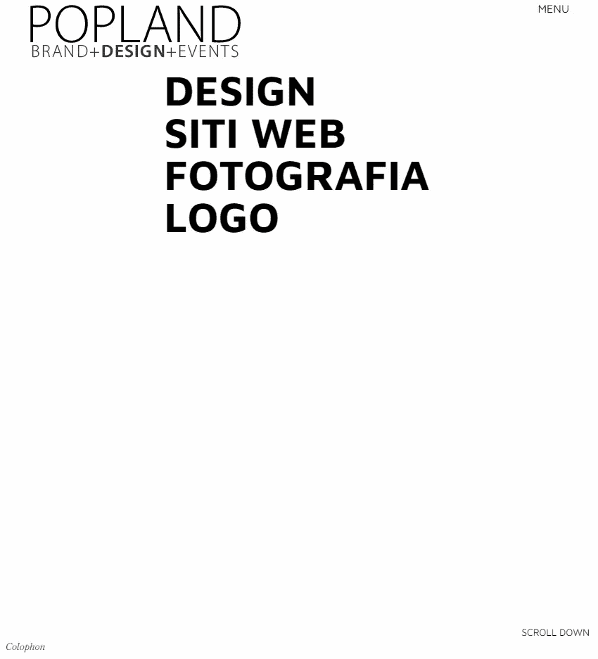
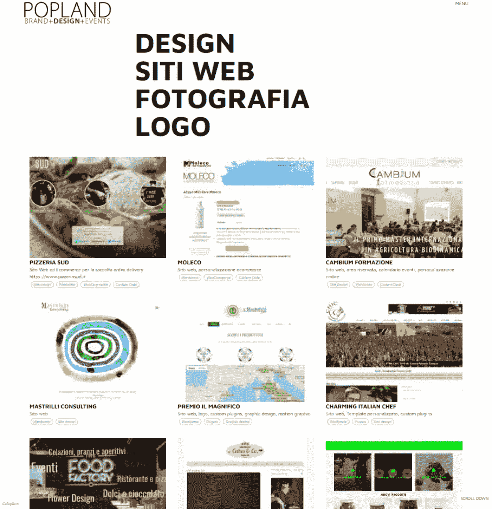

# 用 React 和 Gatsby.js 搭建作品集网站

> 原文：<https://javascript.plainenglish.io/how-to-build-a-portfolio-in-react-with-yaml-and-gatsby-js-d817d1c2994e?source=collection_archive---------3----------------------->

在 React 中重建我们的站点时，我们选择 Gatsby.js 作为框架。我们的后台在 Wordpress 上，在我们看来，盖茨比转用 [*无头*](https://www.gatsbyjs.com/docs/glossary/headless-wordpress/) 是正确的选择。

在某些时候，我们需要重构我们的作品组合，在 Wordpress 中，我们的组合是由填充了自定义字段(分类法、图库、图片……)的自定义帖子组成的。

尽管可以向 GraphQL 公开定制文章和定制字段以供 Gatsby 读取，但我们决定不在 php 中编写这一部分，而是将整个作品集(大约 50 部精选作品)转移到一个单独的 [YAML](https://yaml.org/) 文件中，Gatsby 也可以通过 GraphQL 处理该文件，因此我们与 Wordpress 部分保持一致(例如，我们通过 GraphQL 从 Wordpress 获取菜单和页面内容)。

## 先决条件

这个小的演练假设你已经知道(至少知道一点)React，Gatsby.js，Gatsby([https://www.gatsbyjs.com/docs/working-with-images/](https://www.gatsbyjs.com/docs/working-with-images/))中的图像用法，Tailwind CSS

## 1.创建一个新的盖茨比项目

首先，我们创建一个新的盖茨比项目

```
npm init gatsby
```

按照提示操作，最后进入项目目录

```
cd porfolio-project
```

使用以下命令启动开发服务器

```
gatsby develop
```

开发服务器将在`htttp://localhost:8000`可用

如果你需要更多关于如何开始开发 Gatsby 的细节，你可以参考他们的文档[https://www.gatsbyjs.com/docs/quick-start](https://www.gatsbyjs.com/docs/quick-start)

## 2.安装和配置 Gatsby 所需的插件

对于这个最小的项目，我们将只安装所需的插件: [*Gatsby 源文件系统*](https://www.gatsbyjs.com/plugins/gatsby-source-filesystem/) (以节点形式读取本地文件) [*YAML 转换器*](https://www.gatsbyjs.com/plugins/gatsby-transformer-yaml/) (将解析 YAML 文件) [*Gatsby 图像和夏普转换器*](https://www.gatsbyjs.com/plugins/gatsby-image) 以(酷)Gatsy 方式处理图像，[*post CSS*](https://www.gatsbyjs.com/docs/how-to/styling/tailwind-css/)*启用和处理 Tailwind CSS*

***安装** `npm install gatsby-transformer-yaml`*

*`npm install gatsby-source-filesystem`*

*`npm install gatsby-image`*

*`npm install gatsby-transformer-sharp gatsby-plugin-sharp`*

*`npm install postcss gatsby-plugin-css`*

***配置**
曾经安装的插件应该配置在 *gatsby-config.js* 中(该文件在项目根目录下)*

## ***3。安装并配置顺风 CSS***

*要安装和配置 Tailwind(这当然是可选的),请遵循本指南:
[https://www.gatsbyjs.com/docs/how-to/styling/tailwind-css/](https://www.gatsbyjs.com/docs/how-to/styling/tailwind-css/)*

## ***4。定义投资组合数据结构***

*这在很大程度上取决于你的项目和个人偏好，yaml 结构非常灵活，可以处理许多数据类型(标量、列表、关联数组……)，仍然保持很好的可读性。我们根据类别决定了一个层次结构，它看起来像这样:*

*正如你所看到的，在文件中我们有几个类别(设计和网站)保存它们各自的组合，每个条目都有一堆信息(大部分是可选的)，图像数组指向存储在 *src/images/portfolio 中的图像。*Yaml 文件本身保存在 *src/data 中。**

*一旦 yaml 文件和图像准备就绪，如果您重新启动您的项目(使用`gatsby develop`，在启动期间 Gatsby 将读取并精心制作您的图像和数据文件，然后它们将通过 graphQL 查询可用(您也可以在`[http://localhost:8000/___graphql](http://localhost:8000/____graphql)`浏览您的 graphQL 服务器)*

## ***5。组织项目***

*现在，我们可以开始组织和编码项目，我们将有一个页面(我们称之为 portfolio.js)将从 yaml 文件影响投资组合，和一个组件:投资组合类别(它将显示可用类别的列表)与工作列表(它将显示所选类别的所有条目)；该组件将从主页接收数据作为道具。页面将被创建为:pages/portfolio.js。组件将被创建为:components/PortfolioContent.js*

*这样，页面将在:`http://localhost:8000/portfolio`可用*

## ***6。编码***

*让我们从页面开始:*

*这个页面非常简单，它查询 graphql(使用 gatsby 文档中指定的 pagequery 结构[https://www . gatsbyjs . com/docs/how-to/query-data/page-query/](https://www.gatsbyjs.com/docs/how-to/querying-data/page-query/))并将数据转发给组件。*

*接下来，我们构建组件:*

*该组件将从页面接收完整的数据，它将设置两个状态(一个存储选定的类别，一个存储选定类别的组合)，以便当您从列表中选择一个类别时，组合将更新为正确的数据，这两个状态都是空的，当您打开页面时，它将只呈现类别列表；第 26 行的呈现部分，我们映射数据并打印出每个类别，给它一个点击句柄，通过 setCategory 函数设置当前类别。*

**

*When opening the page only the categories are shown*

*点击一个类别名称，它将更新*当前类别*状态，这是 useEffect 的一个依赖项，因此 useEffect 运行，它将根据当前类别过滤出数据，并将结果存储在*当前组合*状态中。此时(因为状态已更改),项目组合列表部分使用当前类别项目组合数据重新呈现，它使用 Img gatsby-image 组件呈现数组的第一个图像。*

**

*once a category is selected the worklist of the category is shown*

## ***结论***

*这只是一个基本的起点，从这里你可以做得更多；例如，您可以创建一个组件来显示一个作品的详细视图，一旦该作品被单击，您可以使用当前类别状态来显示我们所处的类别(可能使用更大的字体，或另一种装饰)，您可以动画显示工作表之间的切换，等等。*