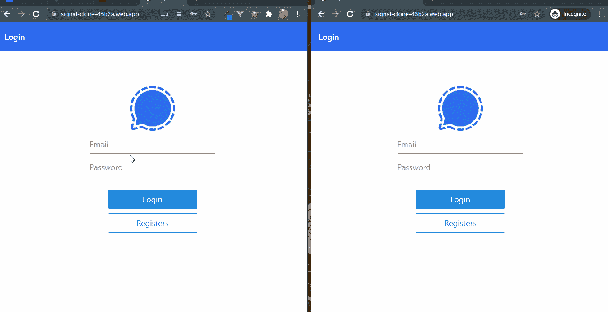
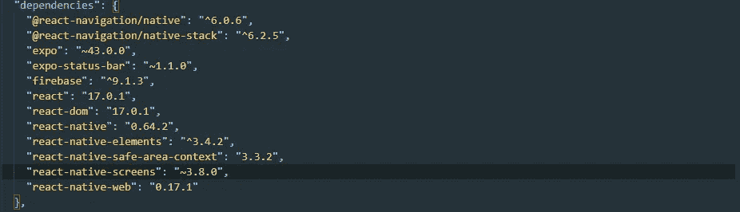

# 如何使用 React-Native(信号克隆)构建一个私人消息聊天应用程序

> 原文：<https://javascript.plainenglish.io/how-to-build-a-private-messaging-chat-app-with-react-native-signal-clone-b29eedf43a82?source=collection_archive---------10----------------------->

你将要建造的东西。Git Repo [这里](https://github.com/Daltonic/signal-clone)。

Signal Chat App Clone

# 介绍

Image by Thomas Ulrich from Pixabay

移动通信应用将继续存在，它们正在改变我们的世界，改变我们在公共场合、私人场合和工作中相互交流和互动的方式。现代技术的进步使世界各地的开发人员能够将这些通信功能整合到应用程序中，从而为他们的各种客户和业务伙伴解决问题。React Native 是一个可靠的 JavaScript 跨平台应用程序开发框架。毫无疑问，这是开发聊天应用程序最有利的技术之一。在本教程中，您将学习如何使用 React Native、Firebase 和 Expo 的强大功能创建跨平台的私人消息聊天应用程序。

# 先决条件

要从本教程中受益，您必须首先了解如何使用 React Native 和 Firebase。这将使您能够完成本教程的其余部分。本教程利用了以下技术。

*   [反应原生](https://reactnative.dev/)
*   [燃烧基地](https://firebase.google.com/)
*   [世博会](https://expo.dev/)

# 安装项目依赖项

Project Dependencies

首先，您需要在您的机器上安装 NodeJs 请访问他们的网站。

其次，您需要使用下面的命令在您的计算机上安装 Expo-CLI。您可以使用此[链接](https://docs.expo.dev/get-started/installation/)访问他们的文档页面。

`# Install Expo-CLI`

`npm install --global expo-cli`

接下来，在终端上创建一个名为 signal-clone 的新 expo 项目，并在出现提示时创建空白模板。

`#Create a new expo project and navigate to the directory`

`expo init signal-clone`

`cd signal-clone`

`#Start the newly created expo project`

`expo start`

在终端上运行上述命令将创建一个新的 react-native 项目，并在浏览器上启动它。现在，您可以选择启动 IOS、Android 或 Web 界面，只需选择您想要的界面。要在 IOS 或 Android 上启动开发服务器，您需要一个模拟器，使用此处的说明[使用 IOS 或 Android 模拟器，否则，使用 web 界面并遵循教程。](https://reactnative.dev/docs/environment-setup)

现在，使用下面的说明为我们的项目安装这些必要的依赖项。博览会的默认包装经理是 yarn。

`# Install the native react navigation libraries`

`yarn add @react-navigation/native`

`yarn add @react-navigation/native-stack`

`#Installing dependencies into an Expo managed project`

`expo install react-native-screens react-native-safe-area-context`

太棒了，现在让我们继续为项目设置 Firebase。

# 设置 Firebase

首先，在您的 expo 项目上运行下面的命令。

`#Install firebase with the command`

`expo install firebase`

下一步，注册一个 firebase 帐户，如果你还没有的话。之后，前往 Firebase 并创建一个名为 signal-clone 的新项目，激活电子邮件和密码认证服务，详情如下。

Firebase Console Create Project

Firebase 支持使用不同的提供者进行身份验证。例如，社交认证、电话号码以及标准的电子邮件和密码方法。由于我们将在本教程中使用电子邮件和密码认证方法，我们需要为我们在 Firebase 中创建的项目启用该方法，因为它在默认情况下是禁用的。在项目的 authentication 选项卡下，单击 sign-in 方法，您应该会看到 Firebase 当前支持的提供者列表。

Firebase Authentication Options

接下来，单击**电子邮件/密码**提供程序上的编辑图标并启用它。

Firebase Enabling Authentication

现在，您需要在 Firebase 项目下注册您的应用程序。在项目的概述页面上，选择添加应用程序选项，并选择 web 作为平台。

Firebase Project Page

注册完应用程序后，会出现一个包含应用程序凭证的屏幕。请注意第二个脚本标记，因为我们将很快在应用程序中使用它。祝贺您，现在您已经完成了安装，让我们来做一些配置。

在 Firebase 控制台上，单击项目设置，您将被导航到项目设置页面。

Project Settings Page

向下滚动到下面，您将看到 project SDK 的设置和配置，这对我们的项目非常有用。

Firebase SDK setup and Configuration

复制 firebaseConfig 对象，在项目的根目录下创建一个名为 firebase.js 的单独文件。将上述 firebase 配置目标代码粘贴到文件中并保存。这个配置对象在生产应用程序中是保密的，但是，由于这是一个演示应用程序，我们就不要费心去保密了。

firebase.js 文件应该包含下面的代码片段。

注意:用 firebaseConfig 设置替换 firebase config 对象。太好了，让我们看看我们的项目结构。

# 项目结构

您的项目结构应该是这样的。

Project Structure

您应该将此作为编码时的参考指南。和我一起跳下去，让我们开始一个接一个地创建我们的项目目录和文件。

# 组件目录

这个项目中有几个目录，让我们从 components 文件夹开始。在这个项目的根目录下创建一个名为 **components** 的文件夹。现在，在这个组件文件夹中创建一个名为 **CustomListItem.js** 的文件。这个组件稍后将用于控制我们如何在**主屏幕**上渲染聊天。

CustomListItem.js Component

这个 **CustomListitem** 组件包含了 **chatAvatar** 、 **chatName** 和 **chatLastMessage** 等参数。下面是负责此行为的代码片段。

这个智能组件不仅仅是呈现聊天列表。它还会观察并呈现该聊天组中讨论的最后一条消息，以及该聊天组中最后一个发言的人的头像。

现在，让我们通过在让所有用户进入之前对他们进行身份验证来确保我们的应用程序是安全的。

# 登录屏幕

The Login Screen

该屏幕负责在允许现有用户与我们的应用程序聊天之前对他们进行身份验证。用户必须提供在我们的平台上注册时使用的电子邮件和密码。要继续这个过程，在项目的根目录下创建一个名为 screens 的文件夹。接下来，在 screens 目录中创建一个名为**logins screen . js**的新文件，粘贴并保存下面的代码。下面的代码片段最好地描述了这种行为。

**注意:**下载上图的 PNG 徽标，将其重命名为**“logo . PNG”**，并将其移动到我们的应用程序根目录下的 assets 文件夹中。

太棒了，有了这个设置，我们可以继续注册了。

# 注册屏幕

The Registration Screen

与登录屏幕几乎一样，**注册屏幕**负责让新用户注册到我们的聊天应用程序中，并使用 firebase 认证服务授权他们的凭证进行后续认证。该屏幕收集用户信息，如姓名、电子邮件、密码和图像 URL。下面的代码片段展示了如何使用新的 **firebase 版本 9** 语法实现注册屏幕。

祝贺那个屏幕，现在让我们实现主屏幕。

# 主屏幕

The Home Screen

主屏幕负责输出我们平台上所有的群聊。它使用 **CustomListItem** 组件来呈现每个聊天组。在屏幕的头部是两组元素，左边包含当前登录用户的头像和**“信号”**，这是我们应用的名称。右边是另一个组，包含三个图标，一个照相机、铅笔和注销图标。当按下时，铅笔图标会将用户引导至**addchatcirscreen**，而注销图标会将用户注销并导航至登录屏幕。说得够多了，下面是负责这些动作的代码。

既然我们已经完成了主屏幕，让我们继续进行**添加聊天屏幕**。

# 添加聊天屏幕

The Add Chat Screen

这个屏幕负责向我们的聊天应用程序添加一个新的聊天组。利用 firestore 的服务，该组件从 UI 收集一个聊天名称，以便在我们的聊天列表中创建新的聊天。下面是迎合这种行为的代码片段。

干得好，你离完成这个信号克隆应用程序只有几步之遥了。

# 聊天屏幕

The Chat Screen

这是聊天屏幕，所有神奇的事情都发生在这里。这个屏幕负责这个应用程序的核心目的。它让用户参与一对多的聊天。下面是负责其行为的代码。

干得好，你已经添加了这个应用程序所需的所有屏幕，让我们继续编写 App.js 的代码。

# App.js

这是我们应用程序的包装文件。我们应用程序中的所有屏幕都在这个条目文件中。您可以在这个 **App.js** 文件中的应用程序中应用全局样式。看一下执行这些职责的代码。

史诗般的工作，你刚刚完成了这个应用程序的编写。

# 结论

最后，创建一个聊天应用程序变得简单多了，React Native 让它感觉像是炎热夏季中的一阵凉风。私人消息应用总是有需求的，理解如何构建一个几乎是所有开发者的要求。本教程向您展示了使用 React Native 创建私人消息聊天应用程序的过程。你应该使用这个新发现的技巧来击败其他聊天应用。

# 关于作者

福音达林顿是一个远程 **Fullstack** 开发者，多产有 **Vue.js** 、 **Angular** 、 **React** 、 **React Native** 和 **API 开发**等技术。

他对开发高级的、响应迅速的 web 应用程序非常感兴趣。

福音书达林顿目前是一名自由职业者，开发应用程序和编写教程，教其他开发者如何将软件产品集成到他们的项目中。

他利用空闲时间指导年轻人如何在生活中获得成功。他的爱好包括发明新食谱、写书、写歌和唱歌。你可以在[网站](https://daltonic.github.io/)、 [LinkedIn](https://www.linkedin.com/in/darlington-gospel-aa626b125/) 、 [Twitter](https://twitter.com/idaltonic) 、[脸书](https://www.facebook.com/darlington.gospel01)或 [GitHub](https://github.com/Daltonic) 联系我进行任何讨论。

*更多内容请看*[*plain English . io*](http://plainenglish.io/)*。在这里注册我们的* [*免费周报*](http://newsletter.plainenglish.io/) *。*