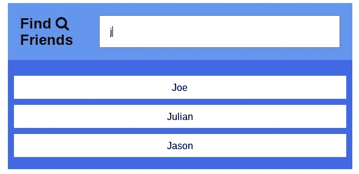
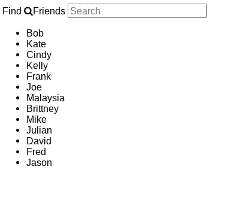
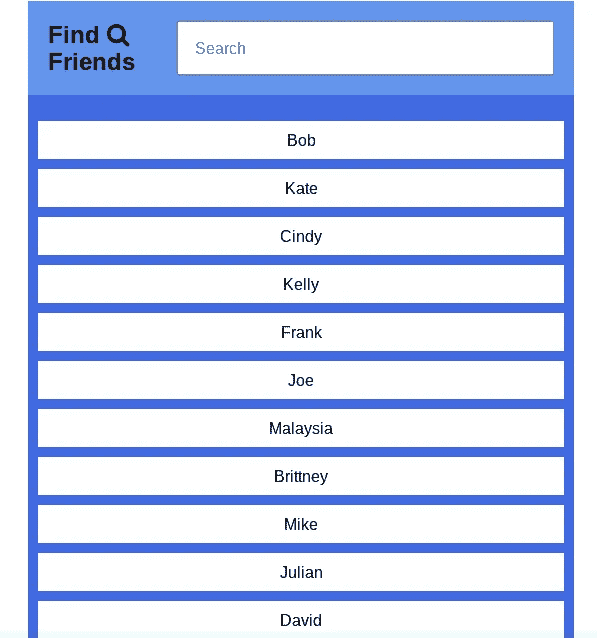

# 如何用 JavaScript 构建搜索栏

> 原文：<https://javascript.plainenglish.io/how-to-build-a-search-bar-7d8a8a3d9d00?source=collection_archive---------2----------------------->

## 如何使用 JavaScript 构建搜索栏功能的快速演练

# 什么是搜索栏？

好吧，我们可能都知道搜索栏是什么，但让我快速解释一下。搜索栏是出现在浏览器、网站和应用程序上的输入框。它接受用户的搜索查询，并允许您搜索某些类型的信息。

[搜索引擎](https://en.wikipedia.org/wiki/Search_engine)是处理网络搜索的幕后软件系统。

你知道在第一个网络搜索引擎出现之前，万维网完全是手工索引的吗？我可能会写一篇关于搜索引擎历史的整篇文章，但今天我们将为一个网络应用程序构建一个基本的搜索栏。

# 构建搜索栏

要开始创建我们的搜索栏功能，我们应该考虑几个概念，这些概念会进入它的工作版本。我们知道，我们需要一个空的搜索栏来接受用户输入。我们还需要一种方法来捕获输入并处理它，以便在用户键入时开始查找用户正在搜索的内容。为了找到并向用户呈现这些数据，我们应该存储正在搜索的任何类型的数据。在这种情况下，我们将使用一个社交应用程序，允许用户使用搜索栏搜索他们的好友列表。

为了开始构建我们的搜索栏，我们需要首先设置 HTML，使其出现在我们的应用程序中。我们可以构建基本结构，以便在页面上显示某些内容。

让我们看看我们的搜索功能是什么样子后，设置一切与 HTML。

还不是最漂亮的搜索应用，但我们正在取得进展。我们会给它一些样式，让它更方便用户。

这应该会给我们一个好看得多的应用程序。

太好了。现在，我们可以通过输入朋友的名字并让他们在页面上呈现，来构建功能，让我们的应用程序能够搜索他们。为此，我们需要考虑如何使用 JavaScript 处理用户在搜索框中键入的事件。我们需要将他们的搜索输入与我们朋友列表中的名字进行比较。在写出我们的 JavaScript 之前，让我们列出几个实现它的步骤。

*   从 DOM 中获取`searchInput`和`name`元素，并将它们存储在变量中
*   在`searchInput`上增加一个事件监听器监听`[keyup](https://developer.mozilla.org/en-US/docs/Web/API/Document/keyup_event)` 事件
*   一旦事件被触发，获取用户输入
*   搜索名称元素并将文本转换为小写以进行不区分大小写的比较
*   使用字符串方法`[includes()](https://developer.mozilla.org/en-US/docs/Web/JavaScript/Reference/Global_Objects/String/includes)`将姓名与搜索查询进行比较
*   更新名称元素样式以显示匹配的名称

现在我们有了 JavaScript 设置，让我们通过在搜索栏中输入一些内容来测试我们的新搜索特性。

有用！现在，我们的搜索栏将根据我们输入的字母字符给出最匹配的姓名结果。

# 摘要

搜索栏是大多数网络和移动应用程序的共同特征。为了方便用户，它们通常出现在网页的顶角，并在整个网站上持续存在。根据应用程序的具体情况，搜索栏可能是一个很好的补充。例如，如果你的应用程序为用户保存了大量信息，它可以极大地改善用户体验。

*更多内容尽在*[***plain English . io***](http://plainenglish.io)