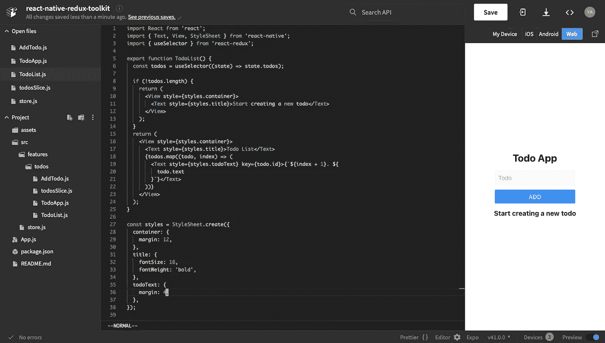
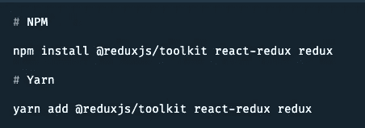
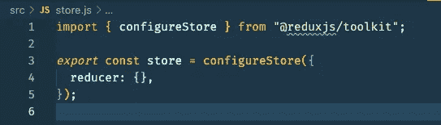
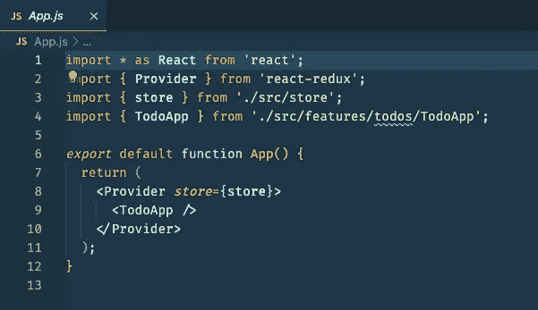
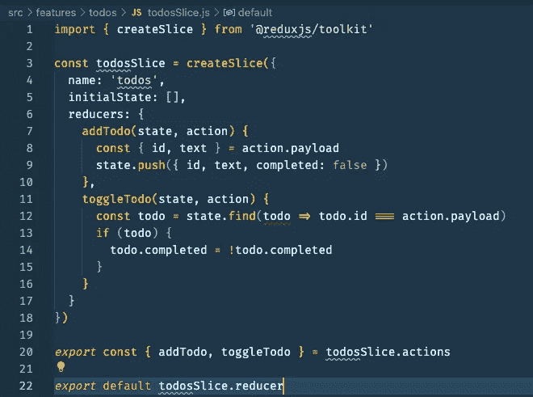
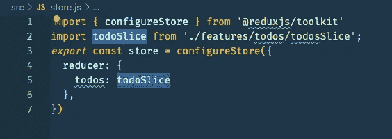
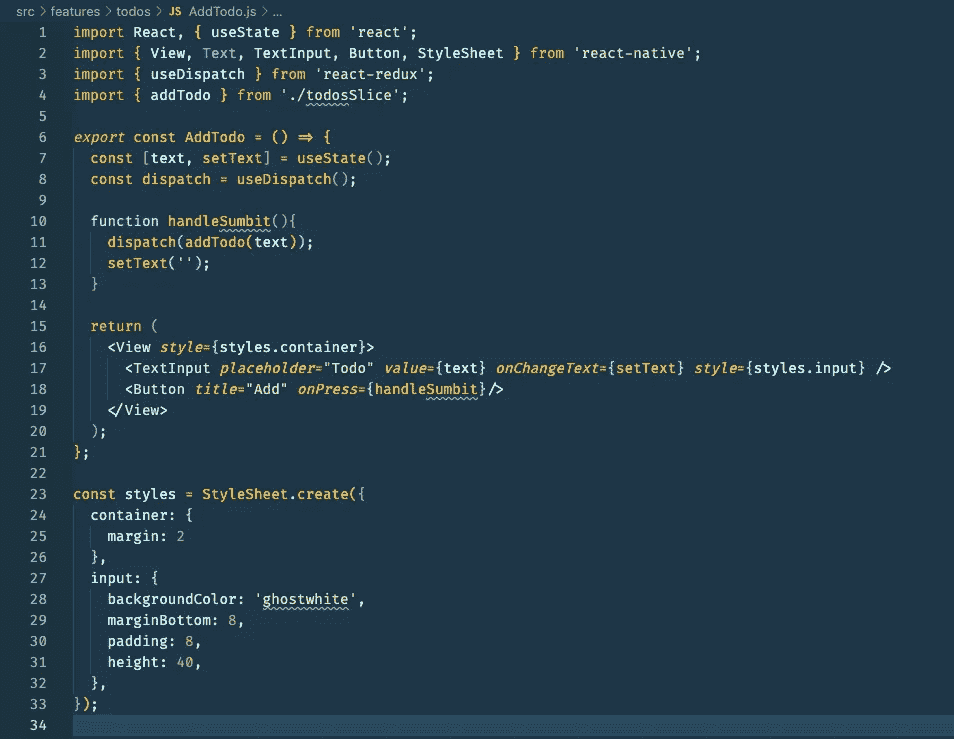
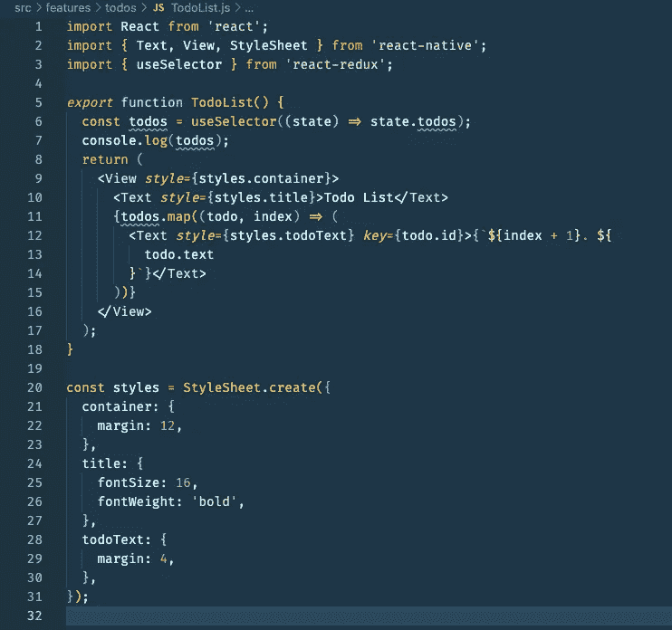

# 如何使用 Redux Toolkit 在 React Native 中构建一个简单的 ToDo App

> 原文：<https://javascript.plainenglish.io/how-to-build-a-simple-todo-app-in-react-native-using-redux-toolkit-eb9ca5409a1d?source=collection_archive---------1----------------------->

在本文中，我们将使用 React Native 中的 Redux 工具包构建一个简单的 todo 应用程序。

***链接世博小吃:****[【https://snack.expo.io/@yajana/react-native-redux-toolkit】](https://snack.expo.io/@yajana/react-native-redux-toolkit)*

****链接到 GitHub 资源库:****[*https://github.com/YajanaRao/react-native-redux-toolkit-app*](https://github.com/YajanaRao/react-native-redux-toolkit-app)**

**让我们从安装构建 todo 应用程序所需的库开始。**

# **安装所需的依赖项**

**使用 npm 或 yarn 安装 redux-toolkit**

****

# **创建 Redux 存储**

**让我们首先创建一个名为`src/store.js`的文件。从 Redux Toolkit 导入`configureStore` API。我们将首先创建一个空的 Redux 存储，并将其导出:**

****

# **提供 Redux 存储以本地反应**

**我们将通过在`App.js`中的应用程序周围包装 React-redux `<Provider/>`，使 Redux 可用于 React 本地组件。导入我们刚刚创建的 Redux 商店，在你的`<App/>`周围放一个`<Provider/>`，把商店当道具传过去:**

****

# ****创建 Todos 切片****

**添加一个名为`src/features/todos/todosSlice.js`的新文件。在该文件中，从 Redux Toolkit 导入`createSlice` API。**

****

# ****向商店添加切片减速器****

**接下来，我们需要从 todos 片导入 todos reducer 函数，并将其添加到我们的存储中。通过在 reducers 参数中定义一个字段，我们告诉商店使用这个 slice reducer 函数来处理该状态的所有更新。**

****

# **在 React 本机组件中使用 Redux 状态和动作**

**现在让我们创建`AddTodo`和`TodoList`组件来使用 redux 状态和动作。**

**在 AddTodo 组件中，我们使用`useDispatch` 到在 React 原生组件中使用 Redux 动作。按下添加按钮时，将调度 addTodo 操作，并以 Todo 文本作为有效负载。**

****

**在 TodoList 中，我们使用`useSelector`钩子来访问 redux store 中的 todos。**

****

**现在，让我们在 App 组件中导入`<AddTodo/>`和`<TodoList/>`组件，以查看一个工作的 Todo 应用程序。**

*****链接世博小吃****:*[*https://snack.expo.io/@yajana/react-native-redux-toolkit*](https://snack.expo.io/@yajana/react-native-redux-toolkit)**

*****链接到 GitHub 库****:*[*https://github.com/YajanaRao/react-native-redux-toolkit-app*](https://github.com/YajanaRao/react-native-redux-toolkit-app)**

## **参考资料:**

 **[## 快速入门| Redux 工具包

### 欢迎来到 Redux Toolkit 快速入门教程！本教程将简要介绍你 Redux 工具包，并教…

redux-toolkit.js.org](https://redux-toolkit.js.org/tutorials/quick-start)** ** [## reduxjs/redux-toolkit

### 在基础教程中，您看到了 Redux Toolkit 中包含的主要 API 函数，以及一些简短的示例…

github.com](https://github.com/reduxjs/redux-toolkit/blob/e85eb17b39a2118d859f7b7746e0f3fee523e089/docs/tutorials/intermediate-tutorial.md) 

*更多内容请看*[***plain English . io***](http://plainenglish.io/)**