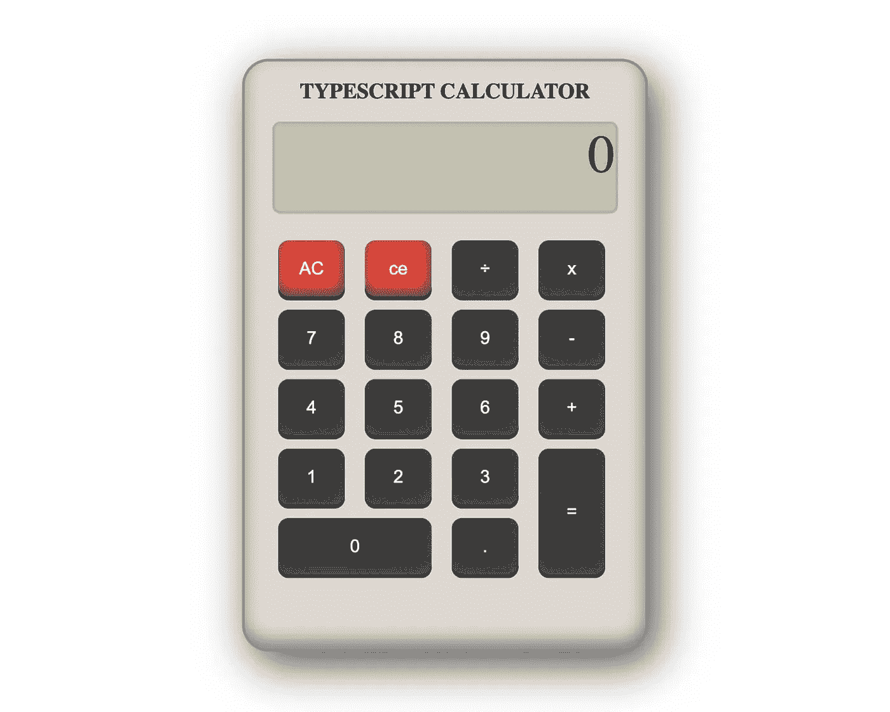

# 如何建立一个简单的网络计算器

> 原文：<https://javascript.plainenglish.io/how-to-build-a-simple-web-calculator-fa0ba9c2808c?source=collection_archive---------8----------------------->

## 教程

## 使用 TypeScript 和自定义元素

当您还在学习 JavaScript/TypeScript 时，构建一个计算器是一个很好的项目。在本教程中，您将了解计算器背后的 HTML、CSS 和 TypeScript。该项目将在没有 JavaScript 框架的情况下构建，并将使用 TypeScript starter 项目进行构建工具的基本设置。

*如果你想更多地了解这个 starter 项目是如何产生的，你可以在我关于如何制作自己的 TypeScript starter 项目的帖子中阅读更多内容。*

 [## 创建 TypeScript 初学者项目的初学者指南

### 创建新项目将变得快速、简单、轻松

javascript.plainenglish.io](/a-beginners-guide-to-creating-a-typescript-starter-project-6129deeeb973) 

## 该项目

你可以在 [Netlify](https://ws-simple-web-calculator.netlify.app/) 上看到这个计算器的最终版本。

## 加价

标记非常简单。根元素将是一个名为 *< ws-calculator >* 的**定制元素**。在这里面，将有一个显示部分和一个按钮部分。

## 造型

样式很简单，但是按钮使用 CSS 网格。这允许您将“=”按钮精确地放置在两行上。

## 逻辑

计算器将是一个名为`ws-calculator`的自定义元素。这意味着您需要从扩展 HTMLElement 类的类开始。

如果您正在跟进 TypeScript starter 项目，这应该放在`app.ts`中。

该类需要跟踪几件事情:

*   该显示元件
*   按钮元素
*   要计算的当前查询

让我们创建几个属性来保存这些数据。此外，让我们为查询属性创建一个 getter 和 setter。这允许您在查询更改时执行额外的逻辑。

现在这个类可以处理数据了，您需要为按钮点击设置事件侦听器。定制元素有两个自动调用的函数，这两个函数在这个项目中很有用:

*   connectedCallback —每次将自定义元素追加到文档连接的元素中时，都会调用此函数。
*   disconnectedCallback —每当自定义元素与文档的 DOM 断开连接时，都会调用此函数。

事件侦听器应该在 connectedCallback 上绑定，在 disconnectedCallback 上解除绑定。这将防止在移动或重新添加计算器时事件被双重绑定。

## 处理按钮点击

当你点击任何一个按钮，都会触发`handleButtonClick`方法。我们要确定按钮的价值，还要确定用户价值。例如，符号*用于执行乘法，但在显示器上，您希望显示“x”字符。

大多数按钮应该在显示屏上添加一个字符。但是，有三个按钮具有不同的功能:

1.  AC 按钮应该会清除显示。
2.  CE 按钮应该从显示中删除最后一个字符。
3.  =按钮应该执行计算。

让我们实现一个简单的 switch 语句来处理这些不同的输入。

`performCalculation`还不存在，我们暂时把它作为一个空函数添加进来。

## 更新显示

当点击按钮时,`query`属性会被更新，但是它们在屏幕上还不会被更新。让我们创建一个方法来更新显示，并从`query` setter 方法中调用该方法。

你现在应该有一个几乎正常工作的计算器，可以更新显示，可以清除显示，可以删除最后一个字符。是时候实现最后一个函数来执行计算了。

## 执行计算

有许多方法可以根据我们的查询执行计算。我们可以解析运算符之间的值，并执行逻辑来计算结果。出于本教程的目的，将使用`eval()`方法。

`eval()`方法是一个全局函数属性，它接受一个字符串作为参数。如果所讨论的字符串代表一个表达式，则计算该表达式并返回结果。

不建议**在生产环境中使用 eval，因为如果第三方可以更改字符串，它会带来安全风险。但是对于这个简单的教程，使用起来还是很安全的。**

在这种方法中，乘除字符被 JavaScript 理解的字符替换，查询通过 eval 方法运行，答案被格式化为四舍五入到小数点后两位的字符串。最后，用格式化的答案更新查询，因此您可以链接更多的计算或者对结果感到满意。

这标志着教程的结束。您已经使用 TypeScript 和定制元素规范构建了一个功能完整的计算器。

## 结论

我希望你能从这个简单的教程中学到一些东西。如果您有任何想法、问题、反馈或改进，请在评论中告诉我。

如果你想看的话, [GitHub 库](https://github.com/WesleySmits/simple-web-calculator)包含了这个项目的全部代码。

如果你想支持我，你可以[在 Twitter 上关注我](https://twitter.com/iamwesleysmits)，[给我买一个 Ko-fi](https://ko-fi.com/wesleysmits) 或者[通过我的链接](https://medium.com/@WesleySmits/membership)(附属)订阅 Medium。

*更多内容看*[***plain English . io***](http://plainenglish.io/)