# 如何用 React (Slack Clone)构建 Team Messenger 站点

> 原文：<https://javascript.plainenglish.io/how-to-build-a-team-messenger-site-with-react-slack-clone-304b31f65b1b?source=collection_archive---------4----------------------->

你将要建造的东西。[演示](https://slack-clone-b1ecf.web.app/)，Git 回购[此处](https://github.com/Daltonic/slack-clone)。

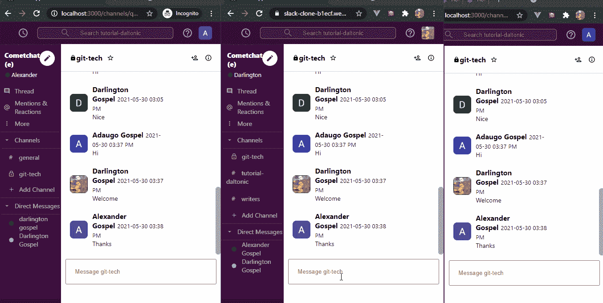

# 介绍

作为一名开发人员，你有足够的灵感吗？你开始你的网页开发者之旅了吗？或者你寻求提高你的技能到下一个水平？如果你对以上任何一个问题的回答是肯定的，那么这个教程就是为你准备的。作为一名开发人员，你需要亲自动手，实现市场上最好的应用程序集，让合适的人对你感兴趣。在本教程中，我们将结合 React、Firebase 和 [CometChat](https://cometchat.com) 的全部功能来构建一个让你大吃一惊的 slack 克隆。

# 先决条件

要学习本教程，你必须对[反应](https://reactjs.org/)的基本原理有一个基本的了解。这将帮助你快速消化本教程。

# 安装应用程序依赖项

首先，您需要在您的机器上安装 NodeJs 你可以去他们的[网站](https://nodejs.org/)看看。

其次，您还需要使用下面的命令在您的计算机上安装 React-CLI。

`npm install -g create-react-app`

接下来，创建一个名为 **slack-clone 的新项目。**

`npx create-react-app slack-clone`

现在，使用下面的命令为我们的项目安装这些必要的依赖项。

`npm install react-router-dom`

`npm install @material-ui/core`

`npm install @material-ui/icons`

`npm install firebase`

`npm install moment react-moment`

`npm install moment-timezone`

现在我们已经完成了安装，让我们继续构建我们的**松弛克隆**解决方案。

# 正在安装 CometChat SDK

1.  前往 [CometChat](https://app.cometchat.com/signup) Pro 并创建一个帐户。
2.  从[仪表盘](https://app.cometchat.com/apps)中，添加一个名为**“slack-clone”**的新应用。
3.  从列表中选择这个新添加的应用程序。
4.  从快速入门开始，复制 APP_ID、REGION 和 AUTH_KEY，稍后会用到它们。
5.  另外，从 API & Auth Key 选项卡中复制 REST_API_KEY。
6.  导航至用户选项卡，删除所有默认用户和组，不再赘述 ***(非常重要)*** 。
7.  在项目的 ***src*** 目录中创建**【app . config . js】**。
8.  在下一个标题下，从 CometChat 和 Firebase 输入您的**密匙**。
9.  运行以下命令安装**comeChat SDK**。

`npm install @cometchat-pro/chat@2.3.0 --save`

# 应用程序配置文件

下面的设置详细说明了为该项目配置 **app.config.js** 文件的格式。

`const firebaseConfig = {`

`apiKey: 'xxx-xxx-xxx-xxx-xxx-xxx-xxx-xxx',`

`authDomain: 'xxx-xxx-xxx-xxx-xxx-xxx-xxx',`

`databaseURL: 'xxx-xxx-xxx-xxx-xxx-xxx-xxx-xxx-xxx',`

`projectId: 'xxx-xxx-xxx',`

`storageBucket: 'xxx-xxx-xxx-xxx-xxx',`

`messagingSenderId: 'xxx-xxx-xxx',`

`appId: 'xxx-xxx-xxx-xxx-xxx-xxx-xxx-xxx',`

`measurementId: 'xxx-xxx-xxx',`

`},`

`const cometChat = {`

`APP_ID: 'xxx-xxx-xxx',`

`AUTH_KEY: 'xxx-xxx-xxx-xxx-xxx-xxx-xxx-xxx',`

`REST_KEY: 'xxx-xxx-xxx-xxx-xxx-xxx-xxx-xxx',`

`APP_REGION: 'xx',`

`}`

`*export* { firebaseConfig, cometChat }`

# 设置 Firebase 项目

前往 Firebase 创建一个新项目，并激活电子邮件和密码认证服务。

要开始使用 Firebase，您需要一个 Gmail 帐户。前往[火基地](https://console.firebase.google.com/u/0/)并创建一个新项目。

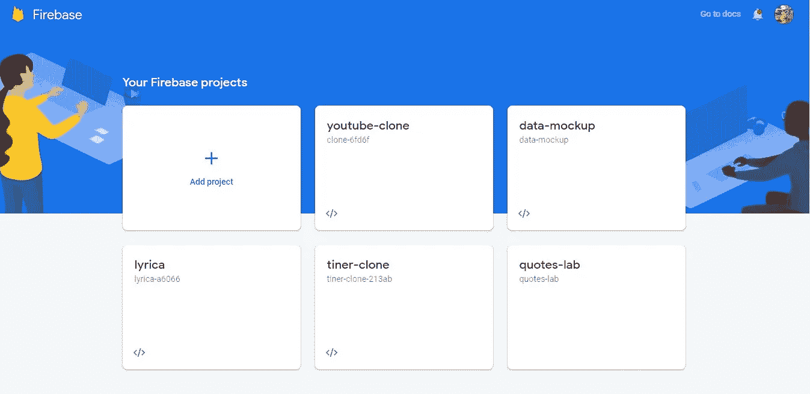

Firebase 支持使用不同的提供程序进行身份验证。例如，社交身份验证、电话号码以及标准的电子邮件和密码方法。由于我们将在本教程中使用电子邮件和密码身份验证方法，我们需要为我们在 Firebase 中创建的项目启用该方法，因为默认情况下它是禁用的。

在项目的身份验证选项卡下，单击登录方法，您将看到 Firebase 当前支持的提供商列表。

接下来，单击电子邮件/密码提供程序上的编辑图标并启用它。

现在，您需要在 Firebase 项目下注册您的应用程序。在项目概述页面上，选择添加应用程序选项并选择 web 作为平台。

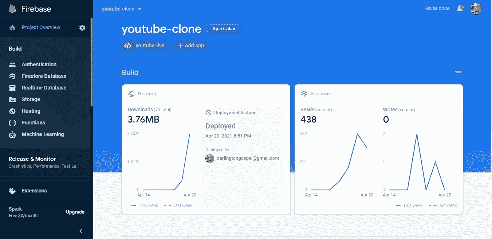

注册完应用程序后，会出现一个包含应用程序凭证的屏幕。请注意第二个脚本标记，因为我们将很快在应用程序中使用它。

恭喜你！现在您已经完成了安装，让我们做一些配置。

# 配置 CometChat SDK

在您的项目结构中，打开 index.js & index.css 文件并粘贴下面的代码。

上面的代码在你的应用启动前初始化 CometChat。index.js 条目文件使用您的 CometChat API 凭证。app.config.js 文件还包含 Firebase 配置变量文件。请不要在 Github 上共享您的密钥。

# 配置 Firebase 文件

该文件负责与 Firebase 身份验证和数据库服务进行交互。此外，它为我们的 Google 认证服务提供商做好了准备，使我们能够登录 Google。

# 项目结构

下图显示了项目结构。在继续之前，请确保您看到了文件夹排列。

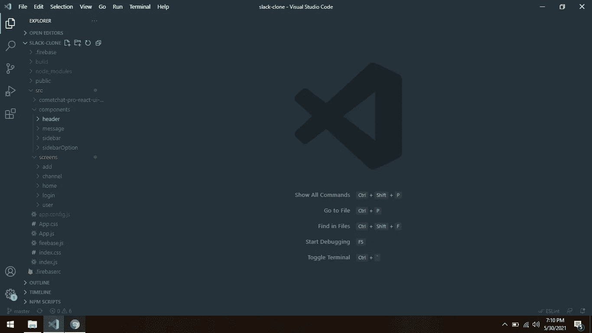

现在让我们制作项目的其余组件，如上图所示。

# 应用程序组件

App 组件负责使用*的服务动态呈现我们的组件。Auth-Guard 确保只有经过身份验证的用户才被允许访问我们的资源，从而为我们的应用程序提供安全性。*

*用上面的代码替换 **App.js** 和 **App.css** 文件中的所有内容。太好了，让我们继续下一件事。*

# *子组件*

*我们将会看到在我们的项目中，各种补充大组件的小组件。我们将使用图像来识别各种子组件以及它们的作用。*

*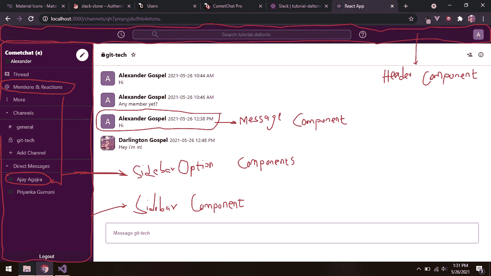*

*上述每个组件都会呈现应用程序的以下部分。是的，它是一个风格良好的 react-可重用组件。让我们继续把支持它们各自操作的代码吐出来。*

# *标题组件*

*观察这个组件中 CSS 美化的惊人数量。*

# *侧栏组件*

*遵守代码，你一定会尊重前端开发。此外，注意到该组件在初始化时使用了 **getChannel** 和 **getDirectMessages** 方法的服务。这些记录一旦被检索到，就被传递给 **sidebarOption** 组件，然后该组件填充侧栏视图。*

# *侧边栏选项组件*

*这个可重用的组件在我们的应用程序中只起到导航代理的作用。它跟踪用户的频道以及用户朋友的在线状态。*

# *消息组件*

*最后，消息组件优雅地用给定的消息列表填充视图，无论是一对多还是一对一聊天。*

*在这一点上，我们已经提到并解释了子组件的作用。让我们进一步讨论更大的组件。*

# *登录组件*

*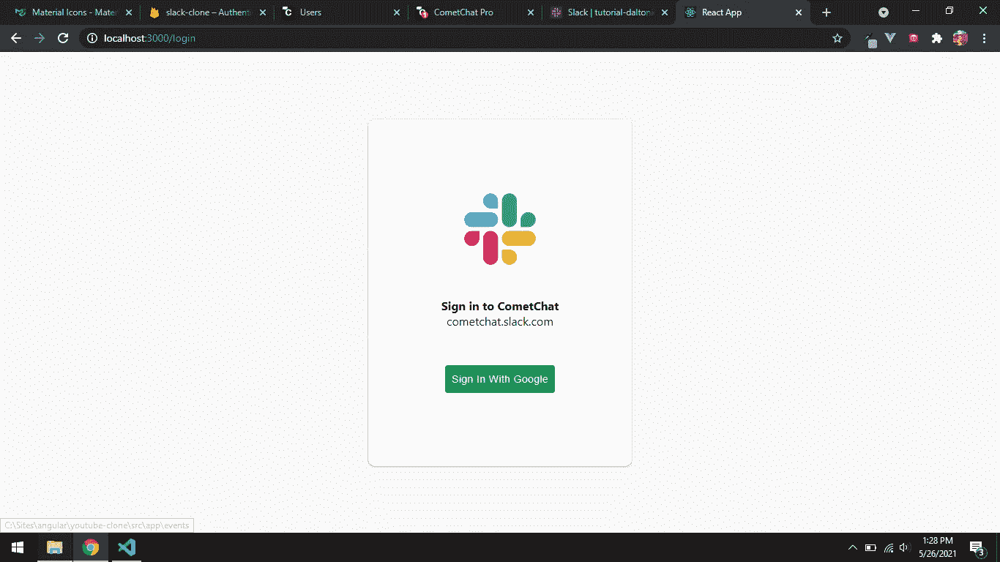*

*尽管看起来优雅而简单，登录组件有两个主要操作:注册和登录。在幕后，这两种方法结合了 Firebase auth-service 和 CometChat 用户身份验证的强大功能。*

*为了说明这个过程，让我们考虑一个名为“James”的用户。现在，詹姆斯必须点击绿色按钮，上面写着“登录谷歌”。如果这是他第一次登录我们的系统，系统会在 Firebase 和 CometChat 上注册他，并提醒他再次登录。*

*一旦完成初始注册，用户可以点击绿色按钮一次，并被允许使用他的谷歌证书我们的应用程序。下面的代码支持登录组件的操作。*

*我们已经完成了身份验证过程，让我们进入应用程序的其他页面。*

# *家用部件*

*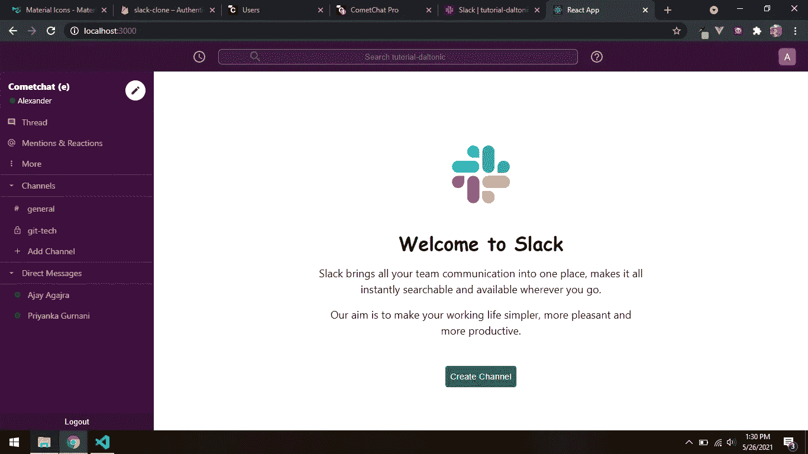*

*该组件为您提供了一个热情的欢迎屏幕，让您第一次看到 slack-clone 的美妙之处。代码如下所示。*

# *添加通道组件*

*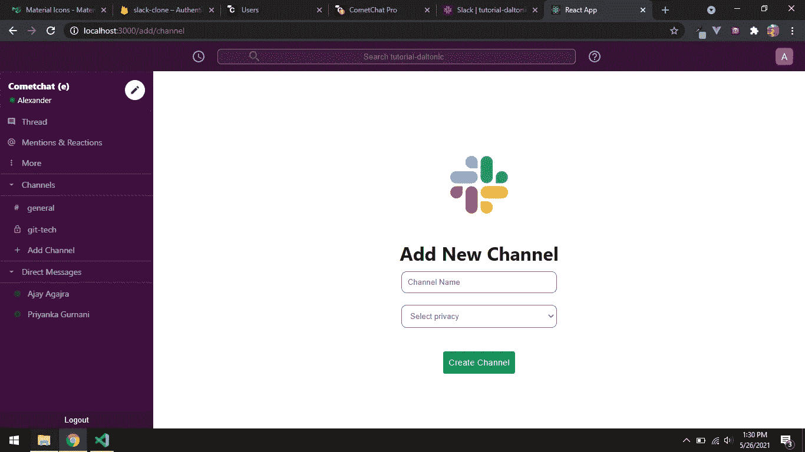*

*该组件具有创建新频道的简单功能。用户可以将频道设为私有或公共，这将决定它在侧边栏上的显示方式。*

# *通道组件*

*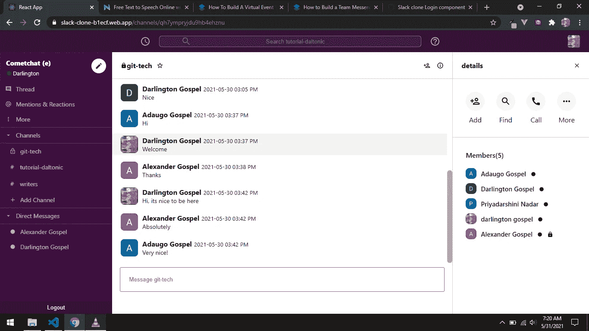*

*通道组件负责很多事情，包括获取通道细节、获取通道消息、列出成员、添加新成员等等。*

*该组件使用消息子组件在其视图上呈现消息。它还具有发送新消息和查看与您同时使用该频道的其他用户发来的消息的功能。这个组件做的另一件事是允许用户通过视频通话互相呼叫。*

*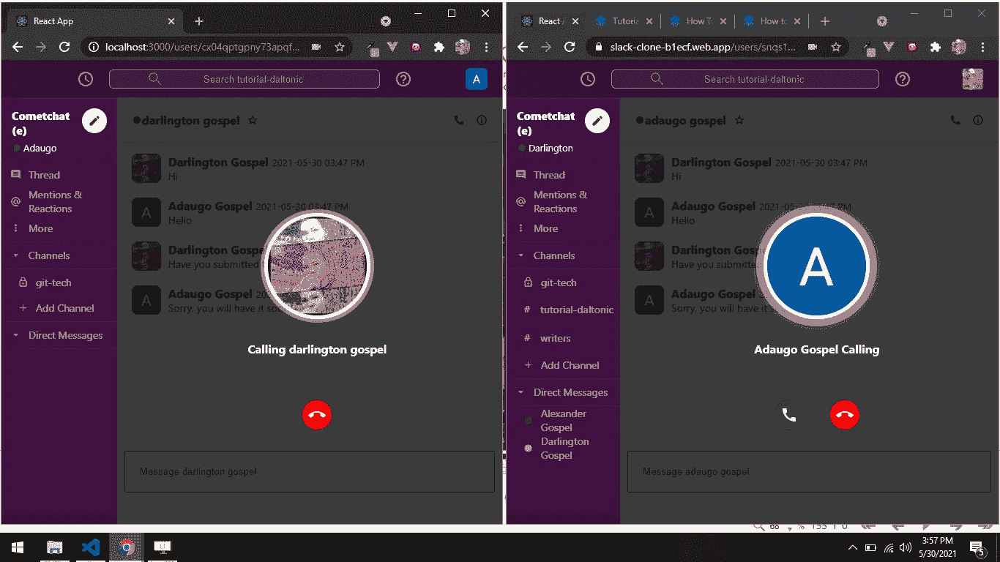*

*公开负责与通道组件相关的所有操作的代码要容易得多。*

# *用户组件*

*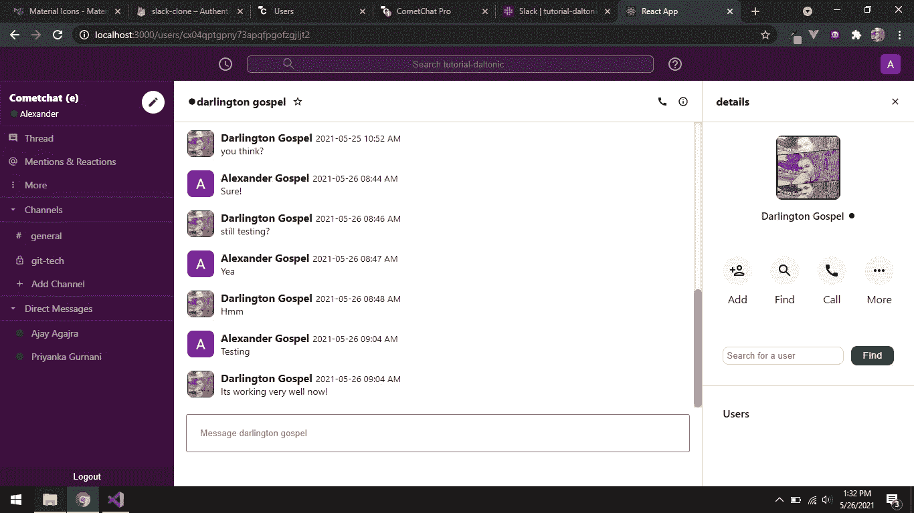*

*尽管如此，用户组件的行为方式与通道组件相同，只是在功能上有所不同。有了这个组件，你可以搜索朋友，并与他们直接联系。*

*祝贺您完成了 slack-clone，现在我们必须使用我们的终端使用下面的命令启动我们的应用程序。*

*`npm start`*

# *结论*

*总之，我们在软件开发领域完成了一项伟大的工作。已经使用 [CometChat](https://cometchat.com) SDK 和 Firebase 向您介绍了 slack 的内部工作方式及其消息传递能力。*

*您已经亲眼看到了如何集成大部分 CometChat 功能，例如文本和视频聊天。是时候站起来，开始用你从本教程中获得的价值碾压其他种类的应用程序了。*

# *关于作者*

*福音书达林顿是一个远程全栈 web 开发者，在**前端**和 **API** 开发方面多产。他对开发高级的、响应迅速的 web 应用程序非常感兴趣。他目前正在探索改进渐进式网络应用的新技术 **(PWA)** 。福音书达林顿目前是一名自由职业者，他利用空闲时间指导年轻人如何在生活中获得成功。他的爱好包括发明新食谱、写书、写歌和唱歌。你可以通过 [LinkedIn](https://www.linkedin.com/in/darlington-gospel-aa626b125/) 、 [Twitter](https://twitter.com/idaltonic) 或[脸书](https://www.facebook.com/darlington.gospel01)联系我。*

**更多内容请看*[***plain English . io***](http://plainenglish.io/)*