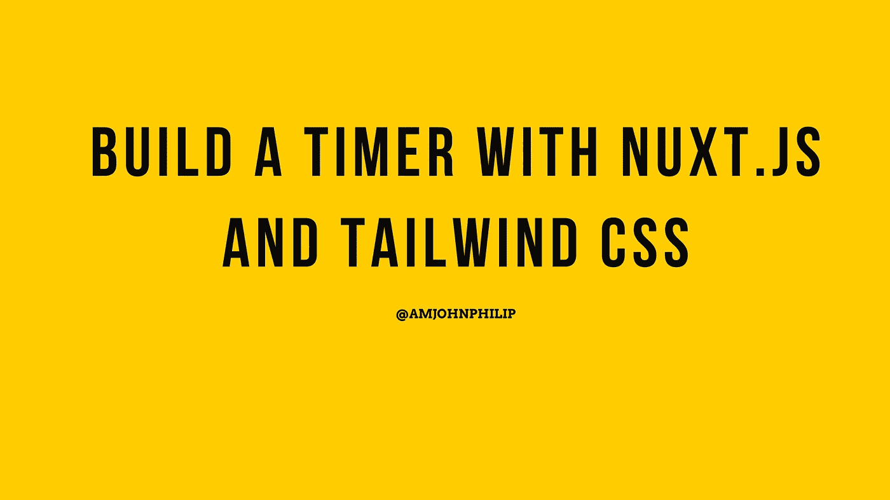

# 如何用 Nuxt.js 和 Tailwind CSS 构建定时器

> 原文：<https://javascript.plainenglish.io/how-to-build-a-timer-with-nuxt-js-and-tailwind-css-3312313d8e1f?source=collection_archive---------9----------------------->

## 用 Nuxt.js 和 Tailwind CSS 构建一个定时器。



Photo by [John Philip](https://medium.com/u/c2cdb19c0977?source=post_page-----3312313d8e1f--------------------------------)

在本教程中，我们将在 JavaScript 和 Tailwind CSS 中构建一个计时器来设计 UI。

在这些简单的项目中，我们将了解:

*   组件。
*   绑定数据和输入。
*   指令。
*   条件渲染。

太棒了，让我们开始吧。

## **安装 Nuxt.js**

Nuxt.js 很容易安装，你需要安装 Node.js，如果你没有的话，在这里 下载[。](https://nodejs.org/en/)

现在，根据您喜欢的包管理器，您可以安装 Nuxt.js，如下所示。

**纱线**

```
yarn create nuxt-app <project-name>
```

**NPX**

```
npx create-nuxt-app <project-name>
```

**NPM**

```
npm init nuxt-app <project-name>
```

系统会提示您一些选项，选择适合您的开发的选项，然后按 enter UI framework、TypeScript、linter、testing framework 等)。

允许项目被搭建并安装到您的系统中(这可能需要一些时间)。

下一步是导航到项目文件夹并启动它:将目录更改为项目并运行命令 ***npm run dev*** 。

这个命令将为您的开发环境提供***http:localhost://3000***。

现在我们的项目开始了，我们需要马上动手做代码。

导航到 ***组件*** 文件夹，创建一个名为 ***Timer.vue*** 的文件。

这将是我们的计时器组件。

在我们的计时器组件上，我们已经为开始和停止按钮附加了相应更新状态的方法，并有条件地呈现给应用程序 UI。

在 start 按钮上，我们附加了一个指令，当点击时将触发一个方法(Start)。

***start*** 方法将是一个间隔，它将在扣除一切的同时，每秒运行我们的计时器。

类似地，我们有一个 ***停止*** 方法，当被点击时，将运行并停止计数。

我们也有一个音频通知声音，当计时器运行时会播放并通知用户。

现在我们需要将我们的应用程序呈现给 Nuxt.js 应用程序实例。

我们可以这样做。

请记住，当我们在 Nuxt.js 中创建组件时，它们是全局组件，我们可以在应用程序实例中呈现它们，如上所示。

你可以在这里查看正在进行的项目。

 [## 苹果蠹

### 编辑描述

pomodoroio.netlify.app](https://pomodoroio.netlify.app/) 

GitHub 库在这里，你会乐意贡献。

[](https://github.com/developerphilo/pomofocus) [## GitHub-developer Philo/pomofocus:实现 Pomodoro 生产力技术的应用程序

### 实现番茄工作法的应用程序。这项技术是由…开发的时间管理方法

github.com](https://github.com/developerphilo/pomofocus) 

## **结论。**

这是一个我们可以用 Nuxt.js 构建的简单定时器的例子。我希望你能学到一些东西。

感谢您阅读本教程到目前为止。

## **更多阅读:**

[](/5-insanely-amazing-tools-that-help-me-code-a0656a0a5ad5) [## 5 个帮助我编码的惊人工具

### 我每天使用的 5 个帮助我编码的工具。

javascript.plainenglish.io](/5-insanely-amazing-tools-that-help-me-code-a0656a0a5ad5) [](/top-10-javascript-tips-and-tricks-you-need-to-know-27896d2a313f) [## 您需要知道的 10 大 JavaScript 技巧和诀窍

### 您可能不知道可以在 JavaScript 中执行的有用提示和技巧。

javascript.plainenglish.io](/top-10-javascript-tips-and-tricks-you-need-to-know-27896d2a313f) 

*更多内容尽在*[***plain English . io***](http://plainenglish.io/)