# 如何用 Angular 构建一个 YouTube 直播克隆(虚拟活动站点)

> 原文：<https://javascript.plainenglish.io/how-to-build-a-virtual-event-site-with-angular-youtube-live-clone-4a6676abbc26?source=collection_archive---------6----------------------->

你将要建造的东西。[演示](https://clone-6fd6f.web.app/)，Git 回购[这里](https://github.com/Daltonic/youtube-live-clone)。

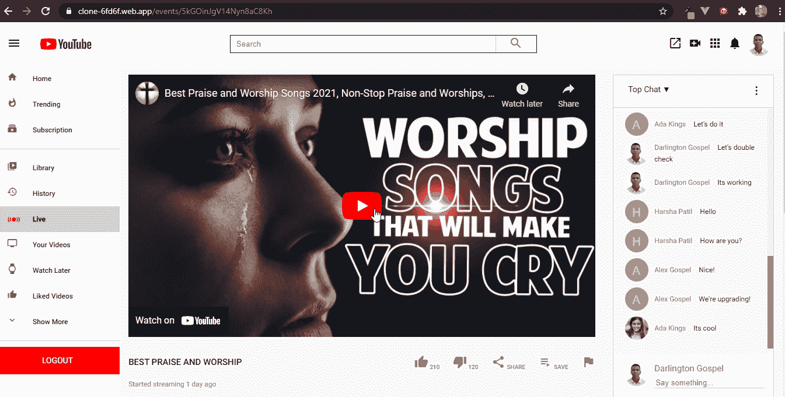

# 介绍

生活中有一条真实的原则是这样陈述的:**“如果你想变得伟大，那就从用小方法做伟大的事情开始吧”**。这也适用于你，一个渴望以一种伟大的方式影响行业的开发人员，**“你可以从以一种微小的方式构建伟大的东西开始”**。成就伟业的一个方法是从小处着手。此外，[comet chat](https://www.cometchat.com/)communication SDK 为您提供了将一些出色的消息功能集成到您的应用程序中的机会，例如文本、音频和视频聊天功能。

# 先决条件

要遵循本教程，您必须对[角度](https://angular.io/)的一般原理有一个基本的了解。这将帮助你快速消化本教程。

# 安装应用程序依赖项

首先，你需要在你的机器上安装 NodeJs，你可以去他们的网站。

其次，您还需要使用下面的命令在您的计算机上安装 Angular-CLI。

`npm install -g @angular/cli`

接下来，创建一个名为 **youtube-live-clone 的新项目。**

`ng new youtube-live-clone`

ng new 命令提示您输入要包含在初始应用程序中的功能信息。通过按 Enter 或 Return 键接受默认值。

Angular CLI 安装必要的 Angular npm 软件包和其他依赖项。这可能需要几分钟时间。

最后，使用下面的命令为我们的项目安装这些必要的依赖项。

`ng add @angular/material`

`npm install @angular/youtube-player`

`npm install @angular/fire`

`ng add @angular/fire`

现在我们已经完成了安装，让我们继续构建我们的 **youtube-live clone** 解决方案。

# 正在安装 CometChat SDK

1.  前往 [CometChat](https://app.cometchat.com/signup) Pro 并创建一个帐户。
2.  从[仪表盘](https://app.cometchat.com/apps)中，添加一个名为**“YouTube-clone”**的新应用。
3.  从列表中选择这个新添加的应用程序。
4.  从“快速入门”中，复制 APP_ID、地区和 AUTH_KEY。这些将在以后使用。
5.  导航至用户选项卡，删除所有默认用户和组，不做修改 ***(非常重要)*** 。
6.  通过在终端上输入该命令，在您的机器上安装 Angular CLI。npm install -g @angular/cli
7.  打开项目中的**【环境. ts】**文件。
8.  在下一个标题下，从 CometChat 和 Firebase 输入你的**密匙**。
9.  将相同的设置复制到**“environment . prod . ts”**中。
10.  运行以下命令安装 **CometChat SDK** 。

`npm install @cometchat-pro/chat@2.3.0 --save`

# 环境变量

下面的设置详细说明了本项目**环境. ts** 文件的配置格式。

`firebase: {`

`apiKey: 'xxx-xxx-xxx-xxx-xxx-xxx-xxx-xxx',`

`authDomain: 'xxx-xxx-xxx-xxx-xxx-xxx-xxx',`

`databaseURL: 'xxx-xxx-xxx-xxx-xxx-xxx-xxx-xxx-xxx',`

`projectId: 'xxx-xxx-xxx',`

`storageBucket: 'xxx-xxx-xxx-xxx-xxx',`

`messagingSenderId: 'xxx-xxx-xxx',`

`appId: 'xxx-xxx-xxx-xxx-xxx-xxx-xxx-xxx',`

`measurementId: 'xxx-xxx-xxx',`

`},`

`APP_ID: 'xxx-xxx-xxx',`

`AUTH_KEY: 'xxx-xxx-xxx-xxx-xxx-xxx-xxx-xxx',`

`APP_REGION: 'xx',`

# 设置 Firebase 项目

前往 Firebase 创建一个新项目，并激活电子邮件和密码认证服务。你就是这样做的。

要开始使用 Firebase，您需要一个 Gmail 帐户。前往 [Firebase](https://console.firebase.google.com/u/0/) 并创建一个新项目。

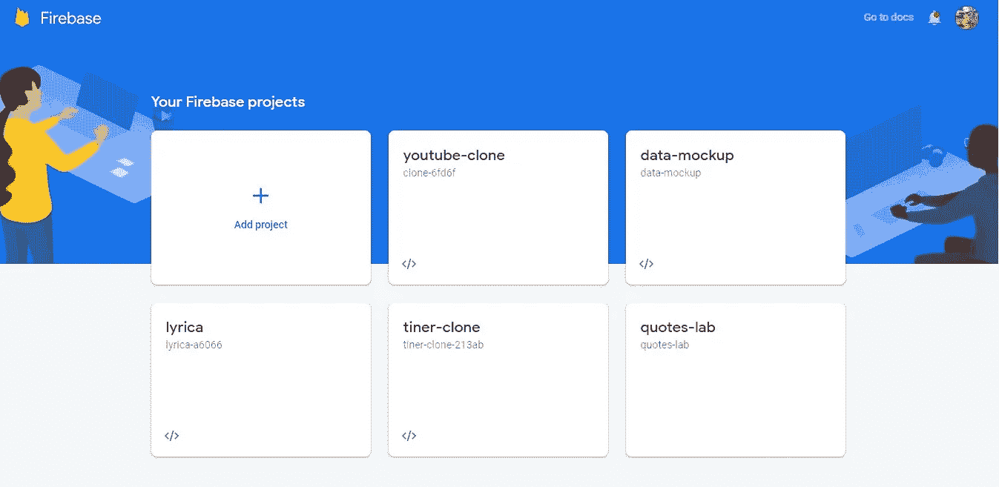

Firebase 支持使用不同的提供程序进行身份验证。例如，社会认证、电话号码以及标准的电子邮件和密码方法。由于我们将在本教程中使用电子邮件和密码身份验证方法，我们需要为我们在 Firebase 中创建的项目启用该方法，因为默认情况下它是禁用的。

在项目的身份验证选项卡下，单击登录方法，您将看到 Firebase 当前支持的提供商列表。

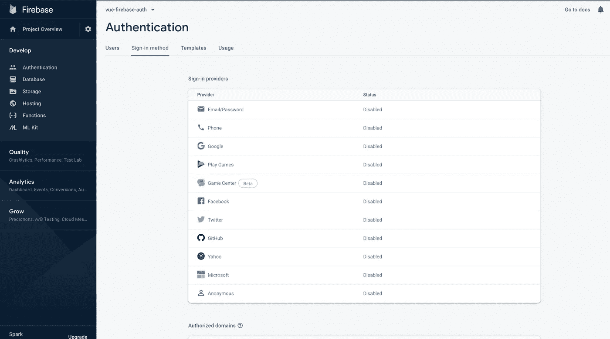

接下来，单击电子邮件/密码提供程序上的编辑图标并启用它。

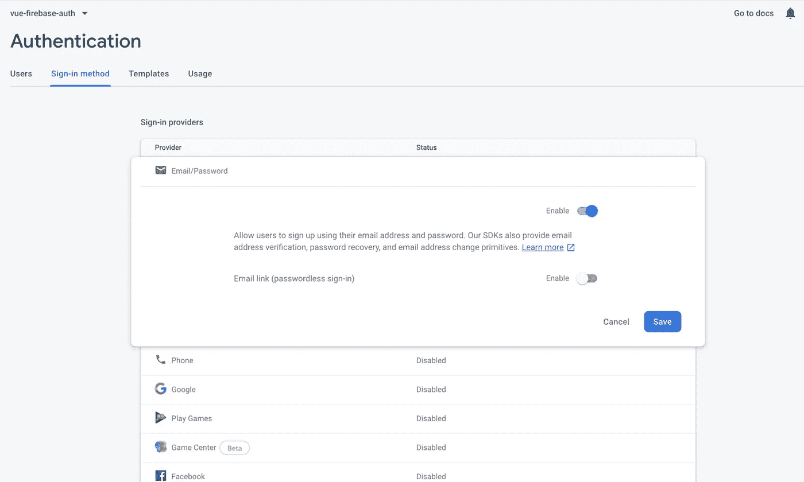

接下来，您需要在 Firebase 项目下注册您的应用程序。在项目概述页面上，选择添加应用程序选项并选择 web 作为平台。

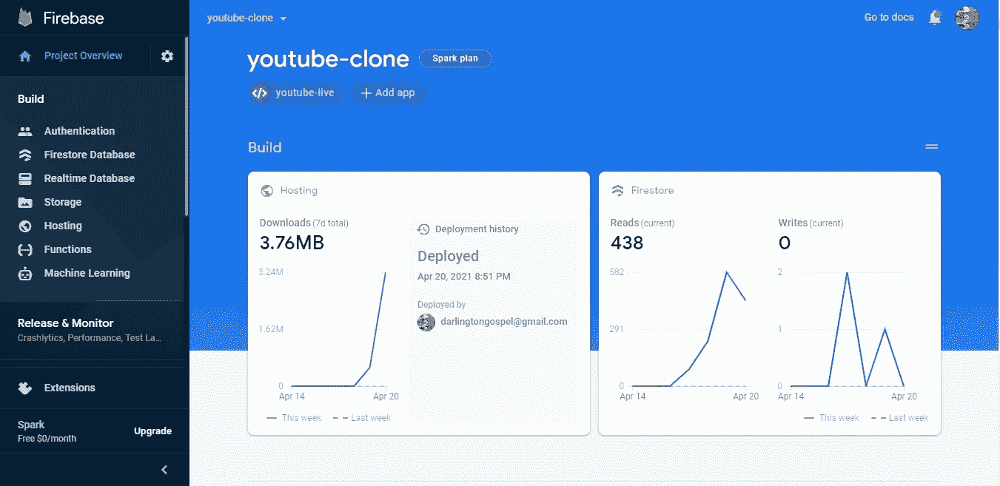

注册完应用程序后，会出现一个包含应用程序凭证的屏幕。请注意第二个脚本标记，因为我们很快就会在我们的 **Angular** 应用程序中使用它。

祝贺您，现在您已经完成了安装，让我们来做一些配置。

# 配置 CometChat SDK

在你的项目结构中，打开 **main.ts** 并粘贴这些代码。

[https://gist . github . com/Daltonic/88e 612d 82 a5e 6824278629 be 3 bdbd 927](https://gist.github.com/Daltonic/88e612d82a5e6824278629be3bdbd927)

上面的代码在你的应用程序中初始化 CometChat，在我们的应用程序启动之前。 **main.ts** 条目文件使用您的 CometChat API 凭证。 **environment.ts** 文件还包含您的 Firebase 配置变量文件。请不要在 **Github** 上分享你的 ***密匙*** 。

# 设置路由器

**app-routing.module.ts** 文件包含我们应用程序中所有可用的路线及其安全许可。

The Router File

# 项目结构

下图显示了项目结构。在继续之前，请确保您看到了文件夹排列。

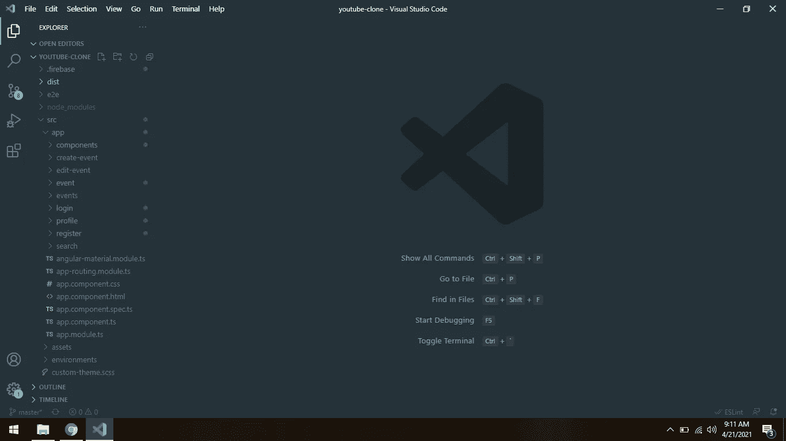

现在让我们制作项目的其余组件，如上图所示。

# 应用程序组件

以下代码是我们的应用在 ***角路由器*** 中的包装，支持快速导航。对于每条路线，该组件将我们的应用程序导航到适当的 URL。

The App Component

用<router-outlet></router-outlet>替换**app.component.html**文件中的所有内容，并删除 **app.component.css** 中的所有样式。

# 角度材质图标设置

以下代码将配置我们的应用程序，以便在整个项目中充分利用材质图标的力量。

Material Icons Module

# 应用程序模块

将代码粘贴到您的 **app.module.ts** 文件中，这是一个非常重要的文件，它捆绑了我们将在项目中使用的所有组件。

The App Module

# 侧栏组件

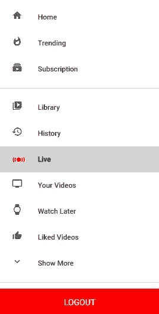

侧边栏组件由子组件精心制作，反映了真实的 YouTube live 的路线。您必须自己花时间研究标记和样式结构。这个组件在我们的应用程序中的其他两个组件之间重用。下面是支持其操作的代码。

The Sidebar Component

# 标题组件

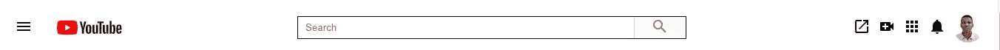

header 组件，这个单文件可重用组件承载了我们的应用程序运行所必需的大量重要特性。除了作为我们应用程序的导航代理，它还包含搜索栏组件，负责为用户整理相关事件。没有大话，这里是负责其行动的代码。

The Header Component

# 视频组件

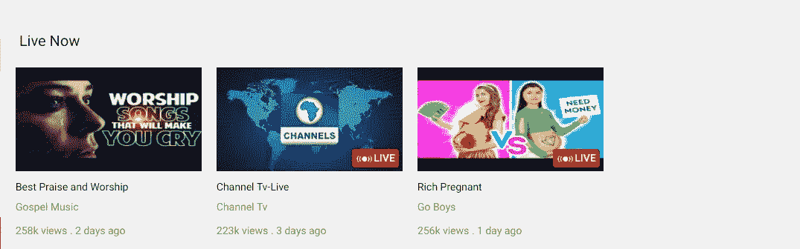

这是一个应用程序中使用的单文件组件，用于列出从 firestore 检索到的事件。它携带事件信息，如标题、描述、图像 URL 和 YouTube 链接。这款应用的成功很大程度上要归功于这个组件。下面的代码清楚地描述了这个组件的功能。

The Video COmponent

# 相关的视频组件

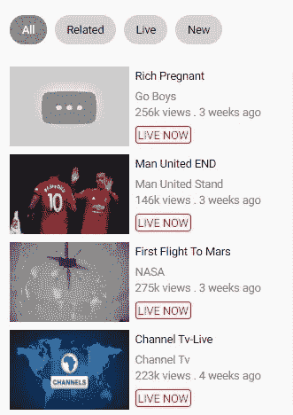

和 **video.component.ts** 一样，这个组件的作用也类似。唯一的区别是，视频组件垂直列出视频，而这个组件水平列出视频。这是代码。

Related Video Component

# 行视频组件

该组件负责使侧边栏路由看起来像上面的图像。它需要一个有棱角的材料图标和一个标题来显示你在上面看到的。下面是它的代码。

The Row Component

# 注册组件

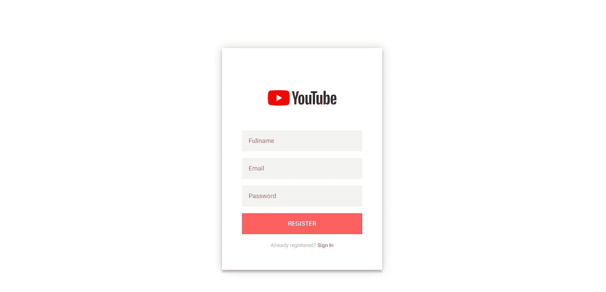

该组件结合了 firebase *auth-service* 和 CometChat 的强大功能，因此每当新用户注册我们的应用程序时，用户的详细信息都会被 firebase 捕获，并注册到我们的 CometChat 帐户上。下面的代码详细解释了它。

`public submit(form: any): void {`

`this.loading = true;`

`const fullname = form.fullname;`

`const email = form.email;`

`const password = form.password;`

`const avatar = this.generateImageFromIntial(fullname);`

`this.auth`

`.createUserWithEmailAndPassword(email, password)`

`.then((res) => {`

`res.user`

`.updateProfile({`

`displayName: fullname,`

`photoURL: avatar,`

`})`

`.then(() => this.signUpWithCometChat({ ...res.user, avatar }));`

`})`

`.catch((error) => {`

`console.log(error);`

`this.loading = false;`

`});`

`}`

`private signUpWithCometChat(data: any) {`

`const apiKey = environment.APP_KEY;`

`const user = new CometChat.User(data.uid);`

`user.setName(data.displayName);`

`user.setMetadata({avatar: data.avatar});`

`CometChat.createUser(user, apiKey)`

`.then(() => this.route.navigate(['login']))`

`.catch((error) => {`

`console.log(error);`

`this.loading = false;`

`});`

`}`

因此，每当用户在我们的应用程序中注册时，他就会自动同时在我们的 CometChat 帐户上注册。下面是解释这一切的完整代码。

The Register Component TS file

The Register Component HTML file

The Register Component CSS file

# 登录组件

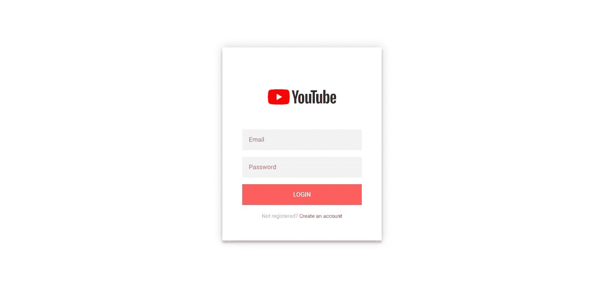

除了样式华丽之外，登录组件遵循注册组件的行为。例如，如果一个名为 Maxwell 的用户在我们的应用程序上注册，他就会被导航到登录页面进行登录。因为 CometChat 也有他的详细信息，他签到的那一刻，他也会被 CometChat 签到。下面这段代码更好地演示了这个过程。

`public submit(form): void {`

`this.loading = true;`

`const email = form.email;`

`const password = form.password;`

`this.auth`

`.signInWithEmailAndPassword(email, password)`

`.then((res) => this.loginCometChat(res.user))`

`.catch((error) => {`

`console.log(error);`

`this.loading = false;`

`});`

`}`

`private loginCometChat(user: any) {`

`const apiKey = environment.APP_KEY;`

`CometChat.login(user.uid, apiKey)`

`.then(() => this.route.navigate(['']))`

`.catch((error) => {`

`console.log(error);`

`this.loading = false;`

`});`

`}`

用户成功登录后，会被重定向到主页。 **app.routing-module.ts** 中的 route-guard 确保只有经过认证的用户才被允许访问主页。以下脚本描述了登录组件的整体操作。

The Login Component TS file

The Login Component HTML file

The Login Component CSS file

# 配置文件组件

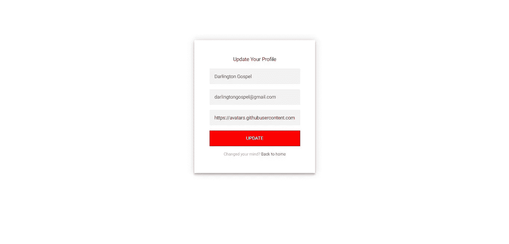

profile 组件负责更新我们的数据，这些数据将反映在我们的应用程序中。该组件的主要任务之一是更改用户的配置文件。

在**注册组件**中，一旦用户注册，我们就用他名字的首字母为他生成一个占位符头像。简档组件允许用户将他们的化身更新为他们偏好的选择。下面是执行该操作的完整代码。

The Profile Component TS File

The Profile Component HTML file

The Profile Component CSS file

# 创建事件组件

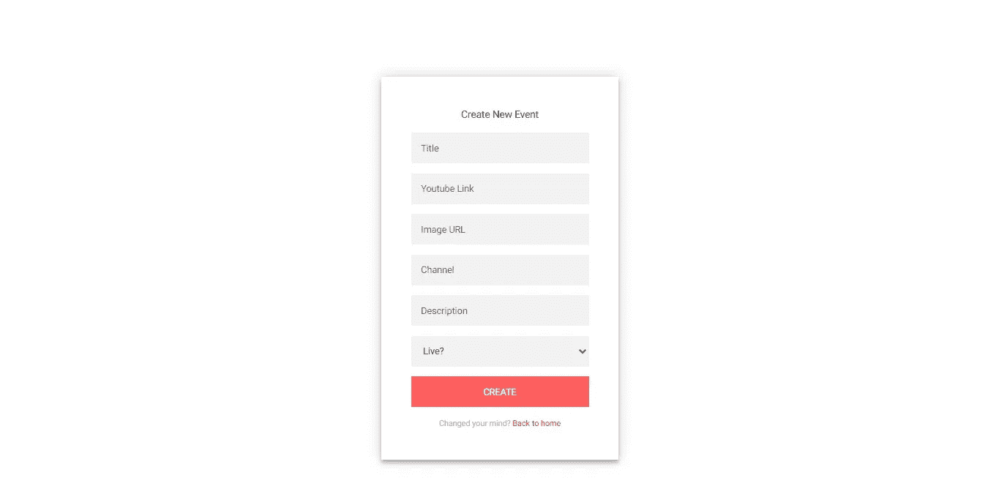

这是一个重要的组成部分，它包含了许多与我们的应用程序的成功相关的责任。该组件保留收集事件信息的职责，如视频标题、链接、图像 URL、描述等。上面的图像清楚地描述了它。

您必须了解一些后台活动，每当一个事件被添加到我们的平台。

例如，一个名为 Musa 的用户向我们的平台添加了一个新事件，在后台执行了两个操作。首先，firebase 存储了该事件的详细信息，CometChat 也为该事件创建了一个群组。下面的代码对此有更好的解释。

`public submit(form: NgForm): void {`

`*if* (form.valid) {`

`this.loading = true;`

`const data = form.value;`

`data.timestamp = new Date().toJSON();`

`data.views = this.randomNumber(100, 300);`

`data.uid = this.authState.uid;`

`this.firestore`

`.collection('events')`

`.add(data)`

`.then((d) => {`

`form.reset();`

`const groupName = this.toVideoId(data.videoId);`

`const guid = d.id;`

`this.cometChatCreateGroup({ groupName, guid });`

`});`

`}`

`}`

`private cometChatCreateGroup(data: any) {`

`const GUID = data.guid;`

`const groupName = data.groupName;`

`const groupType = CometChat.GROUP_TYPE.PUBLIC;`

`const password = '';`

`const group = new CometChat.Group(GUID, groupName, groupType, password);`

`CometChat.createGroup(group)`

`.then((group) => console.log('Group created successfully:', group))`

`.catch((error) => {`

`console.log('Group creation failed with exception:', error)`

`this.loading = false;`

`});`

`}`

现在，您已经了解了幕后发生的事情，让我们来看看这个组件的完整代码。

The Create EventComponent TS file

The Create EventComponent HTML file

The Create EventComponent CSS file

# 编辑事件组件

像**创建事件组件**，编辑组件那些几乎相同的工作，只是它修改你添加到平台的事件的细节。

它有一个重要的操作模式，下面的代码片段可以很好地解释这一点。

The Edit Event Component TS files

The Edit Event Component HTML file

The Create EventComponent CSS file

# 事件组件

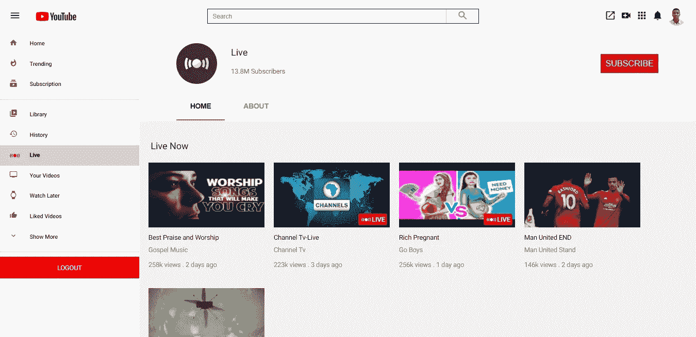

这是我们的应用程序取得全面成功的一个重要因素。它的任务是优雅地列出我们在应用程序中创建的所有事件。

它使用视频组件的服务将视频卡垂直呈现给视图。不多说了，让我们看看它在代码方面是如何工作的。

The Events Component TS file

The Events Component HTML file

The Events Component CSS file

# 事件组件

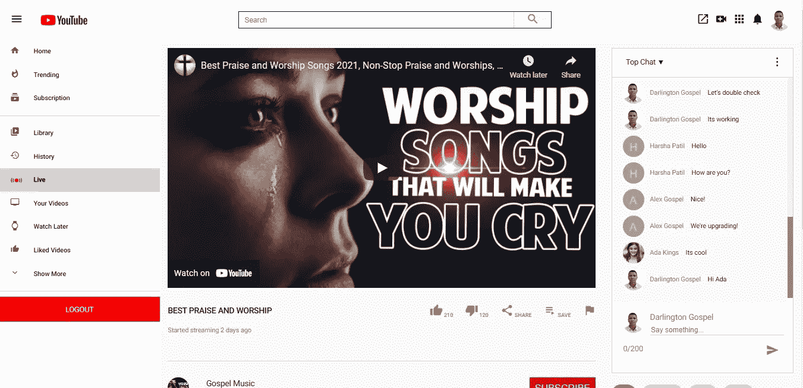

这个组件听起来可能与前面的组件相似，但是它们做的事情完全不同。事件组件显示事件列表，而此组件展示单个事件。

除了它特有的酷的设计，事件组件体现了一个令人兴奋的责任的完整目录，让我们列出它们。

*   事件视频流
*   实时聊天活动
*   相关视频显示
*   执行实时消息传递
*   事件编辑和删除功能

那是一些责任，你不这样认为吗？请允许我用代码与您讨论一些功能。

`// This method listens for a real-time message and renders it to view`

`private listenForMessage(guid: string) {`

`const listenerID = guid;`

`CometChat.addMessageListener(`

`listenerID,`

`new CometChat.MessageListener({`

`onTextMessageReceived: (message) => {`

`this.messages.push(message);`

`this.scrollToEnd();`

`},`

`})`

`);`

`}`

`// This method retreives all the messages for the current event`

`private getMessages(guid: string) {`

`const limit = 50;`

`const messagesRequest = new CometChat.MessagesRequestBuilder()`

`.setLimit(limit)`

`.setGUID(guid)`

`.build();`

`messagesRequest`

`.fetchPrevious()`

`.then((messages: Array<any>) => {`

`this.messages = messages.filter((m) => m.type == 'text');`

`})`

`.catch((error) =>`

`console.log('Message fetching failed with error:', error)`

`);`

`}`

`// This method sends a new message into the group`

`private sendMessage(data: any, form: NgForm) {`

`const receiverID = data.guid;`

`const messageText = data.message;`

`const receiverType = CometChat.RECEIVER_TYPE.GROUP;`

`const textMessage = new CometChat.TextMessage(`

`receiverID,`

`messageText,`

`receiverType`

`);`

`CometChat.sendMessage(textMessage)`

`.then((message) => {`

`this.messages.push(message);`

`form.reset();`

`this.scrollToEnd();`

`this.words = 0;`

`})`

`.catch((error) =>`

`console.log('Message sending failed with error:', error)`

`);`

`}`

`ngOnDestroy(): void {`

`CometChat.removeMessageListener(this.id)`

`}`

`// This method joins a user into a group associated with an event`

`private joinGroup(guid: string) {`

`const GUID = guid;`

`const password = '';`

`const groupType = CometChat.GROUP_TYPE.PUBLIC;`

`CometChat.joinGroup(GUID, groupType, password)`

`.then((group) => {`

`console.log('Group joined successfully:', group);`

`this.router.navigate(['events', guid]);`

`})`

`.catch((error) => {`

`*if* (error.code != 'ERR_ALREADY_JOINED')`

`console.log('Group joining failed with exception:', error);`

`this.router.navigate(['events', guid]);`

`});`

`}`

现在，您已经理解了这个组件中的后台活动，是时候查看完整的代码了。

The Event Component TS file

The Events Component HTML file

The Events Component CSS file

# 搜索组件

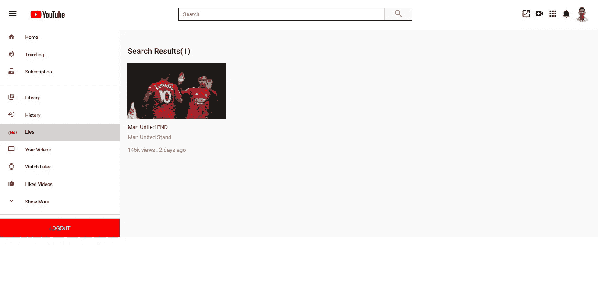

最后，让我们讨论搜索组件如何解析事件排序操作。显然，随着更多的事件被添加到平台中，一个阈值将会到来，这将需要搜索事件的能力。这个组件提供了那个解决方案，让我们在下面的代码中看看它背后的逻辑。

The Search Component TS file

The Event Component HTML file

The Events Component CSS file

按照指示粘贴完代码后，运行下面的命令启动您的应用程序。

`ng serve --open`

在终端中构建几秒钟后，您的应用程序应该启动并运行。

祝贺你，你刚刚完成了 YouTube 的克隆-直播，干得好！！！

# 结论

总之，建立一个像 YouTube-Live 这样的虚拟活动网站是一个提升你开发技能的好主意。特别是，使用 **CometChat SDK** 集成实时聊天功能，让像我这样的人梦想成真。

本教程向您传授了构建我们这个时代最有价值的应用程序之一的克隆所需的能力。是时候开始忙碌了，复制一个 **YouTube-Live 克隆**。

*更多内容请看*[***plain English . io***](http://plainenglish.io/)