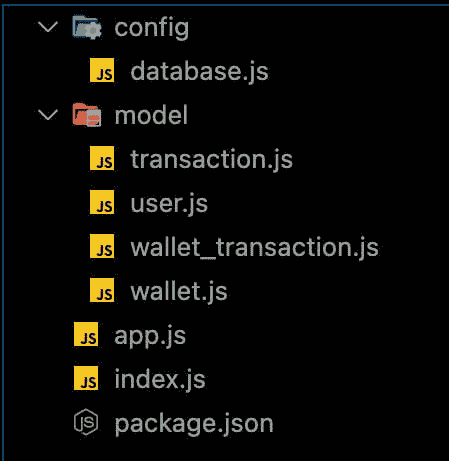
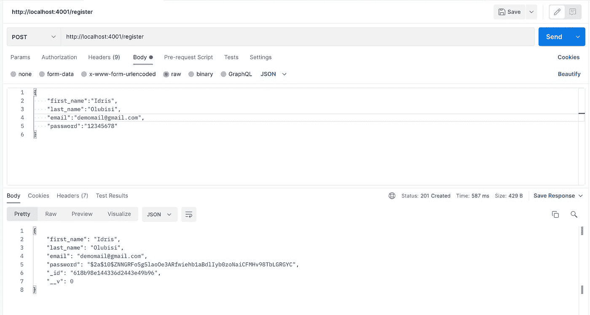
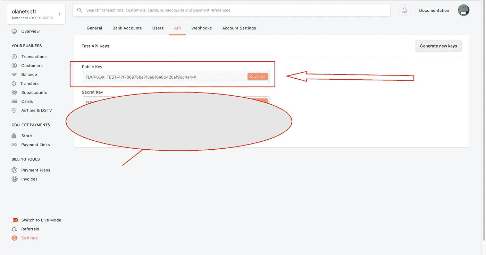
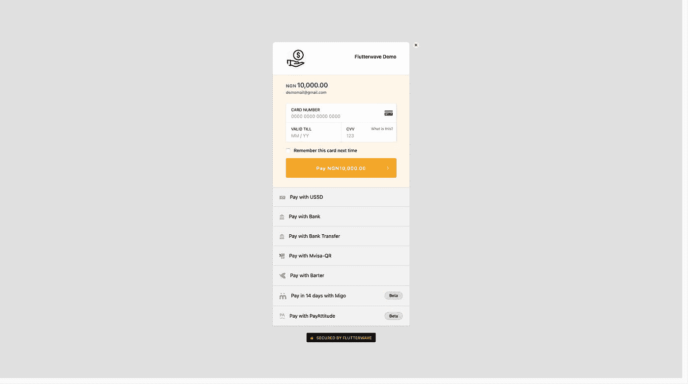
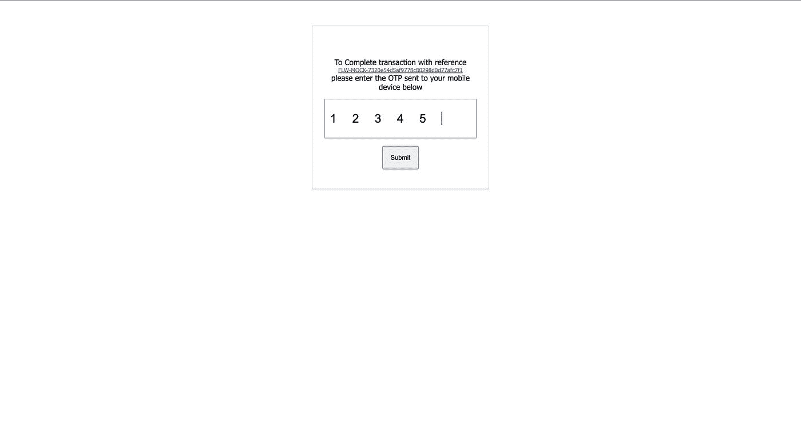
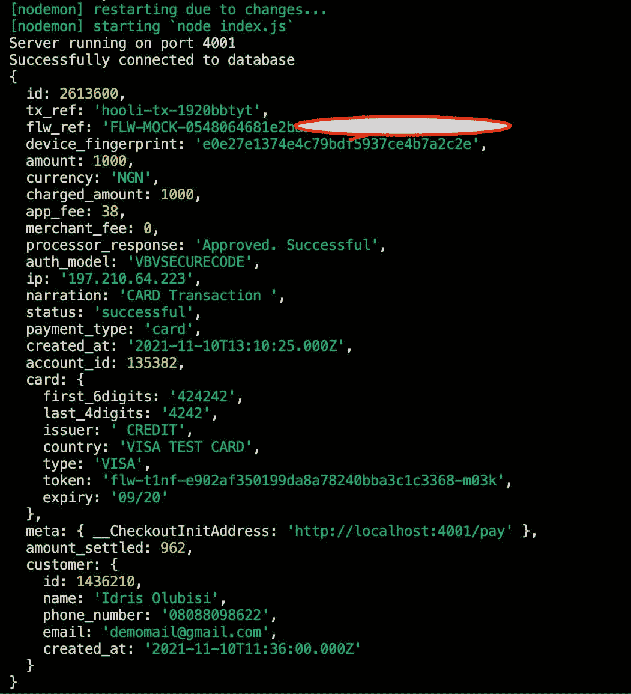
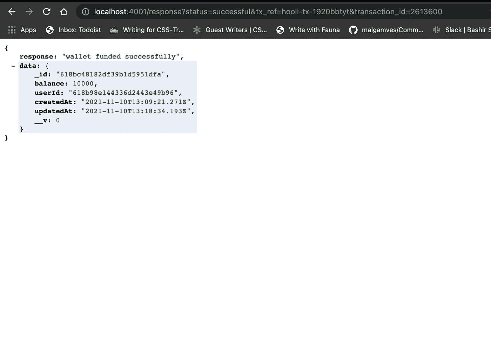
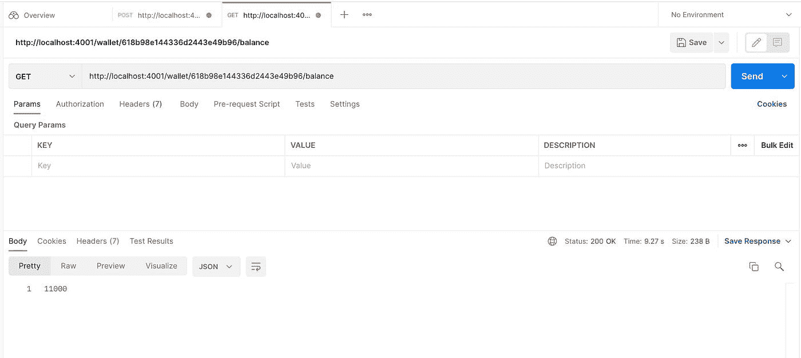
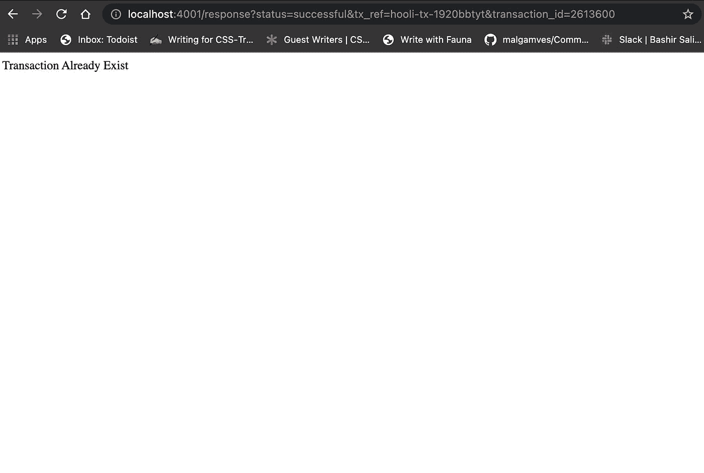

# 如何将 Flutterwave 支付集成到 Node.js 应用程序中来构建钱包系统

> 原文：<https://javascript.plainenglish.io/how-to-build-a-wallet-system-with-flutterwave-payment-integration-into-nodejs-application-5c14350f4eab?source=collection_archive---------1----------------------->


Photo by [Emil Kalibradov](https://unsplash.com/@emkal?utm_source=medium&utm_medium=referral) on [Unsplash](https://unsplash.com?utm_source=medium&utm_medium=referral)

今天，许多网站所有者想要在线支付网关，尤其是在行业飞速发展的情况下。为卫生部门、金融部门或其他部门设计应用程序时，创建钱包系统有点像噩梦。

在本教程中，我们将学习如何创建一个钱包系统，以及如何集成 Flutterwave 支付系统。

# 先决条件

为了完成本教程，我们需要:

*   JavaScript 的工作知识。
*   很好的理解 Node.js。
*   对 MongoDB 或我们选择的任何数据库有基本的了解。
*   [邮差](https://www.postman.com/)以及一些如何使用邮差的知识。

我们还需要一个 [Flutterwave](https://dashboard.flutterwave.com/signup) 账户来接收或接受我们应用程序的付款。

# 什么是钱包系统？

[数字钱包](https://en.wikipedia.org/wiki/Digital_wallet)，通常被称为电子钱包，是一种电子设备、互联网服务或软件应用程序，允许一方与另一方交换数字货币单位以获得产品和服务。这可以包括利用电脑在线购买产品或使用智能手机在商店购买。

在任何交易之前，钱可以存入数字钱包，或者在其他情况下，个人的银行账户可以链接到数字钱包。

# 数字钱包有什么好处？

*   每次你想进行网上交易时，不必从鼓鼓囊囊的钱包里掏出你的卡，你只需拿着你的智能手机，登录你的账户，就可以开始了。
*   大多数应用程序允许你以一种容易获取的方式组织你所有的信息，节省你翻遍钱包寻找你需要的东西的时间。
*   许多数字钱包应用程序向用户提供各种奖金和奖品，这可能有助于你在特定交易中获得更多“物有所值”。

# 什么是 Flutterwave？

从在线收款到支付，以及这两者之间的一切， [Flutterwave](https://flutterwave.com) 可以帮助您为您的特定用例开发任何形式的支付流程。

他们还提供几项服务，让你在几分钟内就可以在世界各地转账和收款。

# 创建目录，安装依赖项，并设置身份验证

要开始，我们需要设置我们的项目。

通过导航到我们在机器上选择的目录并在终端上打开它来打开 Visual Studio 代码。

然后执行:

> *注意:* `*code .*` *如果我们的系统上没有安装 Visual Studio 代码就无法工作。*

# 创建目录并初始化`npm.`

通过键入以下命令创建目录并初始化 npm:

```
mkdir wallet-demo-with-flutterwave cd wallet-demo-with-flutterwave npm init -ymkdir wallet-demo-with-flutterwave cd wallet-demo-with-flutterwave npm init -y
```

# 创建文件和目录

在前面的步骤中，我们用命令“npm init -y”初始化了`npm`，这将自动创建一个 package.json。

我们需要使用下面的命令创建模型、配置目录和文件，例如`wallet.js, wallet_transaction.js, transaction.js, database.js`。

```
mkdir model config touch config/database.js model/wallet.js model/wallet_transaction.js model/transaction.js model/user.js
```

我们现在可以用命令在项目的根目录下创建`index.js`和`app.js`文件。

如下图所示:



# 安装依赖项

我们将安装几个像`mongoose, jsonwebtoken, express, dotenv, axios, bcryptjs,`这样的依赖项和像`nodemon`这样的开发依赖项，以便在我们自动进行更改时重启服务器。

我们将安装 mongoose，因为我将在本教程中使用 MongoDB。

将根据我们数据库中的信息检查用户凭证。因此，整个认证过程并不局限于我们将在本教程中使用的数据库。

```
npm install jsonwebtoken dotenv mongoose express bcryptjs npm install nodemon -D
```

# 创建 Node.js 服务器并连接数据库

通过将以下代码片段添加到我们的 app.js、index.js、database.js。按照这个顺序，我们现在可以创建 Node.js 服务器并将其连接到数据库。

在我们的`database.js.`

`config/database.js:`

在我们的 app.js 中:

`wallet-demo-with-flutterwave/app.js`

在我们的 index.js 中:

`wallet-demo-with-flutterwave/index.js`

如果你注意到，我们的文件需要一些环境变量。我们将创建一个新的`.env`文件，并在启动应用程序之前添加变量。

在我们的. env 中。

要启动我们的服务器，请编辑 package.json 中的脚本对象，如下所示。

```
"scripts": { "start": "node index.js", "dev": "nodemon index.js", "test": "echo \"Error: no test specified\" && exit 1" }
```

上面的代码片段已经成功地插入到`app.js, index.js, and database.js.`中。首先，我们在`index.js`中构建 node.js 服务器，并导入配置了路由的`app.js`文件。

然后，如`database.js,`所示，我们使用 mongoose 创建一个到数据库的连接。

执行命令`npm run dev`。

服务器和数据库都应该正常运行，不会崩溃。

# 创建用户模型和路线

我们将在第一次注册时为用户详细信息定义模式，并在登录时根据保存的凭证验证它们。

将以下代码片段添加到模型文件夹内的 user.js 中。

`model/user.js`

现在让我们分别为注册和登录创建路由。

`app.js`文件的根目录下，我们将添加下面的代码片段用于用户注册和登录。

# 实现注册和登录功能

我们将在应用程序中实现这两条路线。我们将使用 JWT 来签署凭证，并使用 bycrypt 来加密密码，然后将它们存储在我们的数据库中。

从/register 路径，我们将:

*   获取用户输入。
*   验证用户输入。
*   验证用户是否已经存在。
*   加密用户密码。
*   在我们的数据库中创建一个用户。
*   最后，创建一个签名的 JWT 令牌。

修改我们之前创建的/register 路由结构，如下所示。

> *注意:更新您的。env 文件，它可以是一个随机字符串。*

使用 Postman 测试端点，在成功注册后，我们将得到如下所示的响应。



点击[此处](https://www.section.io/engineering-education/how-to-build-authentication-api-with-jwt-token-in-nodejs/)了解更多关于如何在 Node.js 中使用 JWT 令牌构建认证 API 的信息

# 构建集成 Flutterwave 支付的钱包系统

现在，我们可以利用用户详细信息来创建钱包、保存钱包交易以及在系统中执行其他操作，因为我们已经在上一步中成功创建了用户收集和身份验证功能。

让我们使用下面的代码更新我们的 wallet.js、wallet_transaction 和 transaction。

`model/wallet.js` `model/wallet_transaction.js` `model/transaction.js`

我们已经创建了我们的钱包、钱包交易和交易模式，这意味着我们现在可以从客户端接收资金，在后端使用 flutterwave 验证支付，分别在钱包、钱包交易和交易集合中记录和更新支付细节。

让我们让前端客户端准备好接受来自客户的付款。

我们将使用以下命令在我们的根目录下创建一个`index.html`文件。

用下面的代码片段更新我们刚刚创建的`index.html`:

你可以从 [Flutterwave 文档](https://developer.flutterwave.com/docs/flutterwave-inline)中了解更多关于上面片段的信息

更新我们的`app.js`以从服务器端呈现`index.html`文件，我们将使用下面的代码片段:

```
const path = require('path'); app.post("/login", async (req, res) => { } app.get("/pay", (req, res) => { res.sendFile(path.join(__dirname + "/index.html")); });
```

在我们测试我们的应用程序之前，我们会在我们之前创建的“index.html”中看到短语“YOUR_PUBLIC_KEY_HERE ”,这意味着我们需要一个来自我们的 [flutterwave 仪表板](https://dashboard.flutterwave.com/dashboard/settings/apis)的公钥。让我们到仪表板上检索我们的公钥。



让我们在浏览器上输入`http://localhost:4001/pay`来测试一下。单击`Pay Now`按钮后，我们应该会看到类似下面的内容:



我们将使用测试卡号:`4242424242424242`，有效期:`04/25`，CVV: `202`。我们会被重定向到下面的页面进入 OTP，是`12345`因为我们用的是测试卡。



进入 OTP 后，我们将被重定向到 localhost:3000/response，但是什么也不会发生。让我们通过实现处理接下来发生的事情的逻辑来解决这个问题。

创建。`/response` endpoint，我们将使用下面的代码片段更新我们的 app.js:

我们从上面代码中回调函数的查询参数中获取`transaction_id`，并通过向 flutterwave 端点发送请求来验证事务。我们应该会在日志中看到类似下面的截图。



让我们创建一个逻辑来管理诸如验证用户的钱包、创建钱包交易和交易等操作。

在我们的`app.js`中，让我们导入钱包、钱包交易和交易模型。

使用管理操作的逻辑更新 app.js:

我们现在可以用我们创建的管理不同操作的所有函数来更新`/response`端点。

瞧，🥳，我们差不多完成了，让我们测试一下我们的应用程序。完成付款后，我们应该得到类似于下面的内容:



因为几次尝试，在试图资助我们钱包的同时，我们有了上面截图中的`10,000`余额；但是，如果仔细检查，这个数字可能会有所不同。

让我们用下面的代码片段创建一个端点来检索用户余额:

```
app.get("/wallet/:userId/balance", async (req, res) => { try { const { userId } = req.params; const wallet = await Wallet.findOne({ userId }); res.status(200).json(wallet.balance); } catch (err) { console.log(err); } });
```

测试我们返回用户余额的端点:



> *注意:我们可能已经注意到，如果我们在重定向到“/response”端点后重新加载页面，我们的 wallet 中将更新相同金额的相同交易。为了防止这种情况，我们必须验证我们的系统中不存在这样的*`*transaction_id*`*；否则，我们将收到重复交易错误。*

我们可以修改我们的逻辑，如下所示:

接下来，当我们刷新页面时，我们应该会看到类似下面的截图。



完整代码可从 [GitHub](https://github.com/Olanetsoft/wallet-demo-with-flutterwave) 获得

# 结论

在本文中，我们学习了如何在 Node.js 应用程序中构建一个简单的身份验证、钱包系统和 Flutterwave 支付集成

# 参考

我很乐意在[Twitter](https://twitter.com/olanetsoft)|[LinkedIn](https://www.linkedin.com/in/olubisi-idris-ayinde-05727b17a/)|[GitHub](https://github.com/Olanetsoft)|[Portfolio](https://idrisolubisi.com/)与你联系

在我的下一篇博客文章中再见。保重！！！

*最初发表于*[*https://blog.idrisolubisi.com*](https://blog.idrisolubisi.com/how-to-build-a-wallet-system-with-flutterwave-payment-integration-into-nodejs-application)*。*

*更多内容看* [***说白了就是***](http://plainenglish.io/) *。报名参加我们的* [***免费每周简讯***](http://newsletter.plainenglish.io/) *。在我们的* [***社区不和谐***](https://discord.gg/GtDtUAvyhW) *获得独家获取写作机会和建议。*