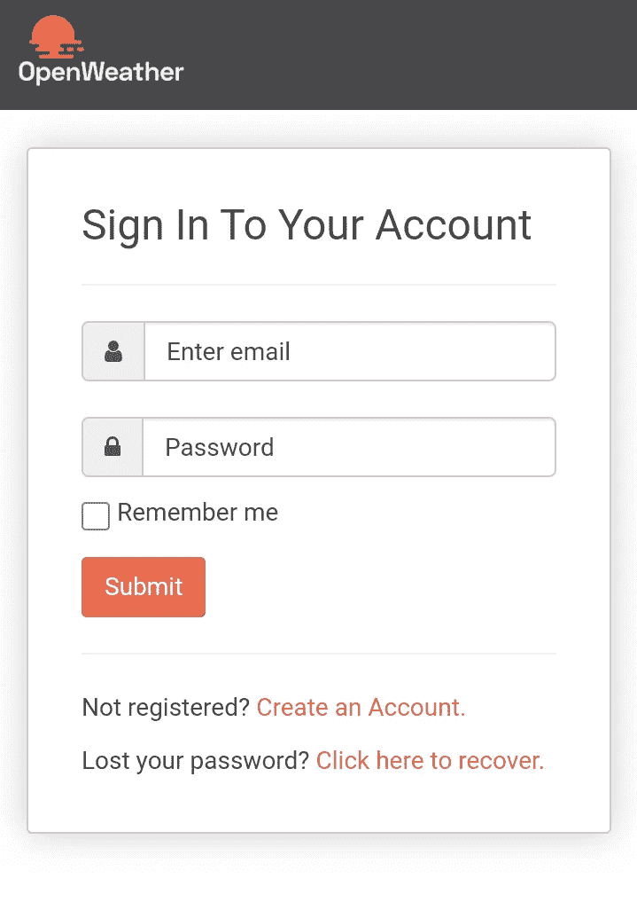

# 如何使用普通 Javascript 构建天气 Web 应用程序

> 原文：<https://javascript.plainenglish.io/how-to-build-a-weather-web-app-using-vanilla-javascript-5518dbb92c52?source=collection_archive---------5----------------------->

## 构建天气应用程序的分步指南，从规划到执行。


Image By [Osman Rana](https://unsplash.com/photos/HOtPD7Z_74s?utm_source=unsplash&utm_medium=referral&utm_content=creditShareLink) on [Unsplash](https://unsplash.com/)

天气预报应用程序是可以提高编程技能的众多项目之一。试想一下，如果你能制作一个通知和预测天气的应用程序，岂不是很酷？因此，我将指导您创建自己的天气 web 应用程序。

# 1.OpenWeatherMap API

为了制作这个应用程序，我们需要一个 API ( *应用程序编程接口*)，它将提供创建天气 web 应用程序所需的数据。对于当前的项目，我们将使用一个 API 来检索世界上的天气数据。有些 API 可以免费使用，而有些 API 则需要支付一定的价格。

为了创建一个天气网络应用程序，我们将使用来自 OpenWeatherMap.org 的 API，你可以免费或付费使用。要使用这个 API，您需要一个 API 密钥。要获得 API 密钥，您必须首先注册 OpenWeatherMap 网站。所以请登录/注册[https://home.openweathermap.org/users/sign_in](https://home.openweathermap.org/users/sign_in)。



Image from Author's Screenshot

登录后，您将获得您的 API 密钥。**切记不要与任何人共享您的 API 密钥。**

# HTML 代码

当然，要创建网页，你需要 HTML 代码。请创建一个基本的 HTML 模板，如下所示:

```
<!DOCTYPE html>
<html>
  <head>
    <title>My Web App</title>
  </head>
<body>
  <input class="input" type="text" placeholder="type a city">
  <button class="submit">search</button>
  <div clas="city_name">unknown</div>
  <div clas="temperature">unknown</div>
  <div clas="humidity">unknown</div>
  <div clas="weather">unknown</div>
  <script type="text/javascript" charset="UTF-8" src="Weather_app.js></script>
</body>
</html>
```

上面的代码用于稍后显示输入字段和天气数据。在上面的例子中，我将只显示 4 个相关数据，即城市名称、天气、温度和湿度。此外，在上面的代码中，我们还创建了一个带有`class = "submit"`属性的按钮。

# Javascript 代码

编写 Javascript 代码是制作这个 web 应用程序最重要的部分。我们要做的第一件事是将 HTML 标签加载到一个变量中。例如，属性为`class = “humidity”`的`div`标签被加载到名为`humidity`的变量中。此外，我们还将按钮标签加载到一个名为`button`的变量中。

```
var input = document.querySelector(.input);
var city  = document.querySelector(.city_name);
var temperature = document.querySelector(.temperature);
var humidity = document.querySelector(.humidity);
var weather = document.querySelector(.weather); 
var button = document.querySelector(.submit);button.addEventListener('click', function(name){
fecth('api.openweathermap.org/data/2.5/weather?q='+input.value+'&appid={API key}&units=metric')
.then(response => response.json())
.then(data => {
  var tempValue = data['main']['temp'];
  var cityValue = data['name'];
  var weatherValue = data['weather'][0]['description'];
  var humidityValue = data['main']['humidity'];

  city.innerHTML = "weather at "+ cityValue;
  weather.innerHTML = "weather: "+ weatherValue;
  temperature.innerHTML = "temperature: "+ tempValue + " celcius";
  humidity.innerHTML = "humidity: "+ humidityValue;
})
.catch(err => alert("wrong city name!"));
```

我们的 web 应用程序就完成了！

# 代码解释——到目前为止我所做的

所以，在上面的 JavaScript 代码中，我声明了一个我想要显示其数据的变量。这些变量包括湿度、温度和输入。需要输入变量来检索用户输入的数据。在这种情况下，用户输入的数据是城市的名称。因此，输入变量稍后将包含一个城市名称字符串。

接下来，我使用`fetch(’https://api.openweathermap.org/data/2.5/weather?q=’+input.value+’&appid={API_KEY}&units=metric’`获取 API。这段代码将根据`input.value`中的城市名称从 API URL 获取数据。请将{API_KEY}替换为您在登录/登入 OpenWeatherMap 网站后获得的 API 密钥。

在获取过程之后，您将获得您想要的城市的天气数据。这些数据将以 JSON 格式显示。以下是您将获得的数据示例:

```
{
  "coord": {
    "lon": -122.08,
    "lat": 37.39
  },
  "weather": [
    {
      "id": 800,
      "main": "Clear",
      "description": "clear sky",
      "icon": "01d"
    }
  ],
  "base": "stations",
  "main": {
    "temp": 282.55,
    "feels_like": 281.86,
    "temp_min": 280.37,
    "temp_max": 284.26,
    "pressure": 1023,
    "humidity": 100
  },
  "visibility": 16093,
  "wind": {
    "speed": 1.5,
    "deg": 350
  },
  "clouds": {
    "all": 1
  },
  "dt": 1560350645,
  "sys": {
    "type": 1,
    "id": 5122,
    "message": 0.0139,
    "country": "US",
    "sunrise": 1560343627,
    "sunset": 1560396563
  },
  "timezone": -25200,
  "id": 420006353,
  "name": "Mountain View",
  "cod": 200
  }
```

现在，`.then`行代码旨在将数据赋给相关变量。例如，关于湿度的数据被分配给`humidityValue`变量。然后，通过`humidity.innerHTML`代码打印出`humidityValue`变量的值。这里需要你对阅读 JSON 文件的理解。但是，如果你对 JSON 一无所知，没问题。只需复制我上面写的 javascript 代码。

如果用户输入的城市名称不在 OpenWeatherMap 提供的数据中，代码的`.catch`行将显示一个`alert`。例如，当用户键入城市名称“abcd”时。由于名为“abcd”的城市在世界上任何地方都不存在，我们的网站将显示一个警告`alert("wrong city name!")`。

# 结论

简而言之，以下是你应该采取的步骤:

1.  登录/登录[OpenWeatherMap.org](https://openweathermap.org/api)网站
2.  获取您的 API 密钥
3.  编写 HTML 和 JavaScript 代码
4.  如果你想要更好的风格，就写 CSS 代码
5.  结束

以下是创建天气 web 应用程序时必须编写的重要文件:

## 超文本标记语言

```
<!DOCTYPE html>
<html>
  <head>
    <title>My Web App</title>
  </head>
<body>
  <input class="input" type="text" placeholder="type a city">
  <button class="submit">search</button>
  <div clas="city_name">unknown</div>
  <div clas="temperature">unknown</div>
  <div clas="humidity">unknown</div>
  <div clas="weather">unknown</div>
  <script type="text/javascript" charset="UTF-8" src="Weather_app.js></script>
</body>
</html>
```

## Java Script 语言

```
var input = document.querySelector(.input);
var city  = document.querySelector(.city_name);
var temperature = document.querySelector(.temperature);
var humidity = document.querySelector(.humidity);
var weather = document.querySelector(.weather); 
var button = document.querySelector(.submit);button.addEventListener('click', function(name){
fecth('api.openweathermap.org/data/2.5/weather?q='+input.value+'&appid={API key}&units=metric')
.then(response => response.json())
.then(data => {
  var tempValue = data['main']['temp'];
  var cityValue = data['name'];
  var weatherValue = data['weather'][0]['description'];
  var humidityValue = data['main']['humidity'];

  city.innerHTML = "weather at "+ cityValue;
  weather.innerHTML = "weather: "+ weatherValue;
  temperature.innerHTML = "temperature: "+ tempValue + " celcius";
  humidity.innerHTML = "humidity: "+ humidityValue;
})
.catch(err => alert("wrong city name!"));
```

## 半铸钢ˌ钢性铸铁(Cast Semi-Steel)

> 对于 CSS，您可以将其定制为您喜欢的样式

CSS 文件基本上只是设置你的网页风格，所以你可以自己设置。我想我不需要在这里添加任何 CSS 代码。

# 添加

你可能会问，*“你不是说我们也要做一个天气预报的 web app 吗？”实际上，如果你理解了我上面写的每一行代码，那么你应该能够用同样的方法构建一个天气预报应用程序。你所要做的就是访问 OpenWeatherMap.org 网站，查看 API 文档。在那里，你会看到有很多你可以得到的数据，从当前的天气到天气预报。*

[](https://openweathermap.org) [## с当前天气和预报- OpenWeatherMap

### 获取您所在城市的当前天气、每小时天气预报、16 天的每日天气预报和 5 天的 3 小时天气预报…

openweathermap.org](https://openweathermap.org) 

如果您想直接观看该应用程序的现场演示，可以访问我的网站:

[](https://fikrinotes.netlify.app/weather_app) [## 天气应用程序- Fikri 注释

### 一个强大的网络应用程序，可以获取世界各地的天气数据

fikrinotes.netlify.app](https://fikrinotes.netlify.app/weather_app) 

所以，谢谢你看我的文章。如果觉得这篇文章有用，可以给这篇文章加个拍手。谢谢大家！

*更多内容看*[***plain English . io***](http://plainenglish.io/)