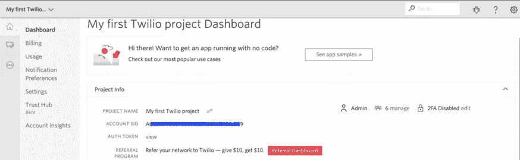

# 如何在没有任何编码的情况下为你的企业构建一个 WhatsApp 机器人

> 原文：<https://javascript.plainenglish.io/how-to-build-a-whatsapp-bot-for-your-business-without-any-coding-7485726144f5?source=collection_archive---------22----------------------->

WhatsApp 在过去几年中人气的大幅增长为企业创造了许多机会。世界各地的公司目前正在发现 WhatsApp 商业应用程序的威力。它允许你使用 WhatsApp 聊天机器人发送通知和消息，这是一种增加和个性化客户参与的好方法。

[**创建免费聊天机器人**](https://dashboard.kommunicate.io/signup)

WhatsApp 已经成为全球最受欢迎的消息应用之一，拥有超过 15 亿用户，最新推出的公司简介和商业账户为公司与世界各地的人联系开辟了新的空间。

# 什么是 WhatsApp 机器人？

WhatsApp chatbot 是一个运行在加密 WhatsApp 平台上的软件程序。WhatsApp Bot 只是一个自动聊天系统，连接到与您的业务相关的 WhatsApp 电话号码。

## 如何为 WhatsApp 创建聊天机器人？

公司可以使用 WhatsApp 商业应用编程接口[创建 WhatsApp 机器人，用于客户服务和通知传递。因此，在本文中，我将向您展示如何构建 WhatsApp bot，并告诉您使用](https://www.whatsapp.com/business/api/)[komunicate](http://www.kommunicate.io/)和 [Twilio](https://www.twilio.com/) 在 WhatsApp 上部署它所需的一切。

## 先决条件

你需要一个 Twilio 帐户来设置你的 WhatsApp 商业应用编程接口，还需要一个 Kommunicate 帐户来将聊天机器人部署到你的 WhatsApp 并管理客户对话。这两个平台都有免费试用。

## 步骤 1:构建聊天机器人

Kommunicate 提供了一个名为 [Kompose](https://www.kommunicate.io/product/kompose-bot-builder) 的 bot builder 工具，在这里你不需要写一行代码。你可以创建人工智能聊天机器人，将它们部署到你的网站和应用程序中，甚至在它们失败时添加自动人工接管。请参考这篇[文章](https://www.kommunicate.io/blog/how-to-make-a-chatbot/)了解如何构建聊天机器人的详细说明。

Kommunicate 还允许您与其他第三方 bot builder 平台集成，如 Dialogflow、Amazon lex、IBM Watson 和自定义 bot。

首先，您需要登录到您的通信仪表板。如果你没有通信账户，你可以免费注册[。](https://dashboard.kommunicate.io/signup?product=kommunicate)

额外收获:如果你想要一个预建的聊天机器人？[下面是](https://www.kommunicate.io/chatbot-templates)去哪里找一堆！

## 第二步:配置 Whatsapp

在这里，我们使用 Twilio 进行 WhatsApp 集成，在开始与 Kommunicate 集成之前，您必须完成 Twilio 注册过程。如果尚未注册，请在此注册 Twilio [。](https://www.twilio.com/try-twilio)

[**免费试用 30 天**](https://dashboard.kommunicate.io/signup)

## 先决条件

*   脸书业务经理[账户 ID](https://www.facebook.com/business/help/1710077379203657?id=180505742745347)
*   Twilio 帐户 SID

## 请求访问以在 WhatsApp 上启用您的 Twilio 号码

要在 Kommunicate 上进行整合，你需要有 Twilio 提供的 WhatsApp 号码。要获得一个 WhatsApp 号码，请填写 Twilio 的[请求访问](https://www.twilio.com/whatsapp/request-access)表单，提供准确的最新信息，包括脸书业务经理 ID。更多信息请参考 Twilio 的[文档](https://www.twilio.com/docs/whatsapp/tutorial/connect-number-business-profile#step-1-request-access-to-enable-your-twilio-numbers-for-whatsapp)

## 在 Twilio 控制台中提交 WhatsApp 发送者请求

一旦您填写并提交请求访问表，您将收到 Twilio 预批准电子邮件。查看此[推荐链接](https://www.twilio.com/docs/whatsapp/tutorial/connect-number-business-profile#step-2-submit-a-sender-profile-and-message-templates)了解相同信息。

然后，在脸书业务管理器控制台中，允许 Twilio 代表您发送消息。此外，提交您的脸书业务经理帐户进行业务验证。

**注意**:一旦你完成了以上所有步骤，你就会得到 Whatsapp 的号码，将其添加到[komunicate 整合部分](https://dashboard.kommunicate.io/integrations)。您可以在 Twilio 控制台的 Whatsapp enabled senders 部分找到 Whatsapp 启用的号码。更多详情请参考以下截图。

## 第三步:整合 WhatsApp 和 Kommunicate

以下说明将帮助您连接 Kommunicate 和 Twilio，从而连接 WhatsApp。

*   从 Twilio 控制台复制帐户 SID、身份验证令牌，从 Whatsapp Enabled Senders 部分复制 WhatsApp Enabled Number，并将其添加到 Kommunicate integration 部分。

*   如下图所示与 Kommunicate 集成。

*   一旦完成与 Kommunicate 的集成，请访问 Twilio 上的 WhatsApp Enabled Senders 部分，然后点击**编辑发送方**。

*   现在添加 Webhook URL 并选择 HTTP POST。此外，在状态回调 URL 文本框中添加一个 URL，并保存/更新 WhatsApp 发送者。[网址](https://omni-channel.kommunicate.io/whatsapp/twilio/webhook)

# 最后一步:测试你的 WhatsApp 机器人

现在 Kommunicate 已经和 WhatsApp 账号成功整合，试试给账号关联的号码发消息吧。这些消息也将被发送到 Kommunicate chat。如果聊天机器人已经集成，它将开始回复你的 WhatsApp 聊天查询。

这是对话在 Kommunicate 仪表盘中的样子。

# 限制

1.  您只能发送和接收特定的媒体文件。点击查看更多信息[。](https://support.twilio.com/hc/en-us/articles/360017961894-Sending-and-Receiving-Media-with-WhatsApp-Messaging-on-Twilio)
2.  如果自最后一条用户消息以来已过去 24 小时以上，则只允许模板消息。
3.  WhatsApp 不支持来自机器人的丰富消息响应，因此最终用户不会收到它们。

# 你的 WhatsApp Bot 为什么要用 Kommunicate？

虽然需要 Twilio 将你的聊天机器人与 WhatsApp 集成，但 Kommunicate 是运行全自动客户支持的有效选择。

Kommunicate 允许你管理来自 WhatsApp、脸书、实时聊天、聊天机器人和电子邮件的客户对话。此外，聊天机器人和人类可以使用 Kommunicate 的客户支持自动化平台完美同步地工作。

因此，如果你想很好地管理你的客户支持，我会推荐使用 Kommunicate 的 WhatsApp 集成。如果你打算只向用户发送 WhatsApp 通知，而不是双向对话，我建议使用其他服务。

尽管本文中讨论的 Kommunicate 特性是创建 WhatsApp 机器人的强大工具，但它们仍然只是触及了 Kompose 聊天机器人及其集成所能实现的功能的皮毛。所以我强烈建议你开始探索[通信](https://www.kommunicate.io/home)。

是时候让可编程的短信成为过去，彻底改变客户对话了。交流愉快！

[**免费试用**](https://dashboard.kommunicate.io/signup)

*本文原载* [*此处*](https://www.kommunicate.io/blog/whatsapp-bot/) *。*

*更多内容看*[***plain English . io***](http://plainenglish.io/)