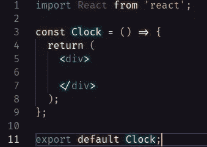
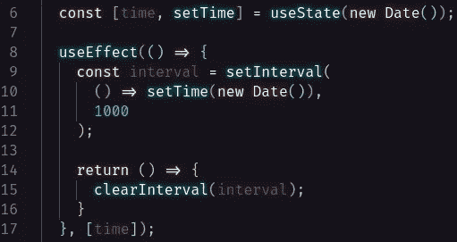
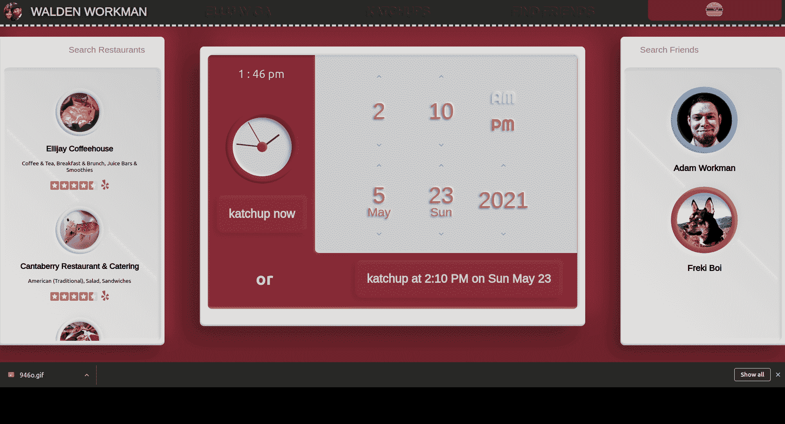

# 如何使用钩子构建模拟时钟

> 原文：<https://javascript.plainenglish.io/how-to-build-an-analog-clock-using-hooks-f33adf51ed9f?source=collection_archive---------4----------------------->

想用模拟时钟来分类吗？嗯，你来对地方了。在本文中，我们将研究一种使用功能组件在 React 中构建简单模拟时钟的方法。作为奖励，我们还将为那些有不同程度计算障碍的人制作一个数字钟。

让我们首先在一个名为 Clock.js 的新文件中构建一个功能组件。

现在让我们在 JSX 建造时钟。在这里，我们将把时钟的每个部分分配给一个容器。

然后，我们将设计每个容器的样式，使一切更像时钟。在这里，你可以尽情发挥创造力。

现在我们有了一个看起来有点像模拟时钟的东西！嗯，这又快又简单，感谢阅读！…要是有那么简单就好了！

现在是有趣的事情。让那些手动起来！和所有事情一样，我相信有很多方法可以解决这个问题。我决定用`useEffect,`和`setState` 钩子来解决这个特殊的问题。

通过创建一个“时间”状态变量，并将其设置为对`useEffect`的依赖，我们能够在每次“时间”改变时运行`useEffect` 钩子。在我们的`useEffect`钩子中，我们可以设置一个间隔来每秒更新我们的状态变量“时间”。这样，我们将渲染我们的时钟组件，这将更新我们的“时间”变量，这将导致`useEffect` 运行并重新渲染我们的时钟组件，这将更新我们的“时间”变量，这将导致`useEffect` 运行并重新渲染我们的时钟组件，这将更新我们的“时间”变量…您明白了吧。

为了确保我们没有任何内存泄漏，我们需要在每次迭代中清理我们的`useEffect`钩子。为此，我们可以简单地返回一个函数，清除我们设置的间隔。

厉害！现在，我们的“时间”变量每秒都在更新正确的时间。让我们利用这些信息来调整时钟。

我们将从在我们的`useEffect`钩子中设置一些变量开始。

由于我们的“时间”状态变量是一个`Date`对象，我们可以访问一些有用的方法。这里我们将使用`getSeconds()`、`getMinutes()`和`getHours()`。我认为它们都是不言自明的。为了确保分钟总是以两位数显示，我们可以在`getminutes()`之后调用`toLocalString`，并包含可选参数`minimumIntegerDigits`。如果你不打算增加数字钟，这并不重要。

类似地，如果您不打算使用数字钟，您可以将保存您的小时数的变量设置为`time.getHours()`。因为我想要一个数字时钟来伴随我的模拟时钟，我需要建立一个函数来将 24 小时时间转换为 12 小时时间。这基本上只是说，如果小时数小于 12，则将时间设置为“am”。如果小时大于 12，则从数字中减去 12，并将时间设置为“pm”。如果小时为 0，则将小时设置为 12。对于我们这些更习惯于 12 小时时间的人来说，这使得一切都容易阅读。

所以我们得到当前时间，每秒更新一次，我们把时间分解成秒、分和小时。数学时间到了！

首先，让我们抓住所有的时钟指针，并将它们设置为语义变量。

很好！现在我们可以根据时间改变每手牌的风格。通过设置`useEfftect`中的 style 属性，每次`useEffect`运行时(每秒)都会更新一次。因此，为了让指针根据当前时间旋转它们的位置，我们可以这样设置 transform 属性。

**重要:**如果你还记得，在我们的。CSS 文件，在`.hand`下，我们将变换原点设置为“中上”。这将我们的变形点(我们将要旋转的点)设置为…你猜对了…手的顶部中心。如果设置不正确，指针将无法正确定位！

就是这样！我们现在有了一个正常工作的模拟时钟！要添加它的数字副本，我们只需添加一个“数字”容器，设置内部 HTML 来显示小时:分钟，以及它是“上午”还是“下午”。

模拟时钟可以增加风格，它们可以如你所愿地复杂或简单…想想数字、小时/分钟标记、日期、星期几。这只是一个起点。从中获得乐趣，并发挥创造力。编码快乐！

*更多内容请看*[*plain English . io*](http://plainenglish.io/)