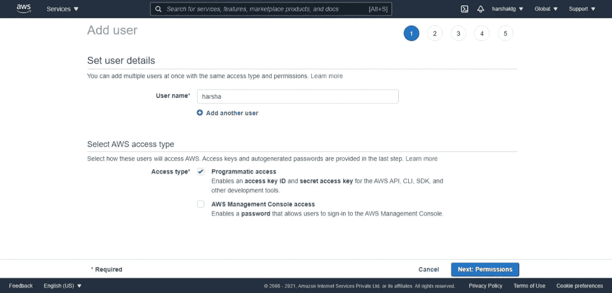
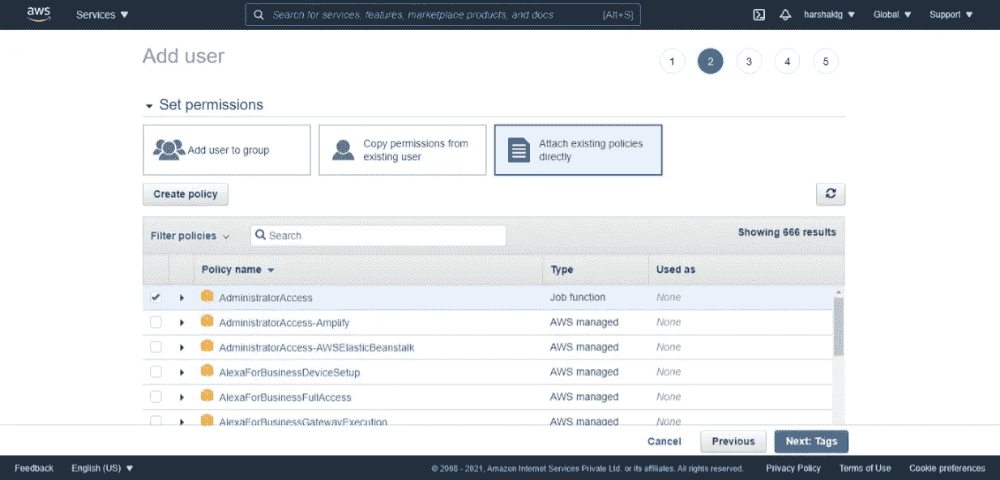
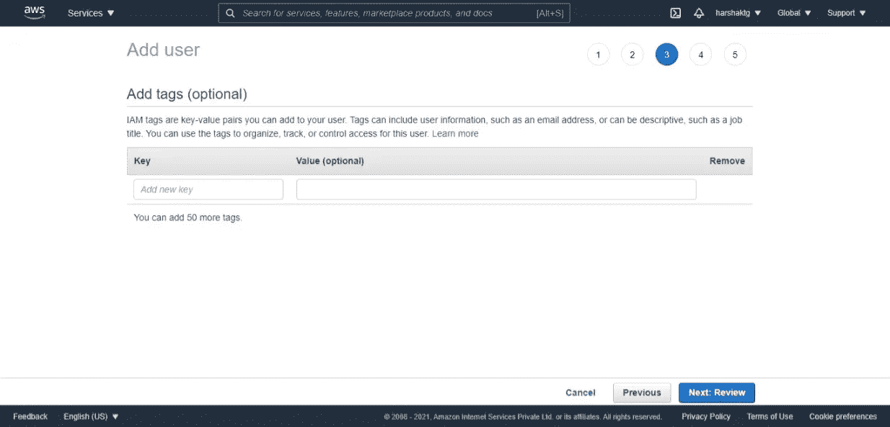
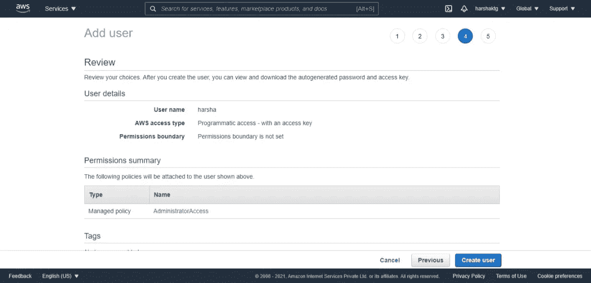
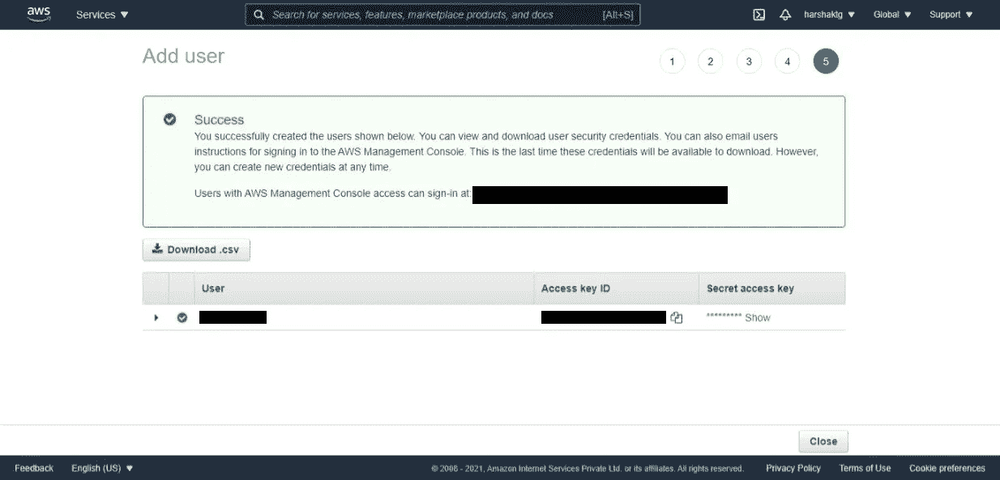
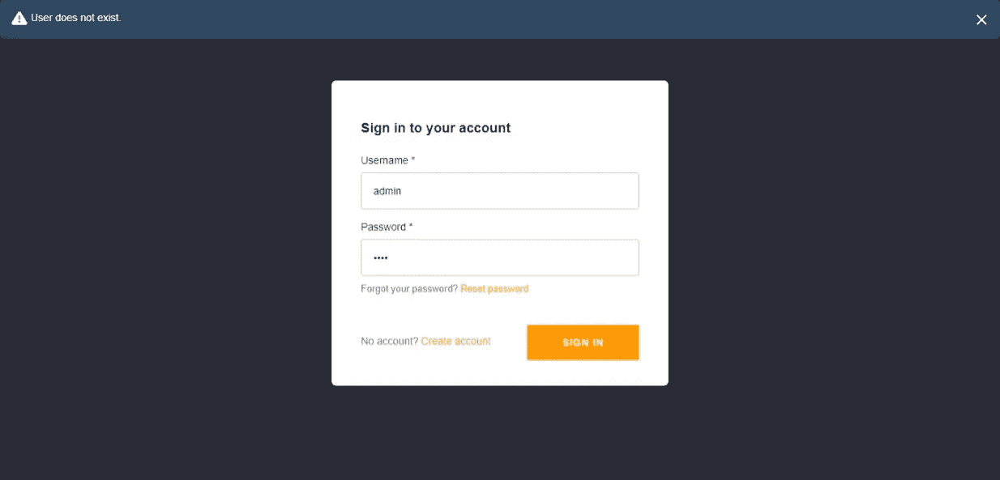
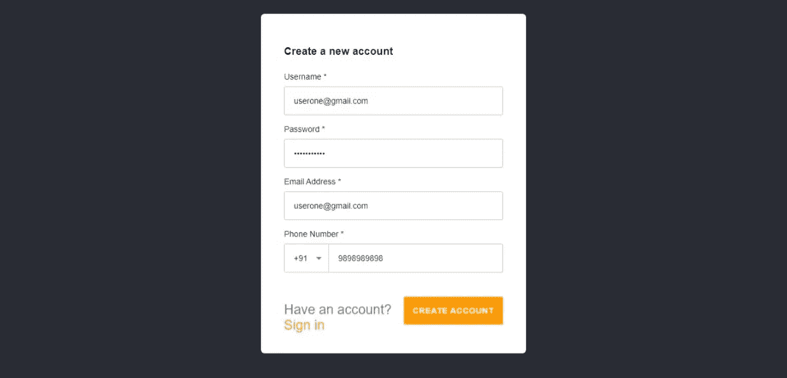
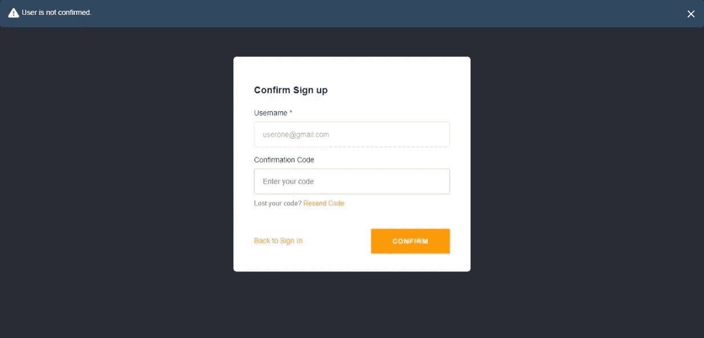
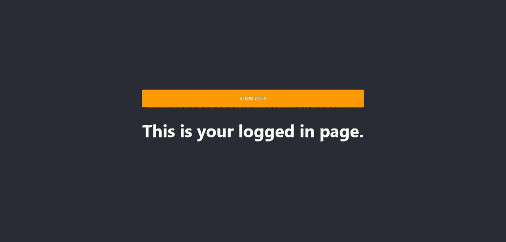

# 如何在几分钟内建立一个认证系统

> 原文：<https://javascript.plainenglish.io/how-to-build-an-authentication-system-in-react-in-minutes-abdb339b573d?source=collection_archive---------13----------------------->

## AWS Amplify 和 AWS Cognito 一起完成所有繁重的工作


Photo by [Markus Winkler](https://unsplash.com/@markuswinkler?utm_source=medium&utm_medium=referral) on [Unsplash](https://unsplash.com?utm_source=medium&utm_medium=referral)

几乎每个应用程序都需要一个认证系统。通常，我们连接到服务器，在那里进行身份验证，然后如果凭证有效，就提供访问。如果您正在构建一个只需要后端认证的应用程序，那么您实际上并不需要服务器。

AWS Amplify 可以让您的生活变得轻松。在这个分步教程中，我们将通过在 React 应用程序中集成 AWS Amplify(和 AWS Cognito)来验证用户。

在我们开始之前，让我们确保您有一个 AWS 帐户。如果没有报名[这里](https://portal.aws.amazon.com/billing/signup#/start)。

# 1.安装 Amplify CLI

首先，让我们在您的计算机上安装 Amplify CLI，在您的终端上运行以下代码:

```
npm install -g @aws-amplify/cli
```

现在，由于 CLI 已经安装在您的计算机上，让我们使用以下命令创建 React 应用程序(用您选择的任何应用程序名称替换 app-name):

```
npx create-react-app **<app-name>**
```

# 2.AWS 放大器配置

让我们通过运行以下代码来配置 AWS Amplify:

```
amplify configure
```

这将提示您登录您的 AWS 帐户，并将自动打开浏览器。请确保登录您的 AWS 帐户。登录后，返回终端并按回车键。您的终端应该是这样的:

```
PS D:\amplifydemo> **amplify configure**
Initializing new Amplify CLI version...
Done initializing new version.
Scanning for plugins...
Plugin scan successful
Follow these steps to set up access to your AWS account:Sign in to your AWS administrator account:
[https://console.aws.amazon.com/](https://console.aws.amazon.com/)
Press Enter to continue
```

然后会要求您选择要部署应用的地区。根据您的 AWS 注册区域选择合适的选项。

```
Specify the AWS Region
? region: 
  us-east-1
> **us-east-2**
  us-west-2
  eu-west-1
  eu-west-2
  eu-central-1
  ap-northeast-1
```

下一步是指定一个新的 IAM(身份和访问管理)用户，或者使用他们推荐的用户。在这里，我将用我的名字创建一个:

```
Specify the username of the new IAM user:
? user name:  **harsha**
```

按回车键，一个新的标签将在你的浏览器中打开。这是 IAM 管理控制台，用于在 Amplify 上设置新的 IAM 用户。确保勾选了“**程序化访问**，然后点击“**下一个权限**”。



在下一个屏幕中，确保默认选中了“**管理员访问**”。点击'**下一步**，直到到达'**创建用户**按钮。



一旦创建了您的用户，您将会看到下面的屏幕。



您将在终端上看到以下消息。按 Enter 键继续，然后将 ***访问密钥 ID*** 粘贴到提示中。

```
Complete the user creation using the AWS console
[https://console.aws.amazon.com/iam/home?region=us-east-2#/users$new?step=final&accessKey&userNames=harsha&permissionType=policies&policies=arn:aws:iam::aws:policy%2FAdministratorAccess](https://console.aws.amazon.com/iam/home?region=us-east-2#/users$new?step=final&accessKey&userNames=harsha&permissionType=policies&policies=arn:aws:iam::aws:policy%2FAdministratorAccess)
Press Enter to continue
```

接下来，它将询问 ***秘密访问密钥*** 。返回到打开的选项卡，将其复制并粘贴到终端的提示中。

最后，它会询问概要文件的名称。您可以选择您想要的任何名称，然后按 Enter 键成功设置用户。我将在这里输入我的案例。

```
Enter the access key of the newly created user:
? accessKeyId:  ********************
? secretAccessKey:  ****************************************
This would update/create the AWS Profile in your local machine
? Profile Name:  **harsha-profile**Successfully set up the new user.
```

# 3.AWS 放大器初始化

运行以下命令，并在出现提示时输入应用程序的名称。

```
PS D:\amplifydemo> **amplify init**
Note: It is recommended to run this command from the root of your app directory
? Enter a name for the project **amplifydemo**
The following configuration will be applied:Project information
| Name: amplifydemo
| Environment: dev
| Default editor: Visual Studio Code
| App type: javascript
| Javascript framework: react
| Source Directory Path: src
| Distribution Directory Path: build
| Build Command: npm.cmd run-script build
| Start Command: npm.cmd run-script start? Initialize the project with the above configuration? (Y/n)
```

然后，它会询问认证方法。选择' **AWS 配置文件**，并选择您刚刚创建的用户。选择您想要使用的验证方法: **AWS 配置文件，**，然后选择您刚刚创建的配置文件。

```
For more information on AWS Profiles, see:
[https://docs.aws.amazon.com/cli/latest/userguide/cli-configure-profiles.html](https://docs.aws.amazon.com/cli/latest/userguide/cli-configure-profiles.html)? Please choose the profile you want to use **harsha-profile**
```

一旦一切都被成功初始化，你应该看到一个`amplify`文件夹出现在你的 React 应用程序目录中，一个名为`aws-exports.js`的文件出现在你的`src`文件夹中。

# 4.添加放大验证

运行以下命令，开始向 React 应用程序添加身份验证。

```
amplify add auth
```

运行该命令后，可以看到这是在自动使用 Cognito 服务。选择'**默认配置**，然后按下回车键。

```
Using service: Cognito, provided by: awscloudformationThe current configured provider is Amazon Cognito.Do you want to use the default authentication and security configuration? (Use arrow keys)
> Default configuration
  Default configuration with Social Provider (Federation)
  Manual configuration
  I want to learn more.
```

接下来，它将询问您的用户的登录方法。对于本教程，选择“**电子邮件**”，然后选择“**不，我完成了**”。

```
How do you want users to be able to sign in?
  Username
> **Email**
  Phone Number
  Email or Phone Number
  I want to learn more.
 Do you want to configure advanced settings? (Use arrow keys)
> **No, I am done.**
  Yes, I want to make some additional changes.
```

现在我们已经在本地添加了这个 auth 资源。运行以下命令将该资源推送到云:

```
amplify push
```

它将询问您是否想要创建一个新资源。键入' **Y** '表示是，然后按 Enter 键继续。

```
? Are you sure you want to continue? Yes
- Updating resources in the cloud. This may take a few minutes...
```

让我们等到过程结束。

所有过程完成后，您应该会看到您的`aws-exports.js`已经更新了新的配置属性。现在，让我们开始为我们的应用程序创建身份验证系统的主要部分。

# 5.让我们创建一个 React 主页

首先，让我们通过运行以下命令来导入 React 应用程序所需的包:

```
npm install aws-amplify @aws-amplify/ui-react
```

在你的`src`文件夹中创建一个名为 *Home.js* 的新文件。这是只有登录用户才能看到的组件。

我们将执行以下操作:

1.  导入必要的包
2.  进口 *aws-exports.js*
3.  导入放大用户界面组件
4.  调用`Amplify.configure(awsExports)`配置放大器
5.  添加 AmplifySignOut 组件
6.  在`withAuthenticator()`中包装家用组件

所以我们的 Home.js 应该是这样的:

# 6.最后一步

在 App.js 中，让我们删除所有代码，让我们有一个“ **Sign In** ”按钮，当用户点击它时重定向到 Home 组件。为了简化本教程，让我们直接导入 Home 组件。您的 *App.js* 文件应该如下所示:

这是最后一步。现在在终端中运行`yarn start`进行测试。

# 测试时间到了

现在，让我们尝试创建用户，验证他们并测试我们的应用程序流。

## 检查未经验证的访问

如果没有用户登录，将自动显示登录页面。要检查某个随机用户是否被允许，让我们输入一些虚拟凭证，并检查这是否有效。



它不让用户进入。它会显示一条横幅，提示用户不存在。

## 帐户创建

让我们现在创建一个帐户。



我在这发一封假邮件。但是要确保你给的是一个有效的用户名，因为你会在你的邮件上得到一个验证码来确认它是否是一个有效的用户。

如果用户未被确认，并且如果我们尝试使用凭证登录，那么我们会得到另一个用户未被确认的横幅。



所以一定要去你的邮箱验证账号。

## 让我们签到

确认帐户后，让我们登录并查看我们的主页。输入正确的凭证后，我们应该能够看到我们的主页。



我们终于到达了我们的主页。你可以注意到它自动添加了一个**登出**按钮。因此，当我们点击它时，用户被注销并被引导到**登录**屏幕。

# 结论

我希望本教程能够帮助您简化 React 应用程序中的身份验证过程。如果你喜欢的内容，请按照我的类似内容简介。感谢您的阅读。

# 参考

[](https://docs.amplify.aws/cli/start/install) [## 开始—安装—放大文档

### Amplify 命令行界面(CLI)是一个统一的工具链，用于为您的应用程序创建 AWS 云服务。我们走吧…

docs.amplify.aws](https://docs.amplify.aws/cli/start/install) [](https://docs.amplify.aws/start/q/integration/react) [## 开始—放大文档

### 开源的 Amplify 框架提供了以下产品来构建完整的 iOS、Android、Flutter、Web 和…

docs.amplify.aws](https://docs.amplify.aws/start/q/integration/react) 

*更多内容尽在*[***plain English . io***](http://plainenglish.io/)