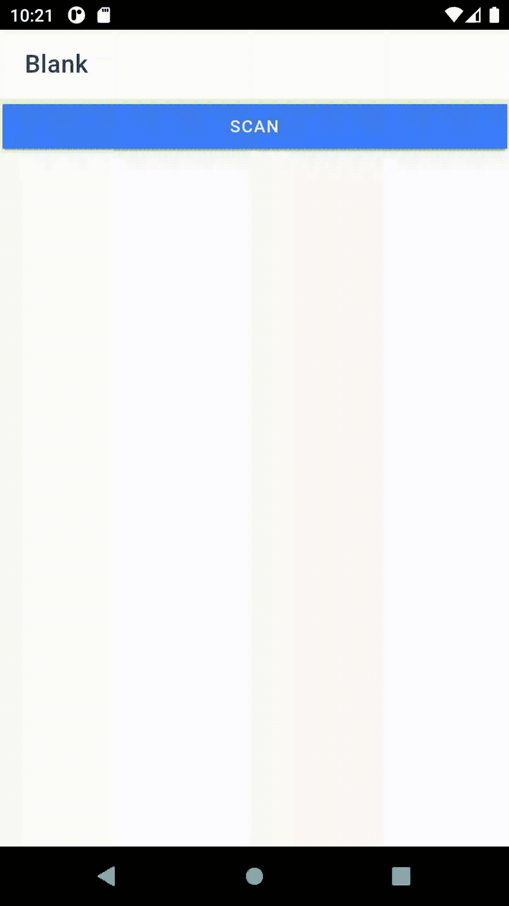

# 如何用二维码扫描仪构建离子角电容 App

> 原文：<https://javascript.plainenglish.io/how-to-build-an-ionic-angular-capacitor-app-with-a-qr-code-scanner-28d6356809af?source=collection_archive---------0----------------------->


Photo by [Mitya Ivanov](https://unsplash.com/@aka_opex?utm_source=medium&utm_medium=referral) on [Unsplash](https://unsplash.com?utm_source=medium&utm_medium=referral)

疫情将 QR 码的识别提升到了一个新的水平。特别是在马来西亚，在进入任何场所之前，马来西亚人都必须扫描二维码，以此来跟踪一个人的行动，从而遏制和追踪盛行的疫情。

因此，结果是，它让马来西亚的每个人都能立即识别二维码。无论老少，每个人都能认出随机生成的方块，无论它们在哪里。

这是一个被迫采用技术的例子，在我看来是一个积极的例子，是疫情的结果，此外还有动词化的 Zoom(作为会议的同义词)，当然还有口罩的无处不在(及其普遍的争议)，我不会在本文中提及。

在这篇文章中，我将重点介绍如何轻松地使用 Ionic Angular 构建一个二维码扫描仪，使用现有的电容二维码扫描仪插件。

必须感谢[西蒙·格林](https://medium.com/u/bca45c04dc66?source=post_page-----28d6356809af--------------------------------)的这段视频激发了本文的灵感

## **0。启动一个 Ionic App**

启动一个 Ionic Angular app。如果你是爱奥尼亚的新手；Ionic 是一个专门为跨平台移动应用开发而开发的混合框架。使用 Capacitor 作为本机桥，您可以将 Ionic 应用程序转换为 iOS、Android 等系统上的本机应用程序。

请通过访问该网站并点击“开始”来了解爱奥尼亚角

[](https://www.ionicframework.com) [## 跨平台移动应用开发:Ionic 框架

### Ionic Framework 的应用程序开发平台构建了令人惊叹的跨平台移动、web 和桌面应用程序，只需一个…

www.ionicframework.com](https://www.ionicframework.com) 

如果你熟悉 Ionic，那就创建一个新的 Ionic Angular 项目。对于项目的模板，这真的取决于你，但我会在空白模板上创建这个应用程序。

## **1。安装条形码扫描仪电容插件**

在命令提示符下，输入以下命令安装条形码扫描仪电容插件:

```
npm install @capacitor-community/barcode-scanner
```

## **2。在 home.page.ts** 中设置条形码扫描仪

在 home.page.ts 中，我添加了几行代码来设置条形码扫描仪:

第 2 行:将条形码扫描仪导入 ts 文件

第 10 行:`scanActive`被声明，这是一个布尔值，稍后将用于激活和停用扫描仪。

第 14–24 行:`checkPermission()`功能用于检查是否已提供使用条形码/QR 扫描仪的许可。

第 26–45 行:`startScanner()`功能用于启动扫描仪，如果提供使用扫描仪的许可，将执行第 35 行，第 37 行的警报将触发带有 QR 码内容的警报。

Line 47: s `topScanner()`功能停止扫描仪

第 52 行:`ionViewWillLeave()`当用户退出 Ionic 页面时禁用扫描仪的功能。

## **3。在 home.page.css 中设置 css**

第 1 行:用于移除扫描框的扫描框类(参见步骤 4 中的 HTML)

第 13 行:扫描按钮类，用于设置扫描按钮的样式(参见第 4 步中的 HTML)

## **4。在 home.page.html 设置 HTML**

第 9 行:如果`scanActive` 为真，将背景变为黑色，否则，背景为白色

第 11 行:显示扫描按钮，按下后执行`startScanner()`功能。当`scanActive`为真时，该按钮将被隐藏。

第 14 行:当`scanActive`为真时显示，如果为假则隐藏。这将包含执行`stopScanner()`功能的停止扫描按钮。

第 19 行:当`scanActive`为真时显示扫描框，如果为假则隐藏它。

## **5。运行命令将电容器添加到您的应用程序中，使其成为 Android 或 iOS 应用程序**

很简单，只需在 Android 和/或 iOS 上运行以下命令

***对于安卓:***

1.  `ionic build`

2.`npm install @capacitor/android`

3.`npx cap copy android`

4.`npx cap sync android`

5.`npx cap open android`

***对于 iOS:***

1.  `ionic build`

2.`npm install @capacitor/ios`

3.`npx cap copy ios`

4.`npx cap sync ios`

5.`npx cap open ios`

## **6。将 Android 或 iOS 添加到您的开发中，并分别更改** `**AndroidManifest.xml**` **和**`**Info.plist**`

**有关如何操作的更多信息，您可以参考此处的指南:**

**[](https://github.com/capacitor-community/barcode-scanner) [## GitHub-capacitor-community/barcode-scanner:一款快速高效的(QR)条形码扫描仪，适用于…

### @ Capacitor-community/barcode-scanner 是一款适用于电容器的快速高效(QR)条形码扫描仪。在 iOS 上，这个库使…

github.com](https://github.com/capacitor-community/barcode-scanner) 

## **7。就这样**

完成后，您应该能够启动二维码扫描仪，扫描任何二维码并查看二维码内容。

这是我在 Android 模拟器上运行的 QR 扫描仪(注意闪烁):



希望你能建造它。** 

***更多内容看*[***plain English . io***](http://plainenglish.io)**

*   ***在* [*Twitter 上关注我们！*](http://twitter.com/JS_PlainEnglish)**
*   ***订阅我们的* [*免费简讯*](http://newsletter.plainenglish.io/) *。***
*   ***了解更多关于*[*Stackademic*](https://stackademic.com/)*，我们的免费编码倡议。***