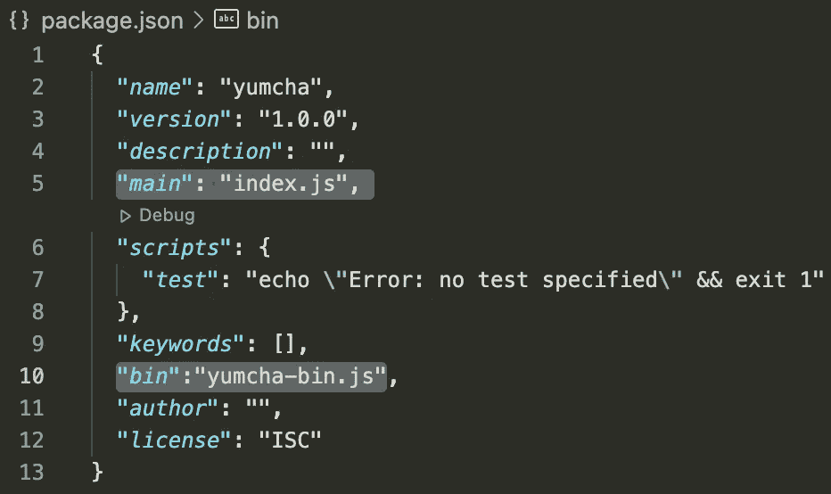

# 如何构建和发布 NPM 模块？

> 原文：<https://javascript.plainenglish.io/how-to-build-and-publish-an-npm-module-b6478d871a0c?source=collection_archive---------18----------------------->

这比看起来容易。


Photo by [Paul Esch-Laurent](https://unsplash.com/@pinjasaur?utm_source=medium&utm_medium=referral) on [Unsplash](https://unsplash.com?utm_source=medium&utm_medium=referral)

# 介绍

除了在互联网上无处不在之外，Javascript 最大的优点之一就是庞大的(并且不断增长的)开发者社区。当 [TC39](https://www.ecma-international.org/technical-committees/tc39/?tab=general) 在处理 [ECMA 的脚本](https://developer.mozilla.org/en-US/docs/Web/JavaScript/Language_Resources)时，人群涌向 [NPM](https://github.com/npm/npm-expansions) (节点包管理器)为他们的应用程序添加一点魔法。本文解释了在 NPM 注册中心上从头构建和列出一个包的步骤。它假设初级到中级的 Javascript 知识。

# 什么是 NPM？

[NPM](https://www.npmjs.com/) 是 Javascript 运行时环境 [Node.js](https://nodejs.dev/) 的默认包管理器。它带有命令行客户端和世界上最大的软件注册中心之一。npm 上列出的一些最受欢迎的名字是 React、Express 和 Moment。来自各大洲的开发人员通过构建有用的模块来为 npm 做出贡献，这些模块使世界各地的其他工程师能够高效地构建可靠的软件应用程序。

如果你感觉特别利他，并且有一个关于 npm 模块的好主意，那就跟着做吧。

# 该模块

我们今天要建造的模块叫做 **yumcha，**意思是喝茶的同时吃点点心。相当于公司的咖啡休息时间。每次调用该模块都会得到一个无用的网站，供您在喝咖啡休息时浏览。

# 安装节点

确保您的计算机上安装了 Node.js。如果已经安装了，那么在终端中运行下面的命令将会得到版本的响应。

```
node -v
v12.22.1 //node version installed on the machine
```

或者，也可以在这里下载[。](https://nodejs.dev/)

# 创建并初始化项目

现在你的机器已经设置好了，让我们初始化一个新的项目。移动到终端窗口，键入以下命令(一次一个)

```
mkdir yumcha
cd yumcha
```

已创建新的空目录 yumcha。npm 命令行客户端作为 Node.js 安装的一部分安装。因此，您只需输入以下命令，就可以在空目录中启动一个新项目。

```
npm init --yes
```

**npm init** 命令基本上是在 yumcha 目录中创建一个 package.json 文件，并且 **yes** 标志**指示 npm 使用*默认设置*用于名称、版本、主要属性等。该文件应该如下所示:**

Package.json 是节点模块中最重要的文件之一，当您希望将它发布到 npm 时更是如此。名称字段将是 npm 上显示的字段，其他人可以使用它来安装模块。另一个需要注意的重要因素是版本。公开列出的 npm 模块的版本必须在每次向 npm 推送更新时**更新(按照语义版本化规则**)。

# **API 还是命令行？**

NPM 模块可以通过导入 js 文件或在终端中使用关键字来使用。根据模块提供的实用程序，它可以以任何一种方式提供。我们将为**API 和命令行启用雅木茶。这样做的关键是修改上面创建的 package.json。**



package.json 中的**主字段**定义了进入模块的*主入口点*。当包被导入到 js 文件中时，如下所示

加载模块的 **index.js** (即将创建)文件。

在文件**、**中添加一个新字段 **bin** ，用于将命令 **yumcha** (包名)映射到文件 **yumcha-bin.js** (即将创建)文件**。**只需在终端输入软件包名称，就可以在命令行中使用该软件包。

```
$ yumcha
[https://trypap.com/](https://trypap.com/)
```

# 添加功能

现在我们有了背景，让我们给 yumcha 一些力量。首先创建 4 个新文件，目录如下所示:

```
Yumcha
  - **site-list.js**
  - **util.js**
  - **index.js**
  - **yumcha-bin.js**
  - package.json
```

## **Site-list.js**

这个文件将有一个无用网站的列表，作为模块的存储库/数据源。

## **Util.js**

对该模块的每次调用都将从上述列表中选择一个网站作为响应。这个文件将负责从数组中随机选择一个网站。这可以如下实现，

虽然 util.js 中只定义了一个函数以保持简短，但它可以扩展为拥有*多个函数和实现*。

## **Index.js**

既然已经处理了模块的行为，让我们把重点放在公开它的功能上。Index.js 充当模块提供的所有函数的集合。

虽然 index.js 只导出*一个函数*，但在实际模块中，它可以是一个很长的列表。查看一个流行的 npm 模块 [UUID](https://www.npmjs.com/package/uuid) 的 [index.js](https://gist.github.com/kritiketan/b4d76c36f83e13fdf21ddca12ba8f872) 文件。

**Yumcha-bin.js**

最后，设置模块**的终端使用。**该文件在每次终端使用关键字 **yumcha** 时运行。最简单的版本是调用 util 函数 getUrl，并在命令行中显示它的响应。这可以通过以下方法实现:

或者，可以设置 bin 文件来处理多个参数、标志甚至菜单(这超出了本文的范围)。

# 在本地测试

是时候试驾我们新开发的模块了。再到终端。

```
cd ~/yumcha
```

确保您在项目目录中之后，使用。

```
node .
```

上面的命令运行您的模块，并建立变量 yumcha 和文件(yumcha-bin.js)之间的连接，以便在终端中使用时运行。您可以在终端中键入关键字 yumcha 来尝试一下。

```
yumcha
// [https://smashthewalls.com/](https://smashthewalls.com/)
```

# 出版给 NPM

是时候与世界分享你的作品了。将包发布到 npm 之前需要注意的事项，

1.  确保 package.json 中的名称可用。在 npm [注册表](https://www.npmjs.com/)上快速搜索可以证实这一点。
2.  在 [npm](https://www.npmjs.com/) 上创建账户

一旦你确定了以上几点，回到你的终端窗口

```
cd ~/yumcha
npm loginUsername: abc-xyz
Password: *******
Email: (this IS public) abc@xyz.com
Logged in as abc-xyz on [https://registry.npmjs.org/](https://registry.npmjs.org/).
```

一旦通过身份验证，您需要做的就是

```
npm publish
```

几秒钟后，该模块将在 npm 注册表上可用，你可以享受你的努力带来的荣耀。该模块将可以使用 npm 命令行客户端公开下载。

```
npm install yumcha
```

如果您希望关闭该模块，请使用

```
npm unpublish <packagename> -f
```

感谢您的关注。我希望你会喜欢创建一个 npm 模块。

**注意:**考虑建立一个模块的存储库，并添加一个 README.md 文件，解释模块的特性和用法。

*更多内容请看*[***plain English . io***](http://plainenglish.io/)